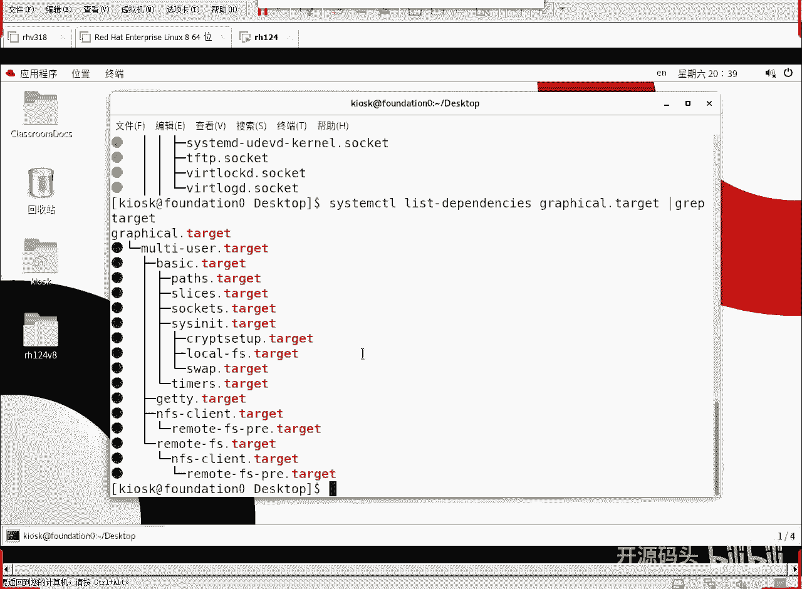
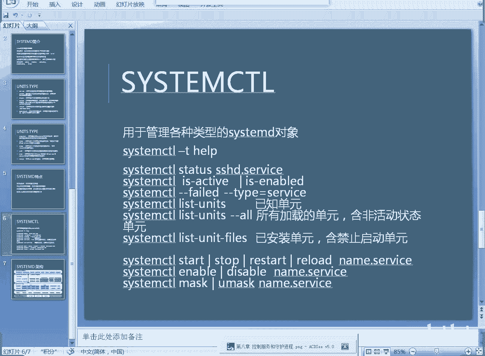
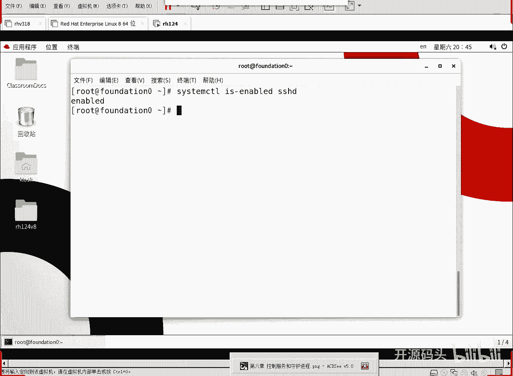
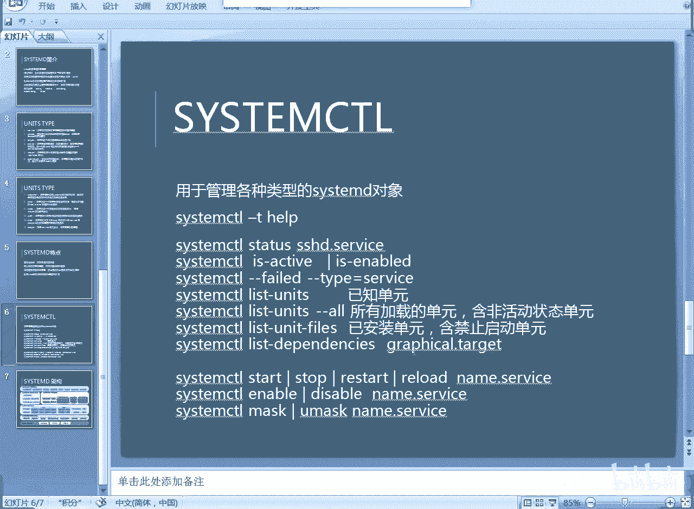
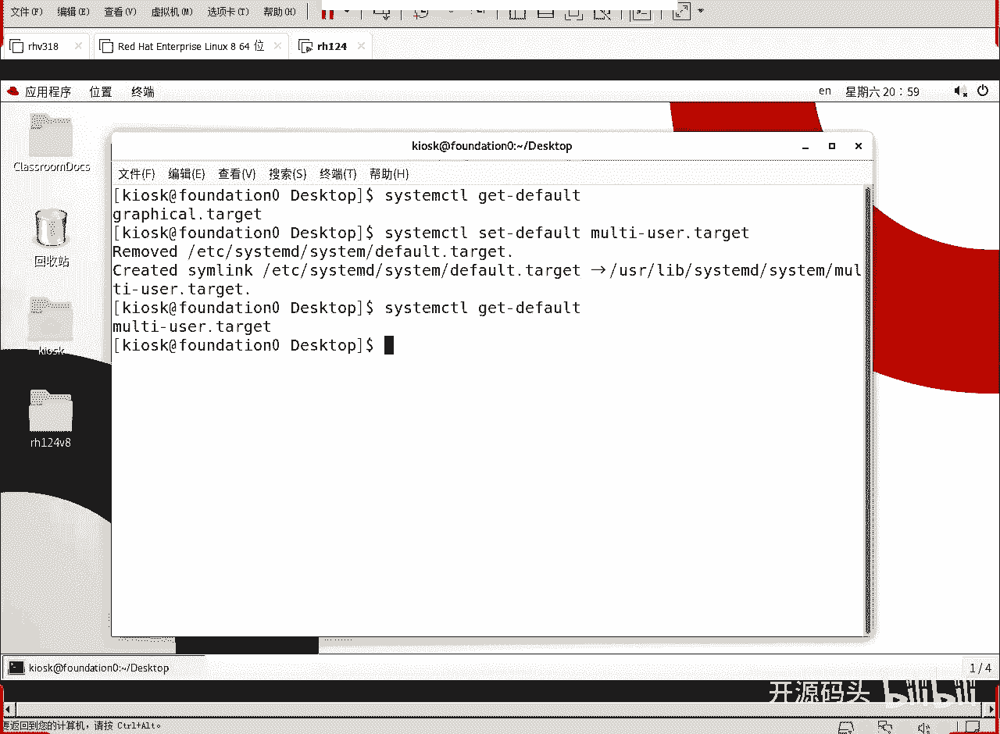
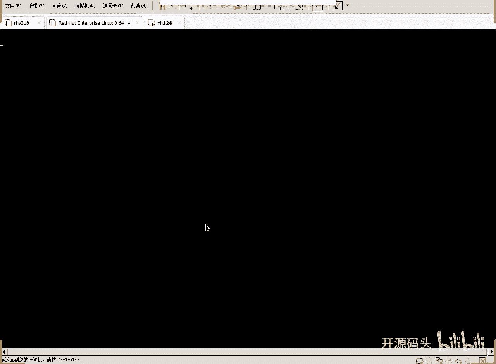
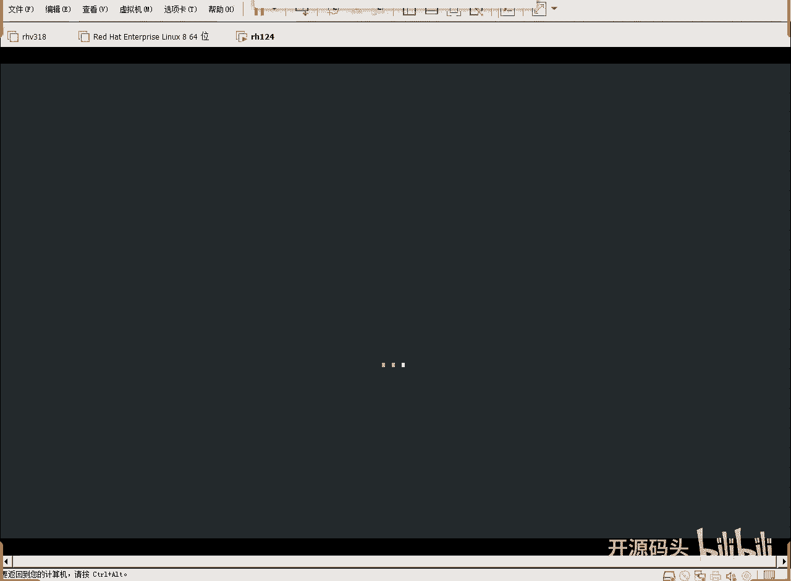
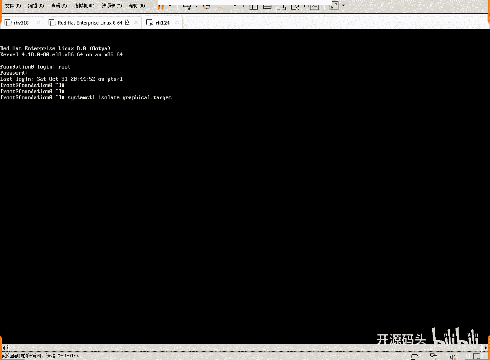
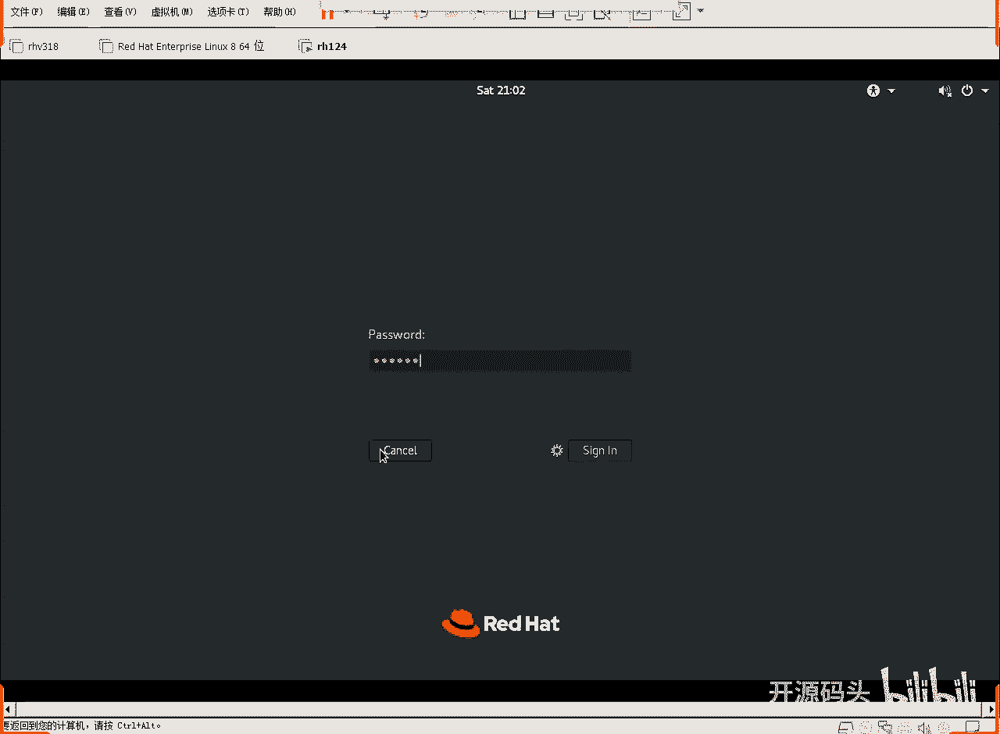
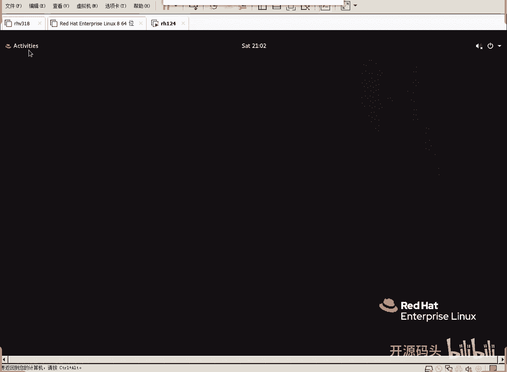

# Linux系统管理：第9章：systemd进程管理(3) 🚀



在本章中，我们将深入学习systemd进程管理，重点了解其单元类型、核心特点以及常用操作。通过本章的学习，你将能够理解systemd如何管理系统的启动和服务，并掌握基本的控制命令。

---

## 单元类型概述

上一节我们介绍了systemd的基本概念，本节中我们来看看systemd支持的各种单元类型。单元是systemd管理的基本对象，它们代表了系统中的不同资源。

systemd有多种单元类型，有些可能不常见或感觉没有直接依赖关系。理解这些类型后，我们对系统启动会形成清晰的概念：
1.  启动过程具有很强的顺序性。
2.  系统启动前所需的准备工作都由systemd完成。
3.  服务是Linux系统的核心操作。

服务（service）单元是最常见和数量最多的类型，系统启动时需要启动许多服务。其他类型如target、mount、automount、timer和swap也会在课程中涉及，但用户日常管理和维护操作主要围绕service、target等类型展开。

以下是systemd管理的主要单元类型：
*   **service**：系统服务。
*   **target**：一组单元的集合，用于实现特定的系统状态（如多用户模式、图形界面模式）。
*   **mount** & **automount**：文件系统挂载点。
*   **timer**：定时器，用于计划任务。
*   **swap**：交换分区。
*   **path**：用于根据文件系统变化触发其他单元。

systemd负责统筹调度所有这些启动任务。

---

## systemd的核心特点

了解了单元类型后，我们来看看systemd相较于旧系统（如SysV init）的核心优势。

systemd的主要特点包括：
*   **并行启动**：依赖关系较弱的单元可以并行启动，提高了系统启动速度。旧系统`init`进程是串行启动。
*   **按需启动**：可以直接控制服务进程，无需单独的服务程序。
*   **依赖管理**：自动管理服务间的依赖关系，防止因上层服务先启动而出现超时错误。
*   **进程追踪**：利用Linux控制组（cgroup）追踪相关进程的详细情况。作为所有进程的父进程，systemd可以无障碍地管理所有其他进程。

---

## 常用systemd控制命令

理论介绍完毕，现在我们来学习实际操作。以下是一些常用的`systemctl`命令，用于查看和控制systemd单元。



### 查看单元状态

我们可以使用`systemctl status`命令查看特定单元（如服务）的详细状态。

```bash
systemctl status sshd
```



要检查服务是否设置为开机自动启动，可以使用`is-enabled`命令。

```bash
systemctl is-enabled sshd
```
如果输出为`enabled`，则表示该服务（如sshd）被许可在开机时启动。

### 列出单元

要列出所有已知的单元，可以使用`list-units`命令。添加`--all`选项可以列出所有已加载的单元，包括非活动状态的。

```bash
systemctl list-units --all
```

列出所有已安装的单元文件（包括被禁用的），可以使用：

```bash
systemctl list-unit-files
```

### 控制服务

对服务进行基本控制是日常运维的常见操作。

以下是控制服务状态的命令：
*   **启动服务**：`systemctl start <服务名>`
*   **停止服务**：`systemctl stop <服务名>`
*   **重启服务**：`systemctl restart <服务名>`
*   **重新加载配置**：`systemctl reload <服务名>`
*   **设置开机自启**：`systemctl enable <服务名>`
*   **禁用开机自启**：`systemctl disable <服务名>`

### 屏蔽与解除屏蔽服务

`mask`命令用于彻底屏蔽一个服务，防止其被手动或自动启动。

```bash
systemctl mask <服务名>
```
屏蔽后，尝试启动该服务会收到被屏蔽的提示。需要管理员使用`unmask`命令解除屏蔽后才能启动。

```bash
systemctl unmask <服务名>
```

### 查看依赖关系

我们可以查看一个单元的依赖关系，了解其启动顺序。

```bash
systemctl list-dependencies <单元名>
```
例如，`systemctl list-dependencies graphical.target`可以列出启动图形界面所依赖的所有单元。

---

## systemd架构简介

为了更系统地理解，我们简要看一下systemd的架构。systemd作为“天字一号”进程，其职责基于Linux内核。

1.  **内核层**：Linux内核启动，并通过控制组（cgroup）对系统资源进行管控和整理。
2.  **基础库**：systemd进程本身基于一系列函数库（如加密库、安全通信库）启动。
3.  **systemd核心**：启动后，systemd根据配置文件加载并管理各种单元（target, service等）。
4.  **用户接口**：用户通过`systemctl`、`journalctl`等应用程序与systemd对话，从而管理或修改其控制的资源。

简而言之，内核管理资源，systemd维持资源的可持续性并提供管理接口，用户通过命令工具进行干预。



---

## 管理系统运行级别（Target）

最后，我们学习如何使用target来管理系统运行模式，例如在图形界面和命令行模式之间切换。



获取当前默认的启动target：
```bash
systemctl get-default
```





将默认启动目标设置为多用户命令行模式：
```bash
systemctl set-default multi-user.target
```

设置后，下次系统启动将进入命令行模式。若当前在命令行模式，想临时切换到图形界面，可以使用：
```bash
systemctl isolate graphical.target
```
这个命令会独立启动图形模式所需的单元。



---



## 本章总结



本节课中我们一起学习了systemd进程管理的进阶内容。我们了解了systemd丰富的单元类型及其在系统启动中的作用，掌握了`systemctl`命令来查看状态、控制服务生命周期、设置依赖关系以及管理系统运行级别（target）。systemd通过并行启动和精细的依赖管理，显著提升了现代Linux系统的启动效率和管理便利性。