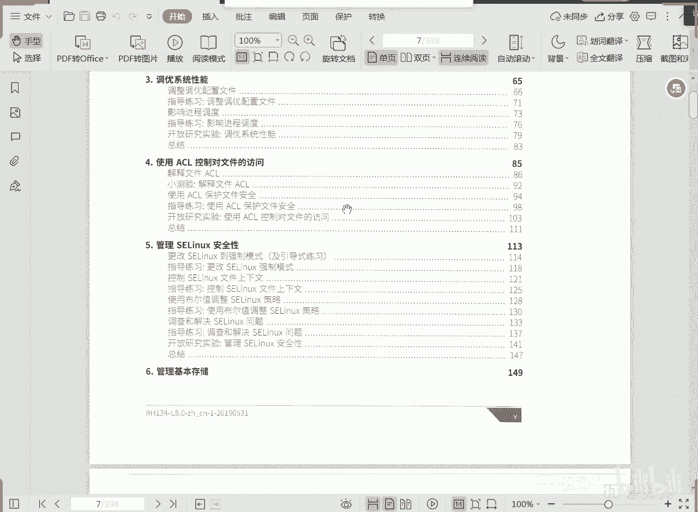

# RHCE RH134 课程简介(1) - P1 - 开源码头 - BV1BW4y187TH

今天呢我们来开始看第二本书，rh 134管理系统二啊，首先呢我们来了解一下啊，第二本书我们会学些什么内容呃。

第一个是就是我们的那个80脚本啊，bus呢就是我们平常用的那个命令行环境，通过我们之前第一本书学到的命令，我们感觉到打命令的确是工作效率很好是吧，再一个呢执行的稳定性很高。

就是一个一个的命令去敲比较累，那么有没有这种方法可以让那些繁重的命令行的输入工作啊，变得简单而快乐呢，有可以这么做，我们把完成这个管理任务所需要输入的所有的命令，按照顺序写到一个文本文件里面。

然后呢给这个文件数赋予执行权，允许用户呢输入这个文件的名字去启动这个文件，这样的话文件里所有的命令呢就会按需执行，就相当于我们在键盘上面去敲啊，但是呢它这个效率呢要比我们键盘上敲要快得多是吧。

通过这种方法呢，我们就可以把管理员从繁重的命令行输入工作中解放出来，也是可执行文件，他呢往往是为了执行一个任务，我们就把它称其为实现任务的一个脚本。

这样的话我们平常做很多事情啊，效率就会很高了，比如说我在教室里面的时候啊，现在咱们这个网上上课是吧，经常性的要什么，要测一下同学们是否机器是否跟我能够连通，那我就会做一个嗯80脚本啊，做一个循环啊。

跟c语言类似啊，for啊，做一个for循环，我可以呢从一pin到20啊，然后每一个同学的机器我都可以拼一遍啊，以以判断他是否在线啊。

呃这是一个一个提高我们那个工作效率的一个方法啊，我们可以把平常经常做的一些任务，把它命令集合集中的放在一个文件里啊。

然后呢去执行，但是有些人有些同学说诶我这个任务的执行的时候呢，是比如说晚上的事情，能不能我晚上不在机器上面，然后它能自动执行，这就是第二章计划任务啊，所谓的计划任务呢就是啊我们规定好他的执行事件。

到点他就执行啊，当然你可以设置只执行一次，也可以设置什么呢，每一天都执行，只要机器开机，他每到那个时间点他就执行，当然你也可以做一个每分钟都执行的任务啊，这好呃，不管我们在不在机器跟前。

然后我们就可以把这个我们编好的脚本任务呢自动化的调用，当然你也可以只调用一个命令是吧，这样的话呢我们的工作管理工作就会效率就会得到极大的提升，对不对啊，一个是把大量的命令放在一个文件里快速执行。

一个呢呃我们给他一个什么，给他一个计划，让他在我们约定的时间呢去自动执行。

好那还有第三啊。

调用啊，我们可以根据这个机器它的功能和角色把它调整为最佳的工作状态，但是这个桥优呢非常非常简单啊，就是整个来讲的话，第三章就相当于这个呃内容很少的一个东西。

就是诶我们系统呢给我们提供了很多这种呃针对不同角色，就是我们这个机器它是一个虚拟机服务器的角色，还是一个web服务器的角色，还是一个什么呃网络服务器的角色对吧，网络通讯的这个转发角色诶。

它会根据我们这个机器呢，我们希望他做的那个某个角色的啊这些工作特征啊，进行相应的什么呢参数的优化啊，对这个系统的一个呃工作方式进行参数优化啊，还好我们这个参数优化不需要我们去干预，大部分情况下不需要啊。

只需要我们去选择对应的这个优化的一个配置就可以了啊，针对呃web服务器的，针对文件服务器的，针对这个有虚拟机，虚拟主机的啊，虚拟机服务器啊啊针对这个呃网络通讯的诶，针对不同工作角色的这种机器呢。

我们会有一套一套的这种调优的这个指标，我们只需要把这套调优指标根据主机的角色给他应用起来就可以了啊，所以说调优这一块呢嗯听起来很生气，但实际上呢几乎我们不用干预他的细节，我们只需要说哎呃这是一个网络机。

那我们就是专门把那个针对网络通讯的一些调优的参数，这是一套配置。

我们把这套配置直接应用起来就可以了啊，这叫调优呃，第四个呢是a c l a cl呢，是呃我们对第一本书所讲的权限的一个扩展啊，它叫防控列表对吧，嗯第一本书我们讲过那个u jo权限。

优质权限有一个缺陷是什么呢，就是它只能针对三主体，就是ur group和什么other，只能针对三主体进行复权，那如果说我超过三主题的这种要求。

不管你原来有没有什么更巧妙的解决方案，那我现在就是很就是很直接的，我就希望这一个目录或者一个文件啊，它的访问者呢有超过uzo的三主体的其他人，我还要记录下来，那你只能借用a c l来做了啊。

所以说a c l其实是什么呢，是u g o权限的一个扩展或者叫扩扩展功扩充啊，就是当u jo如果不满足要求，或者说我不喜欢用uzu来实现这这个权限规划的时候，那你可以启用a c l a c l e启用。

那就随便了啊，你任何主体想对这个目录或者文件有什么样的权限，我们就把你写到这个防控，那外面一直往后追加都可以啊。

这样的话就跟那个微软里面那个权限的就完全一样了啊，那么可想而知，a c l的执行效率肯定是没有什么u ju的执行效率高的对吧。

但是它的精细度，它能针对超过uzo 3主体以外的其他主体进行复权操作。

k a c r啊，第五个还是安全啊，第五个叫做s1 linux啊，c linux呢是我们的linux的一个特有的安全规范或者叫安全的一个，我们马上就做策略吧啊安全策略为什么说是策略啊。

这是什么，这是人为追加上来的一种安全的一个规范啊，没有sin x我们基于基本的权限服务，我们也可以对外提供这个呃，提供这个相应的这个资源啊，但是呢有了sdk之后呢。

我们可以让这个资源的安全保障提高一个档次啊，很多这种非法的访问啊，还有那些呃非法的服务啊，他们即使服务的进程启动了啊，有人在非法访问我们的东西。

如果说ex ex一旦发现这个这种访问不符合我们的正常情况的需求，i ex就会凭空降下一刀，直接把什么把这种非法的访问给它阻止掉，所以说它会让我们的爱情，linx会让我们的那个linux的一个呃。

原来的那个原本的就很稳定和或者安全的系统，把所有的安全都作为一种什么呢，作为一种政策的方式。

这个区别就类似于什么呢，啊我们这我们最近大家都知道这个美国和中国，这个都在应对这个呃新冠疫情是吧，但是呢呃这个美国的应对方法是什么呢，他就是人是自由的，他就开始就说是你每个人各管各对吧。

你你自己管自己抵抗病毒啊，他没有要求人什么隔离啊，或者集中化的不准行动啊，隔离啊，没有要求这些东西啊，那就相当于一个就是一个基本的linux系统啊，它每个主体呢都是都是安全，都是照顾自己的安全。

你像我们国家就不一样啊，我们国家应付新冠疫情，就什么全社会全部动员起来啊，然后集中化的对所有的这种呃疫情的这种情况呢进行统配，统筹的这种规划，那就除了个人保证自己的安全之外。

那整个政府呢在这外套又做了一套什么，因为外加了一套这个规范，让你呃不能随便乱走啦，或者发生高高高危情况的时候，哎不奉隔离啦什么的这些东西哎，这就是艾斯利克斯外加上来的对吧，就类似于这个东西啊。

就这么一个思路，而且ex是额外加上来的，如果没有这条政策，每个人保护好自己也有可能，但是有了这条政策之后呢，那么整体系统的安全层次就提高整个一个档次呃，linux就是因为有这么一个东西啊。

但是他这个呃这个规律或者是他这个呃思想思路好不好掌握，很好掌握啊，到时候我们学的时候呢详细给大家讲一讲啊，而且ex呢其实就是这三要素，把我们的三要素控制好。

基本上就可以解决我们linux系统以不变应万变的方式来解决，我们linux系统里面面临的各种非法访问啦，还有这种不合理的这种行为啦。

这些东西我们都可以去控制它，而且呢非常严格啊，所以说我们这个就是唉呃类似于我们生活中的这种这种状态啊。

说白了就是我们的对linux的政策的要求，就在这个管理linux的情况下，并且什么更加的这种呃严格对吧，至于说哪种好，你要是站在美国的这个角度上来讲的话，肯定是他认为啊没有s0 应该是好啊。

但是我们占到全球的这个角度去看事情，看问题的时候啊，就是外加一套政策啊，除了基本的个人保障之外，在外加一套团体政策，那这个就是仁者见仁智者见智，那么我们所要说的是什么呢。

比如说我在阿里买阿里买到的云主机，腾讯买到的云主机，为什么是关着呢，呃我跟很多这种嗯就是行业里头的，就是呃有工作经验的这些呃，这些人们这些单位的人去探讨这个话题的时候，他就说本来很正常的一个操作。

本来我们就是我把权限放开，我把服务开启，诶我们这个linux所提供的资源就可以往外让人家去访问了是吧，哎结果有了400克死之后呢，哎我们还得还要对英格进行相应的规范才可以，我这个服务才可以正常对外说。

他觉得烦啊，或者是甚至于什么驾驭不了，那你驾驭不了的话，那就没办法，他自然肯定要把它关掉，如果不关的话，他就没有办法在x x这个规则上下功夫了是吧，因为你得有能力去制定这些安全的政策啊，或者叫安全规则。

对不对，所以呢实际情况就是掌控不了啊，或者是什么呢，觉得他烦，所以说基本上都是关的啊，腾讯云主机这个玩意都是关的啊，但是红帽强烈建议想实现安全就用它啊，如果起了他那种什么漏洞攻击啊。

还有什么呃什么注入式攻击啊，加上90%以上的这种攻击，正常的，如果说没有s0 x3 ，你就可以获得超级访问权了，但是有s0 x的话，这些呃攻击行为即使说能够把传统的服务攻破。

也没有办法去获得他想要的资源，因为什么呢，因为艾希linx还监控了后台访问的一些细节，如果它超出了我们预想的那个范围的话，一概就被阻止了啊，所以说能够防止90%以上的这种非法访问的这种资源获取。

所以说sx如果说我真我们真的是我们学过这个机制之后。

在实际工作中最好把它开开，一开始这个东西你的那个安全防护一下子就轻松多了。

