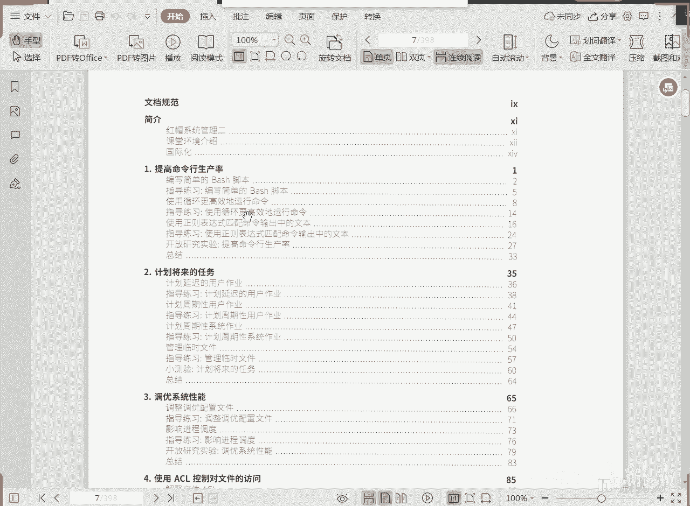
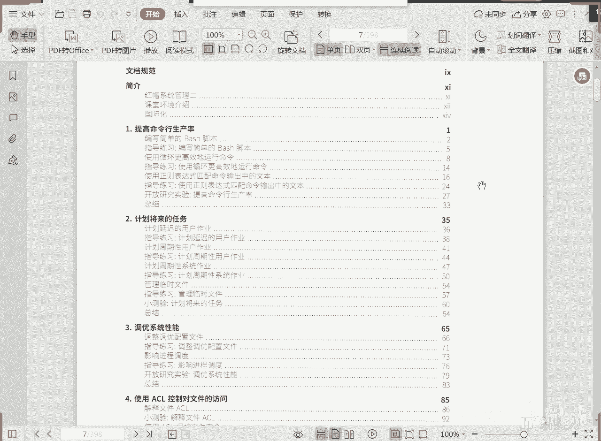
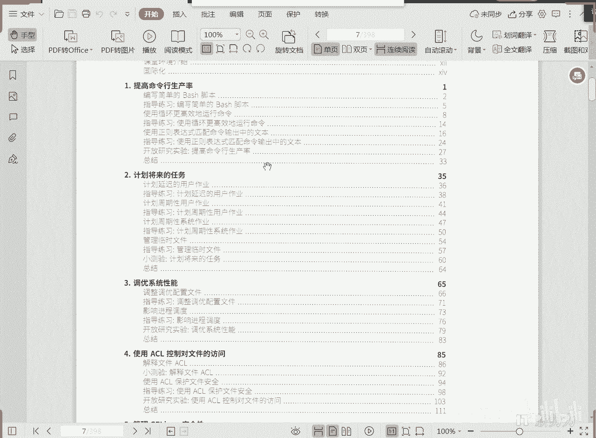
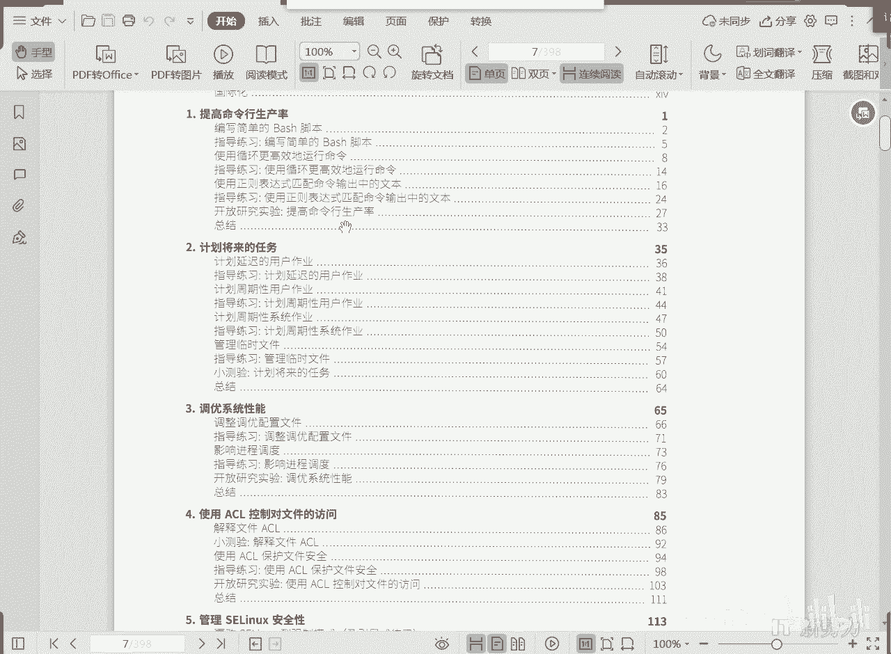
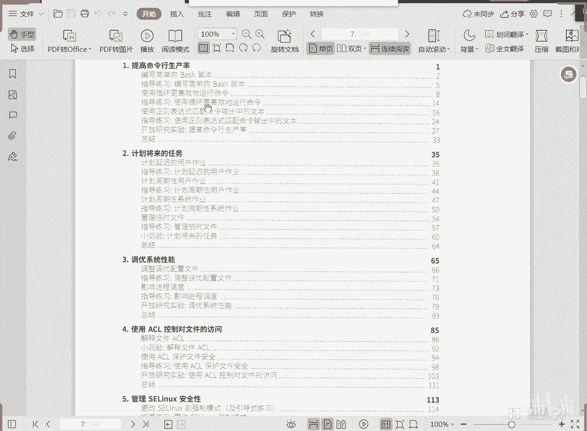
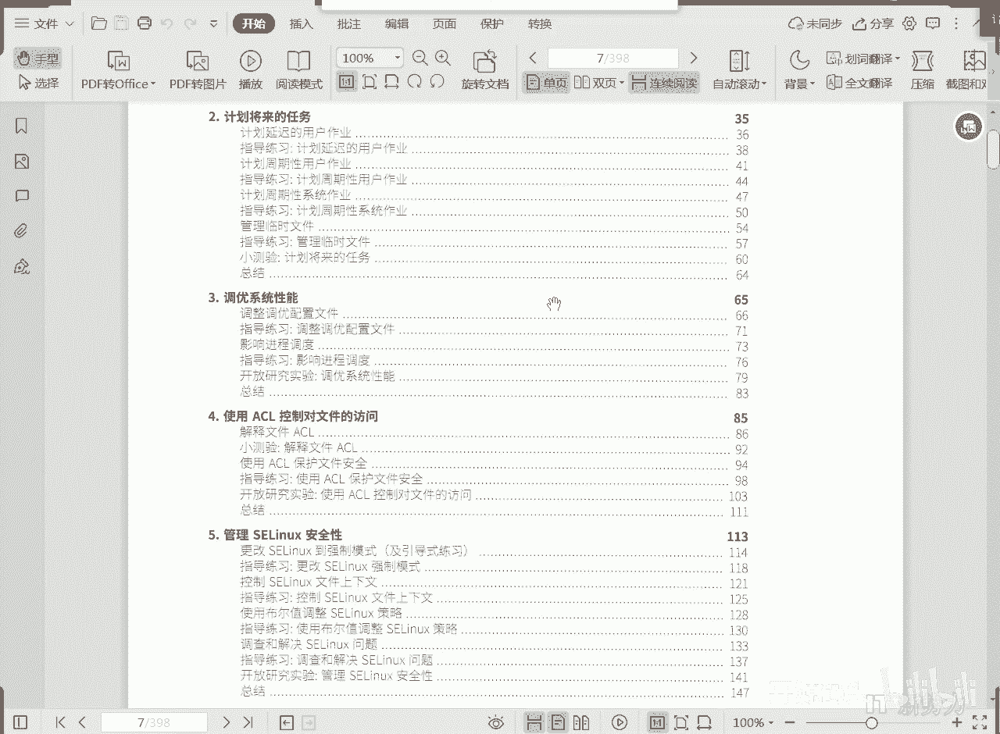
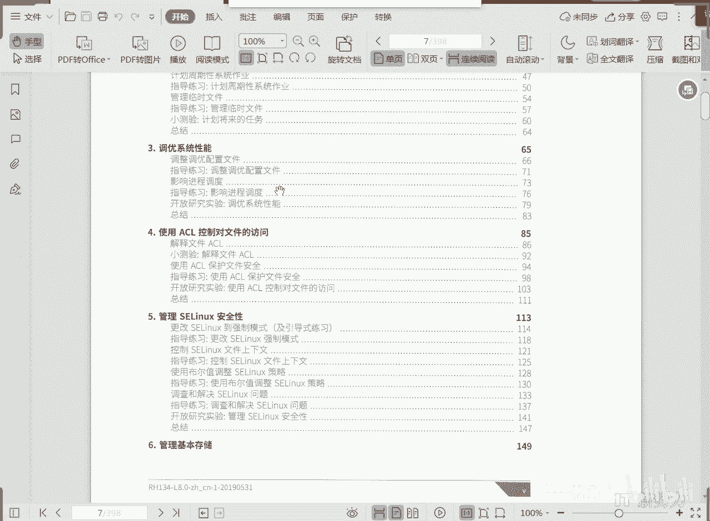
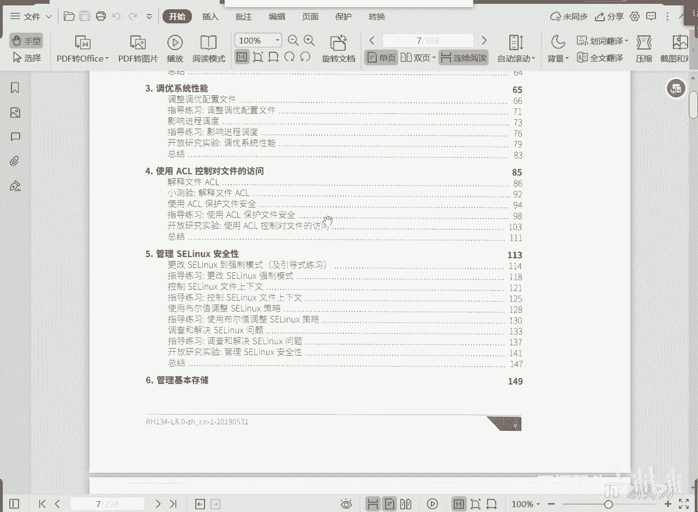
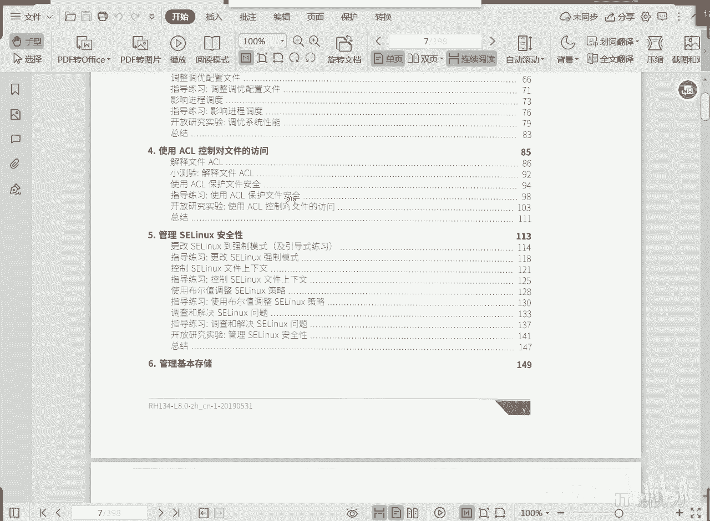
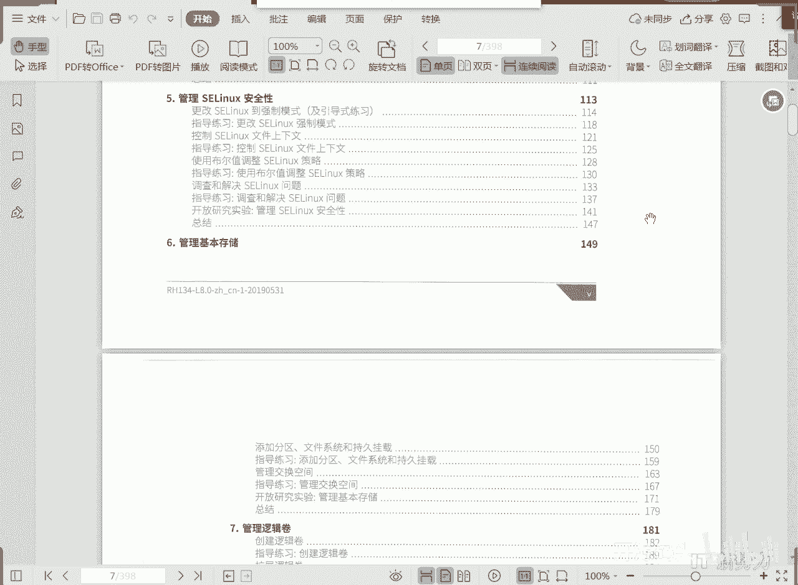

# RHCE RH134 课程简介：1：课程概述与核心内容介绍 🚀




在本节课中，我们将要学习RHCE认证的第二门课程——RH134《管理系统二》的核心内容。这门课程旨在提升我们自动化管理、系统优化和安全控制的能力，是成为一名高效Linux系统管理员的关键。

上一节我们完成了RH124的学习，掌握了Linux系统的基础管理。本节中，我们来看看RH134将带领我们探索哪些更高级、更自动化的管理技术。



## 1. Bash脚本编程 📜

通过第一本书的学习，我们体会到使用命令行工作效率高且执行稳定。然而，逐一输入命令比较繁琐。有没有方法可以让繁重的命令行输入工作变得简单呢？答案是肯定的。





我们可以将完成某个管理任务所需的所有命令，按照顺序写入一个文本文件中。然后赋予这个文件执行权限，用户只需输入文件名即可启动它，文件中的所有命令就会按顺序自动执行。这相当于自动敲击键盘，但效率要高得多。

通过这种方法，管理员可以从繁重的命令行输入工作中解放出来。这种可执行文件通常被称为“脚本”，用于实现特定任务。



**核心概念示例：**
```bash
#!/bin/bash
# 这是一个简单的Bash脚本示例
echo "Hello, World!"
```




以下是Bash脚本带来的效率提升示例：
*   例如，在线上教学时，需要测试所有学生机器的连通性。可以编写一个Bash脚本，使用类似C语言的`for`循环，从1到20依次ping每个学生的IP地址，快速判断他们是否在线。
*   我们可以将日常重复性任务所需的命令集合，集中编写到一个脚本文件中并执行。

## 2. 计划任务 ⏰

有些任务需要在特定时间执行，例如夜间执行，但管理员可能不在机器旁。这时就需要“计划任务”。

计划任务允许我们规定任务的执行时间，到点即自动执行。我们可以设置任务只执行一次，也可以设置为每天、每周或每分钟执行（只要机器开机）。这样，无论管理员是否在场，编好的脚本或命令都能被自动化调用。



一个是将大量命令集成到脚本中快速执行，另一个是为任务设定计划，让其在我们约定的时间自动执行。这两者结合能极大提升管理工作效率。


## 3. 系统性能调优 ⚙️

我们可以根据机器的功能和角色，将其调整为最佳工作状态。系统调优听起来复杂，但实际操作非常简单。





系统为我们提供了针对不同服务器角色（如虚拟机服务器、Web服务器、文件服务器、网络转发服务器等）的优化配置集。我们只需要根据主机的实际角色，选择并应用对应的优化配置即可，大部分情况下无需手动干预具体参数。


因此，调优这一章内容相对较少，核心是学会根据角色应用预设的优化策略。


## 4. 访问控制列表 (ACL) 🔐

ACL是对第一本书所学的UGO（用户-组-其他）权限模型的扩展，全称为“访问控制列表”。


UGO权限有一个缺陷：它只能针对用户、组和其他这三类主体设置权限。如果权限需求超过这三个主体，或者有更精细的权限控制要求，UGO就无法满足。

ACL正是为了解决这个问题。当UGO权限不满足需求时，可以启用ACL。启用后，我们可以为任何用户或组对目录或文件设置任意权限，并且可以不断追加条目，其精细程度与Windows系统中的权限管理类似。

可想而知，ACL的执行效率可能不如简单的UGO模型高，但它能针对UGO三主体之外的其他主体进行精确的授权操作，提供了更高的灵活性。

## 5. SELinux 安全策略 🛡️


SELinux是Linux特有的强制访问控制安全机制，可以理解为系统层面额外附加的一套安全“策略”。


没有SELinux，基于基本的UGO和ACL权限，系统也能提供资源访问控制。但启用SELinux后，可以将系统的安全保障提升一个档次。它能监控进程和资源的访问行为，如果发现非法访问或异常行为（即使相关服务进程已启动），SELinux会直接阻止该访问。

**核心思想类比：**
这类似于应对疫情的不同策略。一种策略是依靠个人负责自身安全（相当于基础Linux权限）；另一种策略是在个人负责之外，由政府强制执行统一的隔离、管控等公共政策（相当于SELinux）。SELinux就是在系统基础安全之上，额外增加的一套严格的、集中管理的安全规范。

SELinux基于“主体、对象、策略”三要素工作。掌握好这三要素，就能以不变应万变的方式，控制Linux系统中各种非法和不合理的行为，防护非常严格。

在实际工作中，许多云服务商默认关闭SELinux，主要是因为觉得配置复杂或难以驾驭。但红帽强烈建议启用它以提高安全性。据统计，SELinux能够阻止90%以上的传统攻击，即使攻击者突破了某个服务，也无法获取其预期资源，因为SELinux还会在后台监控并阻止超出策略范围的访问行为。因此，学习并启用SELinux能让系统安全防护事半功倍。

---




本节课中我们一起学习了RH134课程的核心五大模块：**Bash脚本编程**用于自动化命令执行；**计划任务**用于实现定时自动化；**系统性能调优**用于根据角色优化系统；**访问控制列表(ACL)** 用于实现更精细的文件权限控制；以及**SELinux**用于提供强制性的、策略驱动的系统级安全防护。掌握这些技能，将使我们能够更高效、更安全地管理Linux系统。