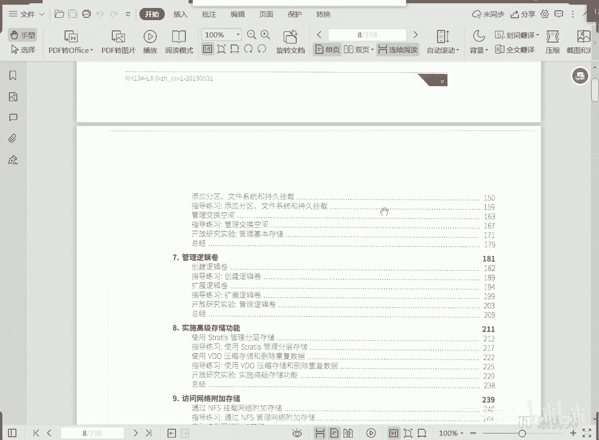
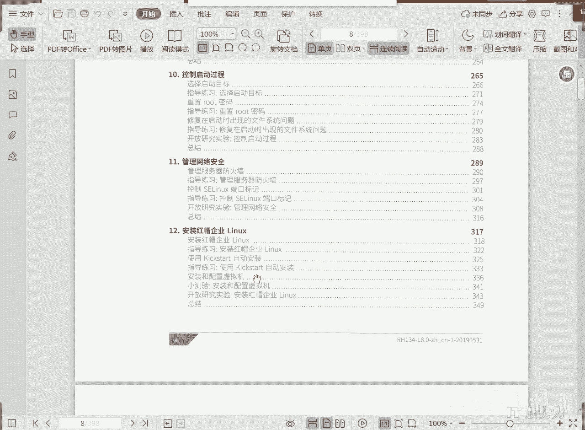

# RHCE RH134 课程简介(2) - P1 - 开源码头 - BV19B4y137KM

好然后第六呢第七呢啊第八呢三张一体。

这什么呢，存储啊，存储其中第六章是老东西啊，是以前的呃旧的知识点啊，每一个linux都应该学到的就是怎么样对磁盘进行分区呃，怎么样制作这个普通分区，怎么样制作一个交换分区，对吧啊。

怎么样配置和管理这些东西，呃这个概念的话呃，我们更多的在两种磁盘分区结构进行方面进行解释啊，一个是老旧的那种m b r就老老旧的那种，磁盘的分区模式啊，一个是最新的g p t的分区模式是吧。

就是全局g u i d啊，全局唯一标识符的这种分区分区表格式啊。

或者是分区格式，那这种格式的话是现在目前买到了win 10的这种系统，他默认所使用的那种磁盘的分区格式啊，这两个分区格式一个是代表的是老旧势力，一个代表的是新势力啊。

我们正好处在了这个新旧交替的这个阶段。

所以说我们两个都得学那么若干，比如说3年5年之后，可能旧的那种模式基本上就要淘汰掉啊，旧的模式呢是从197几年就开始了啊，就是从微软公司做的第一版的dos的时候那个规范啊。

然后七几年到现在应该是50年的标准啊，50年的标准到现在还在用啊，就是小流量8g以下的这种u盘啊，里面这种这种分区格式其实都是那种老旧的格式啊，都是那种原来的m b r的那种格式啊。

就是主音到记录格式，当然最近几年啊，jpg格式，那jb t格式出来也10年多了啊，零几年也就出了零，我第一次见到这种这种产品是0708年啊，0708年就有了，但是真正的普及的话是温室开始普及之后。

也就是说最近35年才开始大面积开始普及的啊，就是g p t的这种磁盘分区结构。

那我们会详细的跟大家聊一聊，那么分区呢是一个磁盘管理的最基本的这么一种单元。

我们上上上次课讲那个mt的时候就说了是吧，那分区呢是只是把我们的磁盘空间根据我们的需要进行什么分块啊，或者分段管理啊，分片管理，分段管理，分类管理，分了以后呢，我们管理起来更加自由，更加方便一些啊。

但是呢能不能啊把我们的那个分区做的什么呢，呃就是经过一个白阵列的方法，或者经过一些就是呃组合啊，组合或者是融合的这种方法啊，把把这个大量的分区呢给它组织成一个大的更大的，更自由化的一个存储单元啊。

那其实就是第七章的逻辑卷啊，逻辑卷呢他它的素材集逻辑卷就是一个什么呢，就是一个用户不用管它的底层大小的啊，就是用户不用管这个分区大小的的这么一种存储在存储，也我们应该把它叫存储单元啊，之所以把它叫卷呢。

就是因为它底层是分区，就是好多分区组合起来构成一个存储单元叫卷，从文件系统角度来讲，诶我就是我就把它认为是一个分区的用法，但实际上呢它的底层才是分区，它是一个把大量的分区组合起来用的一种方案。

那么分区组合使用，那自然而然可以把若干分区并行是吧，可以把若干分区什么续起来啊，然后呢逻辑卷一个最大的优势是什么呢，可以在线进行扩展，因为它底层是分区，它的自由度灵活度更高，我们用的时候呢。

我们可以在正常使用磁盘的情况下，把这个磁盘的扩大多少啊，原来是一个g扩大成2g，2g不够再扩大成10g，可以任意的扩大，根据我们的这个文件系统呢还可以收缩啊，有些就是说哎你预先分的太大了。

这个卷分的太大，我们想说说一些可以也可以收缩啊，这个逻辑卷，但是这个也是一个老东西啊，这个逻辑卷这个概念也是从呃企业版五版就已经有了啊，5678啊。

我们现在逻辑卷其实呃一个一个最显著的特性就是它的容量不限啊，它的容量是没有不受限制的，那么既然逻辑卷不受限制，能不能就是我们干脆开发一种文件系统，这种文件系统呢我们不需要控制它的大小。

我们只需要说我们需要一个文件系统，ok然后我们拿到这个文件系统之后呢，我才不管它后台它原始有多大，或者以后会扩多大，我就往里一直放东西，理论上这个文件系统我们是什么，是可以一直往里放东西。

就是它是无限大的啊。

那么我们就把它抽象成一种新的文件系统啊，这个是stratest stratis s t r a t i s嗯，这种文件系统呢其实就是逻辑卷的一个更高级的抽象。

既然你逻辑站可以呃人工地进行扩展嘛，那我可以用脚本啊，或者是用一些后台命令让它自动扩展呗，对不对，那你用的时候你就不要说大小了，你就直接用，你想用多大，我就给你能扩多大啊，当然底层的存储。

实际的这个底层存储的这个设备必须有是吧，在你的不断提供底层存储磁盘的情况下，那我可以呢让一个文件系统不用关，让用户不用关心这个文件的系统到底有多大啊，文件系统的大小没关系，因为我是无限大的。

我理论上是无限大的，你就说吧，你不够你不够，你你就往这个里面怎么加设备，再加一块硬盘，再加一块板，一直往里加，那么它会一直扩下去，而且扩呢不需要人去管啊，就是说你你直接存你的东西，你存的东西多了。

它自动就扩大了是吧，你存的东西再找他就再扩哎，这是其实是逻辑卷的一个什么呢，一个更高级的一个抽象思想，诶，这是八特有的，七的时候还没有这个东西，七的时候还没有正式推出它。

那么我们平常在我们的文件数量越来越多的情况下。

在我们的文件数量越来越多的情况下，我们很有可能呢文件呢会有重复啊，还有呢呃文件呢希望呢有一些就是说呃压缩比很高的这种文件呢，我希望它占的空间更少一些，哎又是一个新东西啊。

叫做video啊，video指的是虚拟数据优化器，这个东西呢它自动带有什么呢，去重功能，自动带有压缩功能的这种文件系统，那我们只要把东西放进去，你你同样的东西往里考十分。

那么它会自动的把其他九份什么自动的就清除掉了，那就是说它可以删除啊，还可以呢自动压缩啊，你比如说你放一个这种呃文本文件，我们知道文本文件的那个压缩比是很高的啊，比如说你文本文件原始大小呢是一个g啊。

那很有可能把发的把它压缩成什么十兆或20兆，那这种就值得压缩是吧，这种数据就值得压缩啊，那我们把那些压缩比很高的东西直接往这里面一放，放进去的时候，它就已经被压缩了，你读的时候自动解压。

放进去的时候自动压缩啊，所以说它实质占用的存储空间是很小的啊，v d o这个东西啊，所以说我们第八章讲两个高级存储功能，这两个高级存储功能只有八，有八之前的系统是没有的啊。

所以说第八章也要好好听一听嗯，就是一个是什么逻辑卷的更高级的抽象啊。

你既然逻辑卷是扩展的时候可以手工扩，那手工课和自动扩没什么两样，那好了，新的文件系统诞生了是吧，你你存多少，我给你扩多少，全自动扩，你你就往里放东西就行了，唉stry就出来了啊，还有video啊。

这种文件系统呢是可以删除啊，可以压缩啊，所以说我们在现在目前在存储容量，存储文件数量和存储内容越来越多，越繁繁杂的这种情况下，video呢会给我们解决很多这种说句重复的问题，当然有没有缺陷。

video删除的删删除重复的数据的这种这种功能缺陷是很很严重的，就是说如果不小心把数据给删了，因为他磁盘上只有一份，就是你从外表看上去是十个文件，但实际上数据只有一份，如果你不小心把这一份数据弄坏了。

那十个文件都会对吧啊，因为十个文件对应的是一套数据了，删除的话其实有一个最大的问题就是不利于呃进行这个容错，不利于进行容错啊，如果呃我们本来啊我想复制一份放在旁边，这份坏了那份可以什么替补结果来。

两份被video系统自动的删除了啊，把重复的删掉了两份，其实最后video只留了一份，这六一份，那这份坏了就完了是吧，两个文件就都坏了，所以说它其实它也有很大的缺陷啊。

但是对于那些需要大量操作的就是临时性的数据，这个东西是非常好的一个事情啊，video其实在你保障底层啊，你比如说video本身是删除的，对不对啊，那我可以在video底层呢。

我们给它启动一个什么硬件级别的这种read是吧，那硬件级别的rt本身是带有容错功能的，这不就容错加这个删除两个效果结合在一起，不就可以完美了嘛，对吧啊，我们需要去需要去大胆的去想象是吧。

去去设计这种存储的这种思路啊，存储设备的价格，那这样的话你就可以得到一个非常好，就是底层我实现容错的地方，我就是能有有容错能力对吧，你坏一块盘没关系啊，然后上层的video又保证什么没有重复数据。

可以让这个存储效率得到极大的提高，结合吧。

把容错功能和video功能结合到一起去用，那就更不就完了吗，对不对。

ok好，第九章嗯，网络共享啊，怎么样把我们的我的机器上的文件啊，呃共享给网络上其他的人，其实现在有很多，就比如说我是外国服务器，那我就可以把那个我的内容给他共享给说的是。

但实际上呢啊那个外国服务器的共享呢是我们通用的是吧，那linux其实自身只要内核起来，就具备一个nfs的这种这种叫做网络文件系统的这种共享啊，只要内核启动了，它就有啊，不需要加什么外在的服务。

内核以外的这种服务器服务器服务只只需要内核启动了。

nfs就会自动启动啊，所以说这个呢简约效率高，但是他这也只适合什么呢，linux内部来进行文件共享啊。

linux内部来实现文件共享，第十章啊，我们了解一下linux的启动过程，然后呢破密码，排错啊，比如说你的系统坏的呃，就是说系统启动启不了啊，或者是系统那个密码忘掉了等等等，等，从而巧妙的什么呢。

控制这个系统启动到某一个环节，然后我们就可以搞一些破密码啦，或者是什么修复这个启动啊等等等等这些操作，当然前提就是我们得先理解linux的启动过程啊。

第11管理网络安全啊，这个管理网络安全其实这个环节的一个是我们的sd ink一个扩展啊。

我们在前面讲过sx是吧。

那第五章吧应该是吧，但是tx呢啊在第11章关于网络通讯的安全方面，他又加了一个功能部分啊，我们讲的时候尽量把它放在一起去讲啊，一次性就把s应该是闹清楚嗯，还有一个就是防火墙啊。

一个是什么防火墙对网络的过滤。

防火墙对网络通讯流的过滤，那这两个东西在这个第11章啊。

最后一章第12章安装红膜，切完了x这这这章我的意思意见应该是放在第一本书的第一章对吧。

因为任何人拿到一个linux系统，要想研究，首先你得装。

但是他把这章呢放在了我们两本书的最末尾。

是之所以放在这个地方呢，是因为呃他前面讲了一个启动过程是吧。

也又讲了一些基本的这个内核级的服务。

讲完之后呢，再去装装的时候，你就理解很多安装过程当中的选项啊，要不然的话光装也没有太大意义啊，那谁都基本上你给你一个模板。

你自己就会装啊，它主要是聊当我们对linux的内在的东西了解更多的时候呢，在我们安装的时候呢，就能及早的进行控制对吧。

当然其实linux里面很多东西都是安装好之后就可以改的，还可以去改的，但是它就放在后面了，然后它还有一个特点，就是我们刚才说了，自动化安装，就是整个安装linux不需要人什么不需要人去干预啊。

只要启动了启动了这个安装进程，我们就可以让这个安装过程全自动化，那就是把这个功能叫做什么呢，叫做kick star，我们制作一个kick star的一个自动化的，说白了就是一个应答文件啊。

就是一个安装过程当中所有要回答问题的一个应答文件，早早地写到一个文件里，然后再安装的事后呢去关联这个qq文件对吧，哎关联好之后呢，我们就可以它安装过程我们就可以不管了，你开始安装，你就走人。

出去玩就行了啊，玩好了课间十分钟啊，再说玩好了回来他已经装好了啊，这就是所谓的全自动化安装啊，我们把这个全自动化安装叫做kick start的安装。

我们会讲如何去制作一个qq star的自动应答文件。

也就是说我们这一本书呢呃其实总共只有12章。

但是呢在21年元旦之后啊，红帽给我们的第二本书又加了一张。

那我现在拿的这个呃电子版课上的没有这一章啊。

就是加了一个第13章。

那么第13章是个什么东西呢，啊叫做容器化技术啊。

这个技术呢啊是未来的一个发展趋势呃。

容器化技术呃，也是可以为我们的用户提供服务器的这种虚拟服务器的这种服务方式，但是呢容器化呢因为它是从内核之上啊。

才开始分离，才开始对资源进行呃隔离的啊。

所以说呢我们容器化的这些服务器呢，它对资源的消耗是非常小的啊，以至于呢我们这个一个普通的这个主机上啊，可以驻留好几百个容器化的服务器，服务器呢我们给它定制好需要用到的服务啊。

这样的话呢定制化的服务器在很短的时间内像启动应用程序一样的啊。

启动这个服务啊，这种技术呢嗯会被用在这个将来云计算里面的一个ps平台。

作为服务的这种工作方式上，这会对我们那个软件开发啊，以及软件交付的这么一个流程呢产生深远的影响。

那么这个呃将会是未来啊。

就是大量的服务器啊，大量的云服务器存在的一个主要的一个形式。

那我们呢会把这部分呢给大家补充一下啊。

就是容器化怎么去管理啊。

怎么去配置设置好啊，我们呢第二本书啊，管理系统二啊，总共就这么多内容啊，给大家简单介绍一下，然后后面呢我们就开始按照章节啊详细的去了解。

