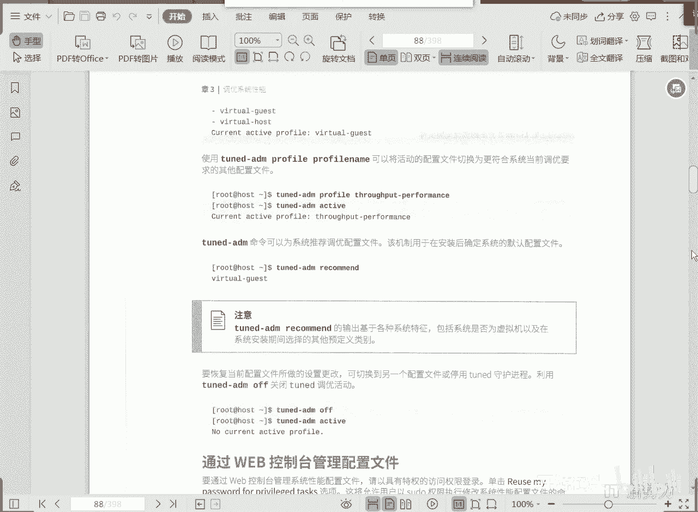
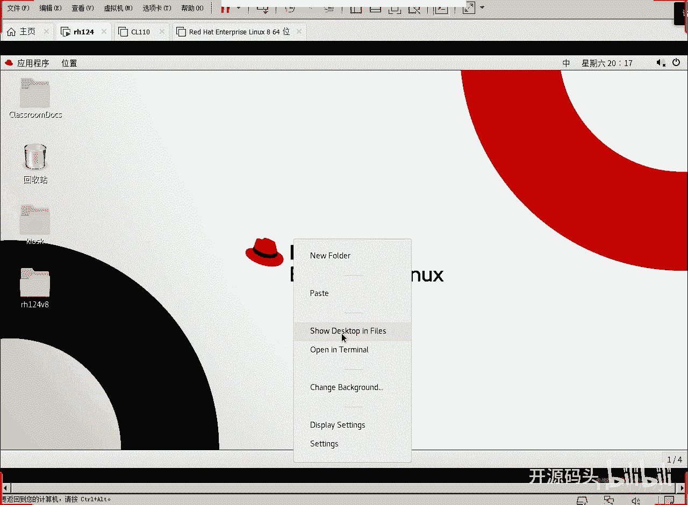
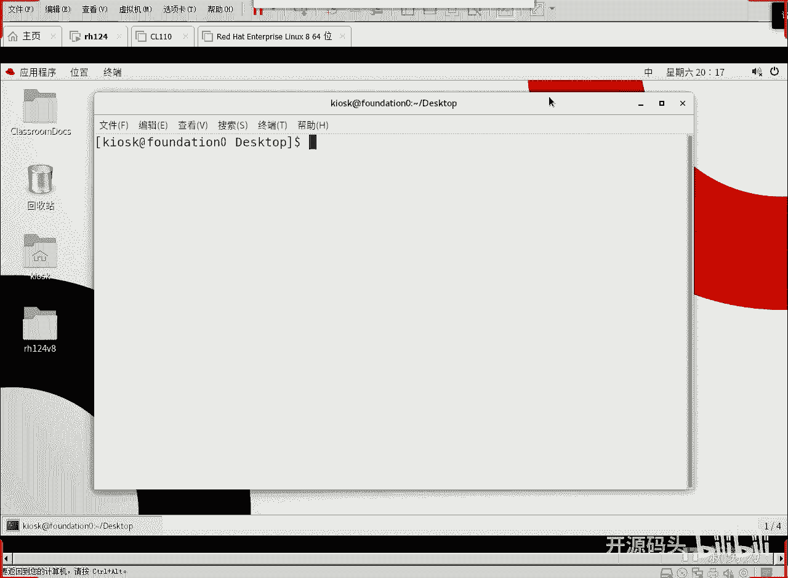
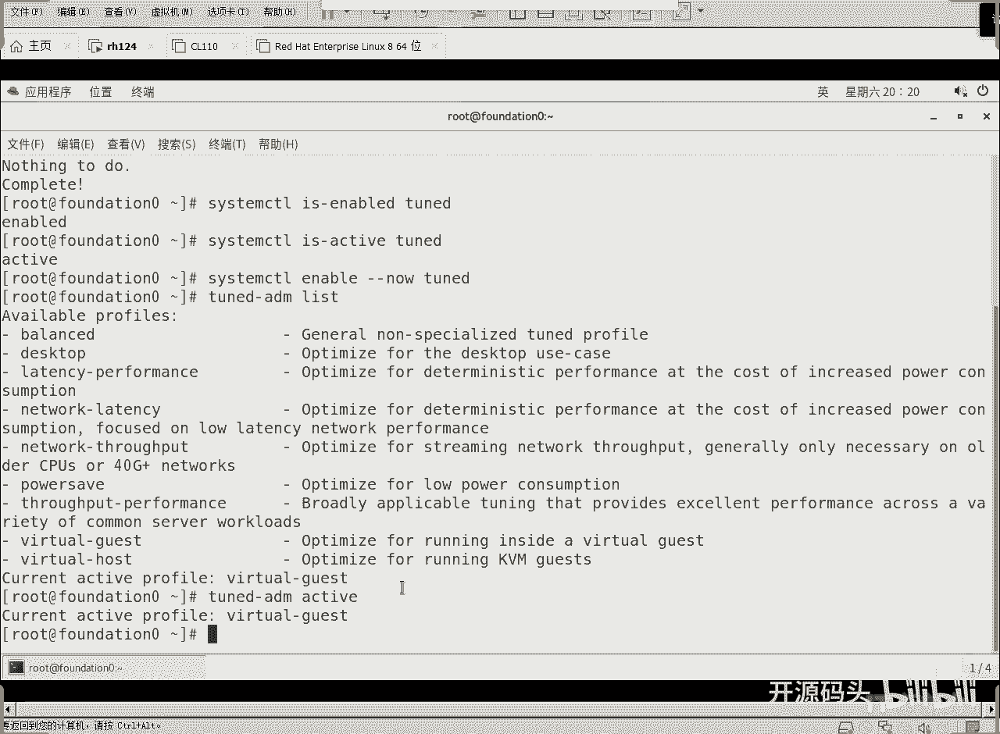

# RHCE RH134之3 调优和进程优先级(1) - P1 - 开源码头 - BV1hg41127KV

好，第三章这张的名字起的很好是吧？调优啊，但实际上就是我们去选择呃根我们根据我们的机器的这个应用场景来选择对应的这种呃。优化的这种配置文件。那优化配置文件一一旦应用起来以后呢。

啊我们的机器呢就会在这种场景下，我们所指定的这种场景下。实现一个高效率的工作，高性能的一个呃体现。OK那么第二部分的内容，这章的第二部分内容啊，就是呃还是以前我们期学过的一个知识点，就是什么呢？

就是进程优先级啊，进程优先级。当我们对一个呃应用程序或者是一个进程啊，它在呃运行的感觉到这个。呃，就是有一些特殊照顾的时候，那或者是有一些呃觉得他工作的时候呢，有点呃不太重要的时候。

你就可以顺可以呢把这个进程优先级调高一些或者什么调低一些。是吧啊如果说我们希望他比别人反应。快一些。那我们可以把这个进程的优先级调高。那我希望他呢呃就是有有能有有这个资源的时候，他去操作。

没资源的时候呢，他就往后延就就可以了。那么对于这种任务来讲的话，那就是呃调低它的优先级是吧？啊，调高或者调低优先级对进程优先级针对某某一个进程对它的进程优先级进行调节，就这么两部分啊。

所以说我们今天这张呢呃内容还是相对来讲比较简单。OK那先说第一部分啊，就是说呃我们的那个性能调优啊，性能调优呢呃有一个工具啊，这个工具呢叫呃twin是吧？啊，ted。就是说呃就是调试调协的意思啊嗯。

那么呃所要做的就是很简单，把它装上，然后把这个服务呢给它呃unable，并且立即启动啊。这个是许可的话是下次开机就启动。now是现在就启动。啊，好，那么t这个准确来讲，它就是一个服务啊。

当做一个服务去运行，把这个服务呢给它装好启动啊，然后呢我们利用tend呢去选择我们需要的这种配置文件就可以了。那么这里面呢。红帽的企业版的linux8啊。

它发布版的一个系统里面啊自带的啊所谓的调优的配置文件。啊，那老呃这个又是中文，又是英文的啊啊，这个是均衡啊，均衡就适合于。呃，要在节能和性能之间进行一个折中。啊，其实呃自古以来是吧。

我们呃中国人就是崇尚这种中庸之道是吧？就是你干啥都不行，干啥都又都能行是吧？中庸均衡啊，这个呢呃应该是比较常见啊，就是你你这个机器呢啊做什么都可以啊，在节能和性能之间实现一个什么折中啊，就是又能节能啊。

性能又不差啊，达到这么一个效果就可以了。那还有一种就是desktop啊，desktop的话就是桌面应用。啊，桌面应用的话呢，自然而然就是什么图形这个环节的效率要高，对不对？啊，那还有这个啊这个叫什么？

吞突量性能啊性能吞就是。实现这个呃最大的吞吐量的这种操作啊，就是进行大量数字IO。啊，还有一个什么叫做延迟是吧？啊，低延迟。啊，延迟小的这种性能优化啊，呃，比如说你的服务器系统对吧？服务器系统哎。

就是让这个呃客户呢访问访问，就是临时性的触发访问比较多。那用这个应该稍微好一点啊，还有一还有一个就是说网络延迟啊，网络延迟啊是由这个呃上面这个延迟。啊，低延迟的这种反应。

低延迟响应的这种配置文件延伸来的啊，它可以启用额外的网络调优参数，提高网络的延迟是吧？啊，这个的话是提高各方面的延迟，对不对？啊，还有网络吞吐量啊，网络吞吐量又是从这个啊IO吞吐量里面呢延伸而来的。

是吧？所以说我们知道了这么多性能优化的这个配置参数配置名称以外啊，我就可呃之之后呢啊我们就可以呢去。明确指定我希望我的机器工作在哪一种工作状态下就可以了。所以说我们要做的命临也仅仅就是什么。

真的 me active啊，那么呃这个呢是。用来这个呃看一下当前活动的是什么。啊，当前活动的配置文件是虚拟机的gues，有没有有吧？虚拟的ges什么意思？就是说这个系统呢啊啊这个系统呢在虚机上运行。

调用性能调用呢针对虚虚拟机。就是我我这个机器是一个虚机啊，我的参数呢应该针对虚机呢做一些调用。啊，我是一个虚机客户端是吧？那如果说你是一个虚机host端呢？You看。我们。

我们的机器如果说上面要运行大量的虚拟机的话，我们就选择watcher host。如果我们我们的本身这个系统就是一个虚机，那我们选择watcher guest。是吧啊根据具体情况去设置去查看设置就可以了。

这个是查看当前活动的对吧？那我们可以选择的有哪些呢？list list这边blance啊，balance，这个是负载均衡，桌面低延迟，网络低延迟，网络吞突啊，吞吐量是吧？

最省电power save是不是？哎，这就是我们上面图上所说的这些。对不对？你看还有针专门针对or数据库来做这个优化的配置文件是吧？基本上呢我们就是说只要知道啊，有这么多配置文件可以供我们去选择。

然后我们可以去根据我们的实际个工作场景给它指定一个配置文件就可以了。OK好，那呃像修改这个。怎么去改呢？直接turn the me，然后profi是什么啊，上面已经list列出来了嘛。

我们从这里面选择我们希望用到的那个配置文件，启用啊，然后看一下activeive就知道了是吧？如果我们自己也不知道自己该用什么，那甚至于可以用什么呢？哎，可以什么让系统给我推荐一个。

让系统一个推荐一个是吧？recomit给我推荐一个那系统推荐是啥，你就先采用啥，以后工作过程当中再说是吧啊。要恢复当前配置文件所做的设置更改的时候呢，可切换到另一个配置文件。

或者是停用这个twin的首物进程啊，利用twin ofalmin这个 of可以关掉这个调优活动啊，这个呢就是我们。就是8。

新添加的东西是吧？好，那我们呢可以简单的看一下这个过程，对吧？好，呃，为了演示方面呢，我还是在这个防对上去做。好吧。嗯，实际上我们课后的课后的那个试验呢，推荐在servA上去做啊无所谓了哈。

反正是操作一下就可以了，先切换到什么呢？

root用户是吧？切换到root啊，然后呢呃EM。直接装吧。衬的。他说already是不是这个东西已经装上了，对吧？already好，装上之后呢，马上给他什么进行这个启动啊，earning able。

或者我们检查一下，看它是不是已经用起来了。is anboard。然后呢。衬的是吧。看人现在就是许可的，对不对啊？而且不但现在是许可的，现在应该是也是还还应该是已经启动了的。啊。就是活动的是吧。

已经启动了啊，然后呢我们可以去什么呢？呃。像书上说的啊，我们。可以做一下是吧？现在就启动。好呃，其实他现在这个状态已经就是正确的啊，我这样做就是相当于多做一遍啊。OK好，然后呢我们可以去呃先列一下它。

所有可能可能给我们提供的这个。优化模式是吧，或者是优化的配置文件啊，你这个是负载均衡的桌面的低延迟的啊，网络低延迟啊，网络吞透量啊呃。

你看这个这个什么仅仅必要的在这个呃旧的CPU或者40G的4G加的网络啊，这个方案呢就适合于的那些对网络通讯要求相对比较高的这种机器里面啊去实施使用啊，还有超级省电是吧？还有这个喷透量啊，吞透量的配置件。

还有wat guest和wat host啊，我们现在呢能看到所有的是吧？那我们现在目前是啥呢是哪一个呢？我们可以。active看一下啊，目前就是啊watcher guest啊。

就是如果说我这个系统是一个虚机，那它就是目前应该最好的一个方式了，对吧啊。

