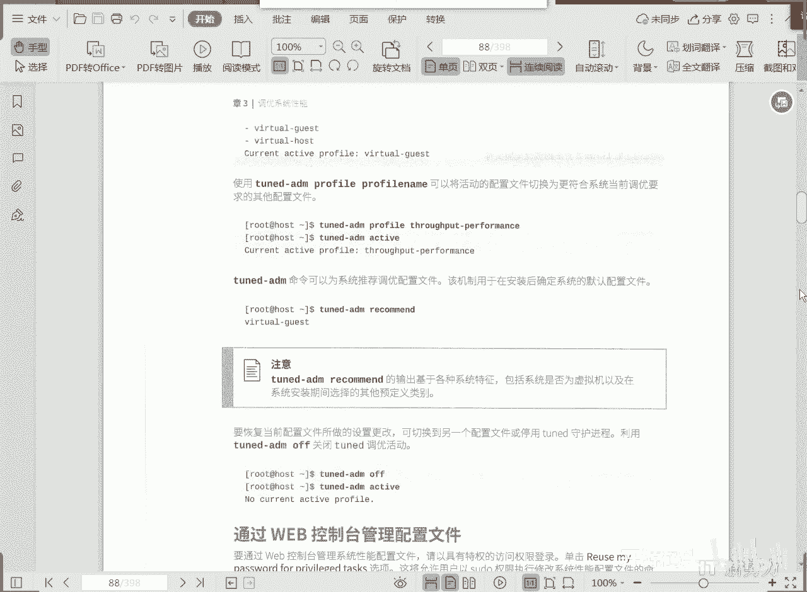
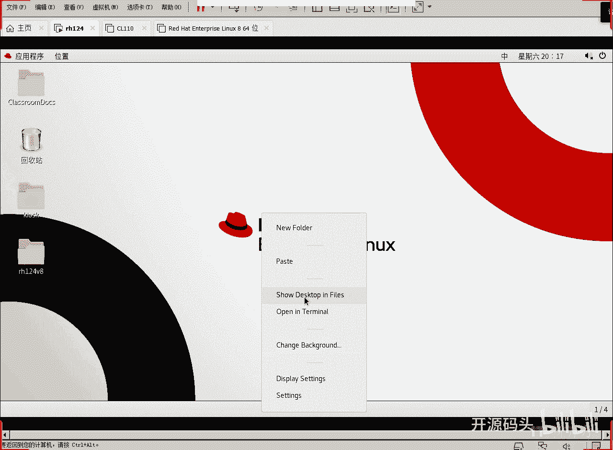
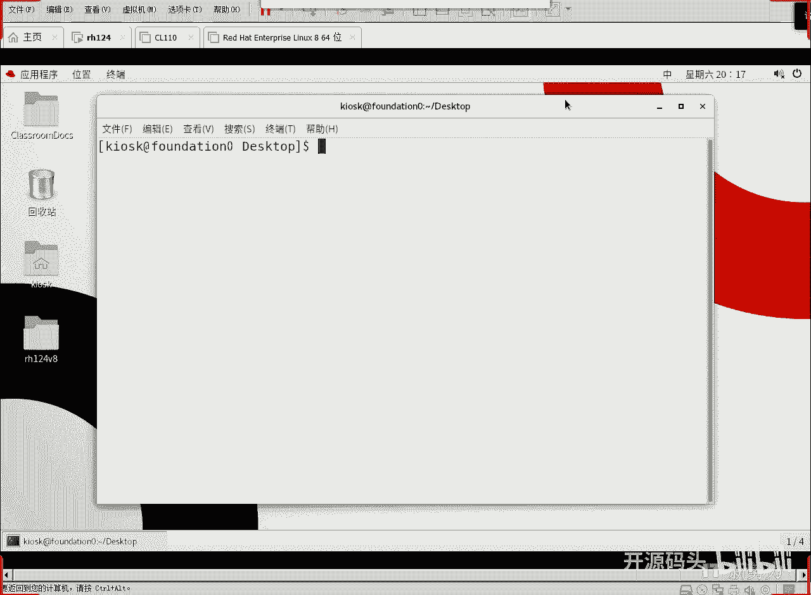
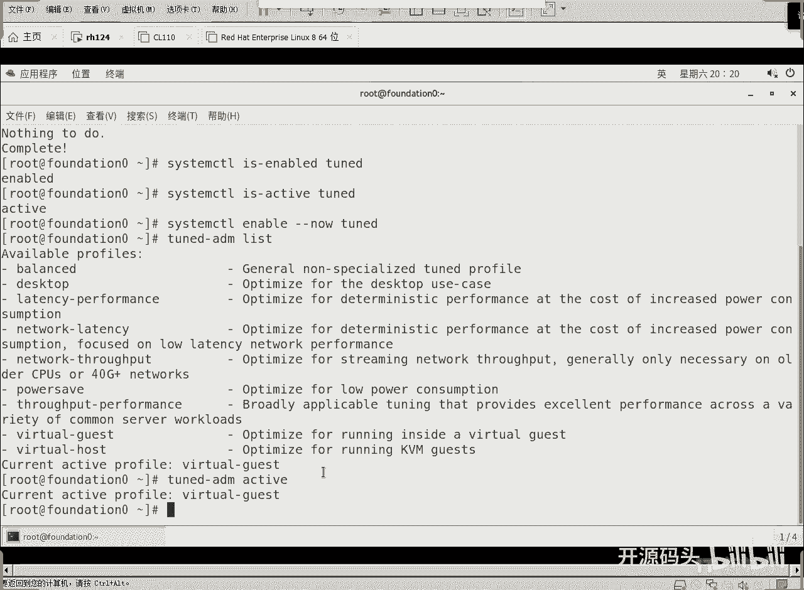

# RHCE RH134课程：第三章：调优和进程优先级（第一部分）

在本节课中，我们将学习系统性能调优的基础知识，特别是如何使用 `tuned` 工具来根据不同的应用场景选择合适的优化配置文件，以提升系统在特定工作负载下的性能表现。

上一节我们介绍了课程的整体结构，本节中我们来看看性能调优的具体实现。

## 🛠️ 性能调优与 `tuned` 工具

系统性能调优的核心是根据机器的应用场景，选择对应的优化配置文件。一旦应用了合适的配置文件，系统就能在指定场景下实现高效率、高性能的工作。

`tuned` 是一个用于系统调优的服务工具。使用它主要分为三个步骤：安装软件包、启用服务、选择配置文件。

以下是使用 `tuned` 的基本命令流程：

1.  **安装 `tuned` 软件包**：
    ```bash
    yum install tuned
    ```

2.  **启用并启动 `tuned` 服务**：
    ```bash
    systemctl enable --now tuned
    ```
    这条命令中的 `--now` 参数表示立即启动服务，而 `enable` 确保下次开机时服务会自动启动。

## 📋 理解调优配置文件

红帽企业版 Linux 8 自带了一系列预设的调优配置文件，每个都针对特定的使用场景进行了优化。

以下是主要的配置文件及其适用场景：

*   **balanced**：均衡模式。在节能和性能之间取得折中，适用于通用场景。
*   **desktop**：桌面模式。针对图形化桌面环境进行优化，提升图形交互体验。
*   **throughput-performance**：吞吐量性能模式。最大化系统的吞吐量，适合进行大量磁盘 I/O 操作的任务。
*   **latency-performance**：低延迟性能模式。优化系统以减少响应延迟，适合需要快速响应的服务器。
*   **network-latency**：网络低延迟模式。由低延迟模式延伸而来，额外启用网络调优参数，进一步降低网络延迟。
*   **network-throughput**：网络吞吐量模式。由吞吐量模式延伸而来，优化网络吞吐性能。
*   **powersave**：省电模式。尽可能降低能耗，优先考虑节能。
*   **virtual-guest**：虚拟机客户机模式。针对在虚拟机上运行的系统进行优化。
*   **virtual-host**：虚拟机宿主机模式。针对运行大量虚拟机的宿主机系统进行优化。

## 🔍 管理调优配置文件

安装并启动 `tuned` 服务后，我们可以通过命令行来查看、选择和修改活动的配置文件。

以下是管理配置文件的关键操作：

1.  **查看当前活动的配置文件**：
    ```bash
    tuned-adm active
    ```
    此命令会显示当前正在生效的优化配置文件。

2.  **列出所有可用的配置文件**：
    ```bash
    tuned-adm list
    ```
    此命令会列出系统中所有预设的配置文件。

3.  **切换到指定的配置文件**：
    ```bash
    tuned-adm profile <profile_name>
    ```
    将 `<profile_name>` 替换为你希望启用的配置文件名称（例如 `throughput-performance`）。

4.  **获取系统推荐配置**：
    ```bash
    tuned-adm recommend
    ```
    如果你不确定该选择哪个配置文件，可以让系统根据当前硬件和配置给出推荐。



5.  **关闭所有调优（恢复默认）**：
    ```bash
    tuned-adm off
    ```
    此命令会停用 `tuned` 服务，系统将恢复到未调优的默认状态。

## 📝 操作演示





为了更直观地理解，我们可以进行一个简单的操作演示。首先，切换到 `root` 用户，然后执行以下步骤：

1.  安装 `tuned`（如果尚未安装）：
    ```bash
    yum install tuned
    ```

2.  启用并立即启动 `tuned` 服务：
    ```bash
    systemctl enable --now tuned
    ```

3.  列出所有可用的配置文件，确认 `virtual-guest` 等选项存在。
4.  使用 `tuned-adm active` 命令查看当前活动的配置文件，通常新安装的虚拟机默认就是 `virtual-guest`。
5.  尝试切换到另一个配置文件，例如 `balanced`，然后再次使用 `active` 命令确认更改已生效。

通过以上步骤，你就完成了基本的系统性能调优配置。

本节课中我们一起学习了如何使用 `tuned` 工具进行系统性能调优。我们了解了 `tuned` 服务的作用，熟悉了多种针对不同场景的优化配置文件，并掌握了查看、选择和切换这些配置文件的命令。这为我们在生产环境中根据实际需求优化系统性能打下了基础。



下一节，我们将探讨进程优先级的管理，学习如何调整进程的优先级以控制其对系统资源的访问顺序。