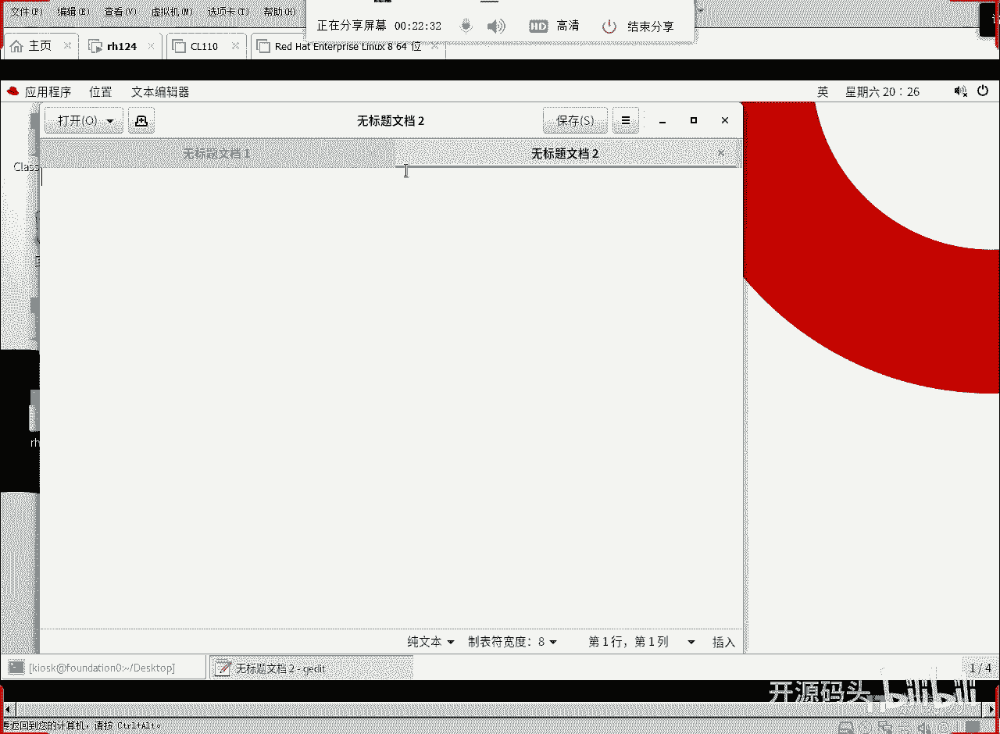

# RHCE RH134之3 调优和进程优先级(2) - P1 - 开源码头 - BV1bt4y1A7qp

那我们如果说想把我的，想把我们的系统换成哪一个，换成这个超级省电的行不行，可以啊，完全可以啊，and me profile，啊配置文件选择什么power c，省电的。

改了之后看一下art是变成power save了，其实调优我们这里名字起的好是吧，名字起得好很厉害，但实际上呢啊所谓的调优就是让我们去学，根据我们的机器的运行场景，选择对应的这种调优的这个配置文件啊。

那么当我们去实施一套配置文件之后呢，这次这个机器呢，就针对这种场景做了一些优化啊，这其实就够了啊，平常我们对这个优化措施操作也就够了，但如果说我们在这个实际程序或者机器，使用过程当中啊，确实是呃。

对某一个或者某两个这个应用程序啊，需要他工作的效率最高或者更好，那就需要去什么，去明确的指定那个它的优先级啊，这就是我们下一节所要聊的啊，就是优先级的这个设置啊，优先级啊。

这个优先级呢呃我们来看一下这个图。

在我们的系统当中啊，我们的优先级呢是呃取值哈，是从-20到什么到正19，正常情况下我们开启的任何一个程序啊，我们bus启动了任何一个程序，它的优先级都是什么零，那如果说这个数值越小，优先级越高。

跟数值相反的数值，这个数值越大，这个优先级反而什么越低，呃正常情况下呢啊我们都是零好。

我们打开一个进程看一下啊，nice main呢就是给一个优先级值，让他按照这个优先级值值去启动这个呃，进程，去启动我们的那个呃所谓的叫程序啊，好我们可以起一个呃g edit jz是一个什么。

是一个图形界面的一个，图形界面的一个这个这个编辑器是吧，我们让它在后台运行啊，我们先不要加nice好吧，j i it，后台运行，然后启动了之后不显示桌，不显示图像呢，直接来看一下ps啊，然后au。

嗯看所有的进程把git才显示出来，我们真没有起来，因为你看这个命令看的时候呢，他没有那个进程，没有g e d i t启动的进程，它是不允许什么，不允许这个初始化这个服务连接被拒绝啊。

这个主要是不能显示啊，因为当前这个用户呢嗯不能打开图形界面，ex退出，啊我就在这个k2 sk这个用户下啊，j edit后台系统，这就好了啊，这就正常了是吧，好那他后台启动了，我们的提示符是出来的。

ctrl这个t竖杠到root，因为我要用root来看的更详细一些啊，我看什么呢，看还是那个a u x那个i ax是有终端的，没终端的全部显示，但是我现在要求什么，要求要显示出nice那个列啊。

要显示类似列，首先呢pad这是一列是吧，然后再显示一个come on，第二列，然后再显示一个nice值回车，jiap这dt吧，不要显得太多啊，这是他的u进程id，这是他的命令，这是它的优先级值，对不对。

这，个线看上去就很清晰了，正常启动的进程的优先级就是零，好现在呢我们呃用nice起一个nice jdit，然后再起个新启动的进程呢。

和原来用同一个窗口啊，骑了两个这个选项卡是吧。

ok然后我们来看一下，还是用这个，关掉这个关掉重启一下好吧，关掉关掉以后进程还有吗，没有了好，我们现在呢再用nice命令起一个，只要nice命令起一个后台是吧，优先级值是多少，十了是吧。

原来的优先级指的是零啊，正常用git直接启动，在bug里面正常写这些ji它就是零零，优先级是零啊，nice值吧，nice值是零啊，然后当我们用nice启动一个进程的时候，它的nice值就变成什么了。

十啊，当然我们可以什么，可以用自己的一个指定的值去开启啊，比如说我觉得十有点太大，我起个五行不行，看出来啊，起个五行不行啊，nice杠n5 啊，或者直接写五都可以啊，回去启动了吧，好，我们再来看一下。

是不是他nice值就是五了对吧，那有人说这个五零十分别感觉是什么啊，如果你的机器性能很好的情况下，你是没感觉的，就是你在做这个操作的时候，你根本没有感觉，就是他慢了快了啊，因为你的机器性能很好。

它呢对资源的消耗很小很小是吧，所以说你感觉，不到又快又慢，这个呢关于这个事情呢，啊我们应该呃说一个道理啊，就说优先级的设置，在什么时候才能体现出来，只有在发生资源争抢的时候，我们的这个进程。

优先级才能体现出他们之间的差异对吧，如果资源很丰富啊，进程数量也不多，每个进程都可以得到充足的资源，那就没有必要因为优先级低，而刻意的降低速度，比如说你有一个cpu，而恰好也只有一个进程在运行。

没有资源争抢，那优先级就没有意义，如果说你有一个cpu，有五个进程，那你五个进程就要分了，这个cpu，cpu就得分成五，个时间片，然后呢让这五个进程呢分别去执行，宏观上看上去好像各自都在执行。

但实际上呢在一个微观的实验片上，它的一个c p u总共只有一个cpu，它同一时刻只能执行一个进程的指令，所以说呢这个时候就出现了资源征用，cpu的征用，只有在这个时候，我们的nice值才会起作用的。

对吧啊，如果说你不排队，没有队列进程没有对，那就nice指大的那只小无所谓是吧，所以说如果说你看我这个机器呢，我这个机器的cpu是几个，我这个机器的cpu是几个嗯，cut process。

下面的cpu info，我这个机器有几个cpu，我们看那个cpu的i d call，哦我这个是虚机啊，只有一个cpu，看到吗，这只有一个cpu，一盒单核的啊，0号i d是0号啊。

因为我这个机器是一个什么是个虚机啊，虚机呢他只给他分了一个cpu，那我是这个这个虚机现在就是一个cpu，同一时刻如果有启动多个进程，多个进程呢都要运行，这个时候我们的优先级才会体现出来的效，果对吧。

我的一直举一个例子啊，就是说呃超市里面，我们在超市里买东西的时候啊，你在结算账的时候啊，你我们比如说有五个人要出，但是超市现在开的那个算账的口呢，有十个口，就是你有十个cpu可以处理这个进程对吧。

但是你现在只有什么，只，现在只有五个人要解释，那这个时候你说这五个人的优先级高低，有没有有没有他们之间的一个什么呃，也体现出他们之间的一个优势来比别人优，点，比别人那个啊有优势来体现不出来呀。

因为每个人都可以直接结算出去啊，每个人都可以拿到一个，就是每个进程都可以拿到一个cpu对吧，各各自都是全速在处理，那你优先级高的，优先级低的，你根本体现不出你的好坏来，是不是，但现在话又说回来了啊。

只有我现在还是十个结账口，你现在有30个人要排，队出每个结算口是不是要赌三个人，这是不是就有了队列了，有了队列以后的优先级高的那个人啊，他可能是要插队啊，他要放在前面去做，因为他是vip啊。

或者是他是领导把前面那两人往后挪，他第三个人他要出，因为他什么他优先级高，只有在有队列的情况下，我们的优先级才能体现出它的优势啊，如果说没有队列啊，根本就没有攒下来的东西，就没有等等待的进程。

那你的优先级是十也好，优先级是19也好，或者是-19也好，你的工作效率是一样的啊，所以说这个优先级呢是相对，的啊他嗯我们在考虑这个资源征用的时候，首先得判断你有没有足够的资源，如果资源足够。

它就不会产生征用，没有队列，没有任务队列，那就不会是吧啊，你的优先级值高低就不会有什么效果，因为所有的人都是什么权利，所有的进程都是全速在运行，不管你的优先级有多低，还有多高，都在全速运行啊。

但是呢如果有的队列，那么优先级高的必然被先处理，从而呢先出去啊，就是先完成，所以说呢我们的优先级是这么个概念啊，大家注意一下这个思路啊，所以说我刚才演示的时候，你看啊，我刚才演示的时候，这个是零是吧。

默认启动就是零，而这个呢是默认不写值，不写值，它是十，默认值是十，如果我们洗了一个值，它就这个值，但是我们同一时刻要么只运行它一个，关了它再运行了一下，它关了它再运行它，我问一下这三个情况。

我们能不能感觉到它的速度有快有慢，感觉不到的对吧，因为同一时刻只有一个进程在运行，而我只有一个就一个cpu啊，有些同学说，那你后台的那些程序算什么，注意这个后台和那个后台不一样啊。

就是我们的后台驻留程序，没有终端的那种程序啊，没有中断的那种程，序的话啊，他大部分时间在做什么，在做sleep，就sleep的话应该是什么，他有时间片吗，有但是呢啊它可以就是忽略不计啊。

sleep就是对cpu是没有手铐的，呃不是损耗极其小啊，所以说我们像这种情况下，我们整个这个操作不管是几啊，我们是感觉不到它的速度，有快有慢之之分的，除非啊我们用什么，用机器。

不断地产生一些消耗cpu的这些指令啊，不断的产生一些消耗cpu指令，然后呢让他们数量超过我们的内核数量，这时候有了队列之后啊，我们才能看出他们之间啊，这种占用了多少啊，就是cpu时间，片占用了多少。

所以优先级高的cpu时间片占用的就多。

