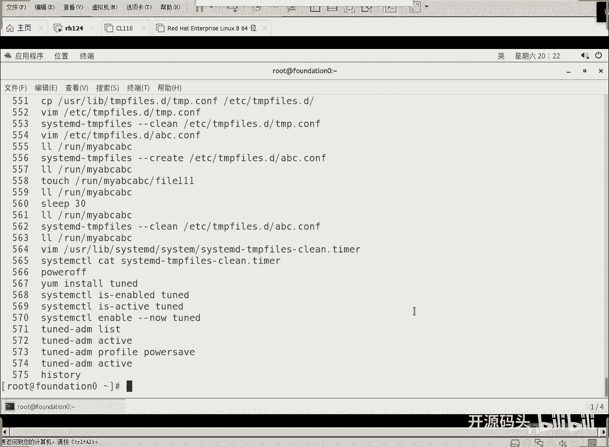
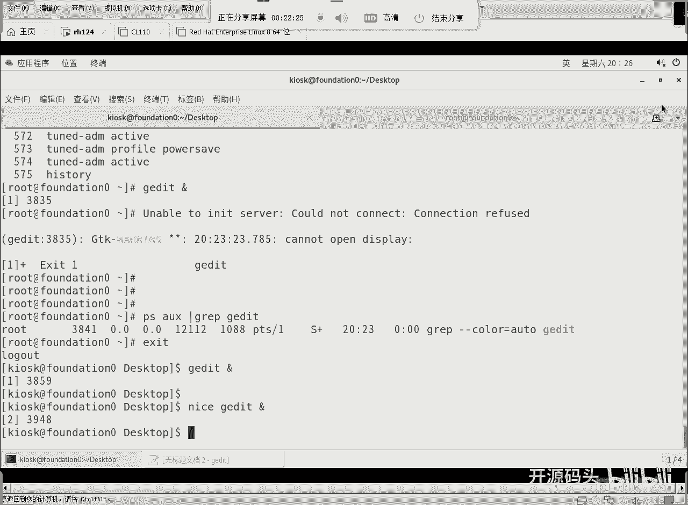
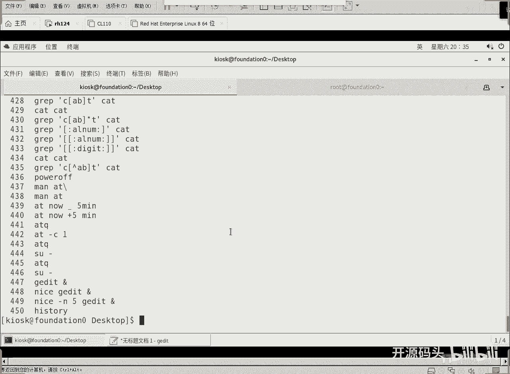

# Linux系统调优与进程优先级：3.2：进程优先级详解 🚀



## 概述
在本节课程中，我们将深入学习Linux系统中的进程优先级概念。上一节我们介绍了如何使用`tuned`工具进行系统级别的性能调优。本节中，我们将聚焦于单个进程的优先级管理，了解其工作原理、如何查看以及如何设置，这对于优化关键应用程序的性能至关重要。


## 进程优先级概念
在Linux系统中，每个进程都有一个优先级值，称为“nice值”。这个值决定了进程在竞争CPU资源时的“谦让”程度。

进程的优先级取值范围是 **-20 到 19**。
*   **数值越小，优先级越高**（例如 -20 是最高的优先级）。
*   **数值越大，优先级越低**（例如 19 是最低的优先级）。
*   默认情况下，用户启动的进程其nice值为 **0**。




这个机制只有在系统资源（特别是CPU）紧张、多个进程需要排队等待执行时才会显著发挥作用。如果CPU资源充足，所有进程都能全速运行，优先级的高低差异就难以察觉。

## 查看进程优先级
我们可以使用`ps`命令来查看运行中进程的优先级（nice值）。

以下是查看进程及其nice值的命令示例：
```bash
ps -eo pid,comm,nice | grep gedit
```
*   `-eo pid,comm,nice`：指定输出进程ID（pid）、命令名（comm）和nice值（nice）这三列。
*   `grep gedit`：过滤出包含“gedit”的进程信息。

## 设置进程优先级
我们可以使用`nice`命令在启动新进程时直接为其指定一个优先级。

### 启动时设置优先级
使用`nice`命令启动一个进程，如果不指定具体值，默认的nice值为 **10**（即比普通进程的优先级低）。

启动一个后台的`gedit`进程并设置其nice值为10：
```bash
nice gedit &
```

如果想指定一个具体的nice值，可以使用`-n`选项。例如，启动一个nice值为5的`gedit`进程：
```bash
nice -n 5 gedit &
```
或者简写为：
```bash
nice -5 gedit &
```

### 注意事项
1.  **普通用户**只能降低自己进程的优先级（即设置nice值为正数），不能提高优先级（设置负数）。
2.  **root用户**可以设置任意优先级（包括负数的最高优先级）。
3.  优先级的效果只有在CPU资源成为瓶颈时才会明显体现。在单核CPU上运行多个计算密集型任务，是观察优先级效果的最佳场景。



## 总结
本节课我们一起学习了Linux进程优先级的管理。我们理解了优先级（nice值）的取值范围和含义，掌握了如何使用`ps`命令查看进程的优先级，以及如何使用`nice`命令在启动时为进程设置优先级。记住，进程优先级是系统在资源争抢时进行调度的重要依据，合理设置可以确保关键任务获得更多的CPU时间。在接下来的课程中，我们将学习如何修改已经运行中进程的优先级。