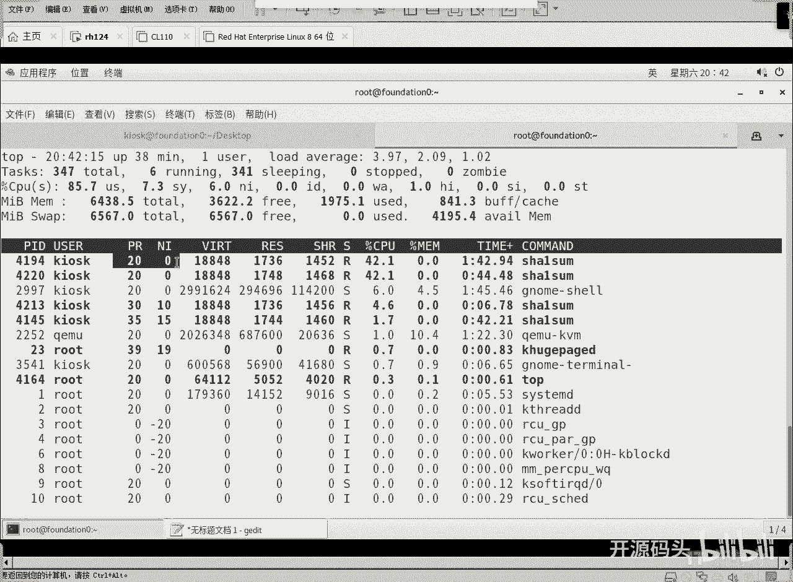
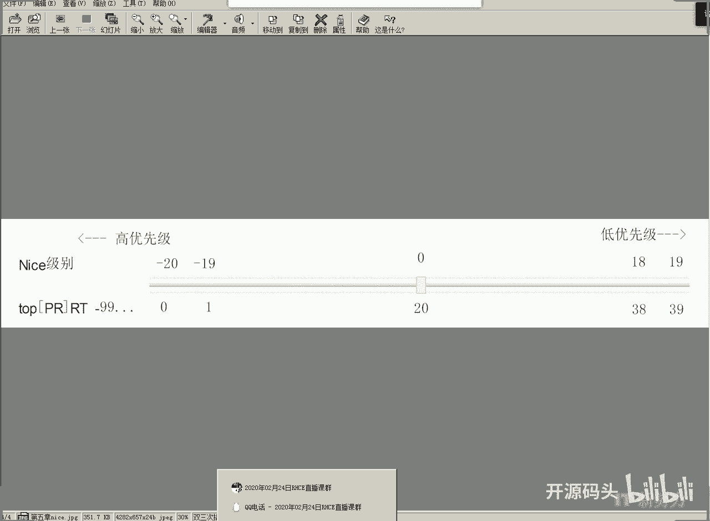
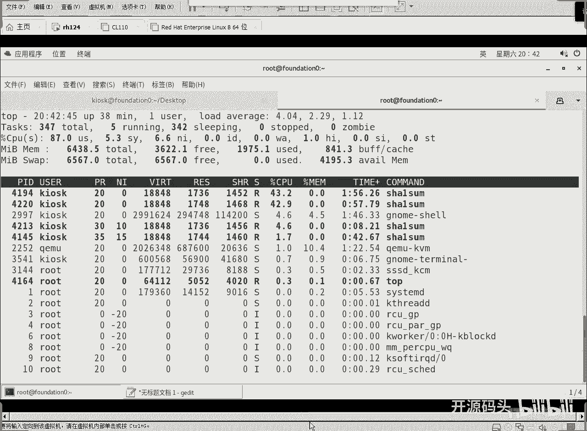
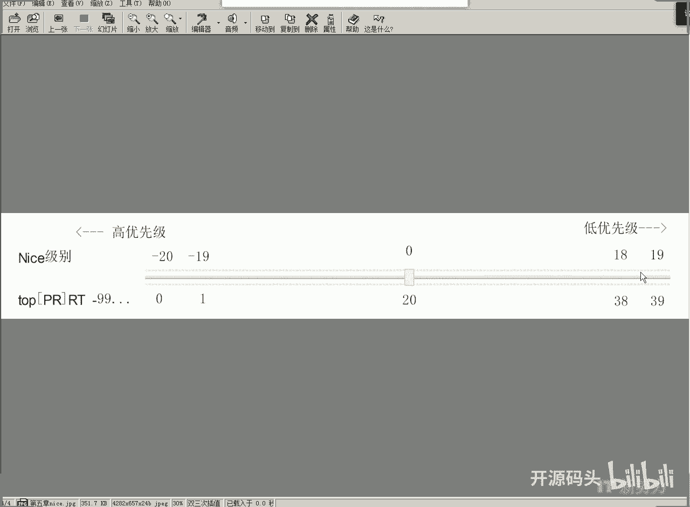
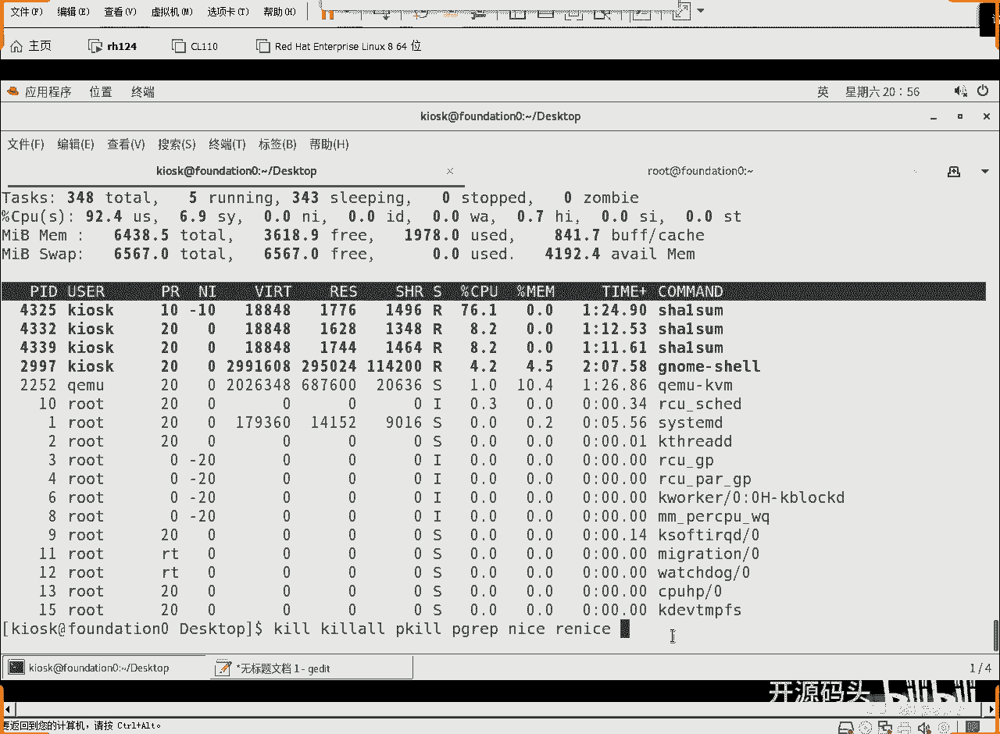

# RHCE RH134之3 调优和进程优先级(3).mp4 - P1 - 开源码头 - BV1EY4y1N7SZ

然后我们可以去尝试着去开上几个东西吧，啊开上几个消耗cpu是吧，比如说啊我们现在开一个做3d运算吧，杀summary啊，然后我们对着谁算呢，对着那个dv下一个产生零的这么一个设备啊。

这个是无穷无尽的这个文件，那么shall summary呢就是对这个文件进行什么散列值的运算，那么在这种操作情况下，它的cpu使用率应该是比较高的啊，我给它放到后台去运行。

然后把把它把我们的那个时间就是我们的那个终端给我们还回来是吧，这是一个啊，ok我们现在可以到这边来看一下，还是这个好吧，他的问题是那是零是吧啊，我们再起一个，nice多少了啊，杠n5 ，要不15吧。

让他感觉差的多一些啊，差异大的话也好看是吧，这是两个进场，我们再来看，一个进程的优先级零，一个进程优先级15啊，那么他们对cpu的使用率是能不能看出来呢，我们用top来看。

top命令是可以动态地显示出啊，我们的那个进程的一个资源使用情况，对吧啊，nice值在这里显示了啊，一个零一个15，这是他这后面这是什么虚拟内存，实际内存共享内存使用率，主要看一下cpu。

这个就是正常情况下启动的进程，而这个呢是我们用了一个什么，用了一个失误，那它对cpu的使用率和对这个c这两个使用率的高低，一眼就辨识出来了对吧，因为它这个是最散列运算的，比较消耗cpu啊，比较消耗啊。

最起码消耗一个是数据调度，一个是什么数学运算，嗯我们要不把，把4123给删了吧，第一个进程，第一个进程q4123 或者是或者是什么q 5%都可以啊，这是那个job号是吧，就可以，没有了。

我们这边它还在动态监控，是不是少了一个，你看少了那个零以后呢，15的这个时候马上到了90几了，为什么就是刚才说的嘛啊没有人没有人排队，优先级低的，他也是快速通过的，他也是可以什么高速是应用的。

因为没人跟他争抢啊，只有在发生争抢的情况下，cpu呢才会啊，就是优先于让那些优先级高的去用啊，如果没有人跟你争抢了，你没用是吧，比如说我现在还是再开一下啊，再看一下是吧，这个是默认的零，对不对。

甚至于我们可以用什么nice负，-9-19，当然现在我们知道一下，就说k2 k普通用户呢它是不能够用复制的，我们试一下nice负，-10杠n-10也可以啊啊，然后呢下一summary，第一下的，lei。

这是一个服比较长的数学运算是吧，12 三啊，啊可以起到-10吗，那不认-10，认成十了，是不是认成十了，看来复试是不管用的是吧，你看不管用啊，无法设置原机啊，杠十他把这个杠认成什么任成选项是选项。

然后后面十啊应该是杠n-10啊，那么不能设置负值啊，不能设置负值，然后这里面呢我起了四个正常情况，你看十的15的他cpu使用率都非常低，这个呢你看优先级高的马上把cpu就均分了，基本上是均分了。

优先级低的呢只能在均分完了，剩下的基础之上再给他们分上一点，啊这个呢是优先级的值，这个是nice值，这两个值其实是一样的道理啊，这两个值其实是一样的道理。

你看啊，如果你是零，那么它的优先级的值就是20啊，如果是，十呢对吧，那就是30对吧，优先极值就是30啊。

所以说这两只选一个其实就够了是吧，你看如果是十的时候呢，它就是30，优先nice值如果是十，那么优先级的值就是30，nice是15，那就是35啊对吧，因为优先级的值呢它是从它的区间是从0~39。

而我们的nice值呢是从-20到什么到19，这是不同的标准啊，这个不同的这个标准叫法啊，但实际上它们表示的优先级是一样的，比如说nice的零代表的就是优先级的20，然后它们的颗粒度也是一样的对吧。

所以说也没关系啊，我，们用哪个去理解它都是可以的啊，0~39，-20到正19啊，他有这么一套机制，但是普通用户呢是无权用零以下的高优先级的啊，只能用零以上的。

我是只有只有一个cpu，是不是，然后我们现在处于r状态的进程有几个，就是只有这么四个是吧，正在运行啊，还有一个你看我们的图形图形桌面是不是也在运行是吧，它也会占用一点点啊，它也会占用一点。

它的线就是零啊，那么基本上最高优先级的这俩人就把资源均分了，剩下的一部分呢才给了优先级低的，优先级低的呢啊，15还比十呢更小一些，你看15的是1。30的是什么呃，4。3对吧，比起零来讲。

它的cpu使用率就少多了啊，只有在，产生对立的情况下，这个优先级才能体现出它的优劣来，但如果是只有一个的时候呢，那他权力都在跑他一个，那就不存在什么优先级的起的作用了是吧，好我们可以怎么ko呃。

百分号9号任务呃，然后8号任务啊，然后，算了全q就得了，pk啊，pk是拿文件名q吧，shell sum所有的都kill了，那我们来看没有了是吧，这里面杀summary的那个进程就已经全退出了。

ok啊这就是我们所谓的那个nice的概念啊，啊只有在我们cpu不够用的情况下啊，大家对cpu资源进行征用的情况下，但我们是以cpu为例去讲的，比如说网络啊，比如说磁盘都会发生这种状态啊。

都会发生这种情况啊，所以说我们用那个12summer这个对cpu运算大量进行数据运算的情况下，对cpu调用很使用率很高的这种状态呢，我们能一眼看出来它的效果啊啊nice，起一个值啊，那我们还可以呢。

正常启动之后再去调节啊，比如说我们现在再来一次啊，summary，杠n嗯，用五来用啊，不用了，我们用正常的默认是零对吧，用零给他开一个，啊不好意思说你弄什么呢，弄的杠n nice，杠n是什么零是吧。

用这个值去看，就是默认值嘛对吧，那这个时候我们能看到它正常运行是吧，它正常运行，那现在呢我们觉得他的希望它运行的慢，现在让他慢也慢不了是吧，你就现在因为只有他一个进程嘛，所以想让他慢，他也慢不了。

对不对，然后要我们再开一个吧，再开一个再开个三个是一样的进程，他们基本上就把cpu均分了，这个稍微少是因为什么，是因为它后开他开的时间稍微启动时间稍微晚一点，随着时间越来越长，它跟上面的这个差。

距就会越来越小啊，所以说我们测三个进程都是优先级，零nice之力，所以说他们基本上是均分的，现在呢我想让这个某一个啊，比如说呃进程号是最小的，这个4325吧，想让他呢降低它的优先级，那就是什么呢啊。

用renice，rng n，然后啊我们调一下啊，4325吧啊，进程号是不是4325，旧的优先级是零星元计时，看一下，改过来吧啊，4325就在运行零新的运气十是不是改了，改了以后是降低了吧。

你看他马上下来了，它的芝麻二从30多把自己的30多退了啊，成了五成了，五退给这两个是退给了两个月算机高的啊，他优先级低，它cpu使用率越来越小，是不是ok好，问题来了，就是说这个事只能往坏处走。

不能往好处走啊，就是你只能将你的优先级，你不能是吧，增加优先级哈，就优先级的值不能往高的调，只能往低的调，这是普通用户的一个限制，啊普通用户一一不能不能直接启用这个高度，先级启动这个用nice复制是吧。

nice的复制启动了一个进程，再一个呢啊还不懂什么，把一个又向你低的改高一些啊，只能往差的改，不能往好的改啊，你比如说我现在要把它改成15行不行，这是可以的，你从十改到15可以。

但是呢从15返回时就不行了啊，你再下点14行不行，14都不行对吧，这就是说普通用户是不能做的，root可不可以root，当然可以了，root我们可以在这里直接用啊，直接在这里操作是吧。

比如说呃我们写个r啊，r就是代表renice，然后rent是谁呢啊，43254325，原来是432，我们刚刚那个给他调低了嘛是吧，4325走啊，新值是多少啊，性质是-10。

看优先级值复试了吧啊一眨眼就上去了，看他的cpu占用率马上就上去了，对吧啊，4325，你为啥，因为他优先级很高啊，别的优先级都不如他呀，对不对，所以他几乎把cpu全占了。

然后剩下的两个就那俩马上立马这个cpu使用率就降低了啊，这就是renice的作用啊，renice root用户，我这里是root用户在操作是吧，root是可以可以操作的啊，但是啊普通用户是不行的啊。

啊有人说普通用户用top行不行啊，普通用户用top也不行啊，对不对啊，你比如说呃我们呃把这个呃4332吧，好吧啊，renice 4344332回，车然后只改成什么，只改成-5吧。

权限不够多吧啊普通用户没有权啊，只有谁有啊，root用户啊，只有root用户用，ok这就是所谓的nice和renice的概念啊，就是用来调节cpu啊，不好意思，调节优先级啊，那么进程优先级呢起源于啊。

就说你有没有对立，如果你没有对立，那你优先级高低没有任何效果了对吧，但如果一旦有了队列，cpu不够用，你运行的进程数量处于run状态的这种进程数量超出了cpu的使用率。

那cpu必然要什么要照顾优先级高的啊，要什么压制优先级低的，那这个时候你一旦说是优先级有有有这个高低有区分，马上这个cpu，的使用率一看就偏心了是吧，偏心率马上就显瘦了，对不对啊。

当然这个cpu使用肯定是处于run状态才会占用cpu啊，处于这种sleep或者是中断这种等待状态，它都不会，基本上cpu都是极其少啊，就是理论上来讲是不占的，但是实际上肯定是调度方面肯定会占一点点啊。

正常处于run的同时处于run状态的进程，如果超出了cpu的那个处理器的数量，就是内核几个核对吧，所以说你现在买cpu是不是买八核的是吧，或者什么四核的八核的对吧，这说明cpu多，同时启动的进程就多啊。

但如果说你是呃cpu少，啊就是双核的或者四核的，结果你同时还起好多应用程序，那必然他们今天就会发生争抢，在发生争抢的情况下，我们是可以去调节它的什么nice值的啊，去调节它的nice值。

从而呢让一些程序运行快一点，而另外一些程序运行的自然就慢下来了是吧，资源增强的时候，优先级才会起作用啊，如果说你有八核，结果你同时只起了四个，那还有四个空的呢，对不对，所以说你这四个优先级再高再低。

他们的cpu使用率的都是高的，因为资源足够是吧，所以说调优是什么，调优只是一种假象啊，调优只是，说让你想要，那你对某个进程很着急是吧，哎他就给你假假冒着哎这个东西真快，但实际上你调用性能用到这个上面了。

别的性能就会降低，只不过那些性能可能你不关心是吧，哎这个时候就感觉是调优了，但实际上呢这是一个假象，只是一种资源的调度啊，因为你的硬件不够用了，哈哈是吧，硬件够用的时候，那你不管优先级高低，没关系。

大家都全数都在运行，还有这么一个差异是吧，ok关于调优和这个呃进程优先级的修改呢，那我们就讲这么多了，关于进程管理呢啊我们之前呢也聊过，是吧，也讲过一些章节，以前只是说唉我们找件进程，把进程给他q掉。

还记得那个呃kkr p q是不是p g r e p这些命令是吧，这些命令的就是找进程，找到进程q掉，但是现在不是q啊，我们在q和这个什么和这个运行中间做一个折中啊，就是我们让它变成什么。

变成十变成15等等等等，哎变了之后呢，它就会虽然它也在运行，但是它对我们的主力呢不会形成太大的影响啊，因为我们的优先级它的面积低，我们的面积高啊，所以说这个手机会我们就自然而然就会进行资源的调配是吧。

所以说呃调优是一个啊，我们把它称为这个只是一个说法，你并不能，把你的机器呢变得越来越优化，因为你的硬件是受限的啊，我们只能把需要那就是表现的那种进程给他更高的优先级，而我们不关心的那些进程啊。

让他压制它，不要让它占用过多的资源，这个时候表象上看嗯，我们的机器反应快了，但实际上你的cpu还是那么多资源，只不过被有效地调用了啊，或者是什么啊，调用到你显显效果的那个进程上对吧，嗯最终要想打得好。

买好机子就ok了，买好机子就行了啊，至于说这种条，就是我们只知道这只是一个小，它只是一个显现出来的，效果而已，所以说这章就讲了两个是吧，一个是什么啊，一个是呃就是tt啊。

就是我们来调用一个啊优化的一个方案啊，针对虚基进行优化，针对虚拟的虚拟计算机这个物理机进行优化啊，或者是针对这个网络的吞吐量进行优化，针对这个数学运算进行优化，针对省电进行优化。

我们用tt然后prefer去换一个对吧，tender ame啊，换一个这个，所谓的配置是吧，所谓的这个呃优优化的方案，那么如果说我们针对某一个细节，就是举想让某一个进程或者某几个进程。

我们关心的这个进程让它工作得更好，让别的进程都不管他，那我们就可以用nice对吧，nice还有什么rnice，那么nice就是用一个优先级值去启动一个进程，那么relax是什么。

把一个已经启动的进程给他调一下它的什么优先级啊，我们刚刚是不是把那个这个一条的cpu肯定立马就上来了对吧，ok好，关于进程管理，我们的第一本书讲了前面的这这么多东西是吧，第一本书讲了一，个进程管理。

第二本书，nice，nice，好。

