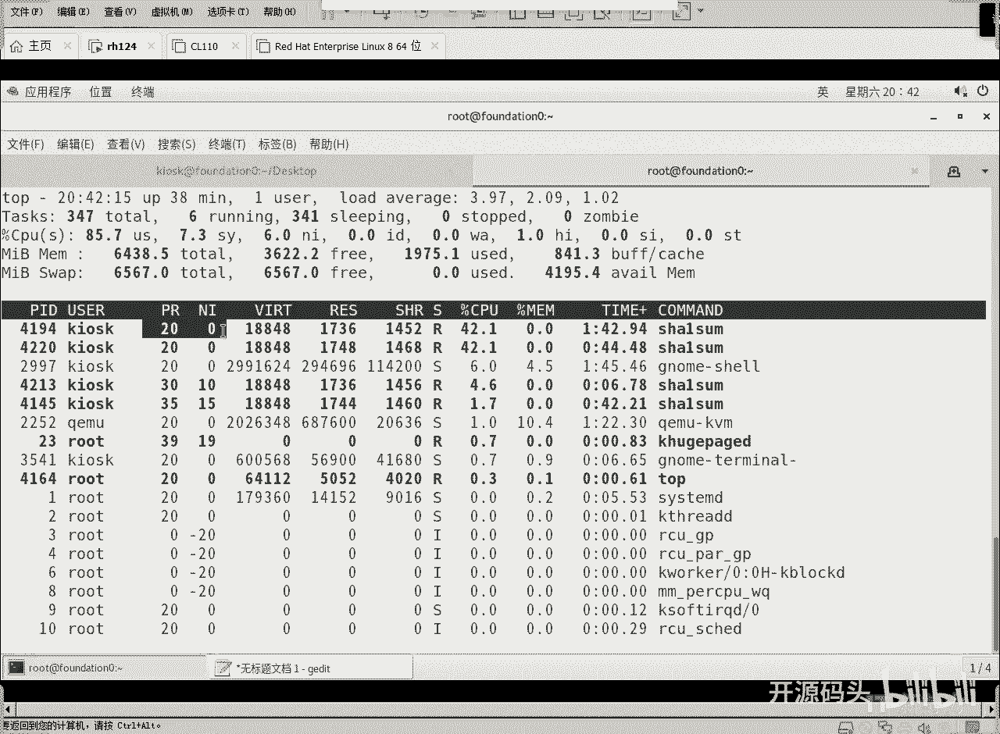
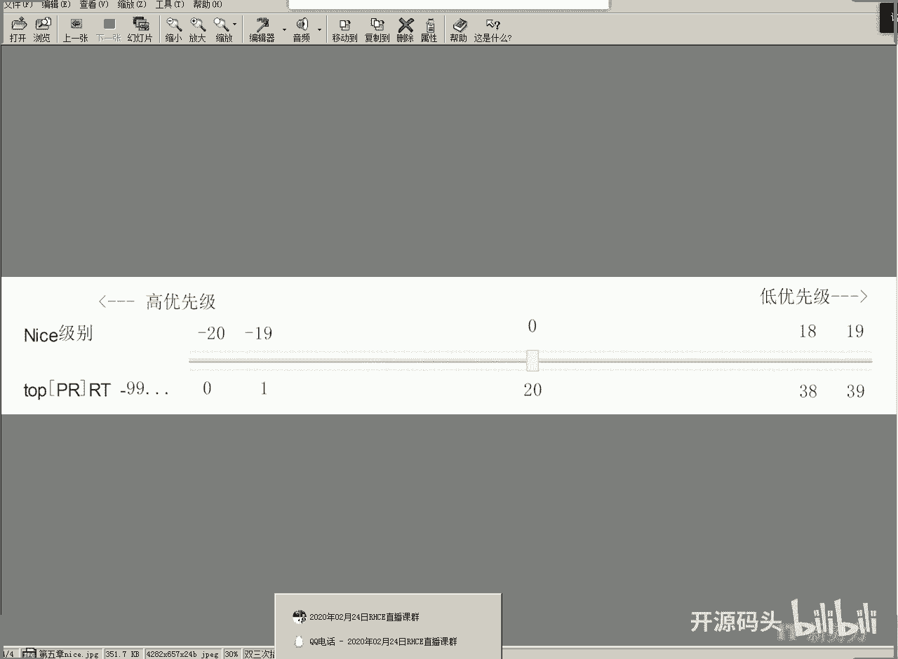
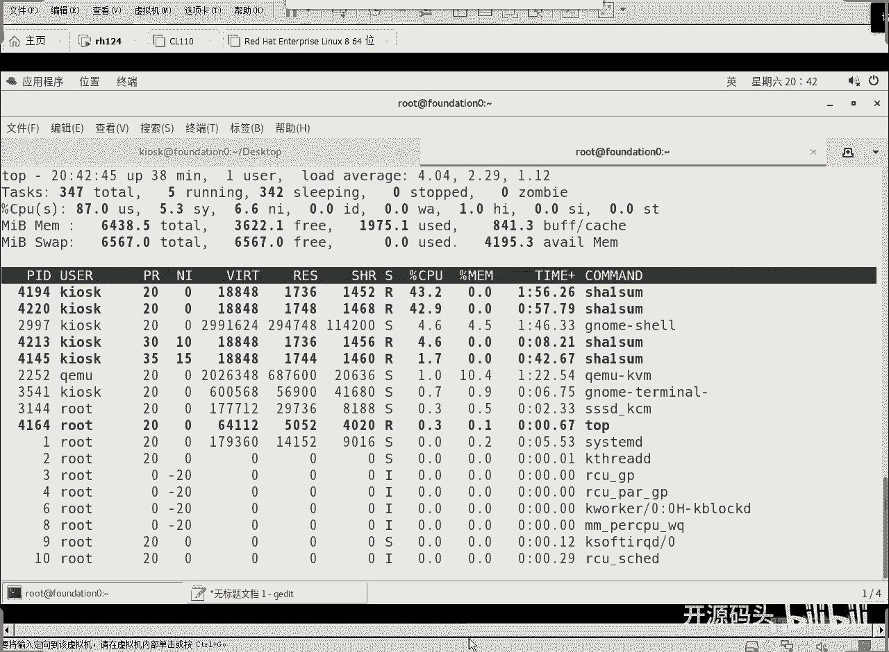
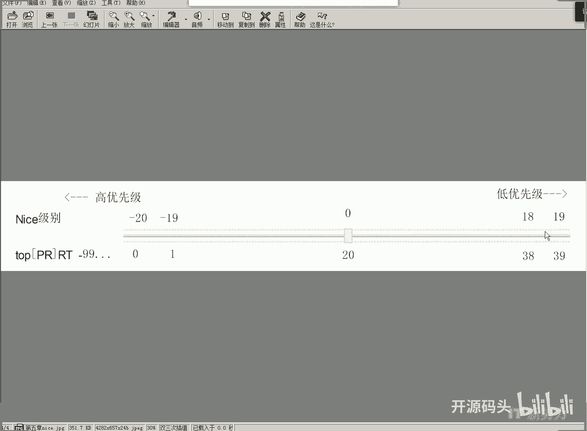
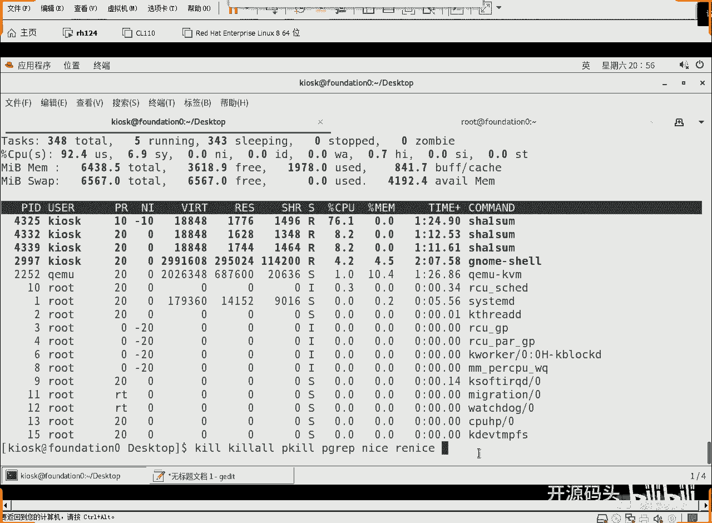

# Linux系统调优与进程优先级：3：实战演示与总结

在本节课中，我们将通过实际操作来理解进程优先级（nice值）如何影响CPU资源的分配。我们将学习如何使用 `nice` 命令启动进程，以及如何使用 `renice` 命令调整运行中进程的优先级，并观察其对系统性能的影响。

## 概述

进程优先级决定了当多个进程竞争CPU资源时，谁将获得优先使用权。在Linux中，这通过nice值来体现。本节将通过创建高CPU消耗的进程，并调整其nice值，直观地展示优先级机制的实际效果。

## 创建高CPU负载进程

为了观察优先级的效果，我们需要创建一些持续消耗CPU资源的进程。这里我们使用 `sha256sum` 命令对一个能无限产生数据的设备进行计算，以模拟高CPU负载。





以下是创建后台进程的步骤：



1.  使用默认优先级（nice=0）启动一个 `sha256sum` 进程。
    ```bash
    sha256sum /dev/zero &
    ```
2.  使用较低优先级（nice=15）启动另一个 `sha256sum` 进程。
    ```bash
    nice -n 15 sha256sum /dev/zero &
    ```



## 使用top命令观察优先级效果

上一节我们创建了两个不同优先级的进程，本节中我们来看看它们如何竞争CPU资源。我们可以使用 `top` 命令动态监控进程状态。

在 `top` 命令的输出界面中，可以查看到各个进程的 `NI` 列，即nice值。通过观察 `%CPU` 列，可以清晰地看到优先级为0的进程占用了绝大部分CPU时间，而优先级为15的进程占用率则低得多。这证明了在资源争抢时，高优先级进程会获得更多CPU资源。

当我们将高优先级的进程终止后，低优先级的进程会立刻占用几乎全部空闲的CPU资源。这说明只有在资源发生争抢时，优先级才会发挥作用；当资源充足时，所有进程都能全速运行。

## 理解nice值与优先级值

在Linux系统中，进程的优先级可以通过两种方式表示：nice值和优先级值（PRI）。它们本质上是描述同一事物的两种标准。

*   **nice值**：范围从 **-20 到 19**。数值越小，优先级越高。
*   **优先级值（PRI）**：范围从 **0 到 39**。数值越小，优先级越高。

两者之间存在一个固定的换算关系：**优先级值（PRI） = 20 + nice值**。

例如：
*   nice值为 **0** 时，对应的优先级值就是 **20**。
*   nice值为 **10** 时，对应的优先级值就是 **30**。
*   nice值为 **-10** 时，对应的优先级值就是 **10**。

普通用户只能使用0及以上的nice值（即降低优先级），无法使用负值（即提升优先级）。

## 使用renice调整运行中进程的优先级

除了在启动时设置，我们还可以调整一个已经在运行的进程的优先级，这需要使用 `renice` 命令。

以下是调整进程优先级的操作示例：

1.  首先，查看当前进程的PID和nice值。
    ```bash
    top
    ```
2.  假设我们想将PID为4325的进程的优先级调低（即增加nice值）。
    ```bash
    renice -n 10 4325
    ```
    执行后，该进程的CPU使用率会显著下降。
3.  对于普通用户，`renice` 命令只能将进程的优先级调低（增加nice值），而不能调高。只有root用户可以将进程的优先级调高（减少nice值）。
    ```bash
    sudo renice -n -10 4325
    ```
    以root身份执行后，该进程的CPU使用率会立刻上升。

## 调优的本质与总结

本节课中我们一起学习了进程优先级的管理。通过 `nice` 和 `renice` 命令，我们可以影响进程获取CPU资源的顺序。

需要明确的是，这种“调优”并不能增加系统的总体计算能力。它本质上是一种**资源调度策略**。当CPU等硬件资源不足，多个进程发生争抢时，通过提高关键进程的优先级，可以确保其获得更多资源，从而在用户体验上显得“更快”。与此同时，非关键进程的运行速度则会相应变慢。



因此，系统调优更像是一种权衡艺术，目的是在有限的硬件资源下，让最重要的任务获得最佳表现。最终极的优化方案仍然是升级硬件。然而，掌握优先级调整技巧，是系统管理员在资源受限环境下进行有效管理的重要手段。