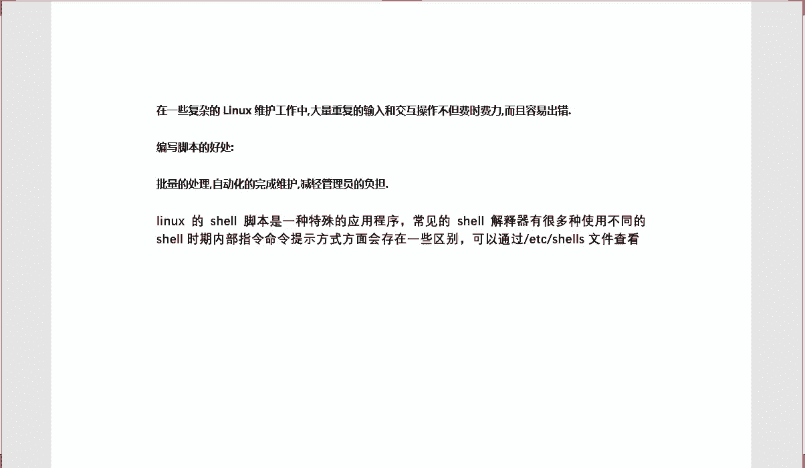
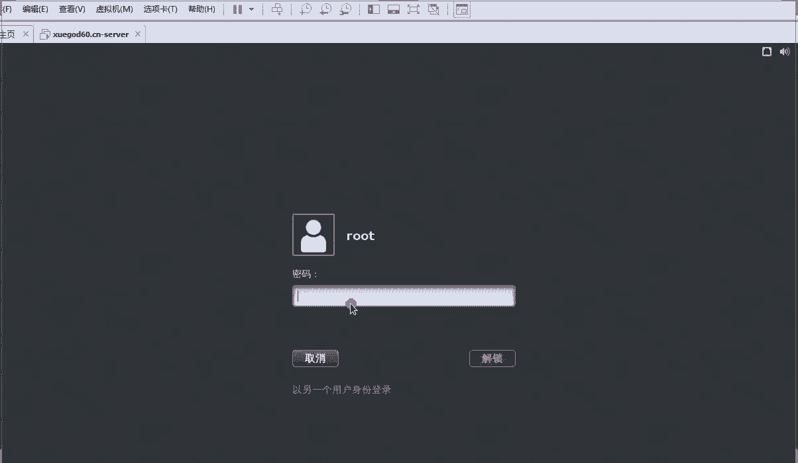
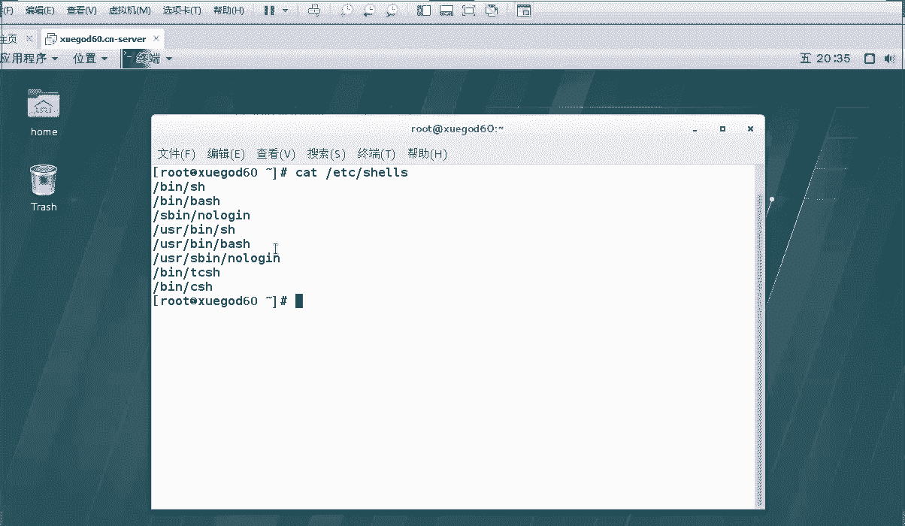
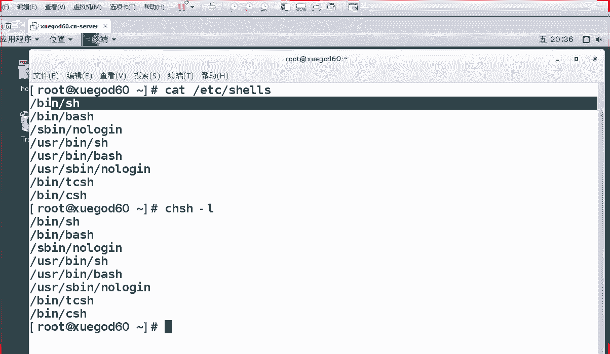
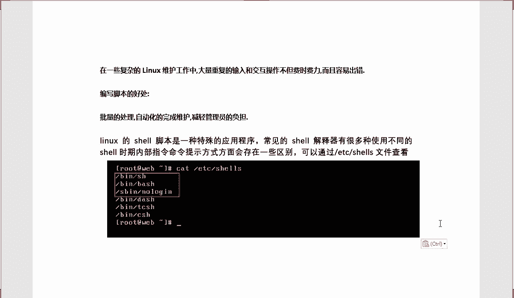
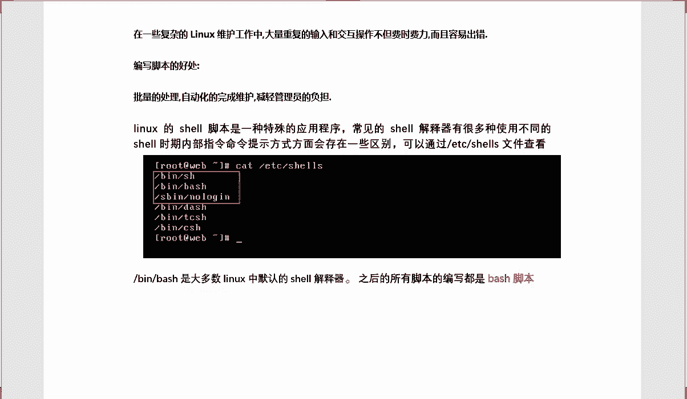
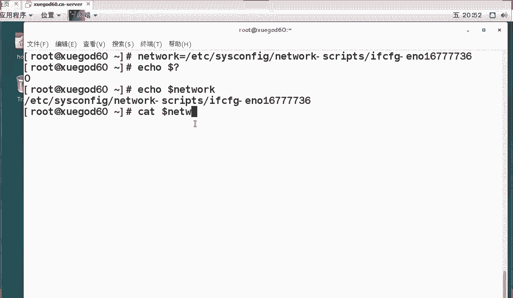
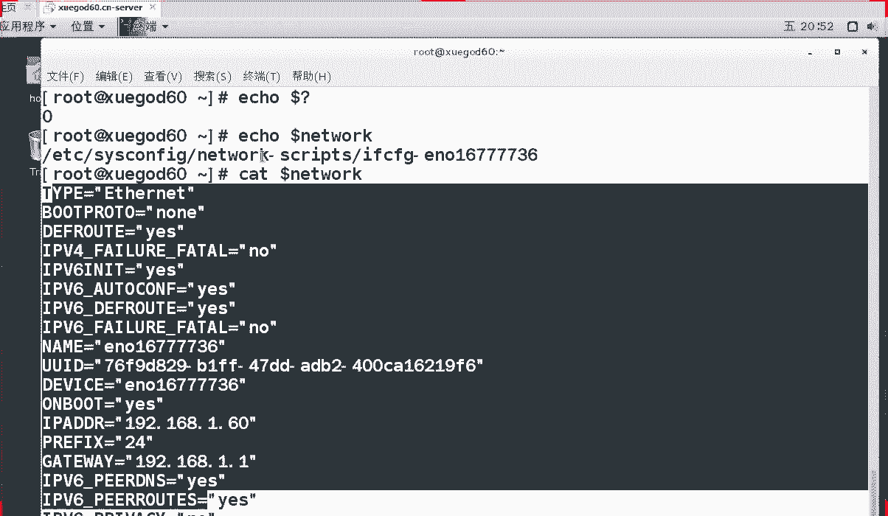
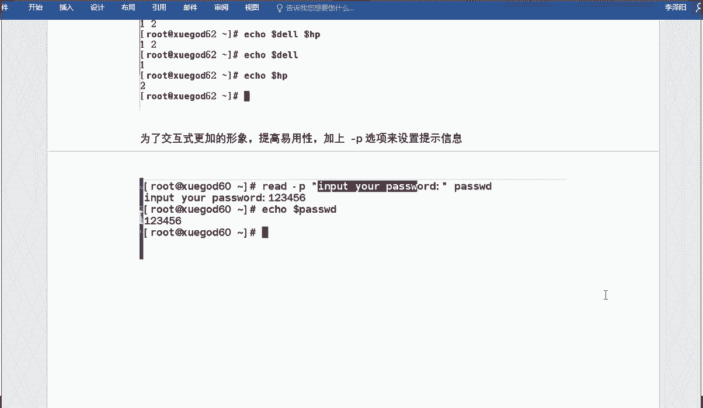

# RHCE 红帽Linux系统教程 - P1：shell脚本的基础-1 - iLoveBurning - BV1X4411j72R

啊。行，今天呢咱们讲的是第22章关于sell脚本的一个基础内容啊，今天呢就是来打基础的。呃，今天咱们把内容呢分给了4个小点啊，第一个呢是关于sell脚本的一个编写规范。如果说你要想写个sell脚本。

那么它这个文件里边内容呢也是有规范的，你必须得按照要求来写。明白吧？那关于第二个小节呢，就关于变量啊， shell里边呢最明显的就是变量。变量呢比咱们日常生活中啊。

比如说你打开一个特别长的路径是不是特别长啊，咱又记不住，那怎么办呢？你可以来创建一个变量啊，变量呢有很多种，有咱们平常的变量，要咱们特殊的变量。明白吧？包括呢咱们第三个小节讲的是局物变量与全局变量。

明白了吗？这是咱们的使用方式。那第四个呢，咱们今天呢如果说前三个点都讲完的话，我会给大家把这个讲一下啊，就关于测试判断表达式啊，这个表达式怎么试呢？啊，今天呢我就会给大家讲到的，好不好？

这是今天咱们讲内容，你先来熟悉一下，那我们一个一个来了解一下啊，首先讲第一点，关于sell这个基本格式。呃，再讲基本格式之前呢，我们要知道sell脚本是来做什么的。啊。来，那么什么是下要脚本呢？啊。

下脚本有什么好处呢？你们如果说是这个在工作中的同学或懂下脚本的同学是吧？你们应该知道啊，在咱们一些复杂的linux呃这个维护工作中。比如说啊我现在告诉你一个环境，比如说现在你是links运维人员啊。

现在呢我给你100台机器让你去维护。你怎么办呢？啊你是一条一个服务器，一个服务器的去域修改吗？啊，不是吧，你怎么办呢？你肯定是通过写脚本的，因为呢大量的一个操作呢都是重复的，重复的输入和交互式的操作。

他不但费时费力，而且呢还容易出错。你能保证说是这个呃100台机器都能写成一样吗？啊，就好比说举个最简单的例子，之前咱们也说过，那就好比说在群里边，咱们昨天说让大家拍一个上课链接是吧？大家都能拍吗？

肯定有同学还是做不到的，是吧？所以说咱们找一个准确的时间，咱们一起来完成一件事情。这样的话呢，效率就高一些了啊，那包括在咱们复杂的环境中呢，咱们一般情况下都是通过脚本来完成对应的运维工作的。明白了。

这是这块啊啊好，这是关于这个脚本先知道。那么咱们写一个脚本有什么好处呢？我们也要知道啊，写脚本有什么好处啊，最简单的一个好处，通过刚才我的描述呢，你们应该也知道什么好处呢？

咱们是不是说呃这个脚本减轻了管理员的负担，是吧，一个脚本轻松就执行了，是不是那批量的一个处理呢，还有自动化的完成维护，这就是sell脚本的一个特点啊，这个也需要大家来把这个记一下啊。

相对来说要把这个记一下，这是好处。另外呢你也知道啊，在咱们写一些指令的时候，其实呢计算机他根本就不知道你写的是什么是通过谁来给他指指指的呀。

是通过这个sell解释器来向他发分发任务的那就好比说你今天去对着一个外国人说是吧？啊，你吃饭了吗？对你对着一个外国人说啊，他根本就不懂中国话。😊，你跟他说半天呢，他还不知道你在说什么呢。

他还以为你在骂他呢，是不是真有这种感觉啊，可能你们没见过外国人啊，但是你要知道是有这种感觉的啊，就好比说咱们计算机它识别的就是二进制啊，所以说我们平常输入的命令呢，计算机它是没法识别的啊。

这时我们怎么办呢？这时我们需要一个程序来帮助我们进行翻译啊，那我问他一下啊，在linux里边，咱们的翻译官是谁呢？来举个例子，别给我说有道词典啊，linux里边这个翻译官是谁啊？好。

看你们速度快还是我速度快啊。呃，在linux里边呢，其实呢sll脚本就是一个特殊应用程序来来放大下啊。一般情况下，咱们是通过sell解释器来进行使用的是吧？它呢因为这个s解释器呢有很多。

之前呢我也给大家了解过啊，关于s解释器呢在ETC下的ss这个文件里边呢，有很多解释器啊，所以说呢每个解释器呢，它的一个范围都不一样的。

可能说它们的一个指令或者说提示的方面肯定是会会存在一些区别的是吧肯定是存在区别的啊，那么今天呢先来看一下关于咱们的一个啊脚本存放的位置啊，跟着我看一下，之前呢我应该记得跟大家说过是吧？

还记不记得咱们可以通过两条命令来查看来。

一般情况下，第一种命令是查看是吧，cat一体C的slls。这样的话呢，咱们是不是可以看出来啊啊，还有没有第二种方式来谁记得同学给老师说啊，有没有第二种方式列出这个信息呢？

说一下有没有啊之前我给教给大家一个快捷方式啊，对，CHSH是吧？杠L这样的话呢，咱们列出来信息是一样的啊。如果你觉得这个还挺长的，那怎么办呢？那你就输入这条命就可以了啊，他们的作用都是一样的。

列出我们当前系统所支持的s解释器，一共有几个呀，这个数量呢并不是说是固定的啊，但是呢有的时候呢你可以自己去添加，就好比说之前我们按照那个ZSH是吧？你自己可以完全添加的每个解释器代表什么作用呢？

我待会给你说一下，好吧，我先把这个截图给大家放到上面啊。

这是关于sll解释器都在这个目录下面啊，在这儿呢我就简单强调这三个吧。第一个呢，并下的SH和并下的bush呢，它们都是咱们经常会用到的解释器啊，咱们现在从今天往后学的脚本呢叫做bu脚本啊。

脚本叫做bu脚本，为什么呀？因为呢咱们调用的是这个解释器，有时候在这个脚本里边，我们使用的是bush这种语言，明白了吗？我们使用这种语言，那么S并下nin呢代表什么意思啊？

如果说你不想让你的一个普通用户登录系统的话，那么你呢就把它一个什么呀，把它一个s解释器改成这个这样的话呢，他就没法登录系统了，明白了吗？之前在讲用户的时候也给大家说了，明白了吧？这是这块好吧？

这是关于这个s解释器，那么你们知道咱们用的最多的是哪个解释器吗？啊，是SH呢还是bu？

啊，是buss。对bus呢是咱们大多数linux里边默认的一个sll解释器。就好比说之后我们要写的脚本呢，全部都是围绕这个解释器来写的，你也可以叫它什么呀？叫做bush脚本。明白了吗？就是这一块啊。

都是一些相当的简单的理论知识，好不好？那接下来呢我来给大家说一下啊，我接下来要教大家怎么写脚本了。我们呢先写上我们在学生学的第一个脚本啊，什么脚本呢？很简单的一个脚本啊，也给你留个纪念，好吧。

咱们先写第一个脚本啊，在写脚本之前呢，我们也有同学想问了，那么什么是脚本呢？脚本是来做什么的？😊。

是吧脚本是做什么的呀？其实呢你们待会儿呢讲完课之后，你会发现啊会发现什么呢？其实脚本里边存放的都是什么呀？存放的也是一些命令啊。对，咱们呢就是把平时所执行的命令排个顺序放到咱们文件里边，执行的时候呢。

以此来执行。对吧所以说呢什么是脚本啊？就是将我们平常要做的某个操作顺序的去放到一个文件里边，然后呢给他某种权限啊，给他个执行权限，然后呢以次执行就可以了。明白了吗？这是咱们的目的。好。

那么接下来呢我们一起来写下第一个脚本啊，接下来我们一起来编辑一下第一个脚本。第一个脚本是什么呢？咱们起个名啊，呃，这个后缀名呢，我给大家解释一下啊，我为什么是以点SH为后缀呢？是因为这样的啊。

在咱们这个se要编程里边有个规矩。啊，如果说你要是这个后缀名其实没有严格区分的，但是我建议大家呢都写成我这种格式。好吧，不管你是呃什么高手了，对你有这种坏习惯的同学呢，你也要把它改过来啊。

都是以点SH为后缀的。明白了吧？来，我们一起来看一下。好，我们一起来看一下啊。好，我们接下来呢开始编写我们第一个脚本怎么写啊？来，我给大家把这个这句话还给写这了啊。来，我们newux是不区分文件的。

但是呢我们为了方便记忆，咱们就以点SH为后缀了。好，我们打开我的讯机来看一下啊。好，我来写个脚本怎么写呢？写脚本呢，咱们还跟创建文件是一样的啊，使用VM编辑器来使用一下，好吧，写哪个脚本呢？

写一个呃fi。啊，first点SH这个呢是我们第一个脚本，好吧，我们一起写一下啊，脚本里边内容写什么呢？我一行一行给你说，我一边写给大家说啊，第一行是什么呢？之前给大家说过啊，看大家有没有记得的啊。

第一行呢就是一个脚本的声明啊，告诉我这个脚本，我要使用哪个解日器啊，我使用的是并下的bu这个解释器啊，你也可以换个换句话这么说的啊，我们现在脚本里边使用的语言是什么呀？是bu这个语言啊。

这两种方式都可以这么说啊，你不要再给我说井号注释信息了啊，井号的确注册信息，但是呢这有个感叹号，感叹号呢是取反的意思，也就是说在现在为止，它并不是个注释信息明白了吧？好，这是咱们那个脚本声明。

每个脚本呢都会有这一行的，所以说你把这行给添加上去好不？然后呢我们写一些描述信息，井号呢是注释信息，我们写一些不生效的注释信息是吧？比如说this is啊写。看着啊，this is my是bi。

fort什么呀，cr。老师的英英语水平也是有限的啊，可能这个应该是没有什么语法错误，对吧？你知道就可以了啊，这是我们的第一个脚本。啊，第一个脚本咱就甭写S了。好吧，这是咱们第一个脚本啊。

第一个脚本里边我们写了什么内容啊，咱们写这个吧啊，写个什么呢？写个if conif con是做什么的啊，按照咱们案例来啊，咱们先创一个目录。😊，MKDR啊创建一个目录，创建一个什么目录呢？

在如ot下边创建一个项目。明白吧？现在呢我们是创一个目录，然后呢，我们查看一下IP吧，if是吧？比如现在呢我这个脚本要执行什么操作呀？我呢先去干嘛，先去创建一个目录，然后呢再去查看我当前的IP信息。

好吗？好，我们继续说啊，现在呢我这脚本里边写的什么内容？第一行呢是我的一个注释声明，也告诉我，这是使用的是b这个解释器啊，这个井号呢代表着注释信息，这儿有个空格有没有无所谓啊，这一行呢是不生效的啊。

这一行是不生效的，就是一个注释信息啊，那么下边呢就写的我要做哪些操作，做哪些操作呢，我们先创建一个目录，在如的下边创建一个shave目录，然后呢再执行个命令，明白了吧？写完之后呢，冒号WQ保存退出。对。

这样的话呢，我脚本就写完了，明白了吧，这是我脚本写的一个方式，这也是个基本的语法格式。好吧，来，我们刚才写个文件名称叫什么呀？叫做啊first点SH这个脚本啊，脚本里边内容呢来看一下内容是怎么样的啊。

内容呢就这样的是吧我们先创建目录，然后呢，咱们去这个看一下IP地址就可以了啊，那么这个过程是怎么做呢？是吧？我们是不是编写完脚本了写完之后我们直接可以执行了吗？啊，可不可以直接执行啊，是不可以的啊。

你自己是不可以直接执行的。😊，那我们怎么办呢？那我们给他一个执行权限啊啊，其实默认情况下呢，他是没有执行权限的，来看一下啊。😡，LL是吧。你看一下这个first SH，它是不是没有执行权限。

要现在呢我们用户根本就没法执行这个脚本怎么办呢？那我给他一个执行权限吧，好吧，称之 mode加X。给他个执行权限，哪个文件呢是first是吧？给他个执行权限。然后这回你再看一下，它会变的。

它是不是变成绿色的了啊，变成绿色，说明什么意思啊？就是我们可以执行它了，对，这简单来说，我们可以执行它了。好，那么们接下来该做什么？该执行这个脚本了。来执行脚本的方式有很多，我先拿其中的一种啊。

咱们这种路径叫什么路径来着？同学们，老师给忘了啊，看这是什么路径来着，啊，点杠指的什么意思啊？是绝对路径呢还是相对路径。啊，就对于这样还是相对于这。😊，相对来讲是吧。来知道啊怎么执行一个脚本文件呢？

通过这样就可以了啊。好，这样的话呢我们会看到啊这里边只显示出我网卡信息了。有的同学说了，我不是创建一个目录吗？对，为什么没有显示出来啊，为什么呀啊，这个脚本没有错误的啊。

那我们来看下为什么没有显示出来啊，是因为咱们已经创建成功了，是吧？是不是多了一个sll。对，所以说呢多了个项啊，这是个使用的方式。明白了吗？说白了就是把我的命令全部都写到里边，然后呢，依次的去执行。

好吧，那把这个执行的过程呢，我给大家写到啊，其实跟咱们昨天发的预习作业很相似，我把我的课件都给你们发过去了是吧？所以说你知道我讲什么，你都知道了，好吧，所以说通过这些过程我们来写。

但是你要注意一个情况啊，我先把效果给大家写着啊，最后验证出来这个效果是这样的啊。😊，来。好，最后出来的效果这样的，这个网卡可能不太一致啊，你们知道这个意思就可以了。好吧，就有个上这个文件。好。

这是这一块值个效果。对？但是呢我给大家注释一个信息啊，什么信息呢？我们看一下啊。呃，除了这个之外呢，我给大家总结了几点要害，对吧？希望大家能够把这个要害给守住啊，对不对？第一行呢。

咱们主要是为了声明我我一下写的都是什么呀？都是这个bus语言啊。有如果用的是这种语言，也可以说呢我用的是这个解释器啊，这个解释器呢就是用来解释我这种语言的。明白了吧？那么第二行呢是注释行，对，注释行呢。

它是不生效的啊。但是呢当你写一个比较大的脚本时，你必须给弄好注释，要不然只有你自己看得懂，别人呢是看不懂的。对，那如果说只有你看得懂，别人看不懂，那还有意思吗？对，行的意思人家都看不懂啊。

以为以为是什么呀，以为是一个乱码文件的，我直接给你删了啊。😡，对，这是这块好不好？这是这块啊，然后呢再执行相对应的命令就可以了。明白了吧？然后呢再执行相对应的命令就行了。好吧。

这是我给大家说一个注释信息，对不行？这个明白的话都敲一来这个小简单的脚本，明白的话都敲一啊，这是最基础的内容了。来明白的话都敲一行。😊，就是这个上小脚本，一定要跟上我的思路啊，我讲到哪呢？

我会给你们时间缓一缓呢。好吧。好，这是关于这个第一个我们脚本呢已经写完了。那么关于执行脚本的方式呢，有很多种，我们一起来看一下有哪几种啊。好。来，我们一起来看看今天这个执行脚本的方式有哪几种。

我简单给大家列举出5种啊，那么这5种呢肯定是什么呀？肯定是咱们有选择性的去执行的。来，这个脚本的执行方式有N多种是吧？咱们呢第一种呢是使用绝对路径。绝对路径呢就把它完整路径给打开就可以了。

对吧那么第二种呢，咱们就使用相对路径。相对路径，就比如说刚才我们这种方式是不是使用相对路径啊啊第三第四第五种呢我们可以使用是吧？第三种和第五种呢，咱们可以使用第三方工具啊。

比如说我们使用SHSH呢也是个工具，明吧？你也可以通过这条命令来执行它的语法格式是怎样的呢？是SH后边加脚本名啊，这一点呢我要强调啊，咱们后三种呢是一般情况下在生产环境中一般都会用到的。为什么呀？

因为呢在企业里边啊，之前我在讲文件权限的时候也给大家说啊啊，你不能随便给一个文件就给执行权限了啊，你给他一个执行权限怎么办呢？是吧谁时是不是都可以来执行了，所以说怎么办呢？

所以说只有你管理员执行就可以了啊，后期呢我也不建议你因为什么原因给他个执行权限啊，你就通过后三种就可以了。后三种你挑一种哪个顺眼，哪个顺手呢，你来学一种，好吧，一般情况下，我建议你使用s啊。

s命令呢也是非常常用到的。而而且还能显示出你的技术来，明白了吧？好，这是关于执行的一个时候啊，这三种呢是不需要执行权限的。好吧，SH呢就是一个命令啊，通过这条命令怎么执行呢？SH加脚本名就行了。好吧。

那s呢后边也加脚本名称就可以了。点儿呢这个你要知道啊，这个点儿怎么办呢？点儿呢这是有空格的。啊，点这是有空格的，注意啊，比如说我想执行个文件是吧，是个点儿空格是吧？比如A点SH是这么执行的。明白了吧。

是这么执行的，好吧，这是这个执行方式，这是这5种执行方式。但是呢我需要你记住三种啊，哪三种呢？第一种呢，你先把第二种给我记住，哎，你可以使用这个绝束键，你给它个权限是吧？然后呢，为了在生产环境中呢。

我需要你们把这几种啊，比如说SH或者s记住一种就行了啊，记住就就行了啊。好，这是关于执行脚本的不同方式。我们先知道啊。那么这个这一块呢，咱们先说这么多啊，关于咱们怎么执行个脚本怎么写个脚本啊。

脚本呢只是说呃其实脚本都是这么写的，只不过咱们写内容相对来说比较简单一些。所以说后期呢你们要什么跟着好好学下啊，内容呢是非常多的，就好比说我给你们发那个实验手册，你也看到了吧。有的同学应该看不懂的啊。

好，那我们我们呢接下来该说另外一个了，接下来该说一个特别重要东西了，是什么呀，是变量啊，在linux里面呢变量是非常重要的。来，我先给你举个例子啊，让你们来看一下什么是变量，行不行？

我先让你看一下什么是变量啊，平常我们要看网卡的配置文件怎么看TC的。啊，这个路径我要求你们把它给背过啊，不要后续去生产环境中，连个网卡都不会改。好吧，我们看一下啊，network啊。好啊，cs对。

然后呢if啊E对我们之前是不是这么插网卡配置文件啊，那你们觉得这个路径长不长啊啊，长不长？😡，来怎办啊，咱们这样之前呢教大家做过软链接是吧？那我今天呢不教你做软链接了，咱们写个变量吧。

比如说network。咱们起个边量名称叫net word，后边呢给它付一个值，或什么值呢？就是刚才咱们写这个路径。好吧，有同学问我啊，这个是怎么打上去的，这么快打上去的，之前也给你说过了。

alt加点好不好？加个快捷键就行了。对行？咱们给它付个值。对，付个值之后呢，咱们看一下这个值有没有成功啊，使用ic口问号，如果它返回的值是零啊，只要是零的话，说明你当前的操作已经成功了。

那如果说是非零的啊，它就不成功了啊，这样的话，你们告诉我成功没有啊，成功了吧。那么们也来看一下这个值的这个值的一个什么呀，这个变量的一个值啊。😊，好，看一下这个值是不是这个也说呢我现在定一个变量。

变量的值呢就是等号右边的值就是这个啊。如果说你怎么检测你当前的操作有没有出问题啊，怎么检测啊，使用e对e dollar问号呢是来查看我上一步有没有执行成功。如果说返回的是零，说明我们已经执行成功了。

那如果说是非零的呢，那就不用考虑了，肯定是没成功，好吧？啊，最后呢这个e dollar network，对吧？是来查看我当前这个变量的值。好不好，我会给你讲的啊，我现在就告诉你变量有什么好处啊。

那现在我告诉你啊，如果说我要查这个目录怎么办呢？这么干啊，看着啊怎么干呢？

对不对？查看的是不是网卡的信息啊，是吧？同学们没有错吧，你看我查看的什么呀，我是使用的can networkwork啊，有时候呢现在呢我根本就不需要你，不需要再打这么长的路径了。

我们直接把它赋予一个变量就可以了。😡。

来明白了吗？这就是变量啊，这是变量。那我详细给大家说啊什么是变量呢？咱们进一步了解一下啊，这个变量呢非常重要啊，变量呢就是你可以自定一个值。好吧，这个值呢是可变的。

而且呢在不同的解释器里边这个值可能不一样啊，在不同解释器里边呢，这个值可能它们是不一样的，所以说变量是什么呢？就可以存放一个可变的值，这个值呢你可以随便改变啊，比如A等于一呢，A等于二都是可以的啊。

当然呢我们也可以通过什么不同的环境来进行改变啊，这个变量你要知道，待会儿你会发现是有局部变量和全局变量的，它们之间有什么区别。后续我跟你说好吧，这先知道变量是什么意思啊，通过刚才的案例呢。

你应该也知道啊，变量是什么意思啊，是吧？就是这一小块啊。好，那我们继续。呃，除了这块之外呢，咱们说了变量是吧？那么在在sell里边对对？咱们的变量有很多种啊，有哪几种呢？来看一下啊。在sell里边。

我们常用的sell变量呢有几种啊？1234对，4种啊。那么这几种变量是来做什么的？我来给你说一下啊。呃，现在呢先知道咱们今天讲的最后一个内容呢就是变量了啊，变量讲的什么？

就是自定义变量怎么使用环境变量又该怎么使用。什么是位置变量，什么是预定义变量啊，一般情况下，咱们用的最多的是什么呀？是自定义变量好，环境变量，包括咱们的一个位置变量啊，可能说根据不同的需求呢。

咱们用的方式呢还是不一样的好吧，那一般情况下呢，咱们都通过ic的来输出变量，刚才你也看到了变量名称怎么输出啊，就是怎么着啊啊，ic后边加变量名就可以了啊，ic后边加变量名称啊。

前提呢变量名的格式你也要知道啊，变量名的格式怎么着啊？是do对do啊，变量名就行了。这个呢是写什这个是写咱们变变量名称了好不？这个ic dollar问号啊ic。do了问号和什么呀，这个你要区分开啊。

这个是来验证我上一步有没有什么呀，有没有执行成功。那如果说你要想输出这个变量怎么办呢？啊，那就什么呀？e啊。好，谢谢啊。😊，Ile什么呀，dollar变了名。明白吧？这是两种方式，这是他俩不是一个意思。

好，这是关于这个使用的方式，知道啊，咱们怎么查变量，你也知道是吧？好，那么我接下来说第一个啊关于这个自定义变量啊，什么是自定义变量来一起来跟老师好好的研究一下啊，自定义变量是来做什么的啊。

说起来自定义就是你自己定义的呗，对吧？那么自定义变量是来做什么呢？一起来看一下啊，自定义变量呢是用户根据自己的环境来自己定义的变量啊，也就说呢这个环境呢，你可以自己定义啊，你随便定义。

你比如说A等于B了，B等于A，你这个可以由你自己选吧对吧？那么在里边比较简单的变量啊，不用提前进行声明，而是直接给变量负值啊，什么是负值呢？就刚才咱们做这个操作，就是在负值来把这个操作给它写着啊。

刚做哪个操作的，是不是做这个操作了啊，现在呢这个是变量名，等号左边是变量名，等号右边呢是负的值。😊，明白了吧？这就是给变量再赋值啊，那么在赋值中呢，咱们也要注意一些事项啊，这个格式一定要知道啊。

变量名等于变量值。对，等号两边呢是不允许有空格的，有空格的话是不生效的啊。等号两边这时没有空格了。好吧，是没有空格的啊。另外呢变量的名称也是有要求的，它只能以字母或下划线开头啊，你的数字开头可不可以啊？

来，我给你们做个例子啊，这个我就不写到模板上了啊。比如说我现在用数字开头可不可以啊？比如说一等于2。有一义吗？就A等于2可不可以啊，可以的吧？那么一等于二行吗？肯定是不行的。好吧，肯肯定是不行的。

啊另外一种情况呢，一空格等于空格啊，一可能不行是吧？就这样啊，A空格是吧？A空格等于等于2，你再试一下也是没法找到的。所以说呢正确的格式要知道啊，这个习惯呢必须是从刚开始就要养成啊，要不然越往后呢。

你的习惯越改不了了，好吧，所以说呢这个名称呢一般情况下是字母和下划线开头啊，平常咱们用的最多的呢还是字母开头的，但是呢我要说的一点啊，你说一个大写字母和小写字母他们说出的值是一样的吗。😊，来举个例子啊。

我们举例子来说下，一个大写和小写的值是一样的吗？来看一下啊。就好比说同样叫两个名字，对？但是呢他们是一个人吗？啊，来，我们举个例子来定一个变量的名字，对，为linus，然后呢值为7。2。

来跟着我一起来看一下啊。好，我来打开我的讯机。怎么定义变量呢？咱们这样定义很简单，我定一个变量的名称叫linux啊，我的值是多少呢？我的值是7。2。对不对？这样的话呢我们就也OK了。

那我们来看一下这个值有没有定义成功呢？你可以使用着doll问号，可以吧，没有问题，是零的话是明没有问题啊。那我要想看这个变量的值怎么办呢？咱们怎么办呢？apple dollar什么呀？linux是吧。

是不是值是7。2啊？明白了吧？现在呢我给这个边上负的值呢是7。2，这样的话呢，咱们这个值已经查看成功了。啊，现在是不是已经复制成功了？那我再举个例子啊，比如我小写的lin啊，linux等于多少？等于6。

5来看一下这个值也是成功的啊，也是成功的。但是为了让你知道一点啊，知道什么呢？来，你们说老师要让你知道什么呀？大写跟小写他们的值是不一样的啊，大写跟小写他们是不一样的，明白吧？他们是完全不一样的。好。

这一点你一定要清楚啊，大写跟小写它们的值完全不一样啊，所以说呢你要注意大小写来把这个案例写到这啊。哎，这是我的一个案例，自定义变量的一个案例，明白思吗？所以呢我再次强调啊，跟着我学的你要养成一个好习惯。

不要越往后越学不会了啊，可以直接在命令行上直接定义。对，以上呢就是一个定义的赋值是吧？咱们可以通过icle呢来输出变量dollar符号时来做什么呀？是来引用变量的啊，什么叫引用变量啊？

就来引用你这个变量的值是多少？😊，好吧好，那么ic口和调用的一个变量之间必须要有空格啊，这个是必须要有空格的。啊，变量负值会不会覆盖的？会的啊，比如说这样啊，咱们再举个例子，咱们举个其他的好吧。

你们提出问题，我尽量满足你们啊，A等于来重新写啊，快速一写啊，A等于。然后呢，我们输出到了A。😊，应该等于几啊？哎哎，写错了啊，到了A对不对？到了A等于一吧。那我再写个A等于13呢，来再来输出一下。😊。

啊，他肯定是根据最后一次操作来做的对你已经把它值改了，所以说它的值就是3了。好吧，这是这种方式啊，这是这种方式，这是第一个操作，明白了吗？这是第一个操作。咱们怎么定义变量的值，很简单吧。

变量名变量值就可以了啊，这个还是没有难度的啊，没有难度的。那我再说一个第二个例子啊，咱们还有另外一种方式，什么方式啊？那比如说我想把这两个密两个变量都来输出怎么办呢？对吧？

我想把这两条变量全部都输出出来啊，注意它的格式输出呢，我现在大家应该都会是吧？外呼怎着啊，咱们输个ic echo大写的lin是吧？好，注意呢就是它的格式，你要这么写看，对不对？有同学说了。

我把它连在一起吧。咱们不可以通用吗？可以吗？啊，肯定是不可以的对，肯定是不可以的啊。所以说你要注意它的格式啊，你要这么写的话也不行，还得有空格啊，必须是以空格来区分的啊。

要不然的话你是没法把这两个值一起来写出来的。好吧，你是不没法使用的，好吧，你是没法使用的啊，这是这一块跟着我思路来。好吧，这是关于咱们怎么调用两个一两个值一起来调用呢，你中间必须得隔空格啊，这是必须的。

得加空格啊，所以说你使用sha来使用这个ic呢是吧？你可以加一个空格，你可以多加几个，没有问题啊，多加几个就行了。好吧，这是关于这个ic命令，怎么调用这个变量啊，得动么调用变量。😊，好，这是这块啊。

然后呢我们第三个讲出来。第三个例子啊，咱们来说一下第三个例子什么呢？比如说你想调用一个值啊，第三个例子啊，比如说啊当变量名后边的字符容易混淆的时候，你来看下啊。咱们一起来看啊。

当变量名和后面的字符容易混淆的时候，咱们应该使用住这个这个大括号，对吧？将变量名来括起来。来，我们一起来看一下啊，怎么办呢？咱们这样啊。比如说我们要想把这个变量名给扩起来啊，怎么办呢啊？咱们做个操作吧。

icle对？呃，比如说咱们这样吧，ele什么的到了。lininux是吧，lininux什么呢？系统。啊，你们说这样会显示出来什么呢？对，这样会显示出什么啊，没写错是吧？这样的话呢是显示不出东西的。

为什么呀？来，你们觉得为什么呀？这样的话，是不是把咱们变量跟咱们普通字符给混了呀？😡，是吧。😡，是不把咱们电量给混了啊。😡，这是关于这个怎么输出一个变量啊，在这儿呢，你要知道啊。

不能把这个变量跟普通字符来混淆的那我们怎么办呢？那我们就把这个变量呢给括起来啊，括起来呢，你要注意啊，是把什么呀，是把变量的一个名称给扩起来是吧？linux给括起来没问题吧。啊。

这儿多了一个括号多为空格是吧，你可以把它去掉来看下啊。好，你可以把它给括解啊，这可能就这样的是吧？然后呢，后边你再写你的值啊，看一下这种效果你就看出来了吧，7。2系统是吧？

所以说呢你要知道怎么把这个直来引用出来，你要是不加这括号的话，那么它呢是没法正常执行的。明白了，所以中括这个大括号什么意思啊？就是说你要是把这个变量啊也引用一下的话，那你就得加上大括号了啊。

要不然它就混淆了，他们就是普通字符了。好吧，而且呢大括号加的位置你也要明白啊，大括号的一个位置一定要明白它是加在哪儿了。行不行？这是关于这个自定义变量啊，自定义变量呢还有一些其他操作啊。

那么讲到这儿为止都明白了，明白的话，都敲一来明白的话都敲一啊，中间有没有空格。你看一下这儿肯定是有空格的啊，它们之间你要加空格也可以对，加空格，你可以来用另外一种方式啊啊，加空格有另外一种方式啊。

行都明白是吧，明白就敲一。不明白的话，那你及时说一下啊。这是这一块，就关于这个变量啊，变量这块。呃，那我们接下来说一下啊，关于变量呢，它还有一些其他的操作。那么什么操作呢？我们一起来看一下啊。

这个操作非常多啊。现在我重点说的是一些符号，比如双引号是来做什么呢？你们猜一下是吧？双引号是来做什么呢？这是双引号，对，那我怎么办呢？来，我给大家举个例子啊，你比如说当你等号右边的时候。

你所负的值有个空格怎么办？你说能不能成功啊？来，我们还是照这个例子来做啊。咱们比如说咱们再付个值linux对，linux等于多少呢？等于。啊，等于什么2HL对，写啊。

一般情况下我们写系统的时候是不是都愿意写空格啊，6。5好不？来，我就写一下啊。😊，好，我给他复一个这个值，理论来说是没有问题的吧，对吧？理论上来说，我们付这个值是没有问题的。

但是呢他会告诉你没有这个命令，什么问题啊？是因为你中间多了空格，对，那如果说我你你如果说要是想好看一些，对？这样的话是没有问题的，对吧？这样的话呢，我们赋值已经成功了。

但是呢我就需要它中间有个空格怎么办呢？来，我就需要它中间有个空格，必须给我加空格怎么办？咱们就使用咱们那个什么呀双引号了，来，加上个双引号啊，看双引号有没有效果呀，回车然后呢，咱们iccle一下。

看一下我当前的变量名称，对？看一下是不是你有空格了，所以说呢当你遇到中间有空格，对吧？那你怎么样就加双引号可以了，有同学又问了，啊，比如说我这样来再来空格7。2。可可以啊。可可什吧来。账样没有问题吧。

是账没有问题的啊，不限你有几个空格了，只要你有一个空格，那你就得给我加双引号。好吧，这就是引号的一个作用啊，引号什么作用啊？明白了吧？就是说什么呀，把这些空格之类的也是可以写出来的，好不好？

这是这个关于这个例子，你要知道行了，好吧，就是这个这块啊。好，那么接下来要给大家说另外一个值啊，就关于什么呀？我们要把变量的值给付给另外一个变量。啊，比如说我现在要做个操作，这样的啊，比如说这样啊。

举个最简单的例子，我现在A等于一对不对？我们挨cle一下，e到了A。等于一吧，没问题吧。我现在呢要把doA的值对，付给我B，我要付给这个变量，我怎么办呢？也就说B它也等于一是吧，你可以直接写个一也行。

对吧？那我现在要把doA的值付给他怎么办？我把这个变量的值付给它。你要不知道这个值的话，怎么付呢？啊，只要变了零就行了，怎么付啊，来这等于什么呀？😡，直那么写可威呀。可以吗？来看一下可不可以啊。

可不可以呀，可以吧。对，咱们直接这么写就行了啊。但是在这儿呢，我要写一个相相对来说比较深入一些的吧。来举个其他例子啊，咱么举个例子呢，咱们定一个值s是吧，s等于多少呢？等于啊看看我这个能不能看懂啊。

2HER啊，到了。😊，啊，到了啊，linux。好，这个能看明白吗？啊，现在呢我是不是给他来复值啊啊，那你们告诉我，我现在应该输出的值是多少，来，我艾一下啊，你们来猜一下，快速猜一下啊。

我应该输出的值是多少呢？当前系统是多少啊，是不是红豹7。2啊？对，所以说这是引用变量的值。好吧，这是引用变量的值。我们可以把一个变量的值呢给另外一个变量。啊，也可以说再加一些其他变量都是可以的。好吧。

这是关于怎么引用变量值。也就是说在双引号的范围内还可以引用其他的变量是完全可以的，从而能够体现出什么呀？咱们变量赋值给新的变量。啊，也可以将现有的变量呢付给一些新的变量，完全可以的啊。

java不可以是吧？我在讲java吗？对吧？我讲的是下。行，这是这一块行，这是这块啊，关于这个s解示器的一个使用方式啊，这是第一个号，这是双引号，对对？除了双引号之外，还有一个号是什么号啊？来，看见啊。

还有个什么呢？嗯，是个什么呀？是个什么什么号来着？是个单引号是吧？除了双完，咱该单引号了是吧？来我来看下啊。是啊，你说我讲讲是啊，你给我来一java是吧？欺负我不懂java是吧？来。

这关于这个单引号怎么使用，我们一起来看一下单引号的使用方式啊。如果说你负的值有什么特殊符号，你怎么办呢？来，如果说你负的值对吧？是有特殊符号怎么办？比如说我付的值就是一个普通符号。

我不想让它变成一个变量。对吧怎么办呢？那我们就需要单引号把它转换一下了啊，我们需要使用的单引号来把它转换一下。有时候呢在单引号期间的一个数值范围是吧，它会把所有字符都变成普通字符了，就不会什么呀。

就不会说把你的do符号变成这个变量了。就好比说我举个例子啊，你们看一下单引号什么作用。比如说我现在A等于一，对吧？A等于一吧，那我写了个B，B等于什么呀？怎么举例子啊，我就想让B等于do了。哎。

什么意思啊？我想让的B的值呢就是到了A，并不是这个值。明白我的意思吗？来，明白同学敲一来，我的意思呢？就是什么意思啊？就不是说让它等于一，就是等于这个值。😡，好吗，我就让它等于这个值怎么办呢？

加个单引号来。对，要知道我这个做的一个用法啊，到了B是吧，我就让它等于这个值是吧？所以说你加个单引号什么意思啊？那你想想如果不加单引号怎么办呢？对，比如说我再给他举例答，A等于一是吧，A等于一。

那B等于什么呀？到了A。你们说有没有区别呀？来看一下，对，咱们就喜欢做实战，让你看啊，来看一下有区别吧。那我明明想把doA的值付给B，但是呢你会发现什么呀？它是把doA这个变量的值给它了。

那如果说我只想把这两个字符给他呢？怎么办呢？那咱们就使用单引号就可以了。😡，对吧这是单引号，对，人人平等是吧？你再特殊的字符你也不能再过特殊了，都是一些普通的。好吧，就是这一块啊，如果单引号的时候呢。

你需要使用什么呀，你可以使用这个斜杠啊，反斜杠呢来做转移，转移什么意思啊？就是有有的东西呢可能不太一样，有的是空格，是吧？有一些特殊符号呢，你可以使用转移符号都可以啊。来这个转移符二呢。

后续咱们讲的时候再跟你说啊，行，知道就行了啊。比如说看我这个例子是一样的啊，比如说现在呢你要想什么呀，要想是普通的一个值的话，啊，说出来是普通的值吧。所以说呢你直接使用单引号就可以了。啊。

这是单引号的作用，明白了吗？再敲一来，明白好就敲一。这是单引号啊，除了单引号之外呢，还有方啊，这个符太多了。来，符号太多了啊，怎么做呢？这样啊，除了单引号之外呢，还有个反撇号，反撇号是来做什么的。

你们应该比我清楚啊。咱们如果说做实验，每天老师留的作业，你能做两遍的话。对吧那你已经很了不起了啊，我相信有同学连一遍都做不了吧。来。😡，呃，凡品号是来做什的啊，凡品号的位置你要知道。

你不要下下来再问我返品号在哪啊？打开你的ESC键是吧？ESC下边有个键啊，什么键呢？😊，啊，大保剑是吧，不是啊，是这个本品号这个剑。看到没有，都找到了吧。好，那反比号有什么作用啊？

主要是用于这个命令替换的。😡，啊，允许将某个命令的一个屏幕。对，将某个命令的屏幕输出结果赋值给变量啊，由咱们把命令执行的结果怎么样，把命令执行结果给变量的。明白了吗？把命令执行结果给变亮啊。

凡反品号括写的范围呢必须是可执行的命令，否则会提示错误的。好，这个要点呢你要知道，先把理论搞懂啊，那我接下来做实验来。呃，还记不得之前呢，我给大家说了一个什么呀？是关于咱们在命令行中，对不对？

查找一个程序所在的位置啊，并列出相应的信息啊，咱么看所在位置啊，就列出一个程序啊。来。呃，程序的详细息怎么办呢？就之前我们安装一个软件包，这个软件包是谁来安装的？怎么查看啊，位置是吧？

除了waitch之外呢？我想看一个包是谁安的在比如说PWD命是谁安的呢？😡，2PM杠什么QF吧。啊，QF记得吧，咱们使用凡品号是吧，位是什么呢？那个命令应该是PWD对。PWD啊。好P拉对命是吧。

用反撇来扩起来，这样的话呢它会出现一个软件包啊，那么它呢是不是由他来安装的呀？对，所以这个命令你要记住啊，咱们反品号呢执行的什么呀？这反比号里边是命令执行的结果。明白了吗？有同说问了这个位置对。

位置PWD是指的什么意思啊？看一下啊，写错了啊。你们是么呀你们完全可以看一下的啊，自己去看一下好吧？因为呢虽然说脚本里边写的是命令，但是这些命令拿到shall里边的，账是可以执行的啊。

在这儿能执行的命令，在脚本里边照样可以执行。那在脚本里边可以执行的命令呢，在这儿呢照样也是可以执行的。😡，因为他的解示器呢都是一个。啊，都是一个好不好？这是咱们怎么查看那个命令的是吧？

通过这种方式可以了啊，实在不行，你这么写。😊，QF什么呢？呃，2PM杠QF啊USR下的。USR是的B加大什么呀？PWD啊。看一下是不是出来结果一样的啊，这个要学会变通啊，一定要学会变通啊。

来使用这种方式可以了啊，使用这种方式啊。另外呢我给大家说一个简单的一个同义词啊，你们觉得反撇号相同的，有还有一个符号啊，什么符号呢？咱们还是以刚才这个命令为例啊，以这个命令为例啊。

现在查看的结果是不是一样的呀？来我接下来呢要怎么办呢？我要用另外一种符号来代替了啊，写错了是吧？你说你都预习了一遍了，我都不好意思说你了啊，来加什么符号呢？是吧？刀了大括号啊，括号里边写什么内容呢？

写一个位是吧？位是什么呀？D啊，我就换了一个符号看到没有？我就换了一个符号，但是他们的执行结果是一样的，对不对？结果是不是一样的，也就说呢反撇号就等于大括号啊，这个中括号对？

反撇号就等于刀中括号当是他们之间是有区别的。😊，对，你们觉得他们真有什么区别啊？来，我再给你举个例子啊，比如这样啊，我用什么呀，你看啊，我现在如果想要查按这个包怎么办呢？我可不可以这样啊，2PM杠Q。

😡，长安这个包，我可不可以把这个命令也引用一下，可以吧，来，我加个反品号2PM杠QF。对，之前老师不是这么说的吗？是吧，咱们加个QF选项了，加返品号，把它括起来，再加个反品号which。呃，WH啊。

位驰吧，位视PWD。来再加个返品号啊，最后呢咱们再加一个啊，你们觉得这样可以吗？😡，啊，我可没告诉你这么做啊，你可千万不要出去了，老板问你了，对你可别这么做啊，你这么做可真的傻眼了，那怎么办呢？

那咱们得使用这个括号了啊，这个呢就是用来签到的好，这个就用来签到，怎么签到呢？2PM杠Q啊，说白了就把这些换了呢啊，换成什么呀？到了大括号，对，到了大括号里边什么呀？2PM。是吧减号QF。

那个包呢再来do打括号，对doll打括号啊位置。位置样？PWD看一下。对，最后这个格式一定要写对啊，一定要成双出对者出现啊，小括号对吧？小括号啊，写错了啊，是个小括号啊，甭管什么括号吧，就是这个模样了。

好吧，来看一下，这样的话没有问题吧，同们这样的话是不是没有问题，所以说呢这个格式你要知道啊，所以说这个是反比号等于什么呀啊，他们俩的意思是可以通用的，但是呢它更适用于啊嵌套的。明白吧？

所以这个应该是小括号啊，应该是小括号。没错啊。来，这是这一块啊，关于这个反品号就等同于它，但是他们的作用是不一样的。来写着啊。好，他们之间的作用是完全不一样。所以你要知道这些来小张。好。

这是关于刚才咱们说的什么呀？关于刚才说这个反撇来明白的同学都敲一来。来苗头头敲一啊，带点小括号啊，小括号啊。好，那我们继续说另外一个命令啊，除了这个赋值之外呢，咱们知不知道有一种叫做什么呀？

叫做这种叫这个交互式的赋值啊，就read命在readd命是来做什么的？来，我们一起看下啊，readd命是来做什么的？read命呢是来交互式的赋值啊，今天举个例子看一下啊。好，我们一起来看一下。

除了上面的赋值之外，咱们还可以使用ra命令来进行复值。ra的命令就是用来提示用户要输入的信息，从而实现简单的交互过程。其实我们所输的命令就是一种交互式的过程。对吧好，执行时呢。

我们需要从标准输入设备键盘中读取一行，并且呢是以空格为分割符。来。比如说我们刚开始同时定义的两个变量，来跟我来做一下啊，我们一起来定义两个变量，是通过什么呀？咱们不是说直接给它赋值啊。

咱们通过什么呀交互式的方式来复值。这样啊，我使用什么呀readd。REAB对不？re复个值吧。比如说戴尔来个惠普，好吧，就来几个厂商了啊，对你们后期学的时候呢也是有作用的，好不好？来。

我们一起来执询一下。有同学说了啊，到这儿怎么卡住了，该怎么办了？你们觉得该怎么办？是不是该写值了，对吧？这儿就让你写值了。那如果说你写完一个值呢，一定要空格为什么呀，一定要拿空格为分格符啊，这个要记住。

😡，好，这样的话呢就成功了。成功完之后呢，我们看一下到底有没有成功啊，来ecle一下ecle什么呢？到了戴尔看一下是不是一呀。那么再再看另外一个值HP是吧，看一下是不是也有啊。啊，把刚才的再学一遍。

能把这两个值都来都来显示出来。对，把这两个值都显示出来。没有问题吧，有的说为什么不是12了？因为把边量的位置给换了个位置。😡，好吧。好，这是这块啊，这是这块啊，这是关于怎么给这个变量来赋值啊。

通过read命令，咱们就可以简单去做个赋值。当出现这种情况是正常的啊，收引的值，然后空格隔开就可以了。啊。这是关于这个变量的使用方式啊，那为了咱们更加形象的去做，对吧？那咱们怎么办呢？那咱们加刚P选项。

刚P选项呢也是来复值的，但是呢会让你显示提示信息的啊，它会让你显示提示信息的来，我们一起来看一下啊怎么做呢？咱们这样。呃，咱们怎么做啊？我想想啊，咱们这样做吧。😊。

咱们刚需选象的是来提示这个显示信息的是吧？呃，我就举个例子啊，因为咱们红帽漆里边可能没有安装这个输入法啊，但是呢咱们能明白这个意思就行了，好不好？咱们来负合值啊，read。

red来复值刚P呢指定是你的个一个提示信息。提示信息呢用双引号来引起来。比如说你要什么呀，输入你的密码吧，input对input什么呀1。他W不的是吧。啊，输入你的密码啊，加个冒号，再加个引号啊。

这个冒号你可以自定义好不好？你要给哪个值来复复值呢？你要给谁来复值啊，给哪个变量啊，变量名称呢叫paWD。对你要给他来复值回车对吧？这样呢就会提示你让你输入你的一个密码，你的密码是多少呢？

是不是我给他复值了，值是多少？是123456。可以吧？好，复完值之后呢，我们来看一下啊，我们来输出一下icical dollar pass w。看一下。是不是已经成功了啊，这就是交互式复值。

这里边的信息你可以自定义，但是格式你要知道杠P后边加了提示信息啊，之前呢我在这里边写什么呀？之前呢我这个文档写错了啊，我重新截张图，咱们应该怎么着？应该这样的啊。好，终于可以截图了是吧？来。😊。

通过这种方式就可以了啊，之前的那个笔上的文档呢咱就不看了。好，这是关于咱们怎么交互式的复制啊。但是你要知道一一种情况啊，我们当前的操作怎啊只对于当前有效。来。

