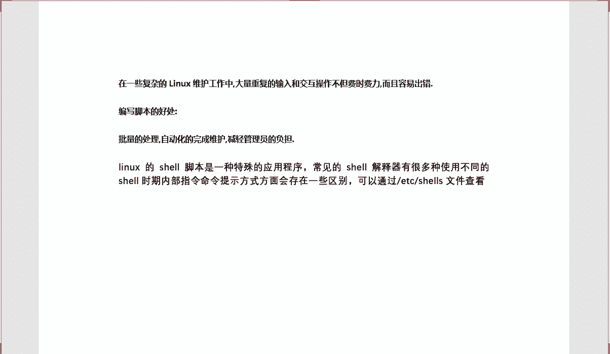
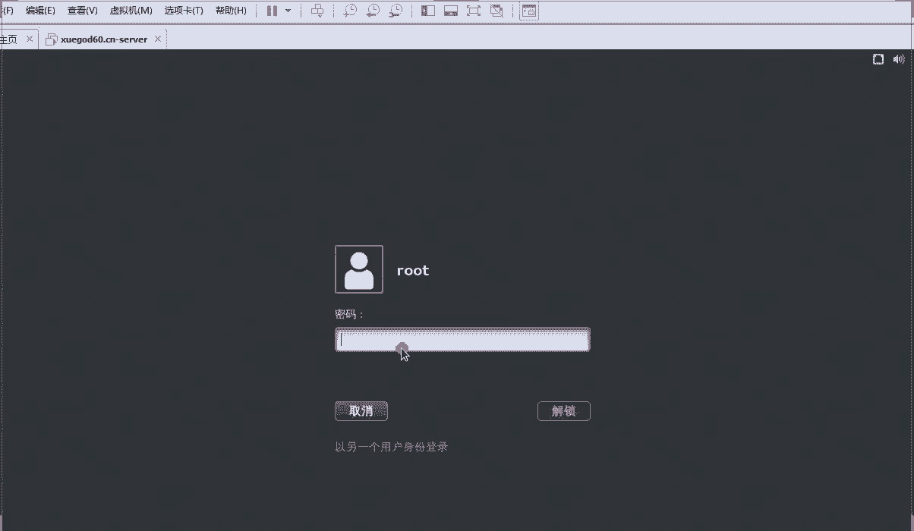
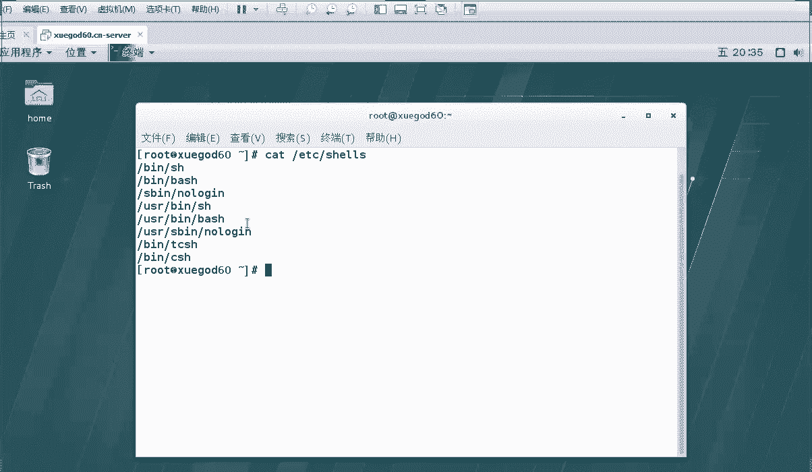
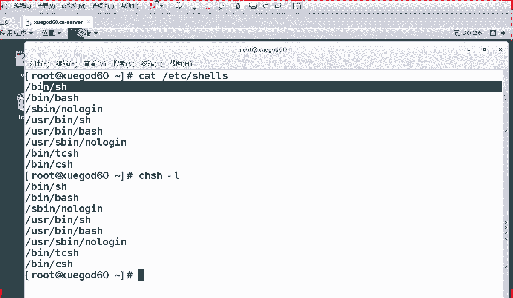
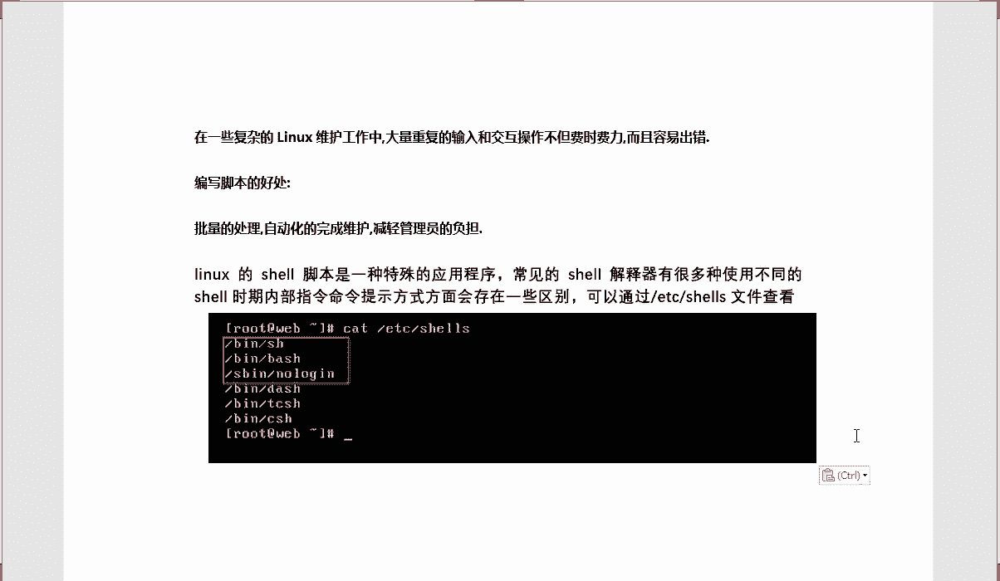
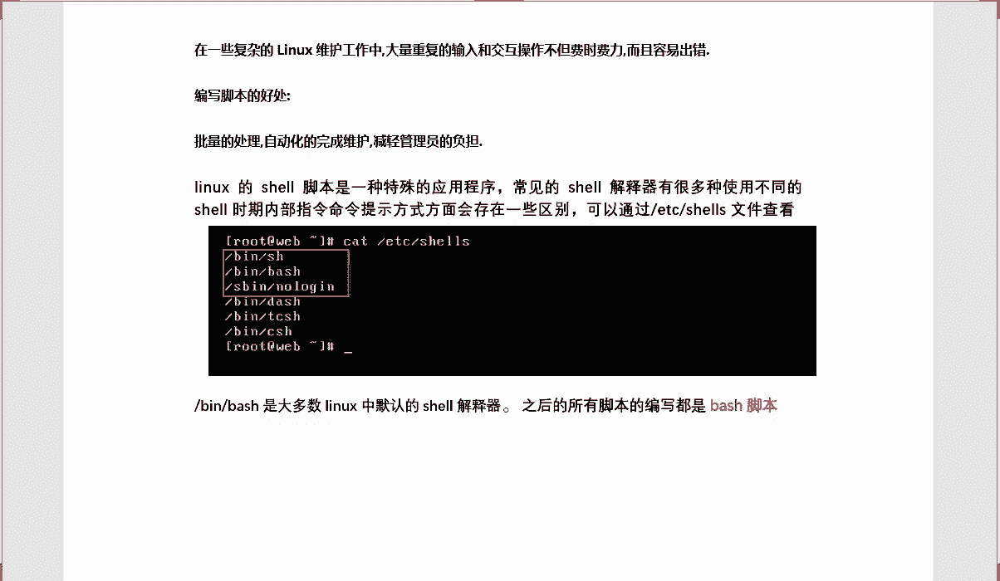
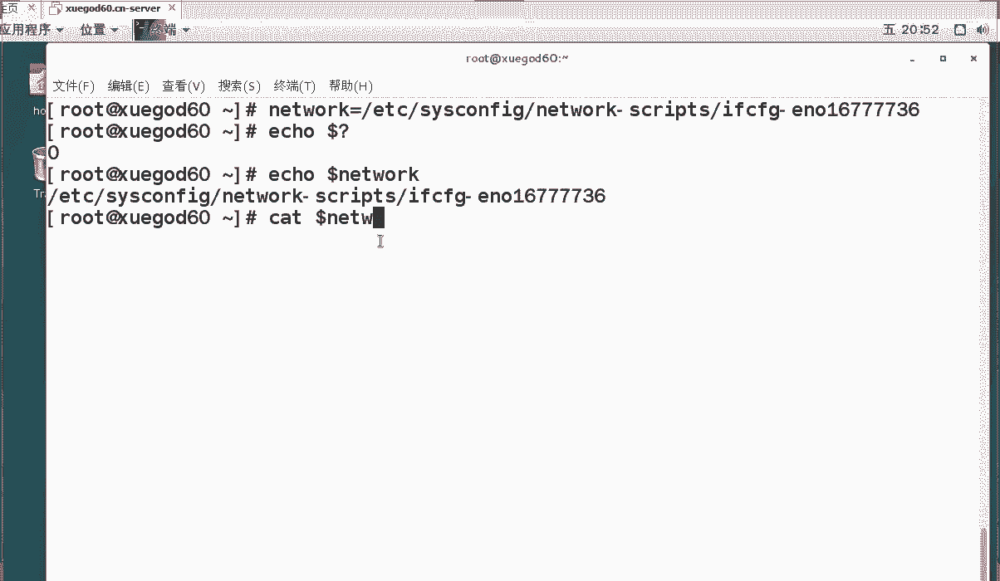
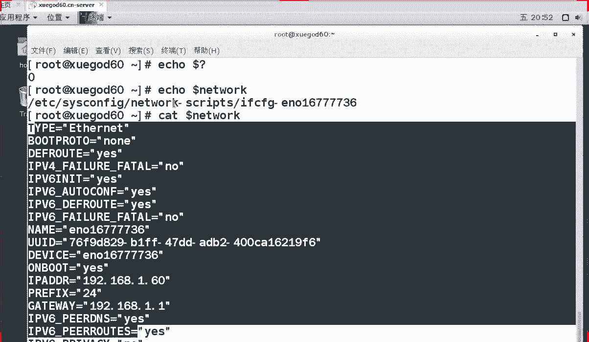
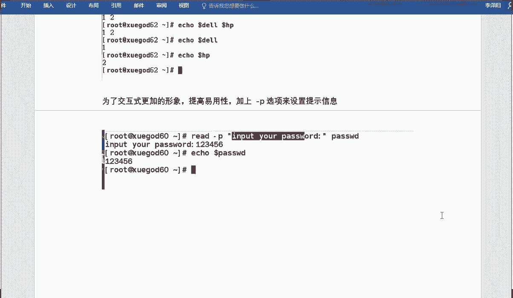

# RHCE 红帽Linux系统教程：P1：Shell脚本的基础-1 📚

在本节课中，我们将要学习Shell脚本的基础知识，包括脚本的编写规范、变量的定义与使用、变量的作用域以及测试判断表达式。这些内容是编写自动化脚本、进行系统运维的基石。

## Shell脚本的基本格式 ✍️







上一节我们介绍了课程概述，本节中我们来看看如何编写一个规范的Shell脚本。首先，我们需要了解Shell脚本是什么以及它的好处。





什么是Shell脚本？Shell脚本有什么好处？在复杂的Linux运维工作中，例如需要维护上百台服务器时，重复的手动操作不仅费时费力，还容易出错。通过编写脚本，可以将一系列命令按顺序组织起来，实现批量处理和自动化维护，从而极大地减轻管理员的工作负担。



计算机本身只识别二进制指令，我们输入的命令需要通过一个“翻译官”来解释。在Linux中，这个翻译官就是Shell解释器。系统支持多种Shell解释器，可以通过命令 `cat /etc/shells` 或 `chsh -l` 来查看。其中最常用的是 `/bin/bash`，我们后续编写的脚本都将基于Bash解释器，因此也称为Bash脚本。

接下来，我们开始编写第一个脚本。Shell脚本的后缀名通常为 `.sh`，这有助于标识文件类型。脚本的第一行需要声明使用的解释器，格式为 `#!/bin/bash`。`#!` 是一个特殊标记，它后面的路径指明了运行此脚本的解释器。

以下是创建并执行第一个脚本的步骤：

1.  使用 `vim` 编辑器创建文件 `first.sh`。
2.  在文件中输入以下内容：
    ```bash
    #!/bin/bash
    # This is my first script.
    mkdir /root/shell
    ifconfig
    ```
    *   第一行 `#!/bin/bash` 是脚本声明，指定使用Bash解释器。
    *   第二行以 `#` 开头，是注释行，不会被执行，用于说明脚本用途。
    *   第三行和第四行是要依次执行的命令：创建一个目录并查看网络配置。
3.  保存并退出编辑器。
4.  默认情况下，新建的脚本文件没有执行权限。需要使用 `chmod +x first.sh` 命令为其添加执行权限。
5.  执行脚本。有多种执行方式，以下是常见的五种：
    *   使用绝对路径：`/root/first.sh`
    *   使用相对路径：`./first.sh`
    *   使用 `bash` 命令：`bash first.sh`
    *   使用 `sh` 命令：`sh first.sh`
    *   使用 `source` 命令（或 `.` 命令）：`source first.sh` 或 `. first.sh`

后三种方式（`bash`、`sh`、`source`）不需要脚本文件本身具有执行权限，在生产环境中更为常用。执行成功后，你会看到网卡信息输出，并且在 `/root` 目录下创建了 `shell` 文件夹。

## 变量的定义与使用 🔤

上一节我们介绍了如何编写和执行一个简单的脚本，本节中我们来看看Shell编程中一个非常重要的概念——变量。变量可以理解为一个存储数据的“盒子”，里面存放的值是可以变化的。使用变量可以简化长路径、复杂命令的引用，使脚本更灵活、易读。

定义变量的基本格式是 `变量名=变量值`。等号两边不能有空格。变量名只能以字母或下划线开头，区分大小写。

以下是定义和使用变量的基本操作：





*   **定义变量**：`linux=7.2`
*   **查看变量值**：使用 `echo` 命令和 `$` 符号引用变量，例如 `echo $linux` 会输出 `7.2`。
*   **变量重新赋值**：`linux=6.5`，再次 `echo $linux` 会输出新的值 `6.5`。
*   **同时输出多个变量**：`echo $linux $linux`，变量之间用空格隔开。
*   **变量名与普通字符区分**：当变量名后面紧跟其他字符时，需要用花括号 `{}` 将变量名括起来，例如 `echo ${linux}系统` 会输出 `7.2系统`。

在给变量赋值时，如果值中包含空格等特殊字符，需要使用引号。

以下是引号和反引号的使用场景：

*   **双引号 `"`**：允许引用其他变量的值（变量替换）和转义字符。例如 `os="Red Hat $linux"`，`echo $os` 会输出 `Red Hat 7.2`。
*   **单引号 `'`**：禁止变量替换和大部分特殊字符的解释，所有内容视为普通字符串。例如 `os='Red Hat $linux'`，`echo $os` 会输出 `Red Hat $linux`。
*   **反引号 `` ` `` 或 `$()`**：用于命令替换，将命令的执行结果赋值给变量。例如 `file_location=$(which pwd)`，`echo $file_location` 会输出 `pwd` 命令的绝对路径。`$()` 格式支持嵌套，更推荐使用。

除了直接赋值，还可以通过 `read` 命令进行交互式赋值，提示用户输入信息。

以下是使用 `read` 命令的例子：

*   **基本用法**：`read dell hp`，执行后会等待用户输入，输入两个以空格分隔的值（如 `1 2`），即可分别赋值给变量 `dell` 和 `hp`。
*   **带提示信息**：`read -p “请输入密码：” passwd`，`-p` 选项后跟提示字符串，用户输入的内容会赋值给变量 `passwd`。

## 局部变量与全局变量 🌍

上一节我们学习了如何定义和使用变量，本节中我们来区分局部变量和全局变量。变量的作用域决定了它在哪些地方可以被访问。

*   **局部变量**：仅在定义它的当前Shell进程或函数中有效。我们之前用 `变量名=值` 方式定义的变量，默认就是局部变量。在脚本中定义的变量，脚本执行结束后就失效了。
*   **全局变量（环境变量）**：对于所有子Shell进程都有效。使用 `export 变量名` 命令可以将一个局部变量提升为全局变量。常见的环境变量如 `PATH`、`HOME`、`USER` 等，可以使用 `env` 或 `printenv` 命令查看。

理解局部和全局的区别，有助于在编写复杂脚本或管理环境配置时避免冲突。

## 测试判断表达式 🧪

上一节我们了解了变量的作用域，本节我们来看看Shell脚本中的测试判断表达式。测试命令用于检查某个条件是否成立，它是Shell脚本实现逻辑判断（如if语句）的基础。

最常用的测试命令是 `test`，但更常见的写法是使用方括号 `[ 表达式 ]`。**注意：方括号内部两端必须留有空格。**

测试表达式主要分为三类：

*   **文件测试**：判断文件的属性。
    *   `-e 文件名`：判断文件（或目录）是否存在。
    *   `-f 文件名`：判断是否为普通文件。
    *   `-d 文件名`：判断是否为目录。
    *   `-r 文件名`：判断文件是否有读权限。
    *   `-w 文件名`：判断文件是否有写权限。
    *   `-x 文件名`：判断文件是否有执行权限。
*   **数值比较**：比较两个整数值。
    *   `-eq`：等于（equal）
    *   `-ne`：不等于（not equal）
    *   `-gt`：大于（greater than）
    *   `-lt`：小于（less than）
    *   `-ge`：大于等于（greater or equal）
    *   `-le`：小于等于（less or equal）
*   **字符串比较**：比较两个字符串。
    *   `=` 或 `==`：字符串相等。
    *   `!=`：字符串不相等。
    *   `-z 字符串`：判断字符串长度是否为0（空）。
    *   `-n 字符串`：判断字符串长度是否非空。

测试命令会返回一个结果状态，可以通过 `$?` 来获取。如果条件成立，`$?` 的值为0；如果不成立，则为非0值。

以下是一个简单的测试示例：
```bash
#!/bin/bash
filename=”test.txt”
if [ -f “$filename” ]; then
    echo “文件 $filename 存在。”
else
    echo “文件 $filename 不存在。”
fi
```
这个脚本判断当前目录下是否存在 `test.txt` 这个普通文件，并根据结果输出相应信息。

---



本节课中我们一起学习了Shell脚本的基础知识。我们首先了解了Shell脚本的编写规范和执行方式，然后深入探讨了变量的定义、引用、赋值（包括交互式赋值）以及局部变量与全局变量的区别。最后，我们介绍了用于条件判断的测试表达式，这是编写具有逻辑功能脚本的关键。掌握这些内容是迈向自动化运维的第一步。