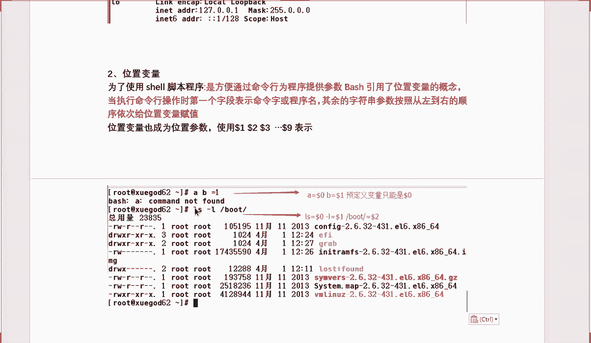

# RHCE 红帽Linux系统教程 - P2：shell脚本的基础-2 - iLoveBurning - BV1X4411j72R

好，那刚才呢咱们刚才说到这个锐的赋值啊，因为呢当你做锐的赋值的时候，咱们加杠T选项更加生动一些啊。但是呢我们现在要证明一个例子什么呀？就是当前以上做的操作呢，只在当前的环境下生效，到了其他控制台呢。

它是不能生效了，所以说呢我们举了个例子，什么例子呢？我们先看一下我当前的值，对吧？看一下我当前的值是7。2，但是呢我切换了一个子下之后呢，你会发现我的值已经变了吧？是不是已经没有这值啊。

所以说现在遇到了一个问题啊，我怎么让它这个值在哪个解释器都要生效呢？怎么办？

对，如果说这种情况的话，就好比说什么呀？就好比说咱们举个不恰当例子啊，这个例子可能不恰当啊，咱们给大说下吧。呃，比如说你就说你现在弄的特别好好的，然后换了一个新的环境呢，就什么也不会了，是吧？

你的技术特别高，Lux玩特别熟练，给你个新的环境你就不会了，换个服务器你就不会了，那不行吧，那怎么办呢？😊，那怎么办呢？那咱们需要把它设置到一个局无变量和和这个全局变量啊。

我们一起来看看这个相关内容行不行？那我们一般呢是通过SET来设置当前的一个变量的s对st呢是来设置变量的。那么ENV呢是来查看变量的，明白了吗？是来查看当前所有变量。那ENV呢是查看全局变量。好吧。

这两个方式你要知道。好，那么接下来怎么办呢？如果说你要想在所有的环境下都生效，那我告诉你只有一个办法啊，将一个局部变量呢变成一个全局变量，怎么变呢？我们需要返回到复式呀。对，退出一下啊，怎么退出。

跟着我看。😡。

ESIT退出一下啊哎，写错了啊。来先退出退出完之后怎么办呢？我们这样啊，我们要想实现这个值在其他解释器里边都能生效，怎么办呢？我们需要这样啊，EXP啊Xport对吧？使用这个工具呢来设置一下。

它呢就是把变量呢设为全局变量啊。比如说我们要把哪个变量实成全局变量，比如说linux对linux还有什么呢？把小写的linux对吧？我们需要把这两个值变成全局变量怎么办呢？我们回车就可以了。啊，很简单。

回车回车之后呢，我们再来验证一下来再来验证一下啊，我现在是不是进入个子筛啊，进完之后呢，我们使用ic来看一下dolllarlinux。😊，没有问题吧，是不是没有问题了，这说明什么意思啊？

这说明我现在设计的是一个全局变量，在所有解示器里边我都生效。😡，明白了吗？是这样的啊，是我在所有解析器边都成效，这就是一个全局变量的设置方式啊。当你遇到其他解释器边无法执行的变量，那你怎么办呢？

你可以使用Xport这个工具呢来进行什么呀？来进行设置就可以了。好吧，这是关于这个全局变量怎么设置啊，当然呢，全局变量，咱们也可以通过另外一种方式来，小张啊，通过另外一种什么方式呢？

咱们也可以直接复值啊。

别肉复知啊。来，怎么看呢？咱们这样啊，咱们也先什么呀，先退出去吧，我现在你在哪啊，退出来了是吧？退出完之后呢，我们需要设置个全局变量啊。啊，为什么跟两个lins哎？行。

那我先刚才说的那个关于这个全局变量怎么赋值是吧？我们接下来呢给一个全局变量来赋值，怎么办呢？咱们使用Xpo啊，Xpo什么呢？啊，赋值叫FQDNFQDN什么呀？是完全合格域名啊，完全合格域名是什么呢？

是3W点。学干点C是吧？这是个完全啊COM吧。对吧我们设置一个这个值。那后现在呢我去设置一个全局变量，变量的值呢是3W点学Gt点comM。对对？那我们来看下啊，我们艾一下。挨口下到了FQD。

的FQD没有错吧。然后呢，我们切换一个环境。啊，切完之后呢，再来ecle一下eical到了。FQ1。

是不是也没有问题啊？所以说你通过这种方式呢，照样也是可以设置的。好吧，通过这种方式给啊，注意的是严格区分大家写的啊，你不管是做什么的啊，这条命呢是严格区分大家写的，好吧，是严格区分大家写的。明看怎么？

这是环境变量，我简单说这么多啊，除了环境变量之后呢，我们说一个数值变量啊，数值变量的运算。这个有意思啊，就这个加减乘除啊，加减乘除啊。好，你说哪个不要空格不行啊，这个这没空格没问题啊。明吧。

照明空格没问题的啊。

行，这是这一块啊。好，刚才咱们说那个刚才咱们说的是这儿是吧？

什么。来，这刚才这个应该是哪块，应该是这块没录上好，这块没录上，后期你们都看一下好不好？那我把这个位置变量给大家说一下啊。

行，那么关于这个位置变量，你先知道啊，它的参数呢有这几个参数。来，我们一起来看什么是位置变量啊，这个位置变量什么意思呢？我给大家举个例子吧。

比如说啊。咱们这样吧。呃，咱们做个什么操作呢？咱们使用这个位置变段，其实就是某个参数啊。比如说咱们举个最常用的例子吧，虽以说这个是没法使用的啊，咱们这样吧，AB。一是吧，这个什么意思啊？这有三个位置啊。

它们是根据什么呀？这是刀0，刀一刀了2就这么来这个确定的，好吧？就是通过这种方式来确定的。好吧，这是这个预定一变量的一个使用方式。比就说这是一个什么呀，不是位置变量啊。

刀0刀一刀2就根据这个位置来进行确认的那比如说举个例子啊。Al right。呃，杠L。我怎么了？这个什么意思啊？你要区分位置变量呢，就是刀0刀一和刀2。好吧，就通过这种方式来看的，就根据它的位置好吗？

这关于这个位置变量，你就知道可以了，这是参数，你定要记住啊，跟着我搜来就可以了，这是刀一刀2刀3，后边呢就刀4了，明白没有？后边是没有的啊。就关于位置参数，你先知道怎么做，在每一个到底代表什么意思。

看一下。But。刚开始参数，我明白它是参数，但是呢按照它的位置来说，它就是刀了2明白吧？哦，刀了一啊，刀0刀一刀2好吧，这是一个什么呀，我就告诉你它的位置，根据它的位置来定义，它就属于刀一这个位置。

好吧，这是关于这块啊，并不是说这个意思啊，待会儿我就明白了，待会儿我给你举个例子吧。

晓得啊。比如说咱们以一般情况刚才以这个为例是吧？其中呢LS呢是什么呀？都是一些位置参数啊，LH呢代表什么？代表是一个参数，就指到了一啊，往后排对，空格是分格。啊，刀了2刀了3刀4，然后呢，刀0呢。

刀零代表就是说咱们的一个什么呀，就是本身这个程序啊，你可以理解为是个预定义变量，而不是一个位置变量。好吧，你知道就行了啊，这个知道就行了啊。呃，除了这之外呢，我们到时候写个脚本啊，我们写个脚本。怎么。

来，我们一一起写脚本吧，来说明一下这个位置变量啊，写脚本来说明一下。怎么说明呢？咱们这样啊，咱们写脚本来说明一下，比如说VM对吧？VM来编辑一个脚本啊，使用VM呢来编辑一个位置点SH写个脚本啊。

VM编辑一个什么呀位置。点SH啊，咱们写个脚本，写下脚本声明吧。对吧写个脚本说明啊，那我现在呢要做一个求和运算啊，也就sum对吧？求和运算啊等于到了。括号啊什么呢？呃，ESPR是吧？呃，到了一。

刀了一对，加上刀了2。啊，降到了2回车啊。呃，就这块是吧，就这块啊，咱们这样啊，咱们现在呢是来做运算是吧，是不是位置一加上位置2啊，然后呢，我们输出一个结果啊，输出结果什么呢？输出一个值输出什么呢？

就是刀了一。啊，到了一加上倒了2。等于是吧dollar sum对？等于它就可以了。来写完之后呢，咱们用这个来写下，好不好？然后呢保存退出啊，写完这个之后呢，我们看一下啊什么是位置变量，给我看清楚了啊。

对，写完之后呢，我们来执行一下啊，怎么执行呢啊。来看看啊，咱们怎么直交。好，这个脚本怎么执行啊，你就执行这个脚本的了，对吧？你可以使用ss。s的什么呢？位置点SH是吧？位置点SH后边想参数啊。

一和2空格2什么意思啊？对吧你看出来什么意思啊，同么？你们能看清刚才那脚本什么意思吗？这是不是位置位置参数啊，这呢就是do一，这个呢就这不这个这个道一，这是刀2，好吧，它们之间相加就可以了。😡，明白吗？

就这种方式来，我给他写着啊，什么意思呢？写着。

你自己去定义就可以了。后边那个位置自己随便变。好，最后边的个位置自己随便变啊，这是怎么样什么叫命来定义就行了。来给他截张图啊。

来写这就可以了，是吧，就是通过这种方式。对，就刀了一加刀了2就行了，是吧？那后边呢改成二和3，你应该也明白是吧，自己去多改改。行，这是这一块啊。这就是位置变量啊，位置变量呢我也先说这么多啊。

除了位置变量之后呢，还有个预定义变量啊，预定义变量是来自什么呢？啊，今天讲的就没多少东西啊，就是这些变量啊，预定义变量怎么做呢？咱们来看一下啊。来什么是预计预定一变预定一变量呢？看一下啊。

比如说刀了警号，对，都是一些刀了符号是吧，看一下啊。

比如说我们经常用的do落井号，doer井号呢代表命令行当中位置变量的个数有几个呀？比如说有3个，那就是三有4个呢，就是4个。好吧，那么doer星号呢代表所有位置变量的内容啊。

所有位置变量内容的具体指的内容什么呀？具体内容呢，比如说咱们boot它就是一个具体内容。

指的每一个参数啊，比如说不它了，就后边你每一个位置变成一个参数就可以了。那么当然问号呢，就是上一条命令执行后返回的状态。当返回状态是零的时候表示执行正常。那非零的时候呢，就代表出错了啊。

如果说你判断是否出现错误。对，正常为零，异常为非0取值范围呢是1到127之间。好吗？这是刀问号，那刀0呢刀0代表当前执行的程序名称，或者说你当前的脚本名称。明白了吧？这是他们的一个定义。

那么接下来呢我们举个例子也来看一下啊，我们写个文件吧。我们写个备份脚本好不好？我们写个备份脚本来打包一个文件，看下啊怎么做这样啊，咱们VM。

Backike。back up点SH写下啊，写个脚本啊，这里边写什么内容呢？来，我直接复制过来了啊。来写什么内容啊，跟着我来做一下啊。第一步呢，我们看一下啊，当前我是在执行个事角脚本对吧？

我现在定一个变量fill等于什么呀？fill等于一个压缩包的名称嘛，只不过压缩包的格式改了一下，在压缩包上以前不是名称点TR点DZ吗？只过名称，后边加了个什么呀，加了个当前的时间嘛，对。

是不是加了个时间啊。好，加个时间啊，然后呢我们来看一下啊会出现个什么呢？啊，然后呢你进行挤压，在挤压完之后呢，会输出一些信息啊，就是刀20刀井号和刀2星号代表什么意思来。

我们一起来看看代表什么意思。好吧？我们一起来看看它代表什么意思啊，我们先写上这个内容，写完之后呢，我们来做个实验啊，咱们使用s。😊，造的什么呢？白up。然后后边你写变量吧，对你要打包对呗。

我要打包哪些目录呢？比如说我要打包啊哪个目录啊，给大家举个例子。比如说home嘛跟加的home啊，这个比较快一些。对，现在呢已经执行了这个脚本啊，控完成了一个备份对象内容呢，包括这个什么呀。

包括这个home是吧？那我给大家对着讲啊，这个什么意思呢？

来跟我讲什么意思啊？刚才我们是不是写个脚本内容啊，那么刀零代表什么意思啊？刀零是不是代表你当前的个数啊，来看一下啊刀0是吧，是不是代表当前执行的程序名称啊，或者说你的个数对不？都可以来写的。

或者你的个数或你的进程啊，都可以来写的是吧？那关于这个呢啊是并向的半你执行了，对那关于共完成几个备份对象呢？就是刀井号，刀井号呢代表你有几个变量，我现在是不是只有一个变量呢？

所以说呢我只完成了一个备份对象。那么具体的内容包括什么呢？是刀什么呀刀星号刀星号代表什么呀？就是所有变量内容，对变量内容是什么呢？变量的内容呢，就是跟项的home。😊。

所以说就这样的，好吗？好，所以这样的啊，我们再举个例子，比如说我后边再多加一个，你们告诉我啊。哪一个会比啊，不想后，我们来写个OPT。来，你们告诉我这几个哪个都会变吗？是都会变呢？还这个会不会变？来。

就问一下这个会不会变。😡，啊，能不能变他们，我执行完这条命令之后看一下啊。怎么着？是不是不会变的，因为你执行的是同一个操作是吧？那关于呢现在你完成两个备份操作了，内容包括什么呀？

这两个相反我再添加一个呢。😡，再添一个完之后，这是不是又多一个，这是不是变成三个了？对，所以这块你要知道好吧，就让你知道啊，你们差吓我一跳啊，刚想起来刚才问你们的问题是呃，关于它会不会变是吧？

我以为你们听不懂我呢，是吧？吓我一跳啊，来，这是关于这个这个的使用方式，你知道行吗啊。

来，截图给大家写着啊，你可以使用ss，也可以什么呀，你可以给他一个执行权限。为了测试的时候啊，可以的。当然了你要写s就行了，好吗？来前面这些边量看有没有问题，如果都没有问题的话，给我敲一就行了。

都没有问题的同学都敲一，好吧。😊，啊，你哪两种呢啊常用的判断方式啊，一般情况下是根据test来进行判断。一种是根据这个括号来判断的。明白了吗？咱们可以通过这个来判断的。那我们一起来看看怎么做啊。

首先呢我们这样做。一般情况下咱们做文件测试，你来看下啊。

我们一起看看文件测试怎么做，好不好？看下啊。😊。

好，文件测试呢指的是根据指定的路径名称判断这个是个文件呢，还是一个目录，也可以判断它是否具有读写执行权限啊，也可以判断这个文件是否存在。明白吧？这是文件测试的一个例子。那么常用的选项有哪些呢？

有杠D杠D呢就是来查看啊，来测试一下这个是否是一个目录呢？或者说是这个目录是否存在。对吧就看它是不是目录或者它是否存在。那么杠E呢是来测试这个目录和文件是否存在的。好，它不管是目录还是文件是否存在。

都会显出来的。杠F呢是来测试是否为文件或者是文件是否存在。你现在要记住啊，D和F看相反，是吧？D呢是目录F呢指的是文件RWX代表是读写执行权限。明白了吗？这三个要区分开。

一般情况刚一咱们一般情况下是不会使用的。为什么呀？是因为当你要判断文件的时候，正好你指定的目录里边有一个和你要判断的文件重名的子目录，这样的话呢也会返回零的，比如说你的操作已经执行成功了，对吧？

但是呢你并没有得到你想要的结果。

啊，你并没有得到你想要的结果。那如果说要想判断目录和文件是否只有啊是否存在，对吧？只需要使什么呢？杠D和杠F选项就可以来判断了。来，比如后面这几个对吧？你们知道就可以了。对，RWX的代表读写执行。好吧。

执行测试条件之后呢，一般通过预定一变量到了问号，可以来测试命令的返回状态，从而判断是否真的存在。好吧，这就是咱们所做的一些事情。来，我们举个例子啊，一般情况下咱们这样啊。我来给大家举个例子啊。

一般情况下咱们喜欢把这光盘挂在哪了，挂载到MT下边。是实其实一般情况下有同学呢喜欢把它挂载到咱们media啊media下边有个CD room这个目录。但是呢IHER系统默认不存在这个目录。

这时呢我们先判断一下这个目录是否存在。比后我现在先来判断一下我系统中这个目录是否存在啊，现在你要知道我判断的是目录，咱们使用哪个选项，是不是使用刚D选项来怎么判断跟着我一起来看啊。

我们来看一下当前系统目录有没有存在呢？通过这种方式啊，哪种方式呢？使用这种框对，咱们就不使用test啊，test也是一样的。哎，当地呢代表是测试咱们的目录哪个目录呢？是。

密道上边有什么呀？CDLM是吧？咱们来测试一下它。对不对？我们看这个目录有没有存在呢？是不是已经执行了，执行了吧。执行完之后，我们来看看do文号看一下。是不是零吗？不是零吧，非零代表什么意思啊？

非零代表这个表达是不成立，不成立就说明咱们这个目录是没有的。啊，不成立说明咱们sm有的那来看一下L在me下面啊，有mi下的CDRM，你table见都服务器，对吧？看一下没有吧，你是没有这目录的。

所以说什么意思啊？所以说啊你这个目录这个表表达式不成立的，不成立的话就是非零的。啊，你看起来正常的对，看起来是正常的。但是你得通过它来什么呀测试。

明白了吧？这是咱们呀，咱们怎么看判断一个目录是否存在啊，就通过这种方式就可以了。好吧，那你使用test也是可以的，来使用test。

看什么呀钢地哪个木呢？密。me下边1个CDLM是吧？这个可以的。来，咱们再输一个ic当问号。是不是账还是一啊，说明我们现在呢还是不存在的。

对，说明我们现在还是不存在。

来看一下啊，说明现在还是不存在的是吧，这是这种方式啊。

大家可以看一下，对，现在还是不存在的啊，那我们在使用这种方式判断的时候，也是最常的一种格式。但是你要注意啊，是两边最什么呀？这个括号两边最起码得有一个空格。好。在这你要注意一下啊。

关于咱们使用这种方式呢是最常用的一个种判断方式啊。但是你要注意这两边最起码有一个空格，好不好？你使用iccle是么，你使用icle输出一个这个那就可以看出当前的返回值。如果说是非零，那就代表什么呀？

代表就是说不对，对？执行操作不对。好，咱们根据这个非零的结果呢，我们可以判断什么呀？当前呢咱们CD入这个目录是不存在的。

明白了吧？就是当前的目录它是不存在的。

好，那么接下来呢我来创建个目录啊，咱们这样。跟我说啊，咱们穿越公路在什么呀，在这个media。穿1个CDRM啊，这次咱们再来执行好不好？咱们这次再来执行，看它存在不存在。啊，你使用ts先执行一下。

再艾一下。好，不是一不是一了吧，然后呢，再通过什么，再通过咱们这个这个括。看一下是都正常了。所以说呢这什么意思啊？这说明咱们这个目录已经存在了吧。因为我已经创建了，那肯定是零了，对吧？肯定是零了，对吧？

这是这个的使用方式。

啊，当我们来访问这个表达式啊，如果是零的话，表示这个表达式来成立的。好。我来给大家写着啊，这是关于咱们这一块。呃，除了这块之外呢，我们再说个其他的啊，比如说我们要想查位置变量的时候，对？查变量的时候。

咱们也可以不使用这个，咱们可以通过什么呀？通过一个符号叫做and符号。and符号呢也是来进行判断的那比如这样啊，我们可不可以这样，你看啊，比如说我这样吧，我做个命令吧。

啊。还是刚这条命令，对我现在是不是判断我现在这个目录是否存在啊啊，那比如说我们加个and and for，还记得什么意思吗？是不是上一条命令执行成功之后再执行下边的命令。对。

由前面这条命令执行成功之后呢，我来执行另外一条命令。对，输出一个内容，输出什么呀？yes。😡，行吧，是这个意思来看一下。是不是输出yes思，这是什么意思啊？由上一条命令呢，我执行成功了。

然我现在这条命令是完全成立的那后边就执行这条命令了。那我再改一下，比如我CDRM加个什么呀s。是不是没有这个目录啊，看一下现在还输入y吗？是不是不输入y啊，咱们可以使用icle什么样。

到时问号看一下是不是已经不成立了，对吧？你要知道啊这个案的案的符案呢，前面必须成立，前面不成立，我后边照样不执行。啊，你前边就不行，我后边也不行了。😡，对吧你要知道好吗？这是关于这个使用方式啊。

关于怎么进行判断，咱们也可以通过这个语符二来使用的啊。

这是叫做逻辑语啊。关于这个章节呢，咱们明天会给大家讲到的，好吧？好，通过这个啊，一般情况下咱们使的双语啊。在咱们讲逻辑测试之前呢，我们会讲好不好？嗯，这是今天咱们要讲内容啊。

好，来看一下咱们这块呢哪方面。

