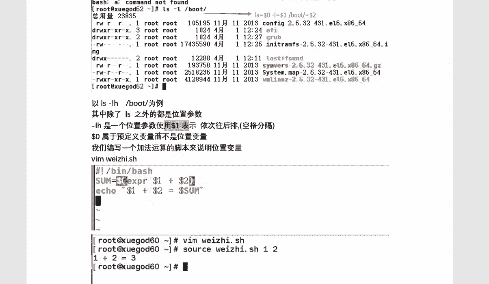

# RHCE 红帽Linux系统教程 - P3：shell脚本的基础-总结 - iLoveBurning - BV1X4411j72R

好，同学们，大家好啊。今天呢咱们讲的是第11杠第12章，讲的是sell脚本的一个基础应用。首先呢这一节课我们所讲内容呢分成了4个点，关于se脚本的一个编写规范，还有变量与咱们特殊变量的应用。好。

局部变量全局变量，包括咱们测试表达式怎么使用。好吧。这今天我们要讲内容。

那么在一些复杂linux运维当中中呢，咱们呃大量的去重复输入一些交互式的操作，不但费时费力，而且呢还容易出错。这样的话呢会导致咱们这个管理员的任务呢会非常大。所以刚才也给大家举个例子。

比如说我们有100台主机出问题的，怎么办是吧？这是问题很大，所以说我们可以编写脚本来解决这个问题啊，在脚本的好处呢就是批量的去处理，自动化的去完成维护。包括呢我们可以减轻管理员的一个负担。

那在ux里边呢脚本呢就是一种特殊的一个应用程序。常见的解释器有很多种，但是呢他们也之间也是有不同的，包括命令提示方面呢都是有些区别的。咱们可以通过ET这个文件来进行查看。

当前呢我就说这三个解释器什么作用啊并且的SH呢指的是咱们一个平常默认使用的解器有bu们使用解器那Slog指的是们禁止登录系统啊并且bu是们大多数系统中默认使用的解器。

后一个所有脚本的编写呢都是通过bash脚本啊，都是bsh脚本。那我们来编写第一个脚本，将我们平时的命令操作按顺序的放入到一个文件里边，并不于执行权限。那么它就是一个下脚本。

那下面呢由我来给教大家怎么来编写第一个脚本，是吧？咱们名称呢叫做first点SH第一行呢是脚本的声明。第二行呢是注释信息，第三第四行就是我们所做一些操作啊，首先你编写完脚本要给他一个权限。

给完权限之后呢，我们来执行一下效果呢你来看一下是不是你经出现成功了，对吧？

这里呢要反复强调啊，病假的bus呢主要是为了声明我所写的均为什么呀bus语言。我用的是bus解释器。第二行呢为注释注释信息呢，它是不生效的。当我们再写一个比较大的脚本时，如果没有一个好的注释。

那么也就没有人能够看得懂其中的意思了。也说再往后执行其后的命令。

啊，执行脚本的方式不同有5种。第一种呢使用绝对路径。第二种呢使用这个相对路径点杠的方式。第三45种是企业里边经常会遇到的。比如说我们不需要执行这些权限，对，通过s和SH执行就可以了。好吧。

那接下来给大家说这个变量啊，变量相来说比较难一些。今天我们主要讲的就是变量变量的定义呢就是我们可以自定义一个变量的值对常见的变下变量呢有自定义变量环境变量位置变量以及预定义变量。

那一般情况下呢我们是使用ic来输出变量的变量名等的格式是什么的就是啊变量名就可以了好，这是变量名的格式。那么关于 dollar问号和变量名，它们之间是有区别的好，它们之间是有区别的啊。

问号呢是来测试我们的命量是否执行成功。那问号这个这个变量名呢指的是我查这个变量的值对吧？那在这呢我细讲一下自定义变量啊，自定义变量呢就是用户根据自己的环境来自己定义的变量。じゃあ。

其中的bu中比较简单的变量不需要进行提前声明，而是直接指定咱们变量名称，并且赋余值定义的格式啊，变量名等于变量值等号两边呢是不允许出现空格的那如果说名称只能是什么呀字母或下划线啊，在这举个例子。

对它们之间的大小写之间是有问题的。所以说呢你必须得什么呀使用刀号符号来进行引用。而且呢I口和调用的变量之间比较有空格。当你呢要调用两组变量的时候呢，怎么办呢？你需要把它们加空格给分开。好吧。

那关于说咱们把变量的名称啊，如果说为了呃方便后续啊为了防止被混淆的时候，应该把什么呀变量名加大括号来什么呀括起来，这样可以了啊，除了这个之外呢，还有双引号，双引号呢，就当等号右边赋值出现空格的时候呢。

我们需要使用双引号将它括起来。对吧那在双引号的范围内，咱们还可以把这个变量引用给其他变量。我们把一个变量的值呢引用给其他变量也是可以的。单引号呢指的是我们要复制的时候，内容可能包括这些字符。

我们需要把这些字符呢变成普通字符。所以说呢我们需要加个单引号，把它括起来。反品号呢指的是命令执行的结果，它的位置呢是在ESC下边这个按键对吧？那反品号主要用于这个命令替换啊。

一般情况下这个反品号是等于什么？等于do大括号啊，但是它们之间是有区别的那虽然说都能做到相同的一个形式。但是呢它们之间有区别的。当我们在实现命令签到的时候呢，你使用它是不行的，咱们使用什么do大括号了。

好吧。关于read的赋值read的赋值这块呢还是比较简单一些的。我们需要把这个呃就是根据read这个用户呢read的命令对吧？来提示咱们用户输入信息，从而实现简单的交互过程啊。

比如说我现在read戴尔和会普对吧？会这呢是正常信息让你输入你的值那最后呢咱们输入一和2就你看一下是不正常的呀为了提高咱们交互时更加形象，而且提高应用性，加上杠P选项来设置提示信息啊。

杠P这儿就是你的提示信息，最想你的值就可以了。最我们可以来验证一下好吧，以上操作呢只能在当前的办中生效啊，到了其他控制台可能就不生效了，怎么办呢？我们需要进入一个子向啊。

有个其他的解示器看一下的确不生效不生效怎么办呢？咱们可以通过se set来设置变量，也可以通过ENV呢来来查看变量好吧。如果说我要把这个变量，在任何环节中都可以运效怎么办呢？

咱们使用X设成全局变量就可以了。好吧，你也可以给个变量值。😊，都可以啊，那数值的运算这块呢还是相对来说偏简单一些啊，有加减乘除啊，还有求值运算啊，轻模运算是吧？也给大家举个相对应例子，在A等于10啊。

怎么乘整么除，按照我这个格式来就可以了。中间呢是-2好吧啊，最后呢咱们也可以把运算之后的结果呢复制给变量，完全可以。好吧，自定义变量呢我就讲这么多啊，接下来我该说的是环境变量。

环境变量呢就是咱们系统自带的一些变量。有inux已经定义好了，后期呢你也可以来添加对通过ENV呢，我们可以看一下环境变量，看完之后呢，有一些咱们自己设置的，但有一些系统自带的对环境变量的主配置文件。

在ET加的pro。😊。

这是全局变量。那关于咱们这个局部变量呢指的是咱们个人目录下边这个点bu点是啊，这是咱们个人的那么PWD呢指的是么呀？就是来调用这个变量值啊，就是来调用这个变量值。还有这个 pass代表什么意思？

us代表什么意思知道可以了。这样做了一个1啊，我不多说了啊，位置变量呢指的什就是通过位置来进行来设置的有一到9是吧？它怎么设置的啊一什么意思？9又是什么意思？你可以来看指的它指的它一2？

就根据这个位置来变一下就可以了。对你看到没有？除了这个L之外，其他都是一些位置参数，比如说L它用一来表示往后排以此类推使用空格做分格就可以了。包括咱们做了一个做什么做了个脚本。

你也可以看一下好吧预定一变量呢就是这几个的一个作用啊，井号代表是咱们那个数。

星号呢代表内容，它问号呢代表上一上个命令执行返回的状态。如果零的话，正常。如果非零的话，代表错误。好，那刀0呢代表是咱们当前真行程序的名称啊，使用的项是吧？通过这个你来做一下，做完之后来验证一下啊。

最后咱们讲的是关于ts这个表达式啊，表达式这个文件测试怎么做呢？在杠D杠F杠E对还杠2杠W杠X这些代表什么意思？大家都去看一下。另外呢咱们怎么判断给大家举这几个例子，大家后续都把这个实验去多做一遍。

好吧。😊。

