# RHCE 红帽Linux系统教程：P3：Shell脚本基础总结 📚

在本节课中，我们将学习Shell脚本的基础知识，包括脚本的编写规范、变量的应用以及测试表达式的使用。这些内容是自动化运维和批量处理任务的核心。

---

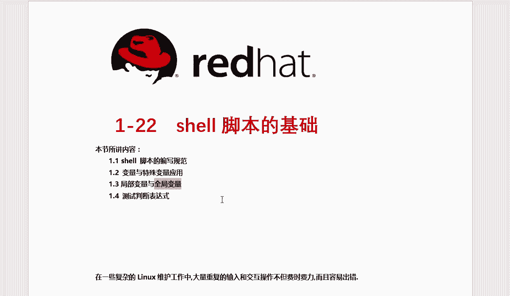

## 脚本编写规范与第一个脚本 ✍️

在复杂的Linux运维工作中，大量重复的交互式操作不仅费时费力，而且容易出错。编写脚本可以批量、自动化地完成任务，从而减轻管理员的负担。

在Linux中，脚本是一种特殊的应用程序。常见的解释器有多种，可以通过 `/etc/shells` 文件查看。其中：
*   `/bin/sh`：默认使用的解释器。
*   `/sbin/nologin`：禁止用户登录系统。
*   `/bin/bash`：大多数系统中默认使用的解释器。

我们编写的脚本通常都是Bash脚本。

### 编写第一个脚本

编写脚本的本质是将一系列命令按顺序放入一个文件中，并赋予执行权限。

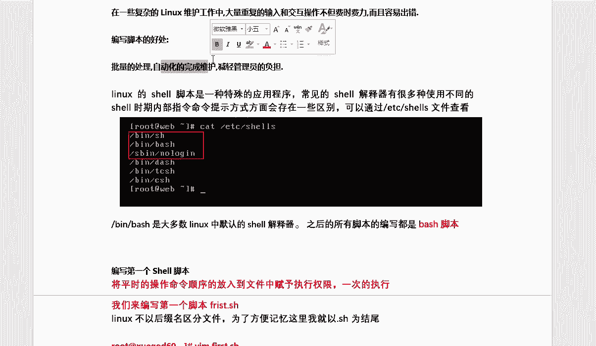

以下是编写第一个脚本的步骤：

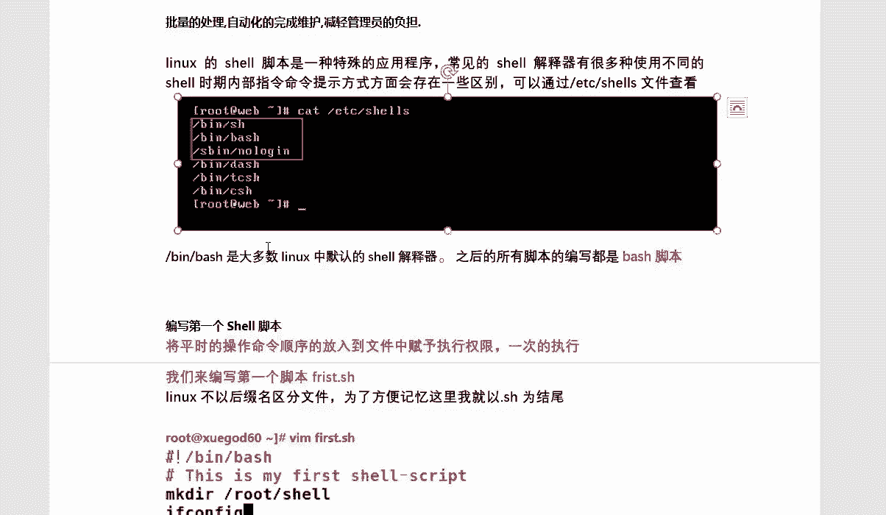

1.  **创建脚本文件**：`vim first.sh`
2.  **编写脚本内容**：
    ```bash
    #!/bin/bash
    # This is my first script.
    pwd
    ls -la
    ```
3.  **赋予执行权限**：`chmod +x first.sh`
4.  **执行脚本**：`./first.sh`

**脚本内容解析**：
*   **第一行 `#!/bin/bash`**：声明此脚本使用 `/bin/bash` 解释器执行。
*   **第二行 `# This is...`**：注释信息，不会被解释执行。良好的注释对于大型脚本的可读性至关重要。
*   **第三、四行**：要顺序执行的命令。

### 执行脚本的多种方式

执行脚本有五种常见方式：

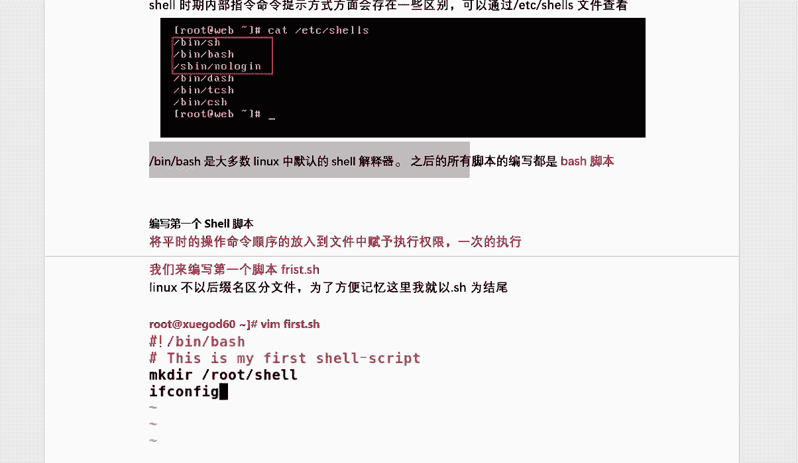

1.  **使用绝对路径**：`/root/first.sh`
2.  **使用相对路径**：`./first.sh`
3.  **使用 `bash` 或 `sh` 命令**：`bash first.sh` 或 `sh first.sh`（此方式无需脚本文件具有执行权限）
4.  **使用 `source` 命令**：`source first.sh`
5.  **使用点 `.` 命令**：`. first.sh`（与 `source` 效果相同）

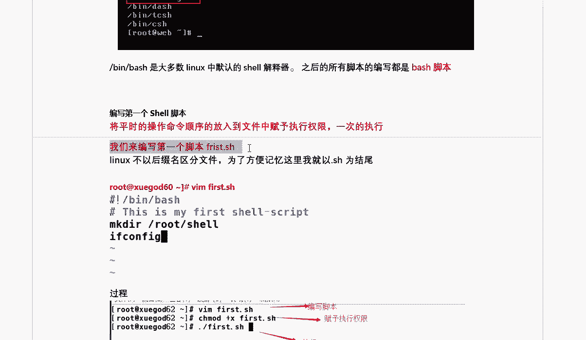

---

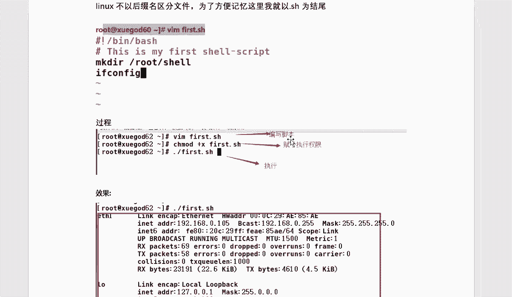

## 变量的定义与应用 🔢

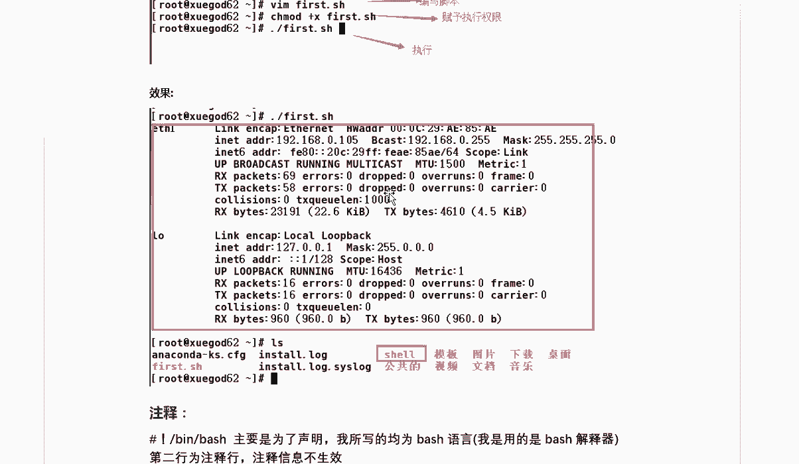

上一节我们介绍了如何编写和执行一个简单的脚本，本节中我们来看看脚本中非常重要的组成部分——变量。变量用于存储信息，使得脚本更加灵活和强大。

变量的定义是用户可以自定义一个值的名称。常见的变量类型包括：自定义变量、环境变量、位置变量和预定义变量。

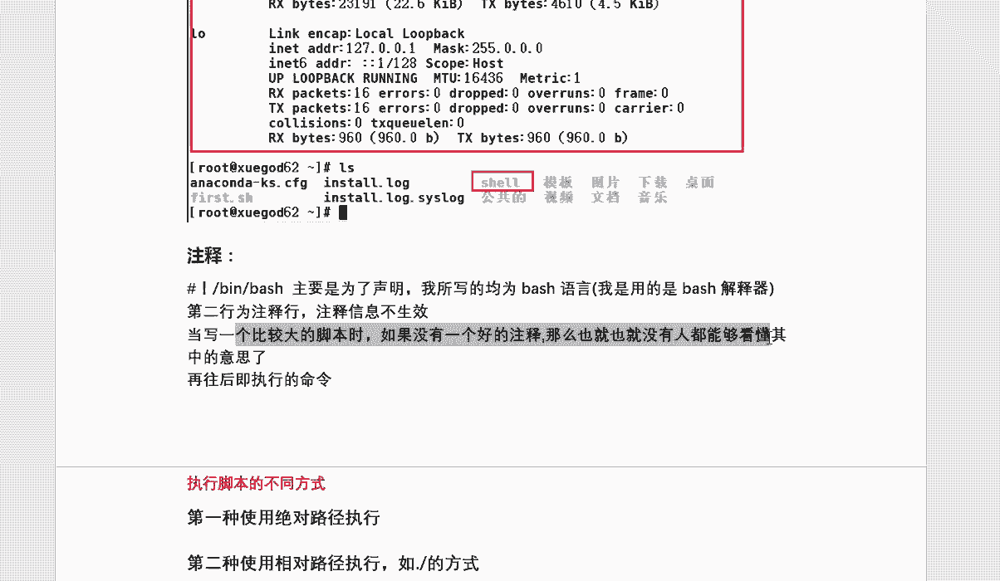

使用 `echo` 命令可以输出变量的值。格式为 `echo $变量名`。

**注意**：`$变量名` 用于获取变量的值，而 `$?` 是一个特殊的预定义变量，用于获取上一个命令的执行状态（0表示成功，非0表示失败）。

### 自定义变量

自定义变量是用户根据自身需求定义的变量。在Bash中，定义变量无需提前声明。

**定义格式**：`变量名=变量值`
*   等号两边不允许有空格。
*   变量名只能由字母、数字和下划线组成，且不能以数字开头。
*   变量名区分大小写。

**引用变量**：使用 `$` 符号，例如 `echo $变量名`。`echo` 和变量之间建议有空格。若要同时输出多个变量，用空格分开即可。

**示例**：
```bash
PRICE=10
echo $PRICE
echo ${PRICE}RMB
```
*   使用 `${变量名}` 的形式可以将变量名与后续字符明确区分，防止混淆。

**引号的使用**：
*   **双引号 `"`**：当赋值内容包含空格时，需要使用双引号括起来。在双引号内，可以引用其他变量。
    ```bash
    NAME="Hello World"
    GREET="Say: $NAME"
    ```
*   **单引号 `'`**：单引号内的所有字符都当作普通字符处理，不会进行变量替换。
    ```bash
    NAME="Hello"
    GREET='Say: $NAME' # 输出：Say: $NAME
    ```
*   **反引号 `` ` `` 或 `$()`**：用于命令替换，将命令的执行结果赋值给变量。
    ```bash
    TIME=`date`
    TIME=$(date)
    ```
    *注意*：在实现命令嵌套时，推荐使用 `$()`。

**使用 `read` 赋值**：`read` 命令可以从标准输入读取值，实现简单的交互。
```bash
read -p "请输入你的名字：" NAME
echo "你好，$NAME"
```
*   `-p` 选项用于设置提示信息。

**变量的作用域**：以上方式定义的变量默认是**局部变量**，只在当前Shell会话中有效。在子Shell中无法访问。

**设置全局变量**：使用 `export` 命令可以将局部变量提升为**全局变量**（环境变量），使其在子Shell中也可用。
```bash
MYVAR="test"
export MYVAR
# 或合并为一行
export MYVAR="test"
```

**数值运算**：Bash中可以进行整数运算。
```bash
A=10
B=3
echo $((A + B))   # 加法
echo $((A - B))   # 减法
echo $((A * B))   # 乘法
echo $((A / B))   # 除法
echo $((A % B))   # 取模（求余）
```
也可以将运算结果赋值给变量：`C=$((A + B))`

---

## 环境变量、位置变量与预定义变量 🌍

了解了自定义变量后，我们再来看看系统预定义的一些常用变量。

### 环境变量

环境变量是系统或用户预先设置好的变量，用于定义Shell的运行环境。可以使用 `env` 或 `printenv` 命令查看当前的所有环境变量。

**常见环境变量**：
*   `PWD`：当前工作目录的路径。
*   `PATH`：系统查找命令的目录路径。
*   `USER`：当前登录的用户名。
*   `HOME`：当前用户的家目录。

**环境变量的配置文件**：
*   **全局配置**：`/etc/profile`
*   **用户个人配置**：`~/.bash_profile` 或 `~/.bashrc`

### 位置变量

位置变量用于接收脚本或函数传入的参数。
*   `$1`, `$2`, `$3` ... `$9`：分别代表第1个到第9个参数。
*   `${10}` ...：代表第10个及以后的参数（需要使用花括号）。

**示例脚本 `test_args.sh`**：
```bash
#!/bin/bash
echo "第一个参数是: $1"
echo "第二个参数是: $2"
echo "所有参数是: $@"
```
执行：`./test_args.sh arg1 arg2`

### 预定义变量

预定义变量是Bash中内置的、有特殊含义的变量。
*   `$#`：表示脚本执行时，传入的参数**个数**。
*   `$*` 或 `$@`：表示脚本执行时，传入的所有参数**内容**。
*   `$?`：表示上一个命令执行的**返回状态**。0表示成功，非0表示失败。
*   `$$`：表示当前进程的进程ID（PID）。
*   `$0`：表示当前执行的脚本或程序的**名称**。

---

## 测试表达式 ✅

最后，我们来学习如何在脚本中进行条件判断，这需要使用测试表达式。测试命令是 `test`，但更常用的形式是 `[ 表达式 ]`（注意括号内的空格）。

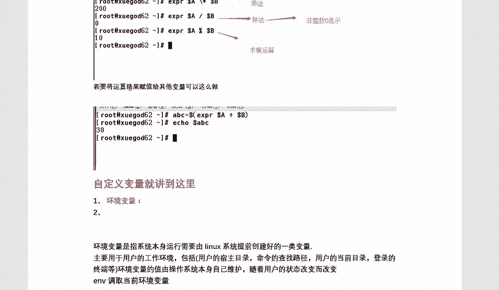

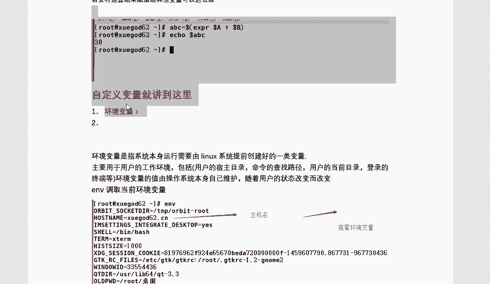

### 文件测试

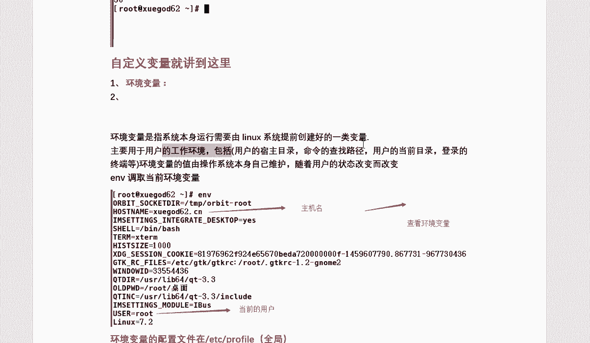

文件测试用于判断文件的属性。

以下是常用的文件测试运算符：

*   `-d 文件`：测试文件是否为**目录**。
*   `-f 文件`：测试文件是否为**普通文件**。
*   `-e 文件`：测试文件是否**存在**。
*   `-r 文件`：测试当前用户对文件是否有**读**权限。
*   `-w 文件`：测试当前用户对文件是否有**写**权限。
*   `-x 文件`：测试当前用户对文件是否有**执行**权限。

**示例**：
```bash
if [ -f /etc/passwd ]; then
    echo "/etc/passwd 是一个普通文件。"
fi

if [ ! -d /tmp/mydir ]; then
    mkdir /tmp/mydir
fi
```

### 数值与字符串比较

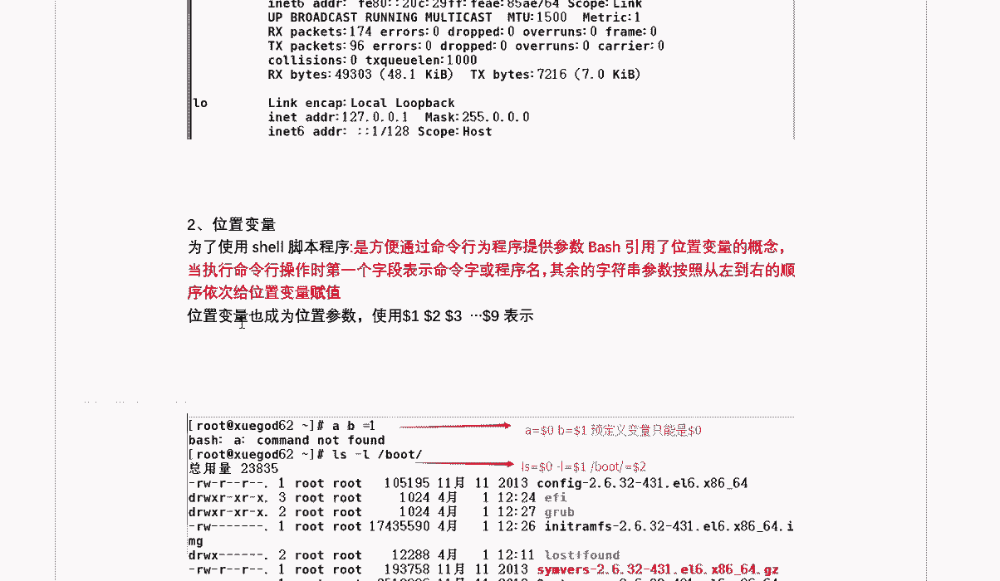

除了文件测试，还可以进行数值和字符串的比较。

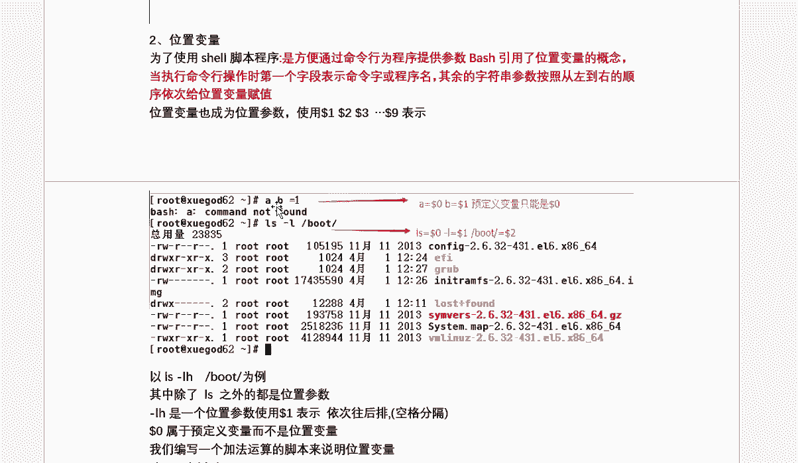

**数值比较**：
*   `-eq`：等于
*   `-ne`：不等于
*   `-gt`：大于
*   `-lt`：小于
*   `-ge`：大于等于
*   `-le`：小于等于

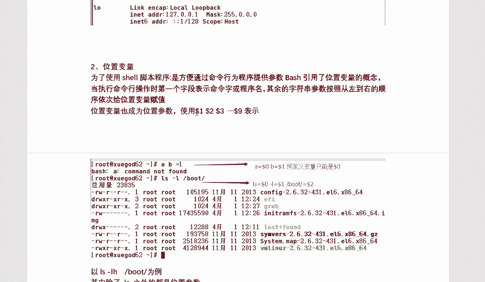

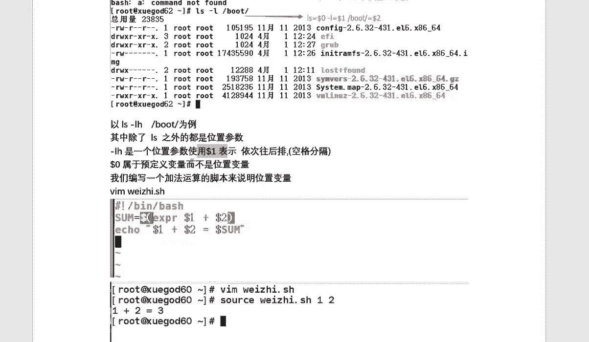

**字符串比较**：
*   `=` 或 `==`：等于
*   `!=`：不等于
*   `-z 字符串`：字符串长度为零则为真
*   `-n 字符串`：字符串长度非零则为真

**示例**：
```bash
NUM1=10
NUM2=20
if [ $NUM1 -lt $NUM2 ]; then
    echo "$NUM1 小于 $NUM2"
fi

NAME="Alice"
if [ "$NAME" = "Alice" ]; then
    echo "名字是 Alice"
fi
```

---

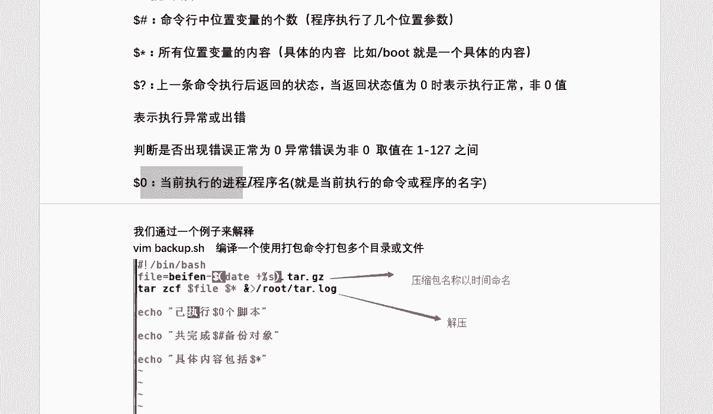

## 总结 📝

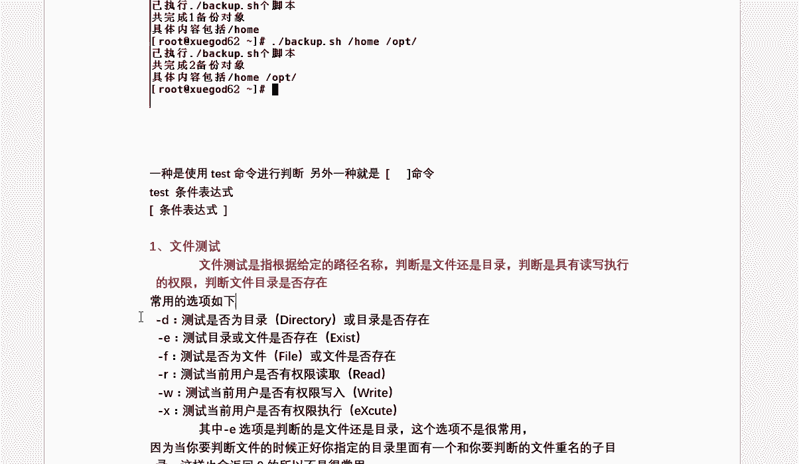

本节课中我们一起学习了Shell脚本的基础知识。

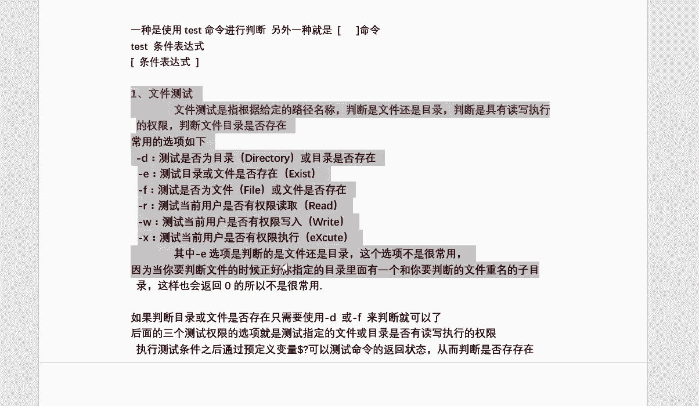

1.  **脚本编写与执行**：我们了解了脚本的作用、编写规范（如声明解释器、添加注释），并掌握了多种执行脚本的方法。
2.  **变量**：我们深入探讨了自定义变量（定义、引用、引号、运算、作用域）、环境变量、位置变量和预定义变量的概念与用法，这是脚本动态处理数据的基础。
3.  **测试表达式**：我们学习了如何使用 `[ ]` 进行条件判断，包括文件测试、数值比较和字符串比较，这是实现脚本逻辑分支的关键。

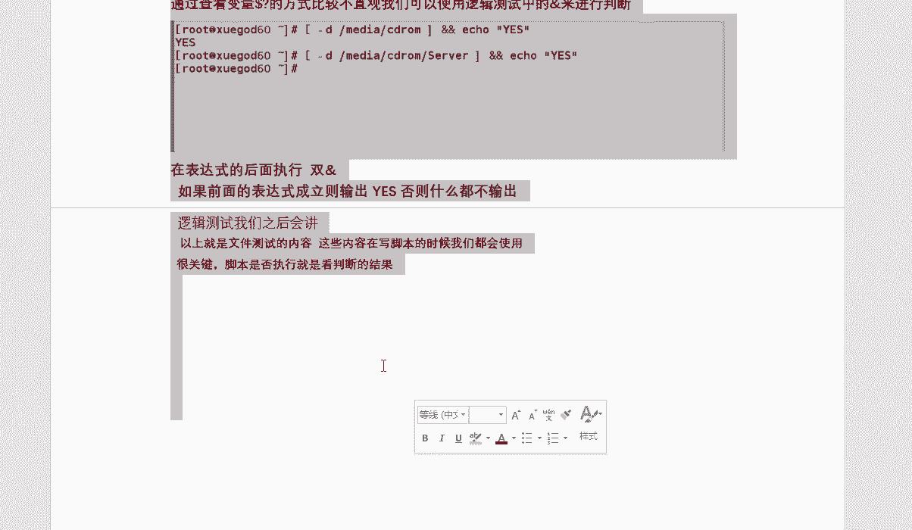

掌握这些基础知识是编写更复杂、更自动化运维脚本的第一步。建议将课程中的示例反复练习，并尝试编写自己的小脚本来巩固理解。