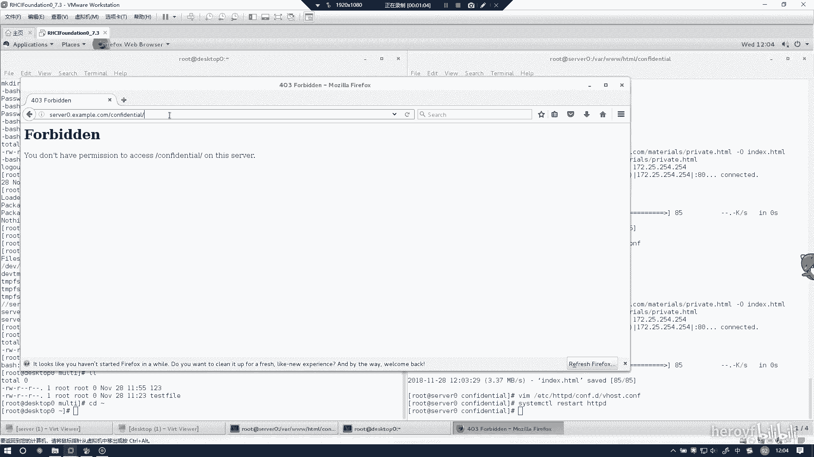
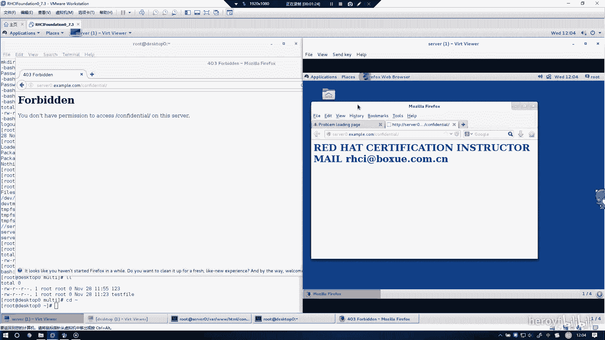

# RHCE(red hat7 考前讲解！最优做法解答，无坑) - P10：配置web内容的访问 - heroyf - BV1St411p7K8

然后这道题的话是配置外部内容的访问。又没有录上？然后把这个。给创建一下。然后我们C到Y。一天然。上就俾见。王梦丽。对你们这么吃的都能听。是觉了天吗？时间过。全过来。让我们下载一下这个页面。

这个的话配置文件其实我刚刚已经写好了，然后刚刚视频软件没有录上。然后的话可以把配置件给你看一下。就是这段话。写上就可以了。require local代表只能从3个零进行访问。我们重启一下。

重启一下后可以发现，如果我们从搜索连上。对，这个机子访问是访问不了。呃，从那个考试机上，就最外面的考试机上，就这些机子访问是访问不了的。

他这个require local的意思也就是说只能从420。本级上进行访问。这个。只有这个是可以访问。当你发现只能从搜索零上就可以访问，其他都访问不了的时候，那么这个实验也就是代表做成功了。

