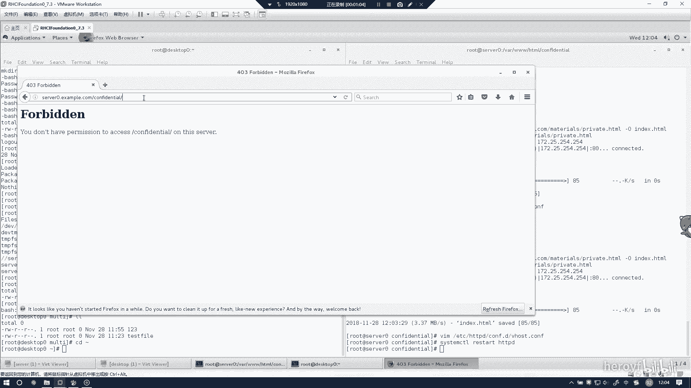
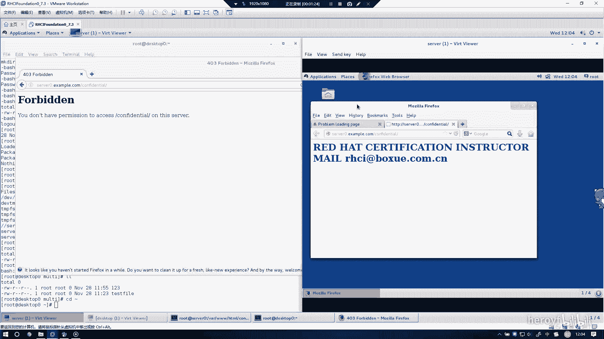

# RHCE 考前讲解：P10：配置 Web 内容的访问 🔒

在本节课中，我们将学习如何配置 Apache HTTP 服务器，以限制对 Web 内容的访问，确保只有特定的来源（例如本地主机）能够访问特定页面。这是 RHCE 考试中的一个重要考点。

---

## 概述与目标

这道题的要求是配置外部内容的访问控制。具体来说，我们需要修改 Apache 的配置文件，使得一个特定的网页只能从服务器本机（即 `localhost` 或 `127.0.0.1`）访问，而来自其他任何外部主机的访问请求都将被拒绝。

上一节我们介绍了基本的 Web 服务器配置，本节中我们来看看如何实现基于来源的访问控制。

---

## 配置步骤详解

以下是实现访问限制的具体步骤。

### 1. 创建测试页面

首先，我们需要创建一个用于测试的网页。这个页面将用于验证我们的访问控制规则是否生效。

```bash
# 创建一个简单的测试页面
echo "This is a restricted test page." > /var/www/html/test.html
```

### 2. 修改 Apache 配置文件

核心的访问控制规则需要在 Apache 的配置文件中设置。我们可以为特定的目录或虚拟主机添加访问限制。

```apache
# 在 Apache 配置文件的相应部分（如 <Directory> 或 <Location> 块）中添加以下内容
<Location "/test.html">
    Require local
</Location>
```

**关键概念解析**：
*   **`Require local`**：这是一个 Apache 指令，它的含义是**只允许从服务器本机（即 IP 地址为 127.0.0.1 或 ::1 的来源）进行访问**。来自任何其他 IP 地址的请求都将被拒绝。

### 3. 重启 Apache 服务



修改配置文件后，必须重启 Apache 服务才能使新的配置生效。

```bash
systemctl restart httpd
```

---

## 验证配置结果

配置完成后，我们需要从不同来源进行测试，以验证规则是否按预期工作。

以下是测试场景和预期结果：

1.  **从服务器本机访问**：在服务器上使用 `curl` 命令或浏览器访问 `http://localhost/test.html`。**预期结果：能够成功访问并看到页面内容。**
2.  **从外部主机访问**：从网络中的另一台机器（例如考试环境中的考试机）尝试访问 `http://<服务器IP地址>/test.html`。**预期结果：访问被拒绝，通常会看到 “403 Forbidden” 错误页面。**

当您发现只能从服务器本机（`localhost`）成功访问，而从其他任何主机访问都被阻止时，就代表本次实验配置成功。



---

## 总结

本节课中我们一起学习了如何在 Red Hat Enterprise Linux 7 上为 Apache Web 服务器配置访问控制。我们通过使用 **`Require local`** 指令，实现了将特定 Web 内容的访问权限限制在服务器本机。这是增强 Web 服务器安全性的一个基础且有效的方法。请务必理解 `Require local` 指令的含义，并掌握验证配置是否生效的测试方法。