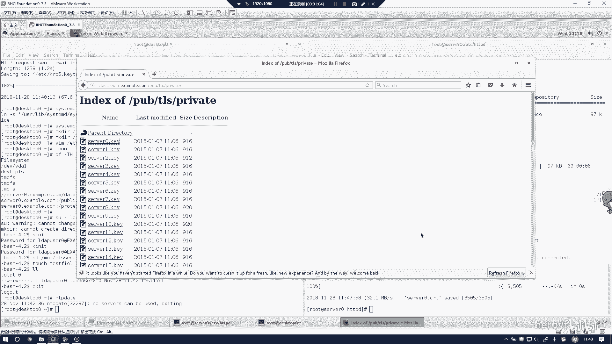
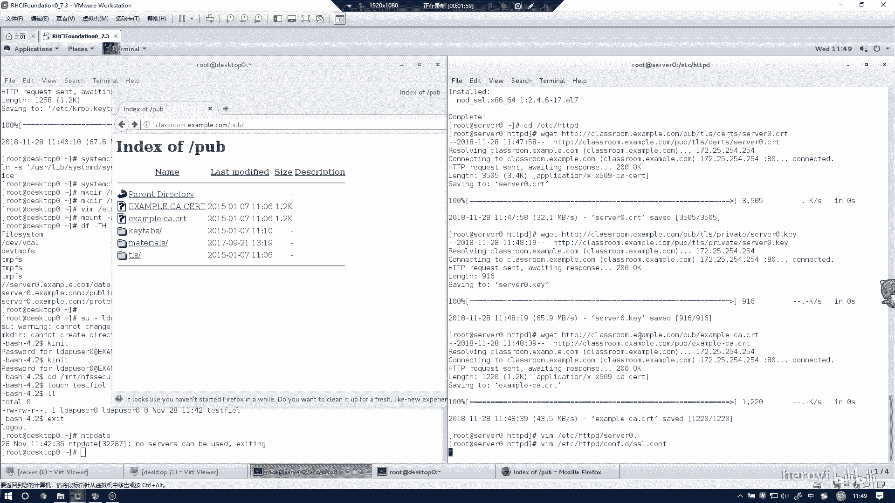
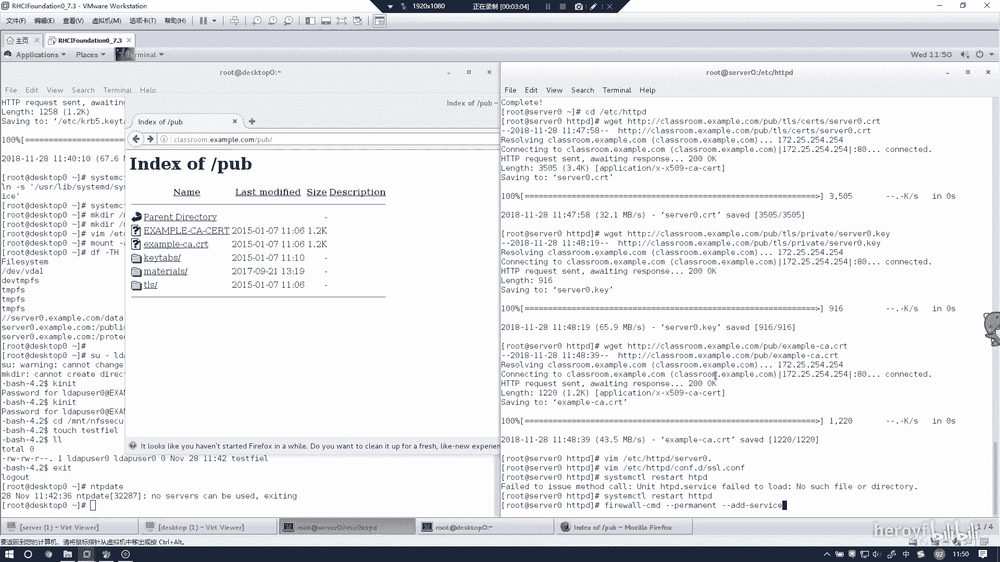

# RHCE(red hat7 考前讲解！最优做法解答，无坑) - P12：配置安全web服务 - heroyf - BV1St411p7K8

接下来这个时间的话是配置安全的外表服务器，其实就是加上1个HTDPS的证书。那么我们把。呃，这边的模块给装一下。

这是SSSLHDPS的模块。

然后我们进入到它的配置文件的目录下，我们把他的那个证书该装的装一下。那我这边的话我就直接这样子了。

懒得打。是在pub下。Tl。CITS。420。点CRT。

这个复制一下。然后这下reget。

嗯，然后还有个T。

4个0点。只有0。K。

我装下。

我这个在privately。设为0点K。

朋要下载一下。

然后还有一个example杠CRT。

嗯。

这个。

等上复制一下。然后这几个地址的话，其实是题目当中会会给你写，你样可以记住。

然后我们把配置文件更改一下。三为0点。

420点。SSL点CO。嗯。跌。这怎么太补出来了？

我们在一00行。然后把这里的地址改成你刚刚把。证书下载了哪个地址？刚刚我是把这书全部下载了HTTB下HTTPD下的。

所以的话这里就写成HTTB呃THTTPD下载serv文0点CRT一定要写成你证如下载什么地方，这这里就写什么地方，不然的话他会找不到。这里也同样是。

这里是key。然后还有122号。嗯。

那我重启一下。

别忘记要把HTTPS加入到防火墙里面。

然后人肉的一下。

然后这时的话，我们通过。这里面通过HTTPS去访问。

嗯。他会告诉你。

是不正确的。没事，你只要把它加进去，看这个是HTTPS就可以去访问了。那么这个实验的话其就已经做完了。

