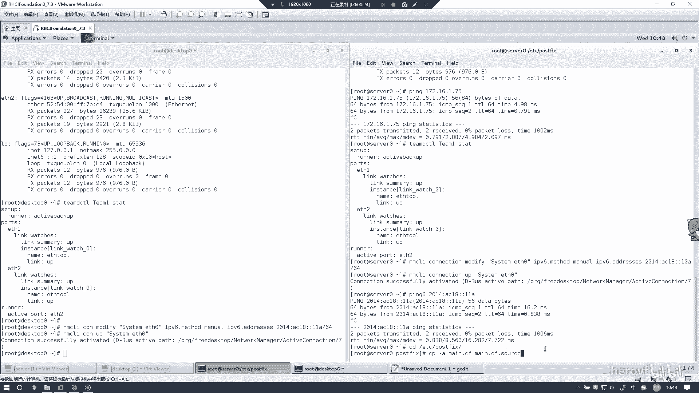
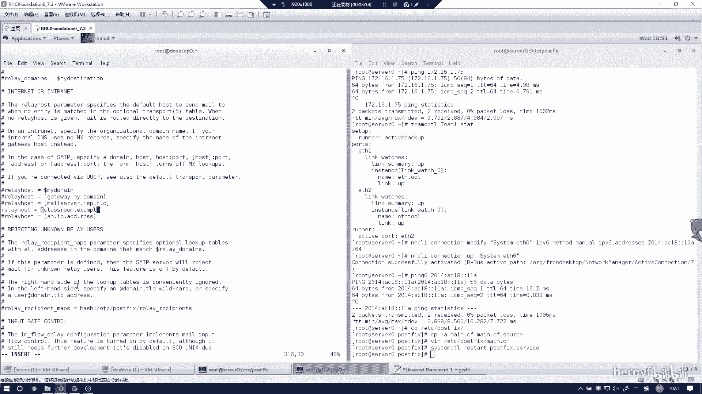

# RHCE(red hat7 考前讲解！最优做法解答，无坑) - P13：配置本地邮件服务 - heroyf - BV1St411p7K8

这道题的话是配置本地邮件服务，本地邮件服务的话是验证不了，所以的话就按照他那个一段配，基本上也就是。没什么问题，就是配置文件地址就可以了。那首先的话是C到这个目录下。

呃，CP杠A。明你 c f。这的话基本上是做一次备份什么之类的。把前面这个文件复制一份，更改为名为这个文件。

Post fix。没点CF。然后一个是在75号。

这是my host name。然后这个的话考试的时候，这个my host name应该是会更改的，也就是你的域的名字。他这里是320点exle。点com。然后其次的话就是83号。买到咩。这的话是。

更改为这个域的总称。然后其4号是99号。

这句话把前面的注释给去掉就行了。还有164号。

my destination，然后把后面都给删了。

然后提交到316号。relay house把这个给删掉。我改成拉丝肉。B exampleample点com。他这是根据题目来的，因为题目当中说在这些系统上发送的任何邮件都会自动录由。点ex点com。

所以的话relay host相当于是终极路由的意思。这里就改成题目当中发给你的。因为你所写这些东西的话，题目上应该都是会告诉你的。那么这个的话配准配准文件就改好了。

重启一下。Pos to fix。

🤧嗯。同样的话，在des store上也理行这边活动。

一个是75行。

这里的话被可人搜个零了，改成dessktop link。

然后在83号。这哥。

不そ明。

ge an example点com。然后在99号。

这句话把周释去掉就行了。然后还有164行。

🤧嗯。

316号怎么什么东西。这个话跟前面是一样的哦。点 example点com。

这这块要冲启一下。

然后的话这个就不用检查了。一般这样配置配置完的话，就听天由命吧。然后的话一般是没什么问题的。然后这个想检查，其实也检查不了。

这样的话，这个本地配置本地配邮件服务的话就配置完了。