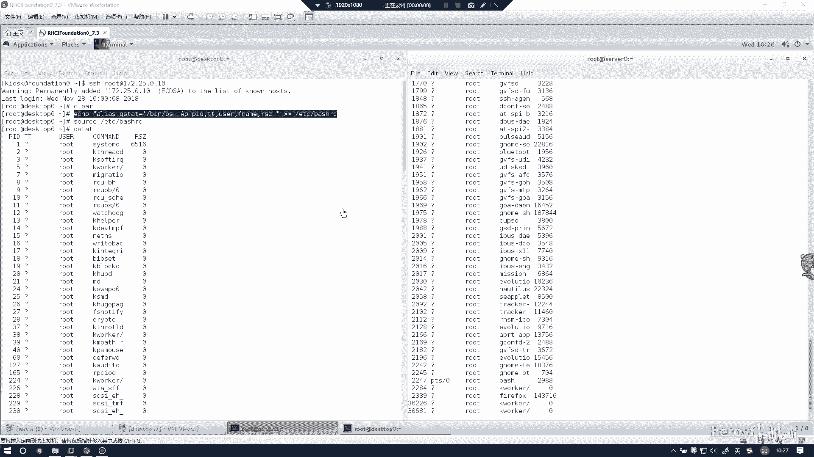
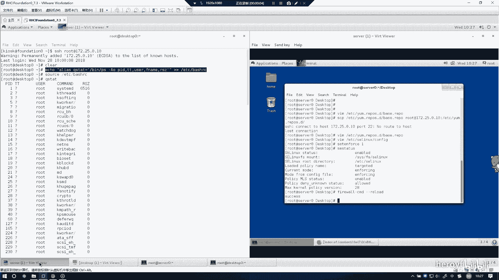
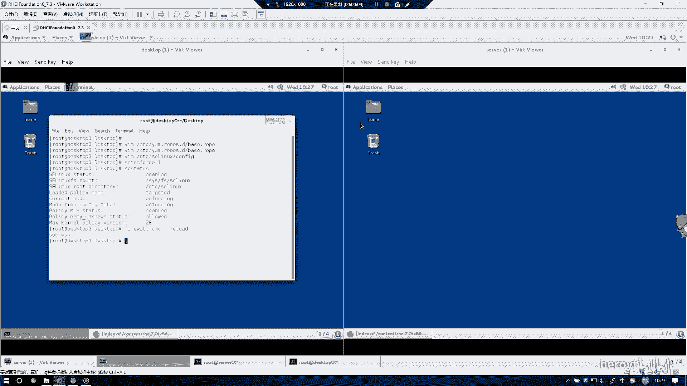
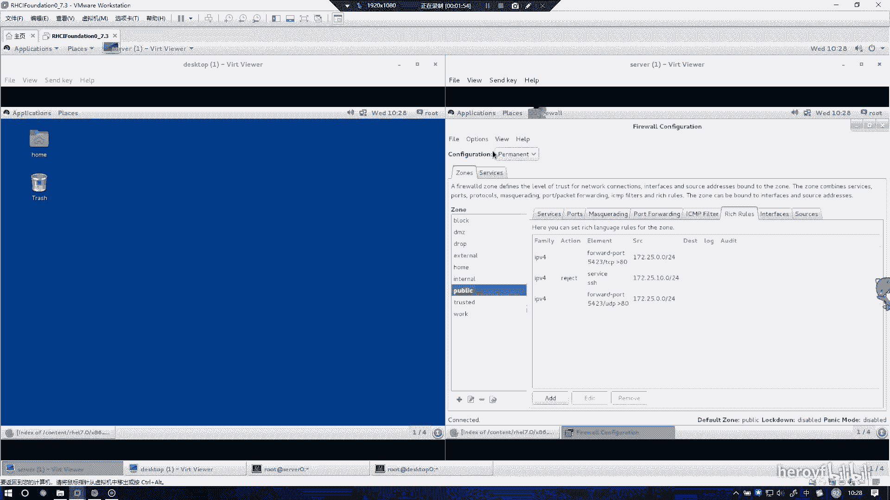
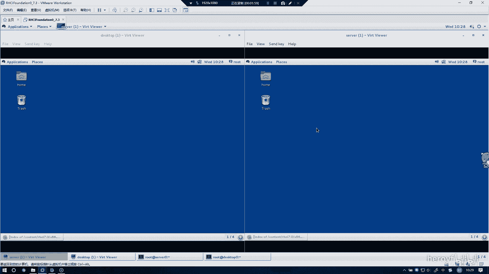
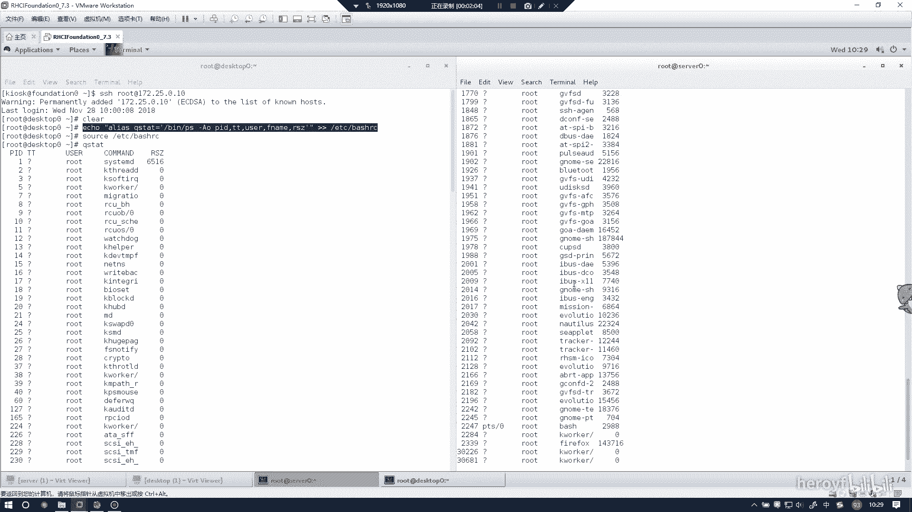

# RHCE(red hat7 考前讲解！最优做法解答，无坑) - P14：配置端口转发 - heroyf - BV1St411p7K8

下道题的话是配置端口转发，用端口转发的话，就需要用到防火墙。防火墙的话就建议到真实的机子上去操作。

那么这两个可以先关掉。

然后打开防火墙的操作。这的话只要在320上进行配置端构展开就可以了。所以只要在420上进行操作。老生常态一点，这里要改成 permanentman。然后转发的话，其实我建议一切都在副规则当中配置。

因为副规则可以配置一切的防火墙规则。呃，这里只要选择IPV4。然后这里改成forward port。然后这里会告诉你从哪个端口转发到哪个端端口，他说将本地的5423。转递到。转发到80端口。确定。🤧。

ss源的话改成172。25。0。0。0。等24。这样的话就是可以的。我建议的话是把UDP再给配置一遍。呃，因为他说的是本地端口，本地端口就包括TCP和UDP的两种端口。🤧嗯。建议式配置。

这样的话就不会丢分，万一他可能不知道，因为他不知道他的考试规则是如何判定的。所以的话还是把EDP给配置一遍，这样是不会错误的。🤧嗯。然后这里改成172。2。0。0-24。这样的话就可以了。

然后你会看到这里现在是有三条规则的。你可以你可以选择通过命令行reload的，然后也可以选择这里来reload。

然后这样话就可以了。然后这个防火墙就配置好了。

我们可以把这个关掉。

这道题就结束了。