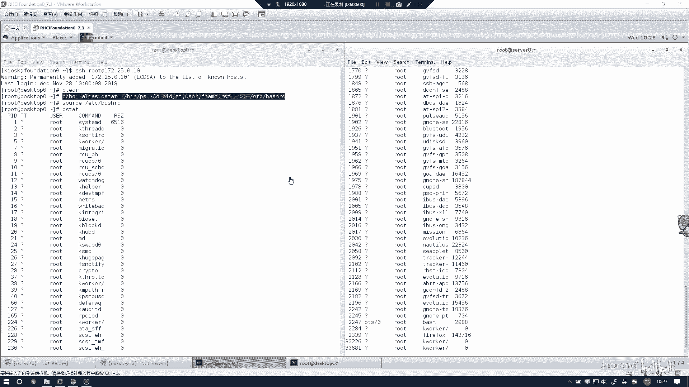
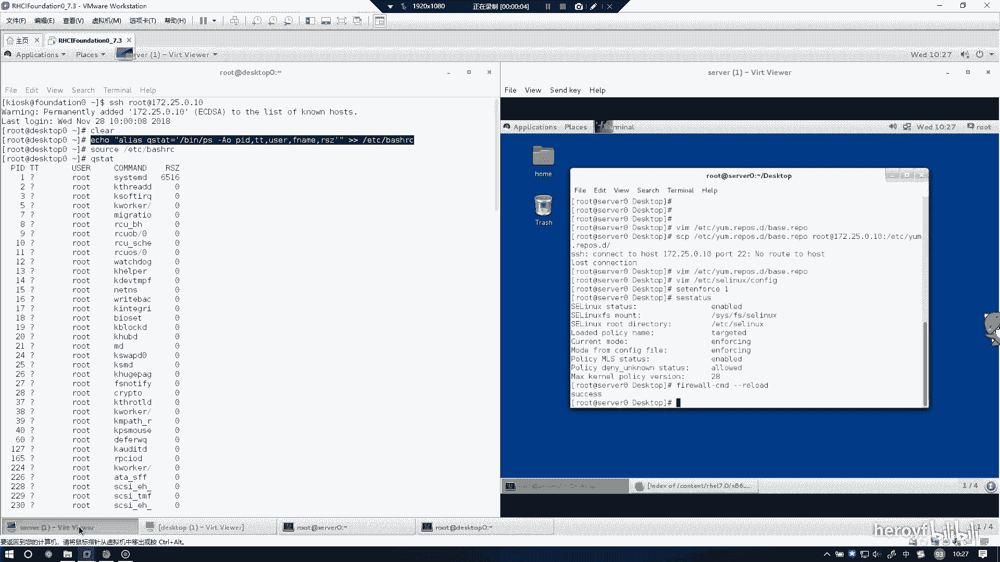
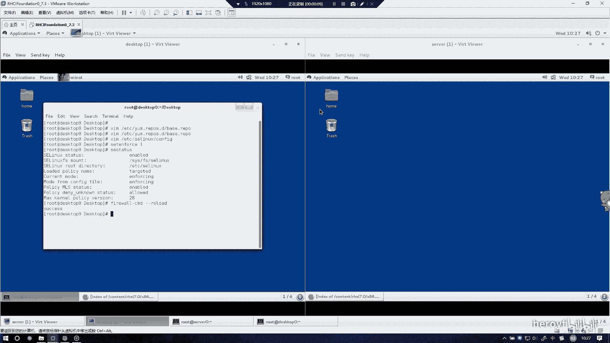
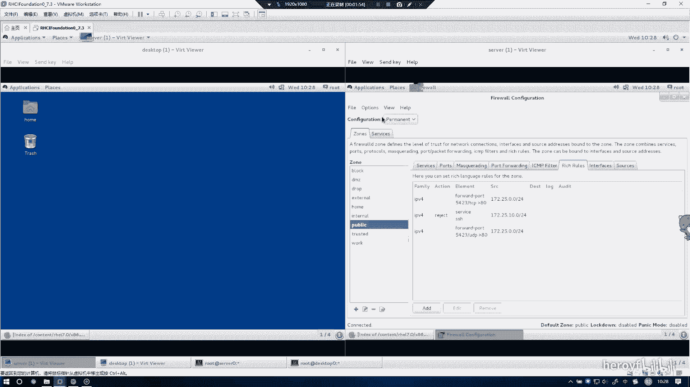
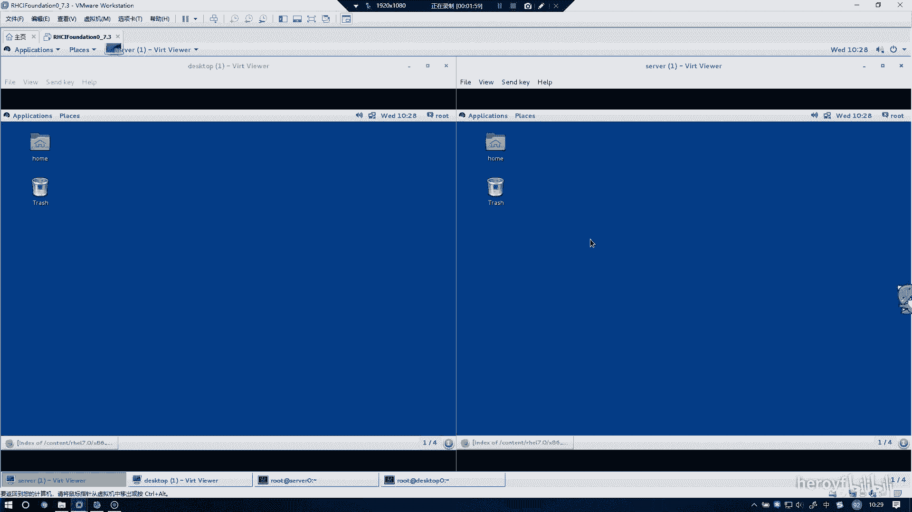
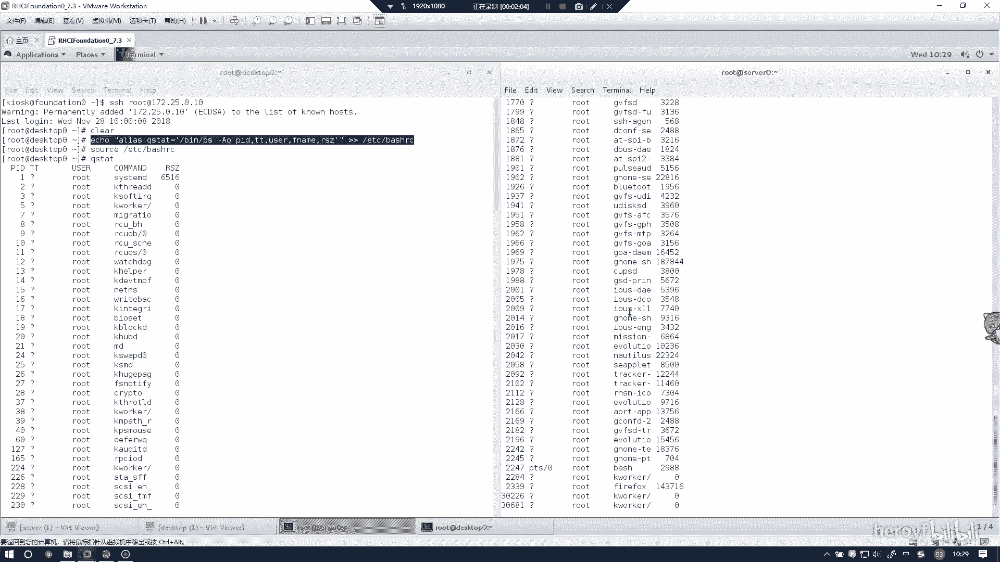

# RHCE 考前讲解：P14：配置端口转发 🔄

在本节课中，我们将学习如何在 Red Hat Enterprise Linux 7 系统上配置防火墙的端口转发功能。端口转发允许我们将到达服务器特定端口的流量，重定向到另一个端口或另一台服务器，这是网络管理中一项非常实用的技能。



上一节我们介绍了防火墙的基本操作，本节中我们来看看如何具体配置端口转发规则。

---

## 环境准备与防火墙管理

配置端口转发需要使用系统的防火墙功能。建议在真实的物理机或虚拟机环境中进行操作，以确保规则生效。



首先，我们需要确保防火墙服务正在运行。如果之前有其他防火墙规则或测试环境干扰，可以先将其清理或关闭。




如图所示，我们可以先停止并禁用可能冲突的服务（如`iptables`），然后启动并启用 `firewalld` 服务。操作命令如下：

```bash
systemctl stop iptables
systemctl disable iptables
systemctl start firewalld
systemctl enable firewalld
```

## 配置端口转发规则

本次实验的目标是在服务器 `servera`（假设IP为172.25.0.10）上配置端口转发。我们需要将到达本机 `5423` 端口的流量，转发到本机的 `80` 端口。

**核心概念**：端口转发的本质是修改防火墙的 `nat` 表规则，其原理可以用以下简化的iptables命令表示：
`iptables -t nat -A PREROUTING -p tcp --dport 5423 -j REDIRECT --to-port 80`

然而，在RHEL7中，我们使用 `firewall-cmd` 或图形化工具 `firewall-config` 来管理更安全便捷。以下是通过 `firewall-config` 图形界面配置的步骤：

1.  打开防火墙配置工具：
    ```bash
    firewall-config
    ```
2.  所有规则建议在“永久”配置模式下进行，以确保重启后生效。请将配置模式切换为 **Permanent**。
3.  端口转发规则在“富规则”（Rich Rules）中配置最为灵活，可以定义详细的源、目标、协议和动作。

以下是配置端口转发的具体操作列表：

*   **添加富规则**：在图形界面中，选择“富规则”选项卡，点击“添加”按钮。
*   **选择协议族**：规则家族选择 **IPv4**。
*   **设置规则类型**：在规则类型中，选择 **Forward port**。
*   **配置端口映射**：
    *   将“本地端口”设置为 **5423**。
    *   将“目标端口”设置为 **80**。
    *   协议选择 **tcp**。
*   **设置源地址**：在“源”地址中，填写允许访问的网段，例如 `172.25.0.0/24`。
*   **确认添加**：点击“确定”保存这条TCP规则。


## 关于UDP协议的补充配置

题目中提到的“本地端口”通常涵盖TCP和UDP两种传输协议。为了确保在考试中不因规则不完整而丢分，建议对UDP协议也进行相同的配置。

以下是重复上述步骤为UDP协议添加规则的简要说明：

*   再次添加一条新的“富规则”。
*   所有设置与TCP规则一致，仅在协议选择时，改为 **udp**。
*   源地址同样设置为 `172.25.0.0/24`。

配置完成后，你的富规则列表中将包含两条规则，分别针对TCP和UDP协议，源地址都是指定的网段。



## 重载防火墙与验证

规则配置完成后，需要重载防火墙才能使“永久”配置立即生效。


你可以通过命令行重载：
```bash
firewall-cmd --reload
```

也可以在 `firewall-config` 图形界面中，点击菜单栏的“选项”，选择“重载防火墙”。



重载成功后，端口转发规则即开始生效。你可以通过关闭配置窗口来结束操作。




此时，所有发往 `servera:5423` 的TCP和UDP数据包，都会被防火墙转发到本机的 `80` 端口进行处理。

---

本节课中我们一起学习了在RHEL7上使用 `firewall-config` 工具配置防火墙端口转发。关键点包括：在**永久模式**下操作、使用**富规则**进行灵活配置、明确指定**协议（TCP/UDP）**和**源地址**、以及配置后必须**重载防火墙**。掌握这些步骤，你就能轻松完成相关的认证考试题目和实际运维工作。