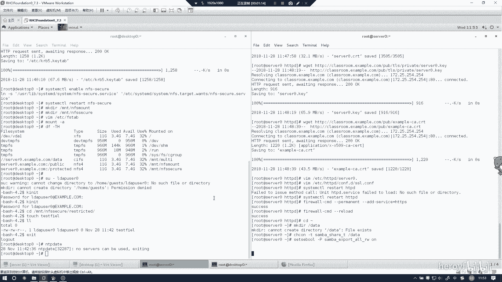
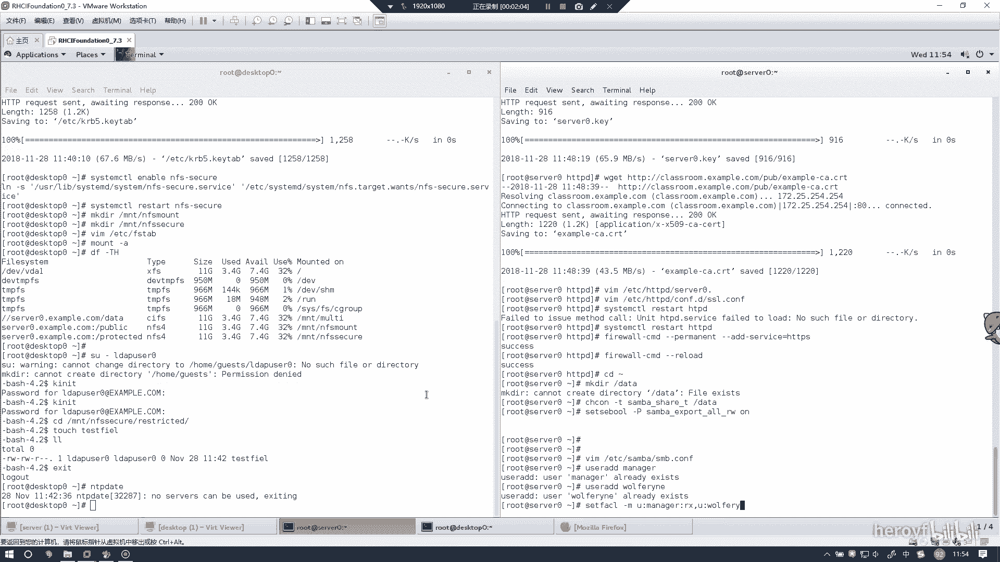
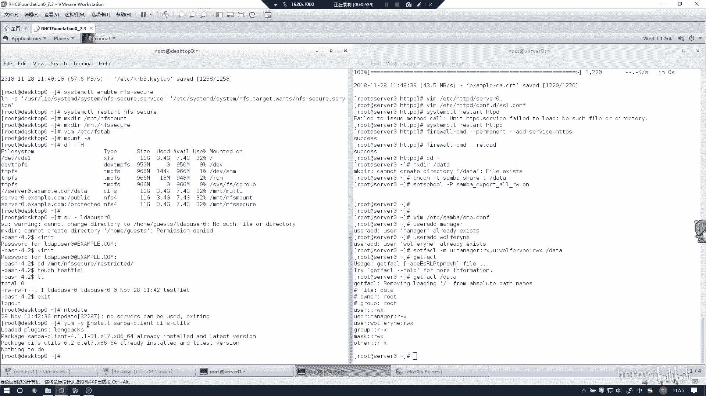

# RHCE(red hat7 考前讲解！最优做法解答，无坑) - P15：配置多用户smb挂载 - heroyf - BV1St411p7K8

でせ。我录的时候发现我的配置多用户管的这个地方没有录上去，那么我就要再重新做一遍。然后的话首先是makeDIR我之前上面可能有些目录已经创建过。

这里的话其实目录已经创建过，然后的话同样按照上面打。放T。Samber。

那个学RE。Seter。哦。Sber。

Sport2W2。是了一个哈皮。对你是听遍。

这里也电。我果你个妈咪。扫你家都是扫。然后等他一下价载的方法。嗯。随便答答个两三分就行。成本价格。

你每天都在那扫皮的是吧？那这地方其实就已经好了。然后配置文件的话，其实之前我已经配好了，然后他没有给我录上去。那我这里的话就展示一下配置文件。

一个是data里面的pa data，然后right list offering。然后这个的话就是这个配置文件的地方。然后你可以选择暂停来看一下配置文件是否正确。

然后这边我就然后这边的user的话，其实我这边都已经弄好了，然后我这边创建一下，然后你会发现我这优秀上框面上面显示的话已经创建好了。

这个怎么变大了？然后pass动的话，你就按照上面敲，其实也就可以敲，也就是正确的。主要是。后面这个地方。一个是这个地方。他的权限的地方。

要外。

你要看他权限是否可以完全，可以通过getite飞。就是你可以看到，然后user manager是2杠X，off是RWX都可以看到。然后客户端的话，这边其实我这边已经装好了，你就装上面1个300plan。

还有个CISFS。就是这样的。30。

还有CIFS杠UTIOS。

这以就这两个，因为这个边都已经装好了，所以它会显示没什么事情可以做。其次就是这个通讯文件。

YXNB。

他的配置文件主要就是这样写。然后还有一个就是它的自动挂载。

自动挂载的话，其实是这一行。

prereedentials后面写的就是你的配置就是在地方。

然后接下来的话，你只要通过mo杠A就行。然后你看一下是否有这条记录。就OK了。如果这条技术代表是挂在上。哥，你有点变态了。

然后如何测试呢？呃我。我现在是一到，因为他是通把这个目录挂载到了。

MT杠。

有 tail。这个下面这个下面有一个我创建的好的目录。现在你看这两个目录是一样的，我在下面创建1个123，然后这里的话其实也是。

能看到1237就过来。这样这样如果检验没有问题的话，那么这个实验其实就完成了。

