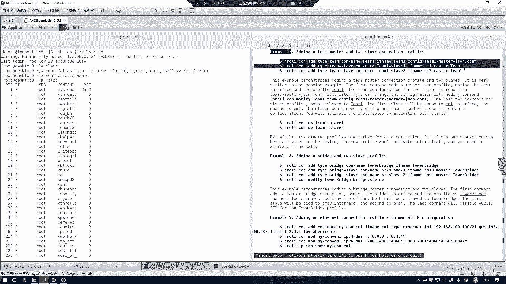
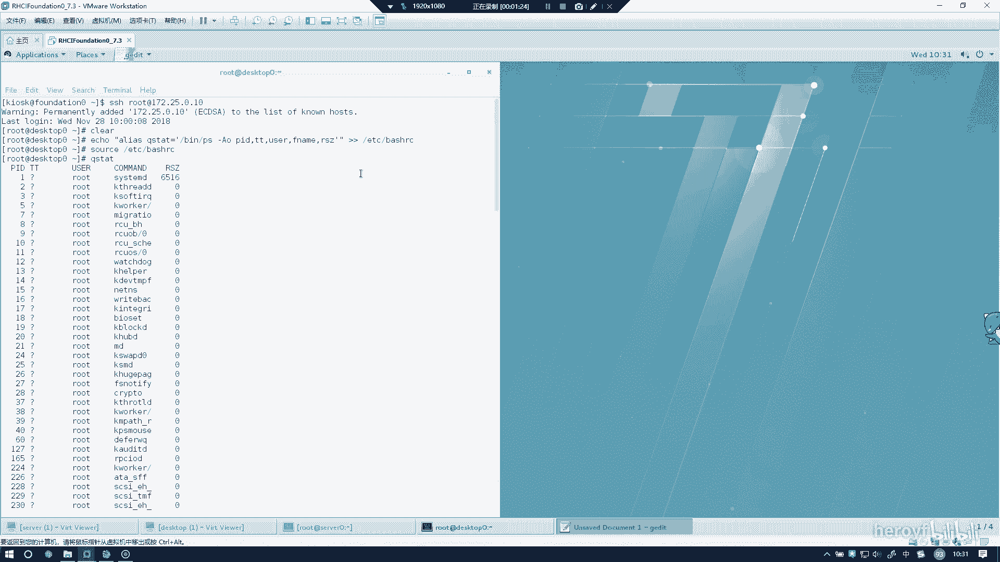
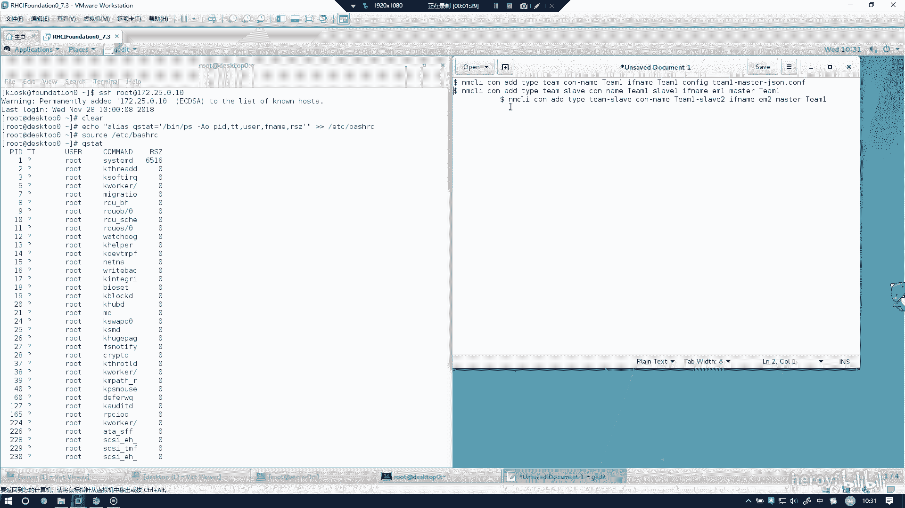
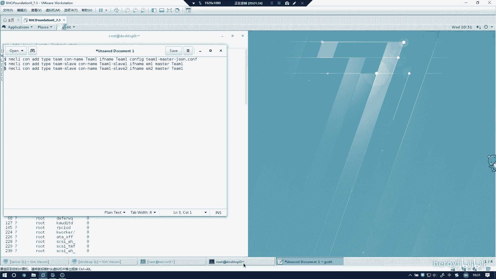
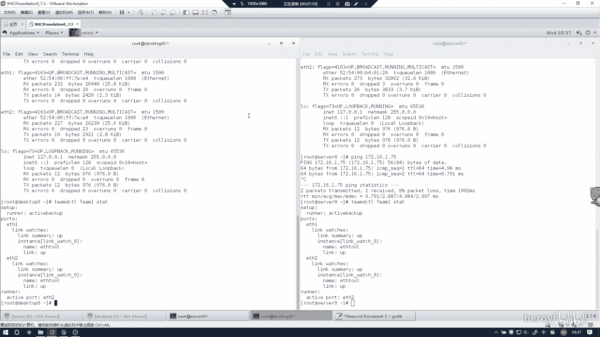

# RHCE(red hat7 考前讲解！最优做法解答，无坑) - P16：配置链路聚合 - heroyf - BV1St411p7K8

然后这一道题的话是配置链路聚合。这道题的话，serv和 desktoptop上是都要使用。我们先把这个清一下，看看清楚。现在诉讼上进行配置。嗯。他有一个man。NMCL。The sameです。そ。

配的还用模板器。呃。这里的话可以看到看到三条句子。我们可以把它复制出来。

但是一般后面的话，你背熟其实就可以不用复制了。然后这里可以打开一个啊表。然后可以找到。诶。记事本。这是备在哪来着？嗯。

复制一下，如果你备不住的话，就可以推荐用这种方法来做。

🤧嗯。

4个0是吧。然后这样。然，这里按Q就可以退出了。我TEAMD点靠想换了。你去了了。然后。搜索。呃，搜索RU andER。呃，这个好像州做不到，你直接搜做双引号。等于诶。然后这里的话其实就可以找到了。

一条一 club。搜索他需要的这一这一段，也就是。呃，这一段。Active backup。然后把这个也给复制下来。然后直接站到这边来。然后要注意的话，就是如果写他配置文件的话呢。

最好在前面加上一个大括号。来表示引用这一段。那么这一段东西就不需要了，这两个man的帮助主要是用来干这些事情。然后就可以通过NMCI。Connection， add。Tam。

call name这些都可以t键主权。然后这种要你具体写名字的话是不行的。if name。铁。TMEconfig。然后其实的话我在敲其实就是这段话。嗯，后那么这时呢你要把后面这段配置文件的话，呃。

把这样东西给粘到后面来。就是copy，然后这里写一个单银行来引用这个配置文件，然后粘贴。这。你看这里他会告诉你successful added，你一定要学会去看他会他给你的那些反馈。嗯。

ad type T，你可以直接这边来复制，我比较喜欢手枪。Slave。Com name。TAME杠SLABE。で、すね。BTH1。Mster。T。你看他也会告诉你，你只要看successful。

也就代表是正确的。然后同样的。把ETHR给加进去。这条就好了。这句话主要是改变这个team一组的IPV的地址。APV4。Address。然后172。16。1。65。啊。APPV4。点med。没事的。

这句话这个是他不了的。所以就接手枪，然后没有报任何错误，再把我们枪试一顺。我们把这个端口给取出来，把这个组的地址给吸起来。🤧う。这全部显示successful了就没有问题。然后这时候的话。

我们同样也要在dextop上进行一样的操作。🤧。这以话我就直接复制吧。敲的话时间有点长。copy，然后paste。加双引号啊，加加个单引号，叫双引号都可以，然后完这这块给复制进去。你哥喺边。是吗？

然后这一句话就加好了。然后我们把这句话。你拿回来的都走被告方，对复制进去。然后这里的话记住你这里是没有EME这个端口，呃这个网网口的，所以你要把它改成ETHE。然后前面看一下是否有不同的地方。

所以我建议就是直接手敲，万一到时候会有错的话。可能会搞了一些奇奇怪怪的bug进去。然后这里也就好了。Co。意吗？这议。此类。Call name。え。以上4类。啊。This name。TTH2。

Paster。TME。TME然后这个也就下好了。然后就是modify。这个的话地址应该是要改变的。呃，serv端是这个的话，但是top户端应该是1。75。72。16。1。我看75。杠24。

IPV4点MNUAL然后这个的话再稍微验证一下是dextop上是1。75。我没有问题。我可是我们接上高系统的大学，然后connection up。也不接了那些开店的那些。然后看一下这个team一的话。

这一概成写的地址就是172。16。1。75。然后我们可以看一下这边。这也是1。65，那我们拼一下172。16。1。75的话，应该是能拼得通的。这些谁可能拼得通的。我们按照上面的方法再来验证一下。

TAMDCTL。EME。STAT。这些都是出现的。其实只要你能拼能的话，基本上就代表没有问题了。你可以不用选择用上面的方法验证。那最后看能不能平衡就可以了。这也是可以的。那么这个事就做完了。

