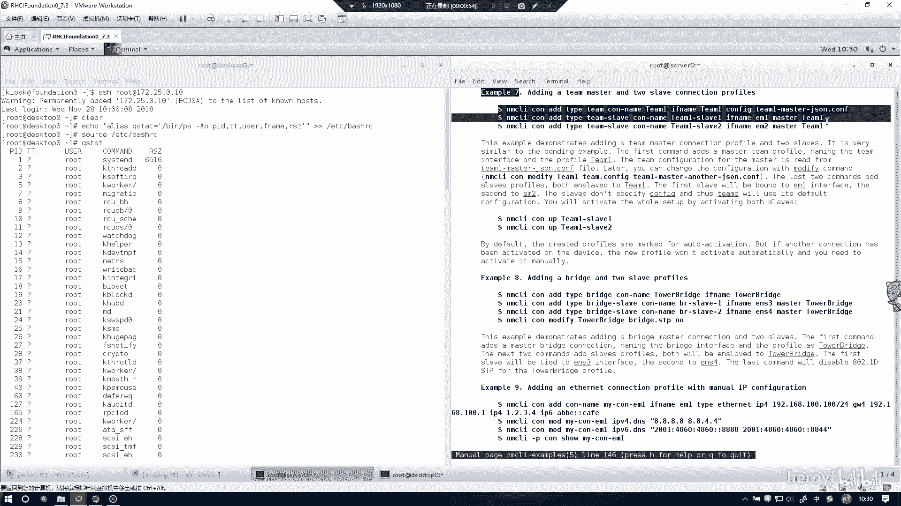
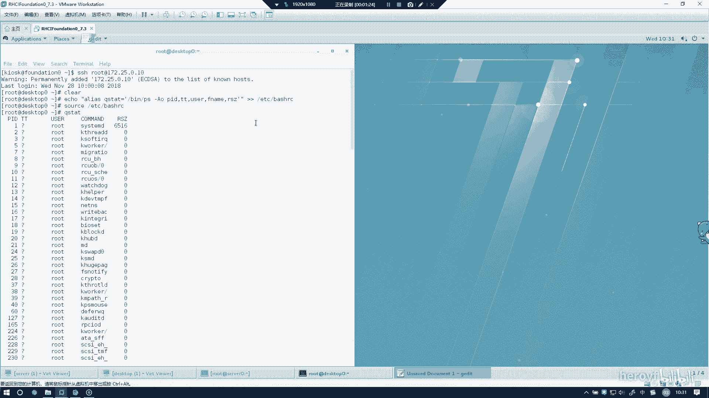
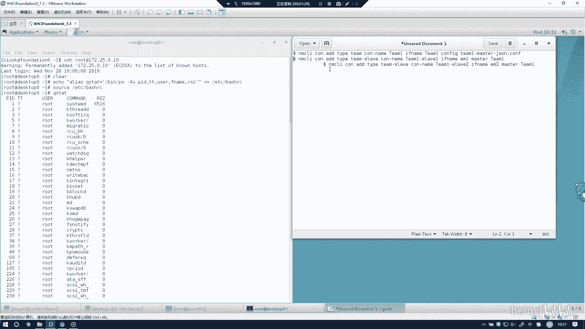
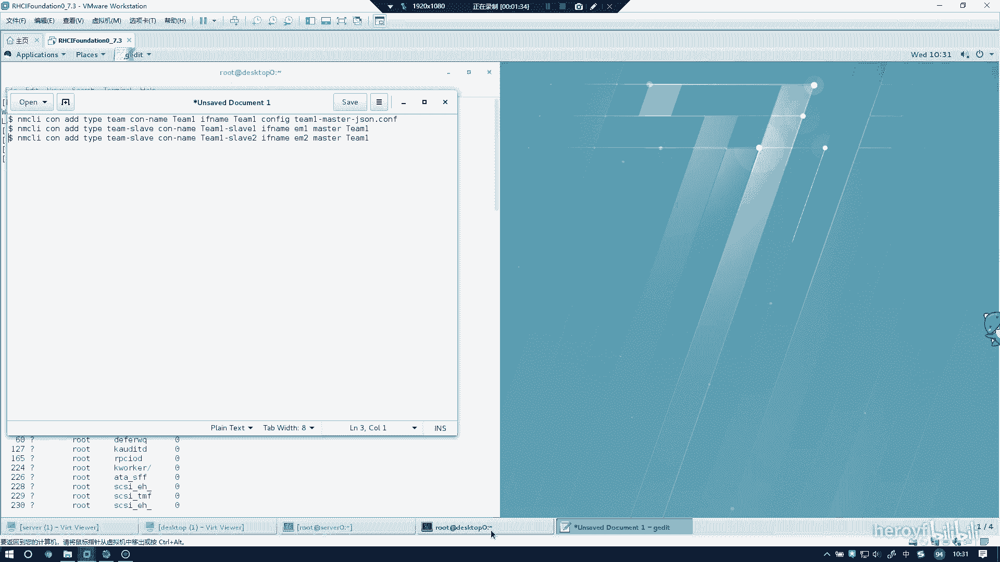
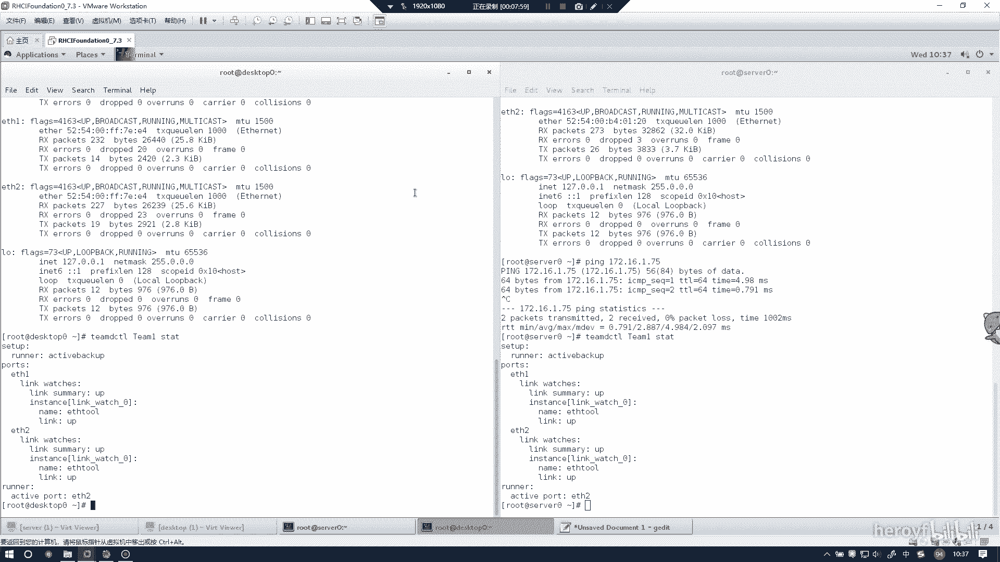

# RHCE考前讲解：P16：配置链路聚合 🔗

在本节课中，我们将学习如何在Red Hat Enterprise Linux 7系统上配置链路聚合。链路聚合可以将多个物理网络接口绑定成一个逻辑接口，以提高带宽和冗余性。我们将使用`teamd`工具，通过`nmcli`命令进行配置，确保操作步骤清晰、无错误。

---



## 概述 📋

本节教程将指导您在`server`和`desktop`两台主机上配置链路聚合。我们将创建一个名为`team1`的聚合接口，并为其配置静态IP地址。配置过程涉及查看帮助文档、创建聚合接口、添加成员接口以及验证配置。



---

## 配置Server端



上一节我们介绍了链路聚合的基本概念，本节中我们来看看如何在Server主机上进行具体配置。



首先，我们需要清除现有配置，确保环境干净。接着，使用`nmcli`命令开始配置。

在配置过程中，可以参考系统帮助文档。使用以下命令查看`teamd`的相关配置示例：

```bash
man teamd.conf
```

在帮助文档中，可以找到可用的配置段落。通常，我们会复制所需的配置模板。

以下是配置链路聚合的关键步骤：

1.  **创建Team聚合接口**：
    使用`nmcli`命令添加一个类型为`team`的新连接，并指定接口名称为`team1`。

    ```bash
    nmcli connection add type team con-name team1 ifname team1
    ```

2.  **为Team接口配置IP地址**：
    为`team1`接口设置静态IPv4地址。

    ```bash
    nmcli connection modify team1 ipv4.addresses 172.16.1.65/24 ipv4.method manual
    ```

3.  **添加成员接口**：
    将物理网卡`eth1`和`eth2`作为`team1`的从属接口添加。

    ```bash
    nmcli connection add type team-slave con-name team1-slave-eth1 ifname eth1 master team1
    nmcli connection add type team-slave con-name team1-slave-eth2 ifname eth2 master team1
    ```

4.  **激活连接**：
    启动新创建的`team1`连接及其从属连接。

    ```bash
    nmcli connection up team1
    nmcli connection up team1-slave-eth1
    nmcli connection up team1-slave-eth2
    ```

执行每条命令后，请注意观察终端反馈。如果出现`successfully`或类似的成功提示，则表明该步骤配置正确。

---

## 配置Desktop端

在Server端配置完成后，我们需要在Desktop主机上进行类似的配置。主要区别在于IP地址不同。

以下是Desktop端的配置步骤：

1.  **创建Team聚合接口**：
    操作与Server端相同，但接口名称和IP地址需根据题目要求更改。

    ```bash
    nmcli connection add type team con-name team1 ifname team1
    ```

2.  **为Team接口配置IP地址**：
    为Desktop端的`team1`接口设置静态IPv4地址`172.16.1.75/24`。

    ```bash
    nmcli connection modify team1 ipv4.addresses 172.16.1.75/24 ipv4.method manual
    ```

3.  **添加成员接口**：
    将Desktop主机上的物理网卡（例如`eth1`和`eth2`）添加为从属接口。**请务必根据实际接口名称进行修改**。

    ```bash
    nmcli connection add type team-slave con-name team1-slave-eth1 ifname eth1 master team1
    nmcli connection add type team-slave con-name team1-slave-eth2 ifname eth2 master team1
    ```

4.  **激活连接**：
    启动所有相关连接。

    ```bash
    nmcli connection up team1
    nmcli connection up team1-slave-eth1
    nmcli connection up team1-slave-eth2
    ```

---

## 验证配置 ✅

配置完成后，必须进行验证以确保链路聚合工作正常。

以下是验证步骤：

1.  **检查IP地址**：
    在Server和Desktop上分别使用`ip addr show team1`命令，确认IP地址已正确配置为`172.16.1.65`和`172.16.1.75`。

2.  **测试连通性**：
    从Server端ping Desktop端的IP地址，这是最直接的验证方法。

    ```bash
    ping 172.16.1.75
    ```

    如果能收到回复，则表明网络层连通性正常，链路聚合配置基本成功。

3.  **查看聚合状态（可选）**：
    可以使用`teamdctl team1 state`命令查看聚合接口的详细状态信息，包括成员接口的活动情况。

---

## 总结 🎯



本节课中我们一起学习了在RHEL 7上配置链路聚合的完整流程。我们掌握了使用`nmcli`命令创建`team`聚合接口、配置IP地址、添加物理网卡作为从属接口的方法，并学会了通过ping测试来验证配置的正确性。关键在于仔细遵循步骤，并注意观察命令执行后的反馈信息，确保每一步都成功执行。