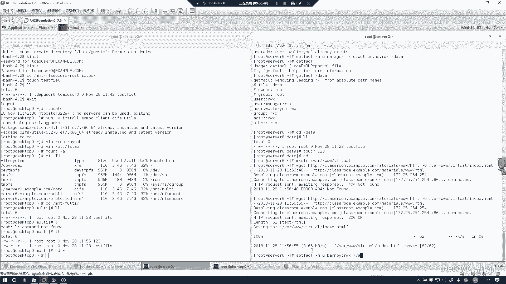
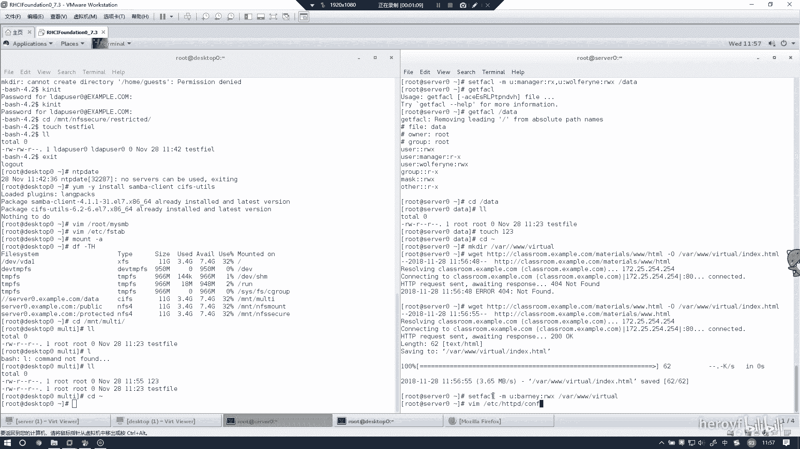

# RHCE(red hat7 考前讲解！最优做法解答，无坑) - P17：配置虚拟主机 - heroyf - BV1St411p7K8

接下来的话配置一下虚拟主机。

创建一下虚拟主机的目录。然后我们这里也下载一下。你我每天有什么调皮的。有。

4。66。Yeah。嗯，这个地方应该是打错了MATT呀。这个地方打错。

嗯。然后的话我们同样设置一下权限。已经告诉。

一个状我的下。这个目录设置下权限。总我在。ETC下面。com点地硬盘。对ウホ。这是一个。这地方应该是有问题，我这里才一般。

Com。

没有吗？这么简单一个题我们在这个配置事件中加入以下一句话。卡皮hosster。デ也可。あ。八年。哦DOC。Document。看一旦你写的正确的话，他这他这里面的颜色是肯定会变的。

就如果你发现颜色没有变的话，应该是你配置文件写错了。你第二次。一定要记得把这个开口给闭上。嗯嗯嗯。这是一。So name。

然后这两个信就配置好了，然后把这个服务重启一下。他这里没有出现任何东西的话，代表是没有任何报错。一旦出现了什么东西的话，说明肯定是有错误的。你一定要认真检查一下。

然后我们把这里。看一下这个网站能不能访问就可以了。

然后这边的话访案可以说明是。

这道题就配就完成了。