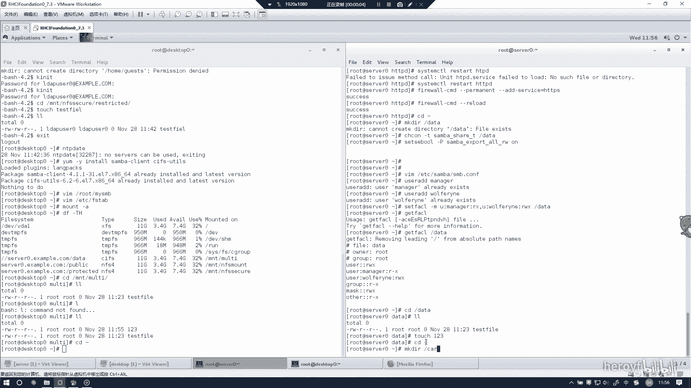
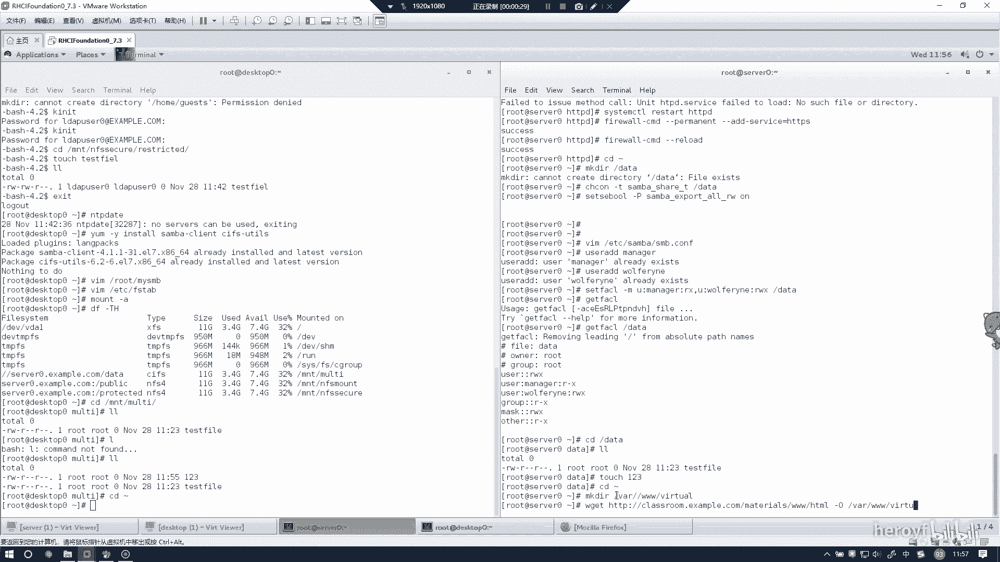
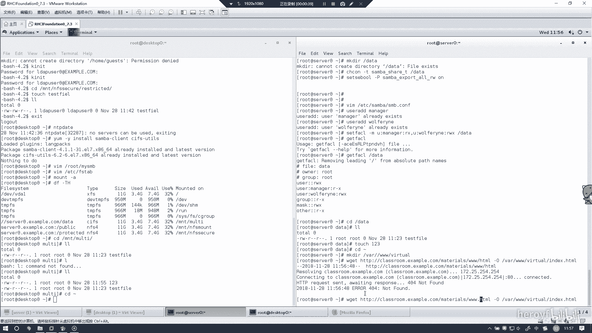
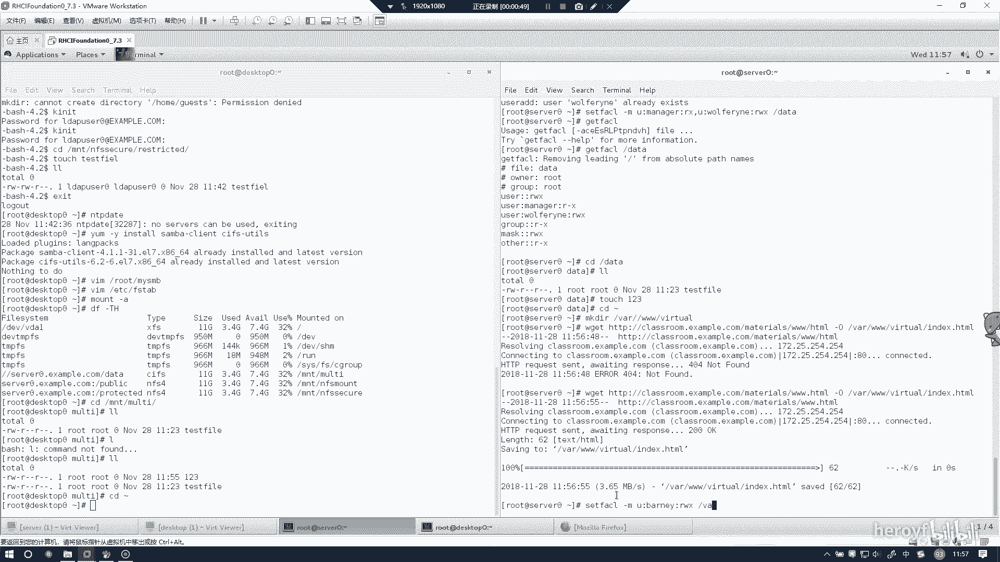
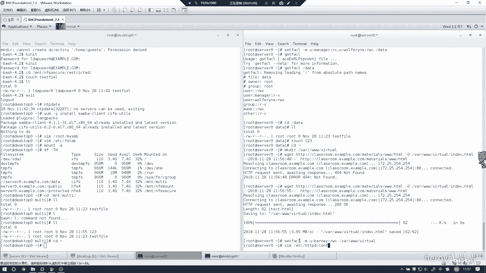
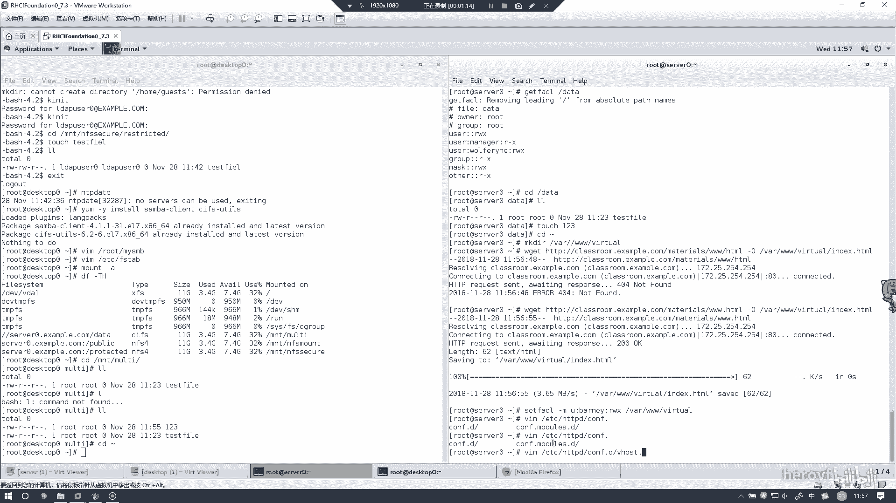
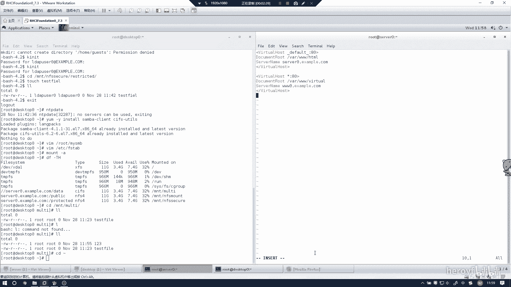
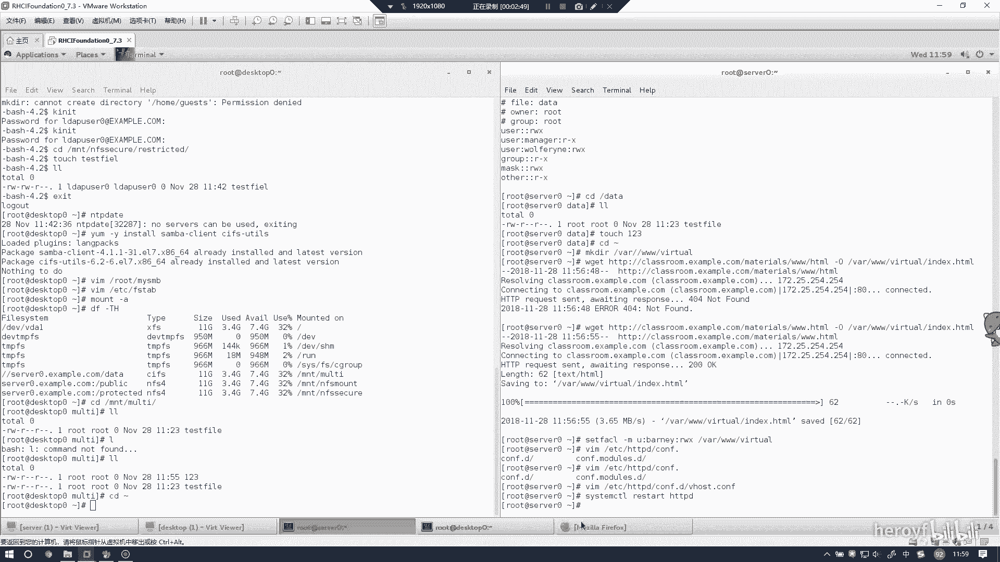
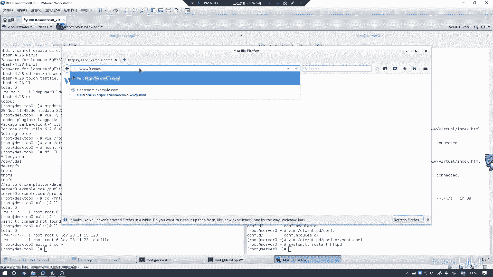
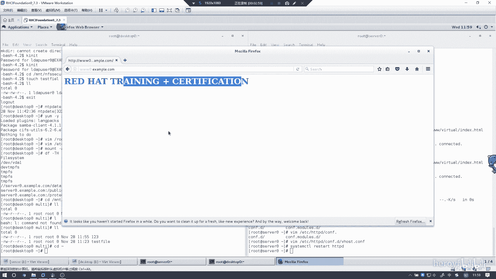

# RHCE 考前讲解：P17：配置虚拟主机 🖥️

在本节课中，我们将学习如何在 Red Hat Enterprise Linux 7 上配置 Apache 虚拟主机。虚拟主机允许我们在单个服务器上托管多个网站。



## 概述

我们将通过创建目录、配置文件和设置权限来配置一个虚拟主机，并最终验证网站是否可以正常访问。



## 创建虚拟主机目录

首先，我们需要为虚拟主机创建网站内容目录。

```bash
mkdir -p /var/www/vhost1
```



## 下载并准备网站内容

接下来，我们需要在创建的目录中准备网站内容。这里我们使用一个简单的示例文件。



```bash
echo "Welcome to Virtual Host 1" > /var/www/vhost1/index.html
```

## 设置目录权限

为确保 Apache 能够读取网站文件，我们需要正确设置目录的权限。



```bash
chmod -R 755 /var/www/vhost1
chown -R apache:apache /var/www/vhost1
```

## 配置虚拟主机文件



上一节我们创建了目录并设置了权限，本节中我们来看看如何配置 Apache 的虚拟主机文件。

我们需要在 `/etc/httpd/conf.d/` 目录下创建一个新的配置文件。

```bash
vi /etc/httpd/conf.d/vhost1.conf
```

在配置文件中，加入以下配置块。核心配置指令是 `VirtualHost`，它定义了服务器的监听端口和文档根目录。

```apache
<VirtualHost *:80>
    ServerName vhost1.example.com
    DocumentRoot /var/www/vhost1
    <Directory /var/www/vhost1>
        AllowOverride All
        Require all granted
    </Directory>
</VirtualHost>
```

**注意**：配置文件语法必须正确。如果编辑器中的语法高亮没有正常显示，通常意味着配置有误，例如忘记关闭 `VirtualHost` 标签。



## 重启 Apache 服务

配置文件保存后，需要重启 Apache 服务以使更改生效。

```bash
systemctl restart httpd
```

重启后，如果命令行没有输出任何错误信息，则表明配置成功。如果出现错误信息，需要返回检查配置文件。



## 验证虚拟主机

最后，我们来验证虚拟主机是否配置成功。我们可以使用 `curl` 命令或在浏览器中访问服务器的 IP 地址或配置的域名。



```bash
curl http://服务器IP地址
```

如果返回了我们之前写入 `index.html` 的内容 “Welcome to Virtual Host 1”，则说明虚拟主机配置成功。



## 总结

本节课中我们一起学习了在 RHEL 7 上配置 Apache 虚拟主机的完整流程。我们完成了创建网站目录、设置权限、编写虚拟主机配置文件、重启服务以及最终验证的步骤。掌握这些步骤对于 RHCE 考试和实际运维工作都至关重要。