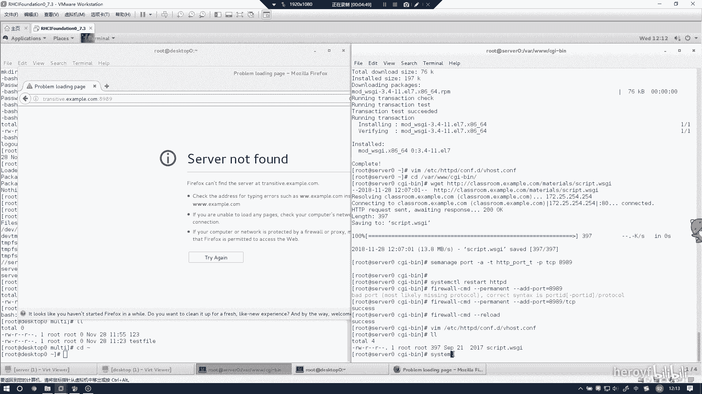
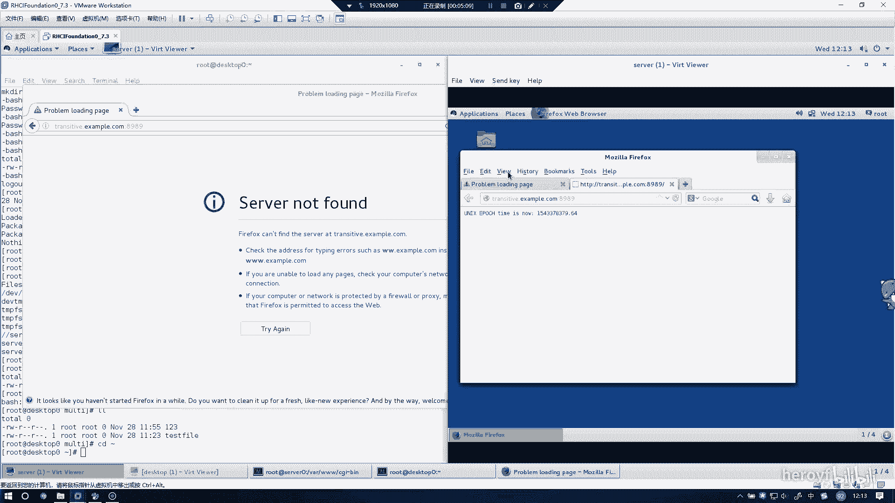
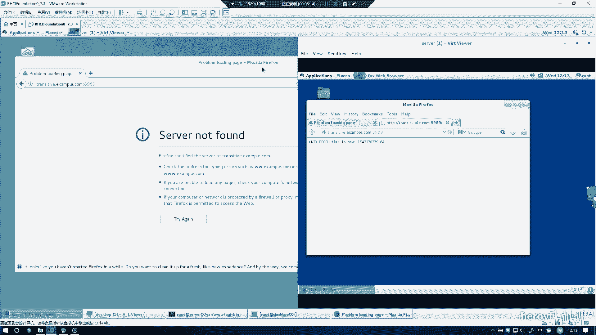
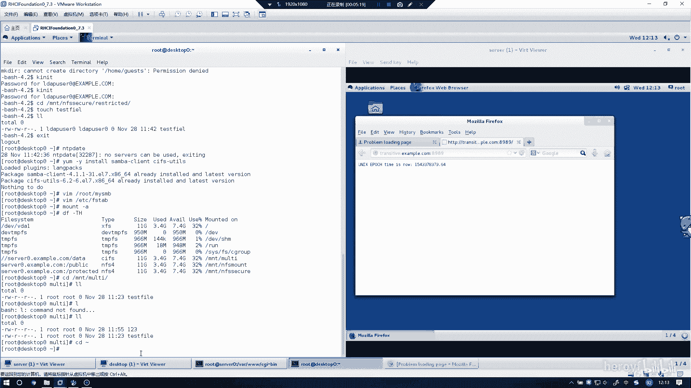

# RHCE(red hat7 考前讲解！最优做法解答，无坑) - P18：实现动态web内容 - heroyf - BV1St411p7K8

然后这道题的话是实现动态的外部内容。我们把他需要的组件给装上，也就是mododeWSGI。这都是HTDP下面的各种呃模块。然后我们再对配置文件进行一个系列修改。Be host。Thisす。

8989最好与前面空一行，你自己自己自己看起来放也方便。Fachual host。新冒后。八九八九。S内。T transitistive。A example点com。然后WWSGI。CIP T S。6。

然后的话把刚刚你下的那个地方给写进去。哇，3WCGI杠B。然后是。script点WSGI。啊，T别忘记，千万别忘记把它给闭合上。然后这个的话退直间其实写完了。然后我们到这个CGIB下面。

把这个东西给下载一下。CRIPT点WWS。下载好之后呢，SEMMA。杠port，然后杠A，这是增加的意思。HTDPD。P。刚T。这个这句话命令主要是查询与修改SElinux默认目录的安全上下文。

把端口加进去8989。🤧最要等一下。好，然后我们把这个服务给重启一下。然后别忘记的话，把8989这个单付给放行。等于8989。忘了叫TCP了。然后重改一下。然后的话我们通过这个页面。去访问。呃。

TRANSITIVE点 example。你确。诶。😊，什么时候没有呢？TA啊，8989端口忘加了。也没有。看一下是不是。现在就是到了排错的阶段。看看是否是自己的名字写错了。关里面。TRAN。

SITIV点exle点comM。什WSPIIT。My lives。白。し。嗯，再看一下。司机到。这个下面的话是否有那个东西？是有的。咁哥喺啊。你么这个问题做在什么地方呢？

我到搜索上去看一下这个东西有没有。这 a。有啊。不知道什么情况，可能是被阻止掉了。你到时候去看一下so在这台。

里面的selo上看一下有没有东西就可以了，有东西待会就做成功了。

然后的话这个事也就做完了。