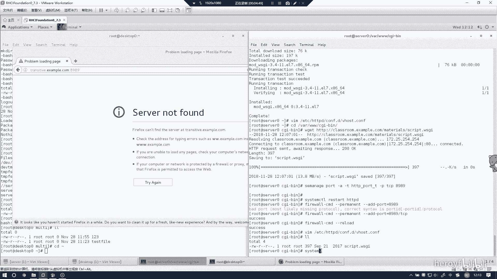
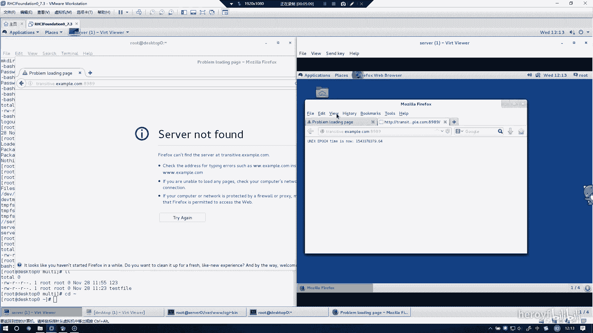
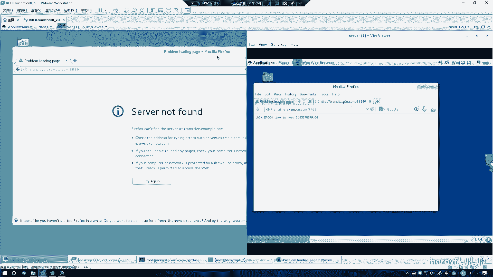
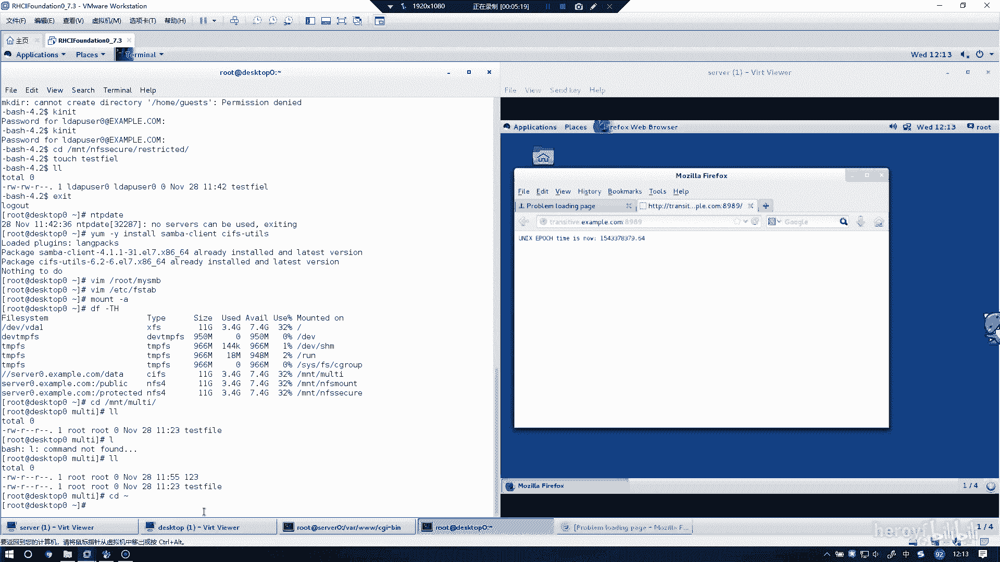

# RHCE 考前讲解：P18：实现动态 Web 内容 🚀

在本节课中，我们将学习如何在 Red Hat 7 系统上配置 Apache HTTP 服务器，以支持使用 WSGI 模块提供动态 Web 内容。我们将涵盖从安装必要组件、修改配置文件到设置 SELinux 和防火墙规则的完整流程。

---

## 安装必要组件 🔧

首先，我们需要安装提供动态 Web 内容功能的核心模块 `mod_wsgi`。它是 Apache HTTP 服务器的一个扩展模块。

执行以下命令进行安装：
```bash
yum install -y mod_wsgi
```

---

## 配置 Apache 虚拟主机 🌐

上一节我们安装了必要的软件包，本节中我们来看看如何配置 Apache 以承载我们的动态 Web 应用。

我们需要编辑 Apache 的主配置文件或虚拟主机配置文件。以下是需要添加或修改的核心配置块。

将以下配置添加到你的虚拟主机配置中（例如 `/etc/httpd/conf.d/` 目录下的一个 `.conf` 文件）：

```apache
<VirtualHost *:8989>
    ServerName transitive.example.com
    WSGIScriptAlias / /var/www/cgi-bin/script.wsgi
</VirtualHost>
```

**关键配置解析：**
*   **`<VirtualHost *:8989>`**：定义监听 8989 端口的虚拟主机。
*   **`ServerName transitive.example.com`**：指定该虚拟主机服务的域名。
*   **`WSGIScriptAlias / /var/www/cgi-bin/script.wsgi`**：这是核心指令，它将网站根目录（`/`）的请求映射到指定的 WSGI 脚本文件（`/var/www/cgi-bin/script.wsgi`）进行处理。

**重要提示：** 配置块必须正确闭合，即以 `</VirtualHost>` 结束。

---

## 部署 WSGI 应用脚本 📄

配置好 Apache 后，我们需要放置实际的动态内容脚本。WSGI 应用本身是一个 Python 脚本。

我们需要将示例 WSGI 脚本下载到配置中指定的目录。

执行以下命令下载脚本：
```bash
cd /var/www/cgi-bin/
wget http://classroom.example.com/pub/script.wsgi
```

---

## 配置 SELinux 安全上下文 🔒

由于我们使用了非标准端口（8989），并且脚本位于特定目录，我们需要确保 SELinux 允许 Apache 访问这些资源。

以下是需要执行的 SELinux 相关命令。

*   **允许 Apache 监听 8989 端口：**
    ```bash
    semanage port -a -t http_port_t -p tcp 8989
    ```
    这条命令将 TCP 8989 端口添加到 SELinux 允许 `httpd` 进程监听的端口类型中。

*   **验证配置：** 命令执行后，可以运行 `semanage port -l | grep http_port_t` 来确认 8989 端口已成功添加。

---

## 重启服务与配置防火墙 🛡️



所有配置完成后，需要重启 Apache 服务使其生效，并确保防火墙允许外部访问我们的服务。

以下是完成服务启用和网络访问的步骤。

1.  **重启 Apache 服务：**
    ```bash
    systemctl restart httpd
    ```
2.  **配置防火墙规则：**
    ```bash
    firewall-cmd --permanent --add-port=8989/tcp
    firewall-cmd --reload
    ```
    第一条命令永久开放 8989 端口的 TCP 访问，第二条命令重新加载防火墙规则使其立即生效。

---



## 测试与故障排查 🐞

服务启动后，可以通过浏览器访问 `http://transitive.example.com:8989` 进行测试。

如果访问失败，请按以下步骤进行排查。



*   **检查配置语法：** 使用 `apachectl configtest` 检查 Apache 配置文件是否有语法错误。
*   **确认服务状态：** 使用 `systemctl status httpd` 确保 `httpd` 服务正在运行且没有报错。
*   **检查端口监听：** 使用 `ss -tlnp | grep 8989` 确认 Apache 进程正在监听 8989 端口。
*   **复查 SELinux：** 如果页面无法访问但服务正常，可能是 SELinux 阻止。可以临时将 SELinux 设置为宽容模式 `setenforce 0` 测试，或使用 `sealert` 工具查看详细拒绝日志。
*   **检查文件路径：** 确认 `/var/www/cgi-bin/script.wsgi` 脚本文件是否存在且具有正确的可执行权限。

---



## 总结 📝

本节课中我们一起学习了在 Red Hat Enterprise Linux 7 上实现动态 Web 内容的完整流程。

我们首先安装了 `mod_wsgi` 模块，然后配置了 Apache 虚拟主机来指定监听端口、域名并关联 WSGI 应用脚本。接着，我们部署了示例脚本，并解决了 SELinux 对于非标准端口和文件访问的安全限制。最后，我们重启了服务、配置了防火墙，并介绍了基本的故障排查方法。掌握这些步骤，是成功配置 Apache 支持 Python WSGI 应用的关键。