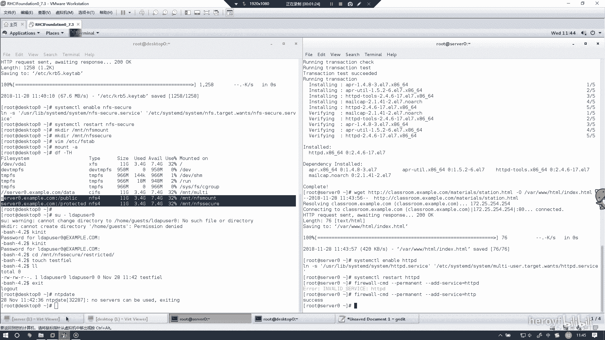
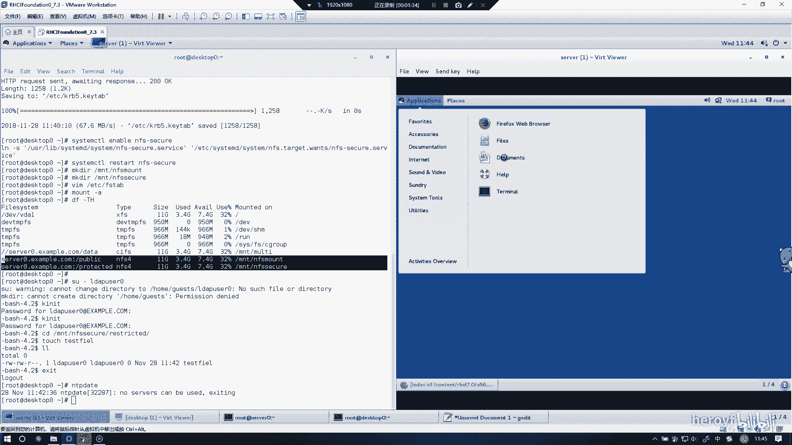
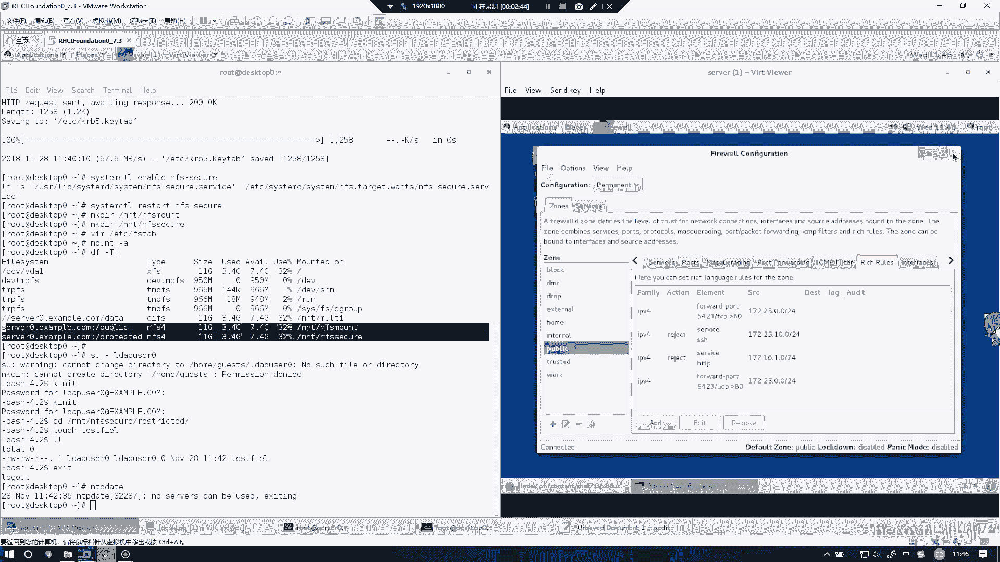
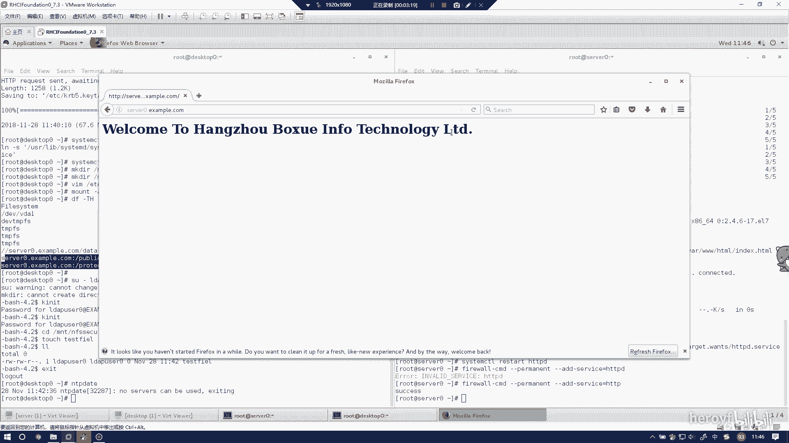

# RHCE(red hat7 考前讲解！最优做法解答，无坑) - P19：实现一个web服务器 - heroyf - BV1St411p7K8

然后的呃这个实验的话是实现一个外部服务器。外部服务器的话，我们首先要把HPPPD给装一下。社情和引诱人。HTTPD给装一下。嗯。嗯。う。把网页给把他要给你的网页给下一下。う。🤧嗯。然后一定要记住把它。

一と？他可。啊，开起来这个服务。这里的话其实装不装linkux无所谓，我建议是不用装linkux，你到时候直接在那个fireworks上面，就浏览器上面，直接看你这管有没有存在就行。然后的话别忘记把它。

因为你这个要对别人实实现抗防围的话，肯定是要把它加入防火墙的。这里的话防火墙的命令不是附贵则比较简单，所以我就直接在呃命令行当中配。然后其实的话也可以选择在你也可以选择在命令行当中配。

这样的话时间会快很多。然后这里的话牵扯到复规则的话，那我们就回到ce上。

把这个负规则加一下。复gate的话就不用去背了，背起来的话太繁琐，就直接在这个。

上来把这给。用图形画界面给他写好就行。然后老生常谈，改成permanent。然后他说的话是。example语可以访问，然后my133提点YIG是不能访问的。我这边改一下IPV4。

service这里选上HTDP。ok。然后的话是哎卡住了。Reject。这个域的话，我这边答案上写的是16。0，到时候的话，根据你们考试当中的。来写，我这里的话就用16点值做个例子而已。

就表示这个地址这个域的话是不能访问的。然后把它确定。然后呢这里OK，然后这里的话reload一下。呃，这个的话就防火墙其实就已经配好了。

嗯。然后的话我们可以选择通过呃firefox来看一下。呃，我把这边这个东西可以关掉了，没什么用。Sver。Example。后。你看这里的话其实是就可以访问了。

那么这个时间的话其实就做完了。