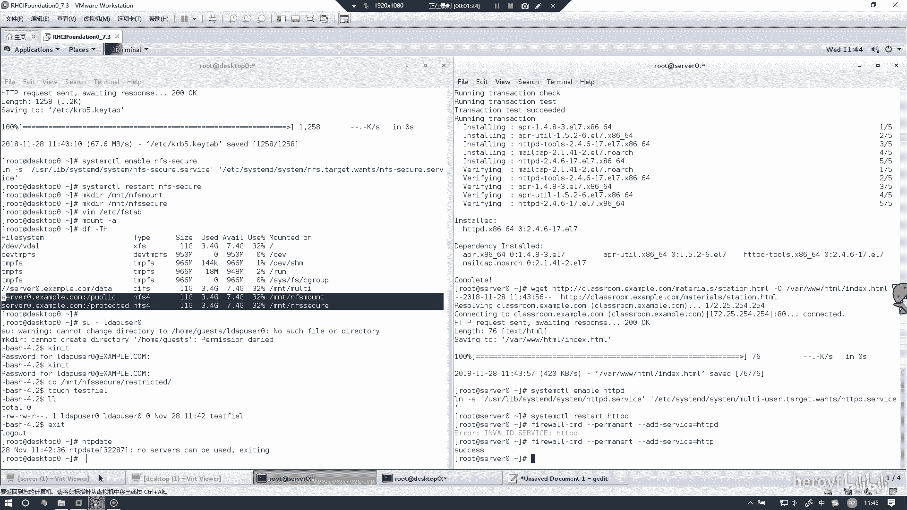
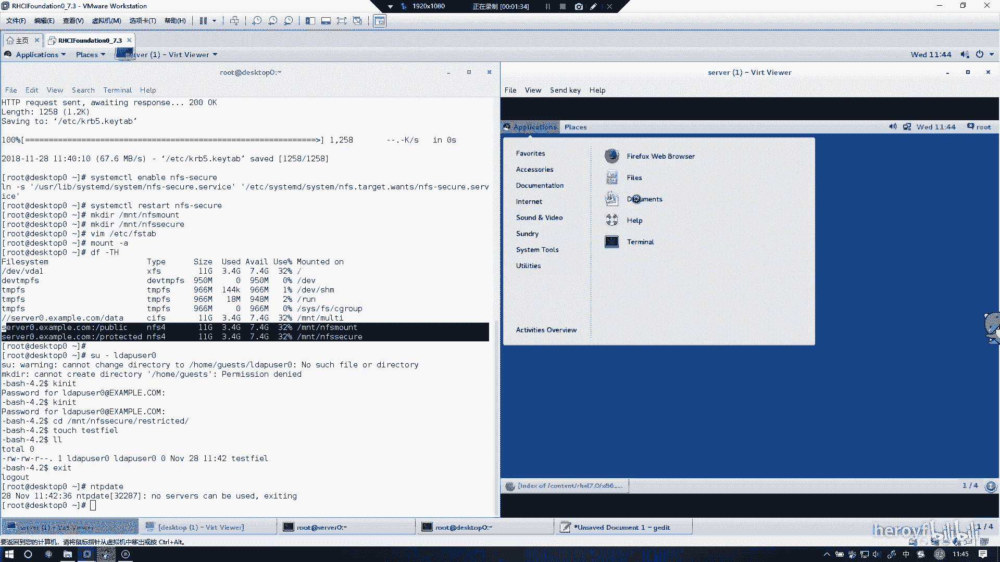
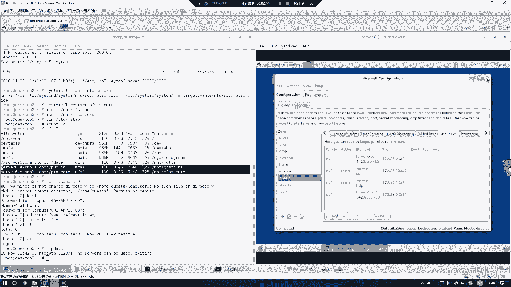
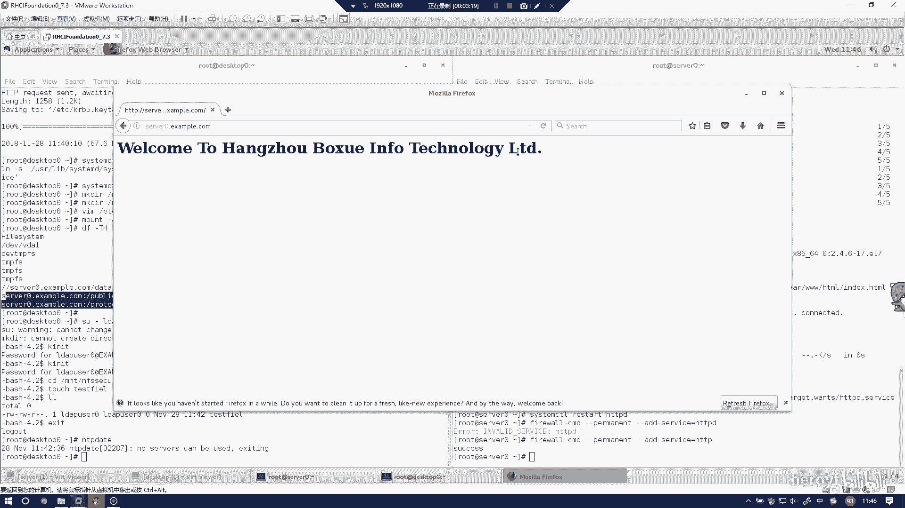

# RHCE 考前讲解：P19：实现一个 Web 服务器 🖥️

在本节课中，我们将学习如何在 Red Hat Enterprise Linux 7 系统上配置一个基础的 Web 服务器。我们将涵盖软件安装、服务管理、防火墙配置以及访问控制等核心步骤，确保您能掌握考试要求的最优做法。

## 概述

本节实验的目标是实现一个 Web 服务器。主要任务包括安装 HTTPD 软件包、启动服务、配置防火墙以允许外部访问，并设置特定的访问控制规则。

## 安装 HTTPD 软件包

首先，我们需要安装提供 Web 服务器功能的软件包。在 Red Hat 系统中，这个软件包是 `httpd`。

执行以下命令进行安装：
```bash
yum install httpd -y
```

## 部署网页内容

安装完成后，需要将提供的网页文件放置到 Web 服务器的默认目录中。通常，这个目录是 `/var/www/html/`。

您可以使用 `wget` 或 `curl` 命令下载指定的网页文件，或者直接复制准备好的文件到该目录。



## 启动并启用 HTTPD 服务

软件安装和内容部署完毕后，需要启动 Web 服务并设置为开机自动启动。



以下是相关命令：
```bash
systemctl start httpd
systemctl enable httpd
```

为了验证服务是否正常运行，您可以直接在浏览器中输入服务器的 IP 地址进行访问。另一种更快捷的方法是使用 `curl` 命令在本地测试。

## 配置防火墙

为了让外部用户能够访问您的 Web 服务器，必须在防火墙中开放 HTTP（端口 80）服务。

虽然可以通过命令行配置防火墙，但使用图形化工具 `firewall-config` 更为直观和高效，可以避免记忆复杂的 `firewall-cmd` 命令。

上一节我们启动了 Web 服务，本节中我们来看看如何配置防火墙以允许外部访问。

以下是配置步骤：
1.  打开防火墙图形化配置工具：`firewall-config`
2.  在“服务”选项卡中，找到并勾选 `http` 服务。
3.  将配置更改为“Permanent”（永久生效）。
4.  点击“应用”或“确定”保存更改。
5.  最后，在命令行中重新加载防火墙规则以使更改生效：
    ```bash
    firewall-cmd --reload
    ```

## 设置访问控制规则



实验要求可能包含特定的访问控制，例如允许来自某个网段（如 `172.25.0.0/24`）的访问，而拒绝另一个特定地址（如 `my133t.yig` 对应的 IP）的访问。

我们可以在防火墙的“区域”设置中，为“public”区域添加丰富的规则来实现。

以下是添加拒绝规则的示例：
1.  在 `firewall-config` 工具的“区域”界面，选择“public”。
2.  切换到“富规则”选项卡。
3.  点击“添加”按钮，新建一条规则。
4.  规则中，选择“协议”为 `ipv4`，“源地址”填写需要拒绝的 IP 地址或网段（例如 `192.168.16.0/24`，请根据实际考试要求填写）。
5.  将操作设置为“拒绝”。
6.  保存并应用配置，然后重新加载防火墙。

配置完成后，您可以通过浏览器或 `curl` 命令从不同来源测试访问，以验证防火墙规则是否按预期工作。



## 总结

本节课中我们一起学习了在 RHEL 7 上配置 Web 服务器的完整流程。我们首先安装了 `httpd` 软件包并部署了网页内容，然后启动了 HTTPD 服务。接着，我们使用 `firewall-config` 图形化工具配置了防火墙，开放了 HTTP 服务并设置了特定的访问控制富规则。这套方法步骤清晰，有效避免了常见错误，是应对相关考试要求的可靠做法。