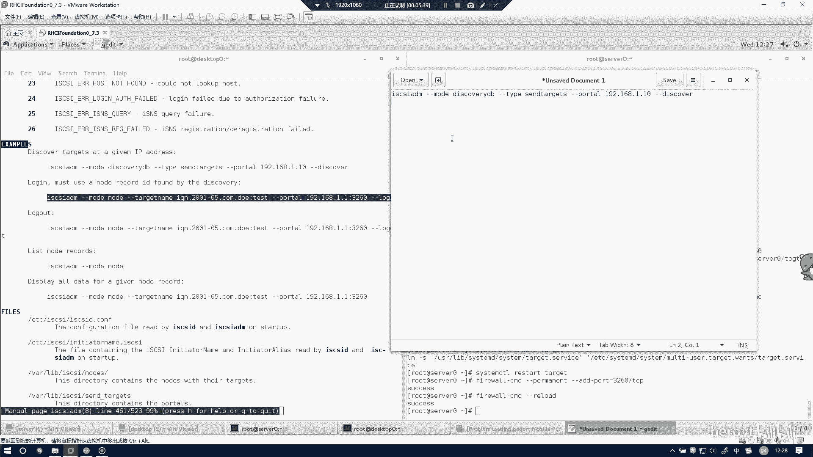

# RHCE(red hat7 考前讲解！最优做法解答，无坑) - P1：iscsi - heroyf - BV1St411p7K8

这题的话是创建Sca的服务端。首先装一下SS需要的一些组件。这一方我已经装过了，所以的话就没什么好用了。然后到时候的话嗯你可以通过FD杠L看一下你哪个盘，剩余的空间是比较大的。

然后你直接用这块盘就可以了。所以考试当中，你必须要通过FD杠L来看一下你哪块盘剩余的比较大，别一股脑就用VDB或者是VDA考试当中可能是SDBSDA也有可能。呃，我们把DB杠VDB。20嗯。

然后defa。这边是deputdeput，然后加上3100兆。就可以了。然后W保存一下PRPOB2DV。杠SDB。啊BDB。Apart probe。然后你再通过一下FD杠L。

你就看到这里有DVBDB这个牌就已经出来了。呃，然后的话其实。你看到答案上是一个创建PDVGLE的过程。呃，其实的话我我们当时。看了一下，其实是根本不需要有这个步骤的。

你可以把创建逻辑建设化步骤给省略掉。你可以直接做后面的步骤。可以省去很大一部分时间。因为罗艺军的话可能会有各种诡异的问题，然后。记住把这个。东西给复制下来。嗰别。处理下来之后。他其 c i。

然后我们通过。这地方就可以进行补全。Greatate。C3接与T。刚刚你刚刚你看到的我创建逻辑卷步骤，主要是在这里写着DEVYVGS data这块逻辑卷的盘。其实我们可以直接写成VDDE。

这样的话也是可以创建成功的，根本不需要创建逻辑性这一个步骤。然后的话也省去了很多时间。其实呃就主要是存在这个差异而已。看111点com这个的话考试当中会告诉你叫什么名字。然后这创建成功了。

IQN450TPG1nice。Create。Baxon S data。AQTBD photoss。Delete。IP这句话主要是这个步骤，主要是防冲突的。可能有些时候他0。0。0。0被占用。

如果没有被占用的话，这句话如果爆错的话，其实不用去管它。看这句话，如果他就是说我没有这个0。00，里面并没有一个占用，所以的话就根本不用去管他，你就直接可跳到下一步就行了。嗯。呃，port。

Greatate。172。25。0。11。这也是成功了，然后把端口加一下。嗯。呃，过滤规则。可以，然后这个就需要用到刚刚复制的东西。这里一定要全部复制上去，不然的话你后面是登录不成功的。

然后这里的话exist就可以了。然后我们需要把这个加入开机启动。呃，然后同时也要把它开把这个服务器起来。然后呢，别忘记在防火墙当中要把这个端口给加进去。等于3260到。PCP。

然后的话呃Sca服务端其这边就做完了。然后下面的话我会做Sca的客户端。客户端的话主要就是需要在destop上进行操作。嗯。这边的话帮助手册主要是怕你记不住，你可以看一下。但是当时的话其实都是记住的。

所以的话。

就没什么关系。

搜索example，然后这边的话应该会有东西出来。Yes and。

得找一下。

嗯，对，就在这边。

主要是用的这两句话，到时候考试的话还是建议。把它给复制下来，然后放到文本上，然后进行更改。但是的话我比较建议你把它背下来。嗯。😊。

搞个记事本，然后把它复制下来。然后还有一个就是登录的指。

复制下来，然后这个的话其实就可以没有用处。然后的话你把这个地方给复置好。这里paste，然后需要更改的是哪些地方？需要更改，就是这里的。IP地址172。25。0。11。对吧discover一下，看一下。

这边已经发现了。啊，然后刚刚还有个好像有个login。保不是错。没事，我这已经收到了。Noだ。嗯。Yeah。你也是。111。点com点我在。So mean。刚刚port头。172。25。

00113260。上告老兵。如果你刚刚那个ACL规则那个地方，也就是。诶。这个地方没有全部复制上去的话，这边肯定是登录不上去的。你看现在我这边login to。

你一定要看下这里是不是successful，success就代表是登录成功了。然后你di杠L看一下它是弄在哪个盘。就是这个盘，刚刚我分的是3100兆，可能会有点原数据。所以他这边是3250兆。

我就用这个盘子。Fdi杠A，然后这边是。全部都是默认。默认默认。然后这边的话是要加上1900张。嗯。啊，这句话写错了。默认默认默认这是加上1900兆。然后W配保存一下，然后这一的话把它格式化。MKSS。

喂，你好，点叉FS到时候看他考试当中要求你格式化什么格式，可能要求你格式化是E叉T4。这个就根据你考试当中的具体题目来看。这边就已经格说画好了。提到这一些。然后。有边。At best time。唉。

这个话是D1SDAE。不能提广接ATTA，然后叉FSFAU。LT S。netEV。你你。然后我们摩他杠A一下。哦，好像有地方写错了。DFAU你看这个地方都没有变色。所以的话可能就这地方解错。

然后我们就说这里麻上转你意下啊。哦，等A，然后这次的话应该就是没有问题的。你看这个盘也就成功挂载好了。然后这里的话S其实就已经全部做完了。到时候如果有问题，你就按照我这步骤一一步步来看你那个地方打错了。

