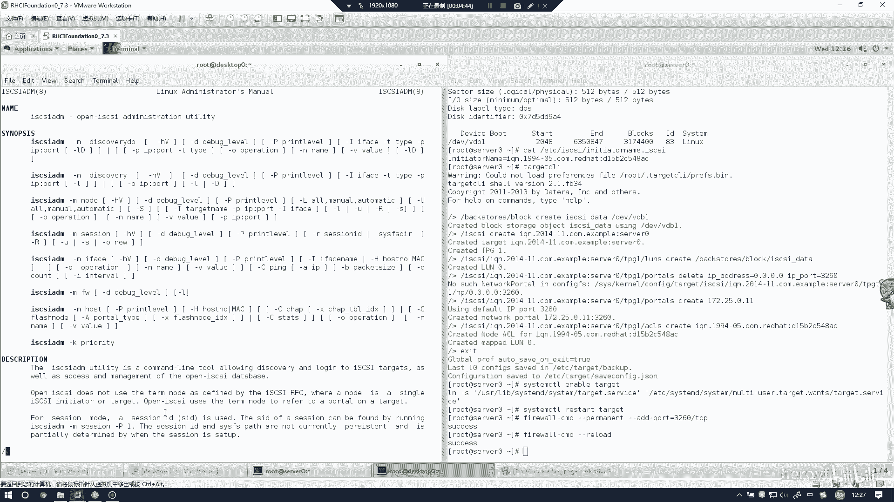
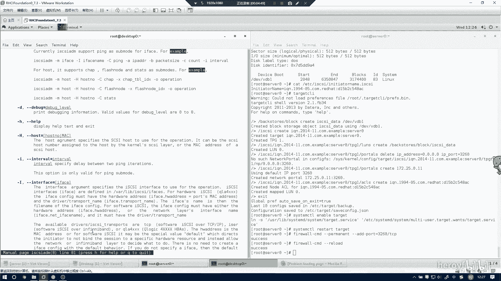
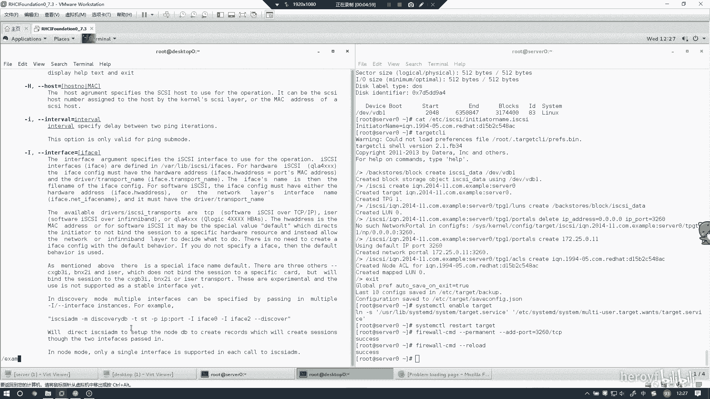
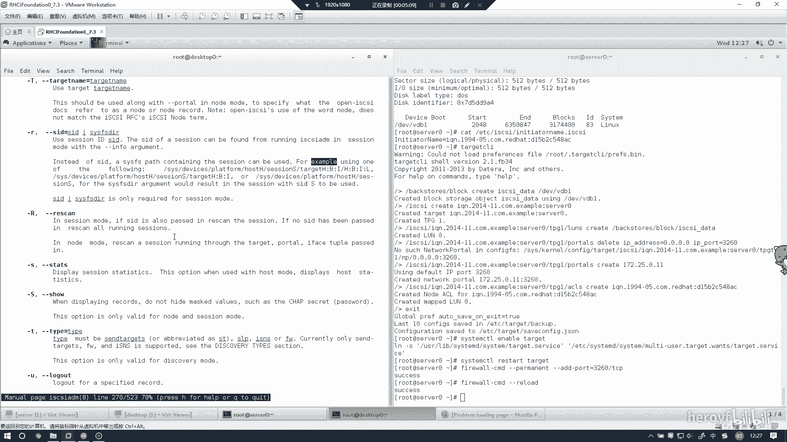
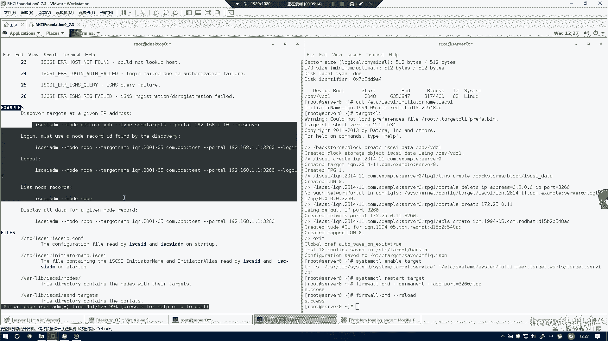
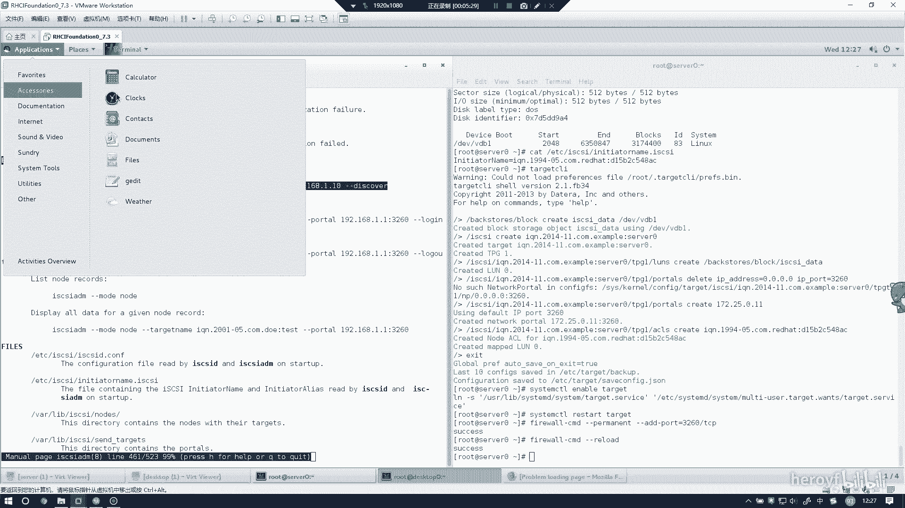
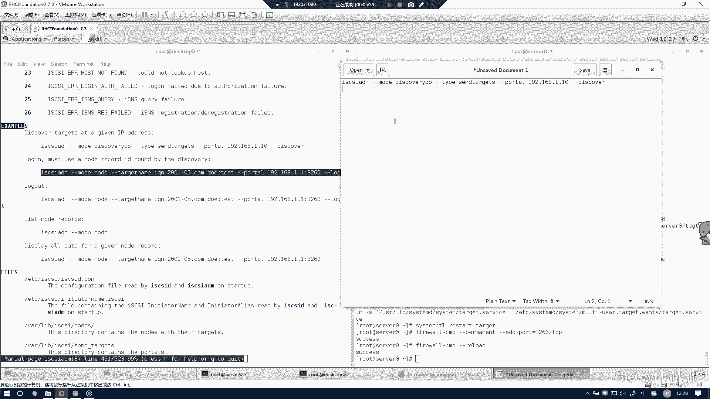
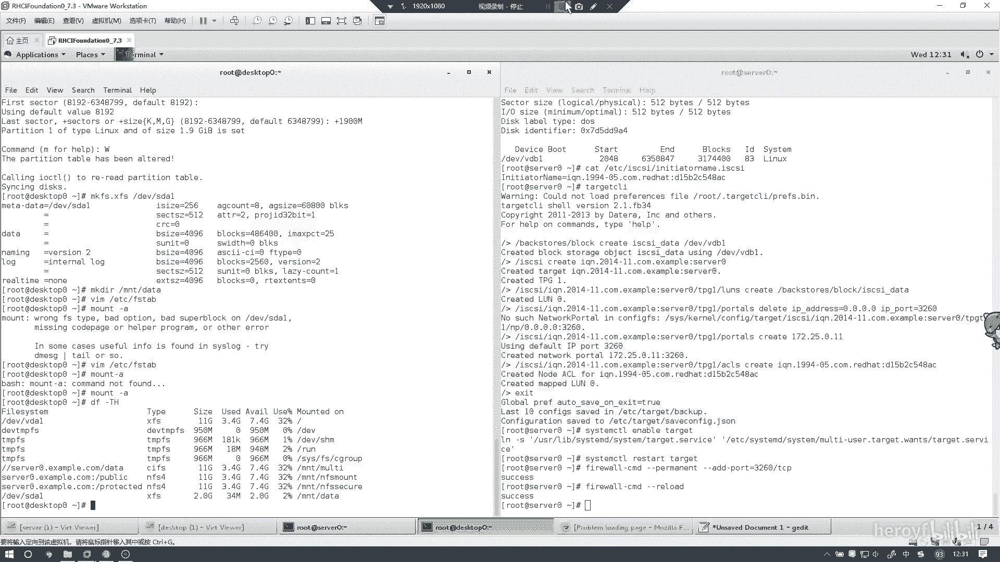

# RHCE 考前讲解：P1：iSCSI 服务配置教程 🚀

在本教程中，我们将学习如何在 Red Hat 7 环境下配置 iSCSI 服务。内容涵盖服务端与客户端的完整设置流程，包括磁盘准备、服务配置、防火墙规则以及客户端挂载。我们将采用最优化的步骤，避开常见陷阱，确保配置过程高效、准确。

---

## 服务端配置

上一节我们介绍了本教程的目标，本节中我们来看看如何配置 iSCSI 服务端。

首先，安装 iSCSI 服务端所需的软件包。如果已经安装过，可以跳过此步。

```bash
yum install -y targetcli
```

安装完成后，需要准备后端存储设备。使用 `fdisk -l` 命令查看系统中可用的磁盘及其剩余空间。

```bash
fdisk -l
```

根据输出，选择一块剩余空间较大的磁盘（例如 `/dev/vdb`）。考试环境中磁盘名称可能不同（如 `/dev/sdb`），请根据实际情况选择。

以下是为选定磁盘创建分区并格式化的步骤：

```bash
fdisk /dev/vdb
# 在 fdisk 交互界面中，依次输入：n -> p -> 1 -> 回车 -> +3100M -> w
partprobe /dev/vdb
```

再次使用 `fdisk -l` 命令，确认新分区 `/dev/vdb1` 已创建成功。

接下来配置 iSCSI 目标。根据官方解答，通常需要创建 LVM 逻辑卷作为后端。但经过验证，此步骤可以省略以节省时间并避免潜在问题。我们可以直接使用刚创建的分区。

启动 `targetcli` 交互式配置工具：

```bash
targetcli
```

在 `targetcli` 提示符下，执行以下命令创建 iSCSI 目标。请注意，`iqn.2014-11.com.example` 中的 `example` 需替换为考试中指定的名称。

```bash
/> /backstores/block create name=iscsi_disk dev=/dev/vdb1
/> /iscsi create iqn.2014-11.com.example:server
/> /iscsi/iqn.2014-11.com.example:server/tpg1/acls create iqn.2014-11.com.example:desktop
/> /iscsi/iqn.2014-11.com.example:server/tpg1/luns create /backstores/block/iscsi_disk
```

设置监听地址和端口。以下命令中的 IP 地址 `172.25.0.11` 需替换为服务端的实际 IP。

```bash
/> /iscsi/iqn.2014-11.com.example:server/tpg1/portals create 172.25.0.11 3260
```

为防止端口冲突，可以删除默认的 `0.0.0.0` 监听（如果存在且未被占用，此步报错可忽略）。

```bash
/> /iscsi/iqn.2014-11.com.example:server/tpg1/portals delete ip_address=0.0.0.0 ip_port=3260
```

配置完成后，输入 `exit` 保存并退出 `targetcli`。

以下是配置防火墙规则的步骤，以允许 iSCSI 流量：

```bash
firewall-cmd --permanent --add-port=3260/tcp
firewall-cmd --reload
```

最后，启动 iSCSI 目标服务并设置为开机自启：

```bash
systemctl enable target
systemctl start target
```



至此，iSCSI 服务端配置完成。



---

## 客户端配置



上一节我们完成了服务端的配置，本节中我们来看看如何在客户端（Desktop）上连接并使用 iSCSI 存储。



首先，在客户端安装必要的软件包。



```bash
yum install -y iscsi-initiator-utils
```

需要修改客户端的启动器名称，使其与服务端 ACL 规则中定义的名称匹配。编辑配置文件 `/etc/iscsi/initiatorname.iscsi`。

```bash
# 将文件内容修改为以下内容，与服务端ACL规则一致
InitiatorName=iqn.2014-11.com.example:desktop
```



以下是发现并登录 iSCSI 目标的步骤。建议将以下命令保存到文本文件中以便修改和检查。

```bash
# 发现目标，将 172.25.0.11 替换为服务端IP
iscsiadm -m discovery -t st -p 172.25.0.11



# 登录到发现的目标
iscsiadm -m node -T iqn.2014-11.com.example:server -p 172.25.0.11:3260 -l
```

执行登录命令后，请确认输出中包含 `successful` 字样，这表示登录成功。

登录成功后，使用 `fdisk -l` 命令查看新发现的 iSCSI 磁盘（通常为 `/dev/sda` 或类似名称）。

```bash
fdisk -l
```

接下来，对新磁盘进行分区和格式化。假设磁盘为 `/dev/sda`。

```bash
fdisk /dev/sda
# 在 fdisk 交互界面中，创建新分区：n -> p -> 1 -> 回车 -> +1900M -> w
```

根据考试要求格式化分区。例如，格式化为 `ext4` 文件系统：

```bash
mkfs.ext4 /dev/sda1
```

创建挂载点并挂载分区：

```bash
mkdir /mnt/iscsi_data
mount /dev/sda1 /mnt/iscsi_data
```

为确保开机自动挂载，需要将挂载信息写入 `/etc/fstab` 文件。请使用磁盘的 UUID 或设备路径。

```bash
# 获取分区UUID
blkid /dev/sda1

# 编辑 /etc/fstab，添加如下行（请替换实际的UUID）
UUID=你的分区UUID /mnt/iscsi_data ext4 _netdev 0 0
```

最后，使用 `mount -a` 测试 `fstab` 配置是否正确，并使用 `df -h` 确认挂载成功。

```bash
mount -a
df -h
```

---

## 总结

本节课中我们一起学习了在 Red Hat Enterprise Linux 7 上配置 iSCSI 服务的完整流程。



*   **服务端**：我们完成了软件安装、磁盘准备、使用 `targetcli` 创建 iSCSI 目标、配置 ACL 访问控制、设置监听端口以及配置防火墙和服务的自启动。
*   **客户端**：我们完成了启动器名称配置、发现 iSCSI 目标、登录目标、对远程磁盘进行分区、格式化文件系统以及配置开机自动挂载。

关键优化点在于**服务端可以直接使用物理分区作为后端存储，省略了创建 LVM 逻辑卷的步骤**，这能有效节省时间并避免复杂问题。请务必注意，配置中的 IP 地址、IQN 名称和文件系统类型需根据考试题目要求进行替换。如果在配置过程中遇到问题，请按照本教程的步骤逐一核对命令和配置。