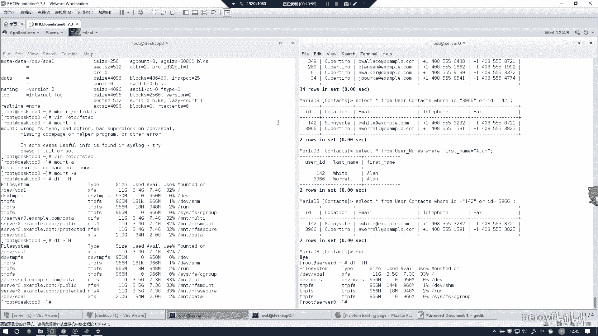

# RHCE(red hat7 考前讲解！最优做法解答，无坑) - P20：数据库 - heroyf - BV1St411p7K8

这个实验的话是呃创建建立配置一个数据库。先把该装的装一下。MARAADB。DATADASE。但是呀你啊。然后还有1个MA。ADBDATABSE。Pt。🤧大家中好。然就装好，然后把这个服务开机启动。

Veryial D。呃。MA啊。把它起去提起来。🤧嗯。然后的话我记得这边的话，它的数据库是下载不下来的。呃，那么的那么我就把数据库，因为我本地的话只有一个下载好的数据库。我把它放到桌面了。

那你什么时候去澳工啊？对吗先找一下。去南方。USDM。

然后我这边布置到桌面来。Yeah。嗯，就是这个。然后的话我需要通过插线。🎼Yeah。然后连接到我的这台上面去，还能个连到。Of the red hat。嗯，这边的话如果你连不上去的话。

你先看一下你的网卡设置有没有把这个加进去。更改适配机项目，然后一般是使用的是vi代98。然后你看一下它的属性。然后这也是IP4。啊，这个不是。应该是要么就是这个，你看一下是vinet哪个会哪一块网卡。

172，你看一定要使用下面的IP地址，因为你里面使用的IP地址的话是172。25的网段，那么你就需要在其中一块网卡下面加上这个网段的地址，那么你才能通过从。

本金上。访问到，不过到时候的话也是没有这些问题的。到时候的话因为。你这这个考试环境上面有些这个问题，到时候考试的话，你就直接通过Wget下载产品就行。🎼然后我这边通过的话，RZ。把这个东西给上量上去。

呃，只是为了做实验而已考试当中的话是绝对不会出现这种问题的。U在点MDB。有的。就这个。然后我们现在再回到这台机子上。嗯，最后又发现这个文件就已经传上来了。然后我们通过。考试当中的话是就直接下载就行了。

不用像我们这么复杂。因为考试当中的话，它的这个机子就是就装的就是lininux的系统。然后我们这边安装的时候就一路回收。没有没有任何要求，就一路回车。嗯。密码的话好像是要写的。我这里忘记写了。写一下。

然后其他就是回车。然后这这边其实就已经弄好了。然后我们马思索杠BFLECPIAG然后发现是可以登进来的。我络创建用户。这个的话，到时候考试当中的话是都有的。IDNTFIEDY这个后面的话就是它的密码。

然后给他加上权限。新点信息代表就是所有。UI。GI艾特。Local hostel。有家的封号。然后创建一个表。嗯。C人。万TACTS。判定好了之后，然后我们退出。然后my circle杠P。因为。

我想听CTS。一段时间。点点嗯。Useers点MDB。是不是要在不对路径？Or users。杠P小写的P大写就是端口的意思。DCTIG。不样的话，这边就已经导进去了，然后别忘记把这个加入到防火墙里面。

等于埋s。然后reload一下。然后这里的话，数据库其实就己导进去了。然后最后的话其实是。呃，再会会给你讲到题目。然后你需要进入到数据库里面。然后use一定要用到这个数据库。Use context。

然后他说查询密码是for soup的人的名字，我们可以先看一下这个里面有哪些表。Show tables看到是这些表格制照。嗯，我看一下现在这个行不行啊。

有就是选择user password from table name的话，应该是在。Use。那个你打时。Loins。我也就代表开庭条件了。等于。FORSO。稍微辛疼。然后这个的话你看一下能不能选择。诶。

我也看一下。等一下。你如果看表的结构呢，可以通过。看这个样子，然后看到它的表的结构，或user loguser pass可能是这个名字。通过DESC加上里面的table名字就可以了。USE。AS12。

我知。US1样。我觉得我要等。PS。我不来，我不想去签。PSS。嗯，这里也要改。这他没有。USER。PA S。啊，看到没？就找到了，这就是他密码，这就是他用户名，所以他的用户名就是KKwins。这个。

然后接下来是有多少人的姓名是allan，同时居住在什么这个城市。然后这个的话我们。同时还是要看一下s tables。看一下可能是出现在哪个表里面，你觉得可能是出现在这个表里面。

然后我们看一下这个的表结构。US一啊。CONT。ONTACTS。看到没？这里有个I locatione telephoneele facts。What。然后是不是还有个user name。

然后我们看一下。こかす。这个表里面是什么东西？Use the names。然后这里面的话是。用户的姓名，这些都是。呃，我们需要这里的话，就需要进行多表查询。姓你是了。我先试验一下，不保证能查出来。我。

し？from。Useer。Names。Where。呃，last name等于。等于。诶呀诶。没有，那可能是在first name。firsst team话是有的。呃，他这里的ID的话是142和3966。

email。😔，你再看一下selection from。USER。小伟。呃TTS。呃，Where啊。你可以看下住处嘛，对不对？C加ON等于。呃，CUPRTIN。有这么多。

你可以看一下142和3966有没有这个ID。听到未？他这ID是绝对不会建的。然后的话如果你觉得他表有些多的话，你可以这样他。Select。In from user。笑。Y TACTS。Where。

ID等于。呃，3966。哦，系啲地。142。看到没？然后你看一下他的location。只有这个是符合上面的，说明只有一个人追在上面。这样就可以了。那么总结下来。呃，如何查呢？密码来查的话。

就按照我前面那样的查，因为那是代表查询比较简单。多表查呃，下面一道题可能会牵涉到多表查询。那么首先需要去到username这个表下呃。

看呃他的姓还是名姓的话应该是first name名的话应该是last name。去年我们考试就有这个坑，然后我就错在这个上面了。他如果他说信是A了 name的话，也就是。

Selection from user。Names， where。First。那等于。ALAN。en，这个地方不能有一点打通。你就能找到。他的姓是alen的人，然后名的话，这里只要改成名的话。

这里只要改成last name就可以了。然后你会看到他的有个user IDD142和3966，那么你可以通过这个IDselect姓 from。是是。Context。啊。Where。ID等于。

你可以把这两个ID给加进去142或者。ID等于。3966。对对，然后你就可以查到这2个ID他们住在什么地方，一个是在这这个什么三里。外外是个地方，一个是在。就住在我们答案中这个地方，那么你就可以知道呃。

只有一个姓名是艾的人居住在这个地方。那么答案就是一。然后的话数据是数据库制道题的话。就相当于是完成了。然后的话关不关机呢，可以根据考试当中。呃，考官有没有让你关机？如果说考完你做完之后要关机。

那你就关机。如果考完之你做完之后不要关机，那你就不要关机。推荐是在呃。最后交卷之前重启一遍电脑看看。看看。比如说这个主要是在destop上挂在，看看这里该挂在有没有挂在上，一个是s0的，这个是NFS的。

还有一个就是SSE的。主要就是四个挂载盘，一定要看到这个四个出现在上面，就代表没有问题了。然后的话基本上讲解就这么多。然后的话我考这个当中也没有出现任何问题。

然后按照这个敲的话，基本上就是没有任何问题的。