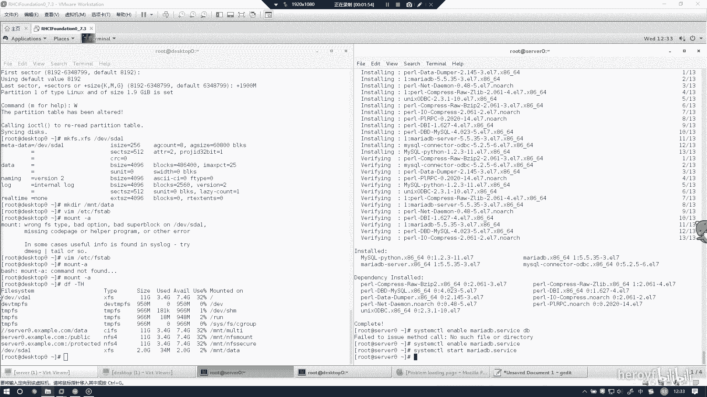
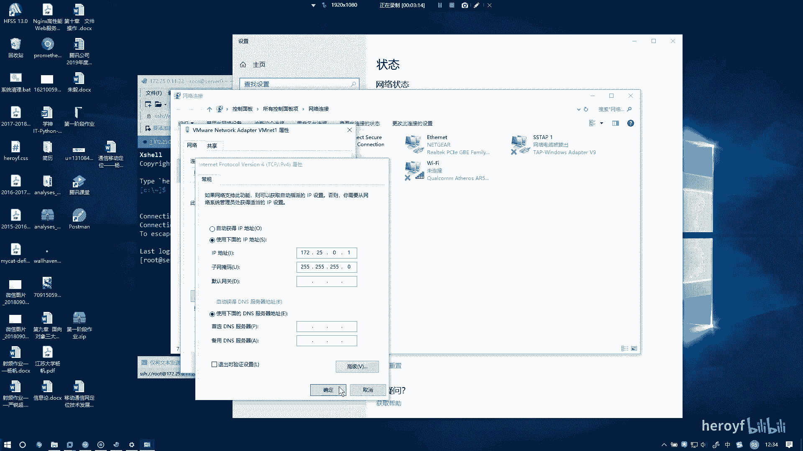
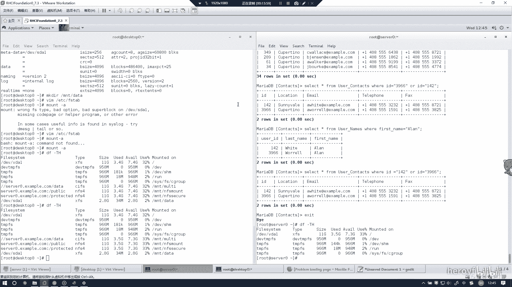

# RHCE考前讲解：P20：数据库配置与管理 📊

在本节课中，我们将学习如何在Red Hat Enterprise Linux 7系统上安装、配置MariaDB数据库，并完成基本的数据库操作，包括用户创建、权限分配、数据导入以及执行查询。这是RHCE考试中的一个重要实验环节。



---

## 第一步：安装与启动服务 🔧

首先，我们需要安装必要的数据库软件包并启动服务。



1.  安装MariaDB服务器和客户端软件包。
    ```bash
    yum install -y mariadb mariadb-server
    ```
2.  安装完成后，启动MariaDB服务并设置为开机自启。
    ```bash
    systemctl start mariadb
    systemctl enable mariadb
    ```

> **注意**：在真实的考试环境中，通常可以直接通过`yum`命令在线安装。如果遇到网络问题，可能需要根据考场环境调整，例如使用本地软件包。

---

## 第二步：初始化数据库与安全设置 🔐

上一节我们启动了数据库服务，本节中我们来进行初始的安全配置并创建数据库。

1.  运行安全安装脚本，根据提示设置root密码（考试中请使用指定密码）。
    ```bash
    mysql_secure_installation
    ```
2.  使用root用户登录MariaDB。
    ```bash
    mysql -u root -p
    ```
3.  创建一个新的数据库，例如`contacts`。
    ```sql
    CREATE DATABASE contacts;
    ```

---

## 第三步：管理用户与权限 👤

数据库创建好后，我们需要创建用户并授予其访问权限。

以下是创建用户并授权的步骤：
*   创建一个新用户（例如 `user`）并设置密码。
    ```sql
    CREATE USER 'user'@'localhost' IDENTIFIED BY 'password';
    ```
*   授予该用户对`contacts`数据库的所有权限。
    ```sql
    GRANT ALL ON contacts.* TO 'user'@'localhost';
    ```
*   刷新权限使设置生效。
    ```sql
    FLUSH PRIVILEGES;
    ```

---

## 第四步：数据导入与操作 📥

现在，我们将外部数据导入到已创建的数据库中。

1.  退出MariaDB，回到命令行。假设有一个名为`users.mdb`的数据文件（考试中可能提供下载链接或本地文件）。
2.  使用`mysql`命令将数据导入到`contacts`数据库。
    ```bash
    mysql -u user -p contacts < /path/to/users.mdb
    ```
3.  配置防火墙，允许数据库服务（默认端口3306）的访问。
    ```bash
    firewall-cmd --permanent --add-service=mysql
    firewall-cmd --reload
    ```

---

## 第五步：执行数据库查询 🔍

数据导入后，我们需要根据题目要求执行查询。本节我们来看看如何进行单表和多表查询。

1.  **登录数据库并选择`contacts`库**。
    ```bash
    mysql -u user -p
    USE contacts;
    ```

2.  **单表查询示例**：查询密码为`forsoup`的用户名。
    首先，查看表结构以确定字段名。
    ```sql
    SHOW TABLES;
    DESC user_logins; -- 假设密码字段在user_logins表
    ```
    然后执行查询。
    ```sql
    SELECT user_name FROM user_logins WHERE password = 'forsoup';
    ```
    查询结果即为用户名。

3.  **多表关联查询示例**：查询名为`Alan`且居住在特定城市的人数。
    首先，在`user_names`表中查找名为`Alan`的用户ID。
    ```sql
    SELECT id FROM user_names WHERE first_name = 'Alan'; -- 或 last_name，需根据题意判断
    ```
    假设查到的ID为`142`和`3966`。接着，在`user_contacts`表中查询这些ID对应的居住城市。
    ```sql
    SELECT location FROM user_contacts WHERE id IN (142, 3966);
    ```
    最后，统计居住在目标城市（例如`Cupertino`）的记录数量，即可得到答案。

---

## 总结与考试提示 ✅

本节课中我们一起学习了RHCE考试中数据库部分的核心操作。总结关键步骤如下：
1.  **安装与启动**：安装`mariadb`和`mariadb-server`，启动并启用服务。
2.  **初始化**：运行安全脚本，创建考试要求的数据库。
3.  **用户权限**：创建指定用户并授予其对数据库的完全权限。
4.  **数据导入**：将提供的数据库文件导入到系统中。
5.  **执行查询**：根据题目要求，使用正确的SQL语句进行单表或多表查询以获取答案。



**考试提示**：
*   操作前请仔细阅读题目要求，确认数据库名、用户名、密码等信息。
*   查询时务必注意字段名是`first_name`还是`last_name`，这是常见的易错点。
*   完成后，根据考官指示决定是否重启系统。在最终交卷前，建议检查所有要求的挂载点（如`/home`, `/var/www/html`等）是否正常。
*   按照上述标准化流程操作，可以有效避免错误，顺利完成考试。