# RHCE(red hat7 考前讲解！最优做法解答，无坑) - P21：自定义用户环境 - heroyf - BV1St411p7K8

这道题的话是配置SS去访问。HSS区的访问的话，它主要是配置防火墙。然后这里的话你可以选择图从图形界面呃配置，也可以选择呃从呃命令行配置。那我演示一遍，如何从图形界面配置。然后的话命令行的话。

你就直接按照上面呃敲的话是没有问题的。我推荐是使用图形画来配置。

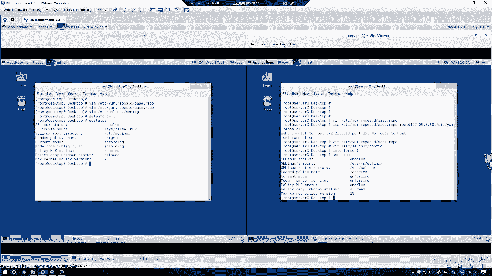

嗯。呃，让我找一下他在什么地方。

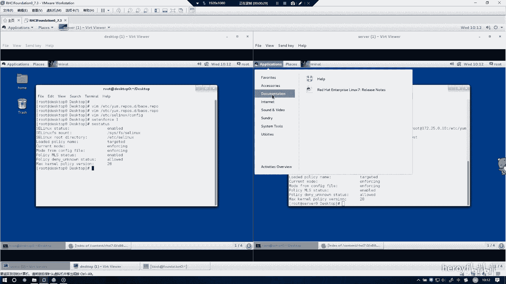

啊，在这里。

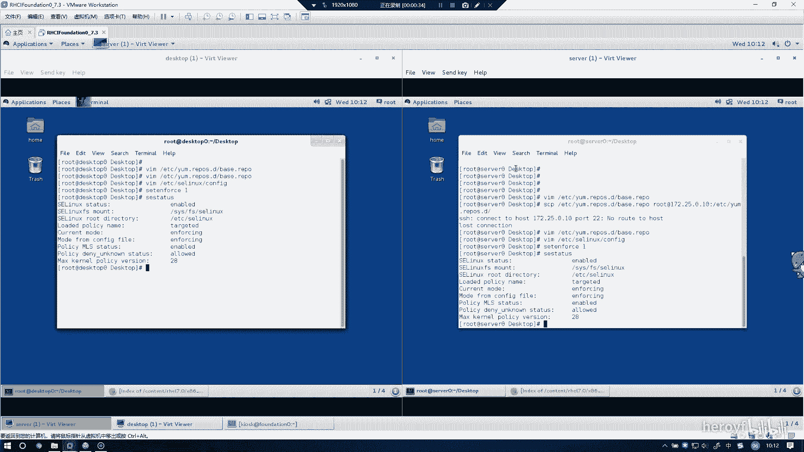

嗯。记住配配置防火墙的话，一定一定。要把这里的 configurationration改成 permanent。不然的话肯定会出错。这里找到SSH。然后把它勾选上。

然后同时的话他要求呃预卖133T点OYG的客户端是不能访问的那我们就添加副规则。

😀嗯。APP4。然后这里的话是选择SSH。嗯，在这里。选择。然后这里的话行为要选择reject。然后的话它整它的来源是12。25点。10。0。到时候考试的话，这个IP地址会。

会明确告诉你是那个域的IP段是哪个的，然后我这个IP段可能会不对，然后就先这样子来敲。🤧嗯。只要source就可以，他没说要发往哪个地方呢，是禁止的，所以只要这里填sourcece就行，然后点OK。

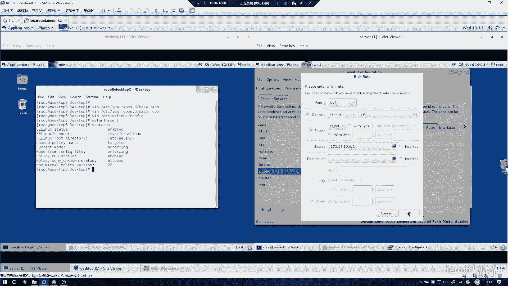

然后呢这样子的话，它的副贵则就配置好了。然后这里的话其实就可以关掉了。

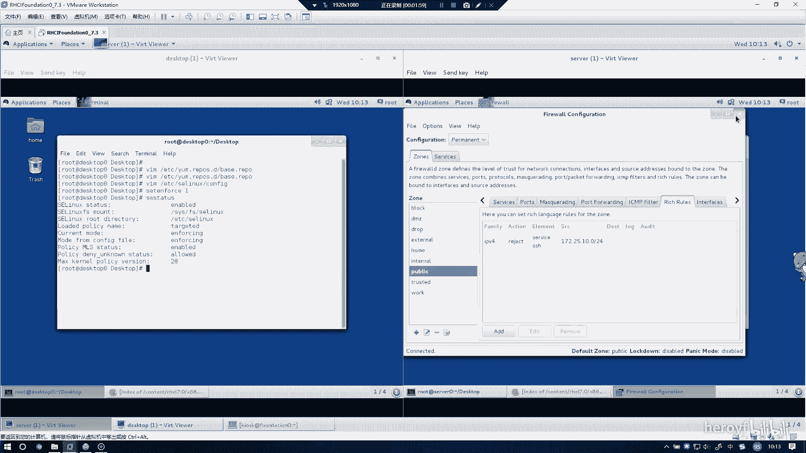

然后你要是不放心。可以。

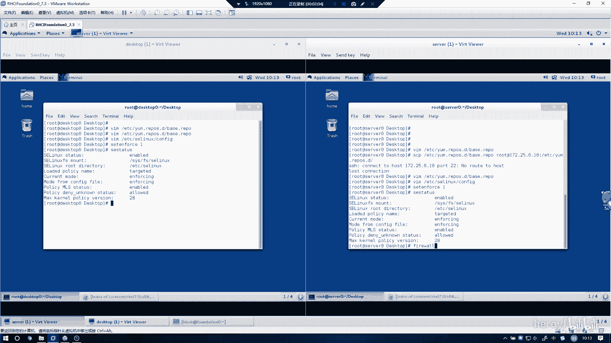

刚刚reload的一下。然后在 desktopexstop上也进行同样的操作。

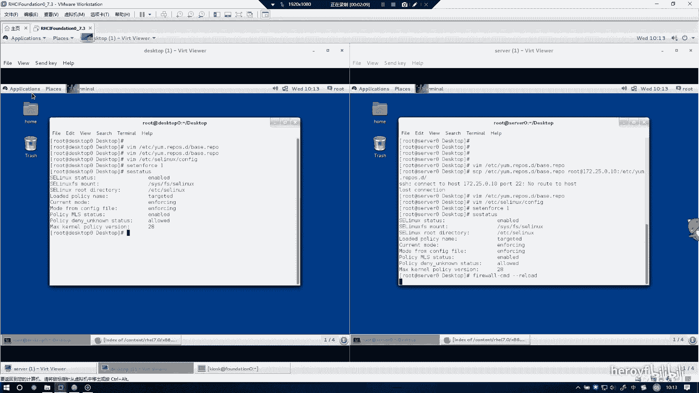

They very hardwork。

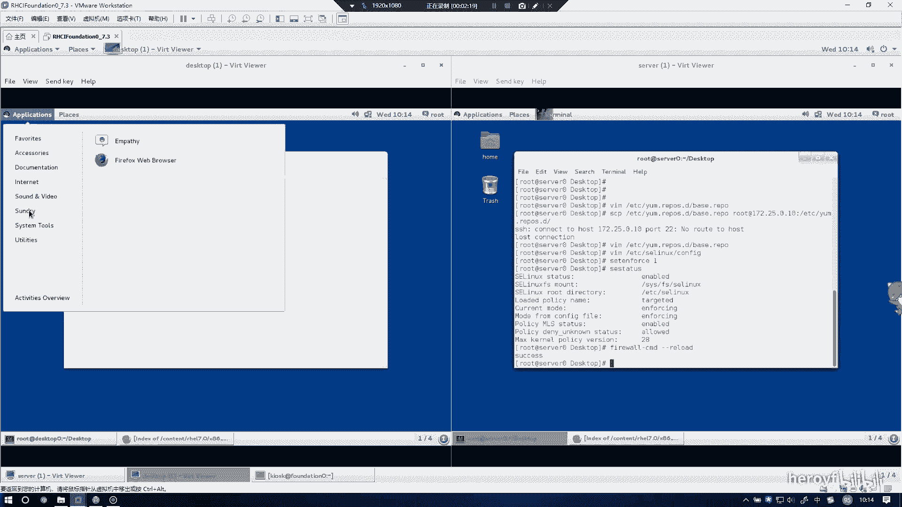

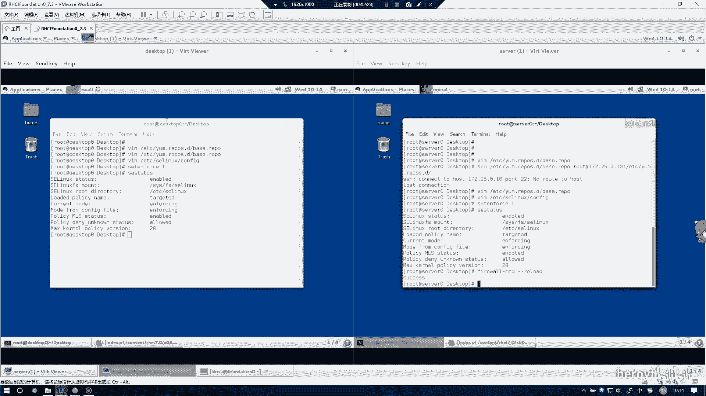

🤧。同样需要的注意的是，一定要把这己的run town改成promanent。然后这一找到SSH去。不规则。

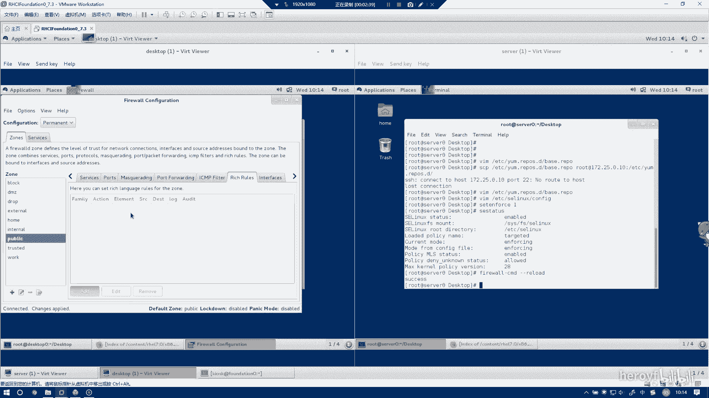

选择IV4。service是不对的，呃，不是不动的。然后这里选择SSH。住住。圆的话依旧是那个圆12。25。10。杠24。

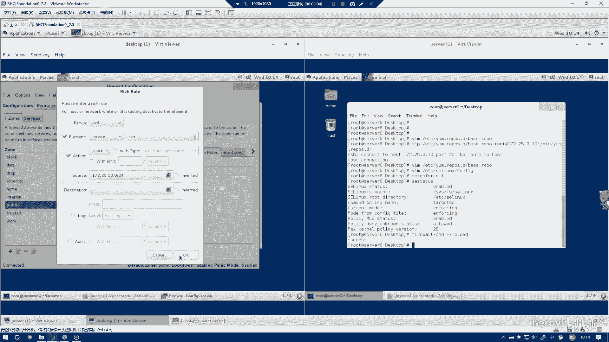

我觉得okK。然后这里的话客户端上也就配置好了。这样就行了。

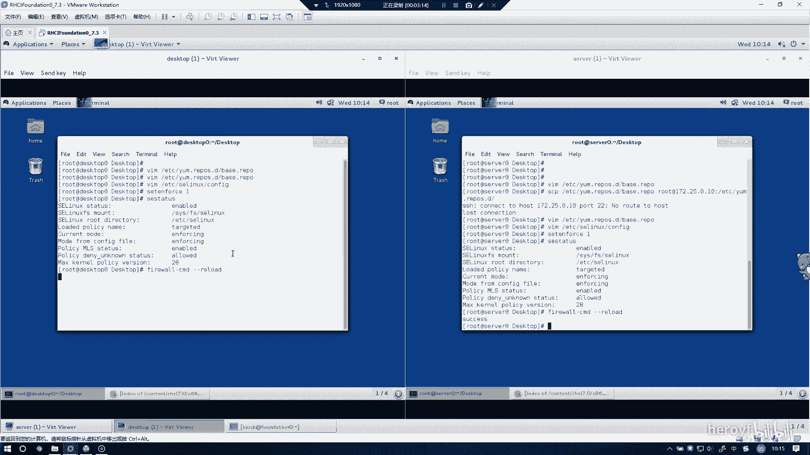

那这道题的话就配置完了。