RHCE 考前讲解：P21：配置 SSH 访问的防火墙规则 🔥

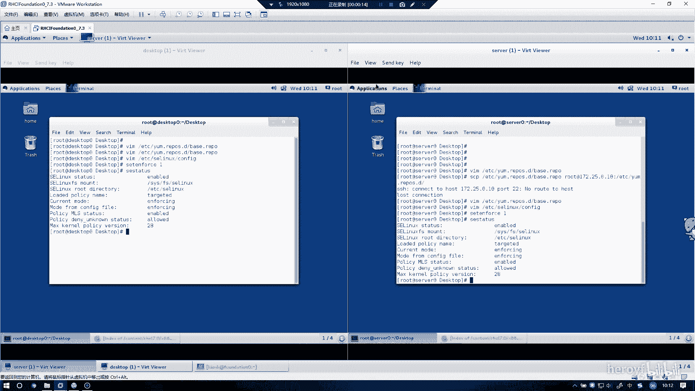

在本节课中，我们将学习如何为 SSH 服务配置防火墙规则，包括允许 SSH 访问和设置特定的拒绝规则。我们将通过图形化界面和命令行两种方式进行操作，确保配置持久有效。

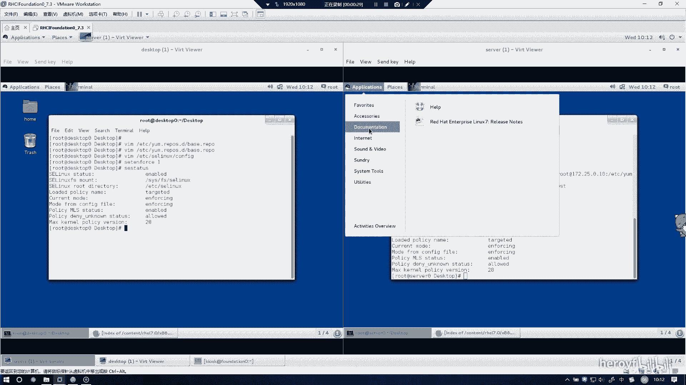

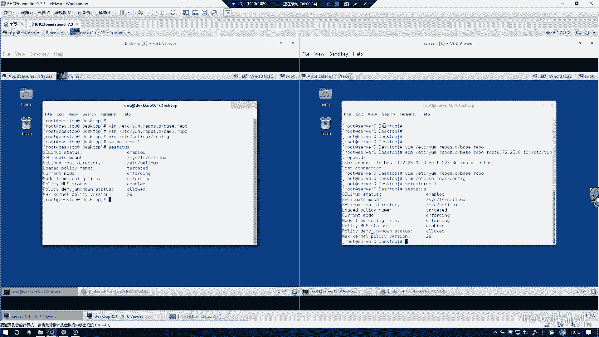

---

上一节我们介绍了防火墙的基本概念，本节中我们来看看如何为 SSH 服务配置具体的访问规则。

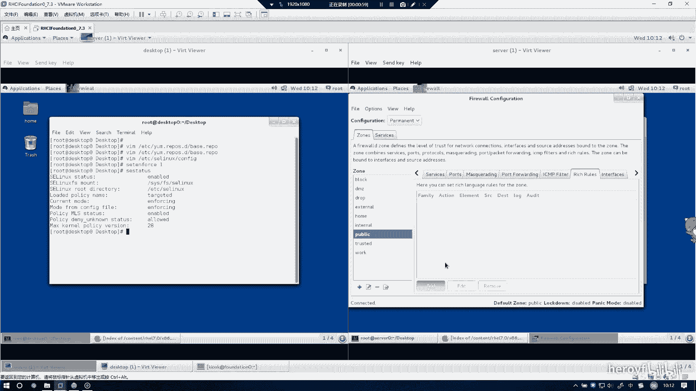

配置防火墙时，必须将配置模式设置为 **永久（permanent）**，否则重启后规则会丢失。在图形化界面中，找到防火墙配置区域，将运行模式切换为永久模式。

以下是配置允许 SSH 访问的步骤：
1.  在防火墙配置界面中，找到 SSH 服务选项。
2.  勾选 SSH 服务，以允许其通过防火墙。

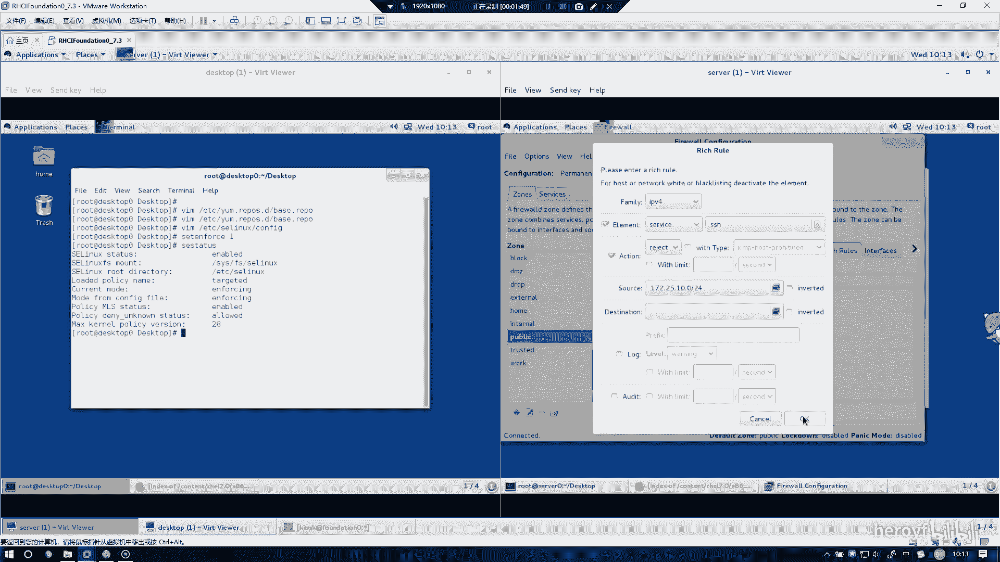

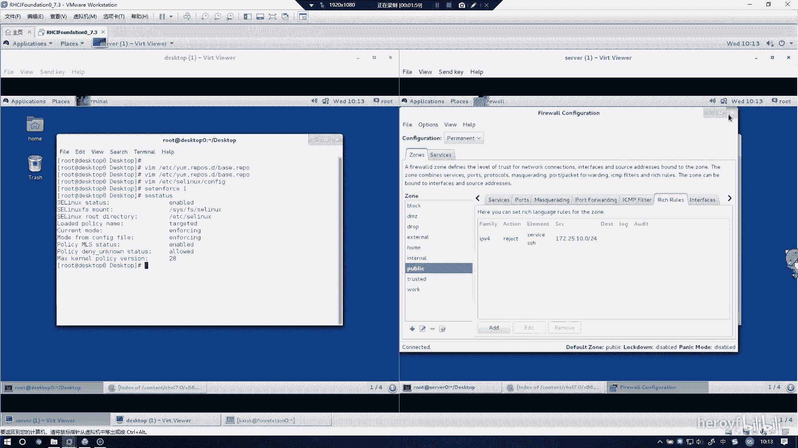

接下来，我们需要添加一条拒绝规则，禁止来自特定 IP 段的客户端访问 SSH。

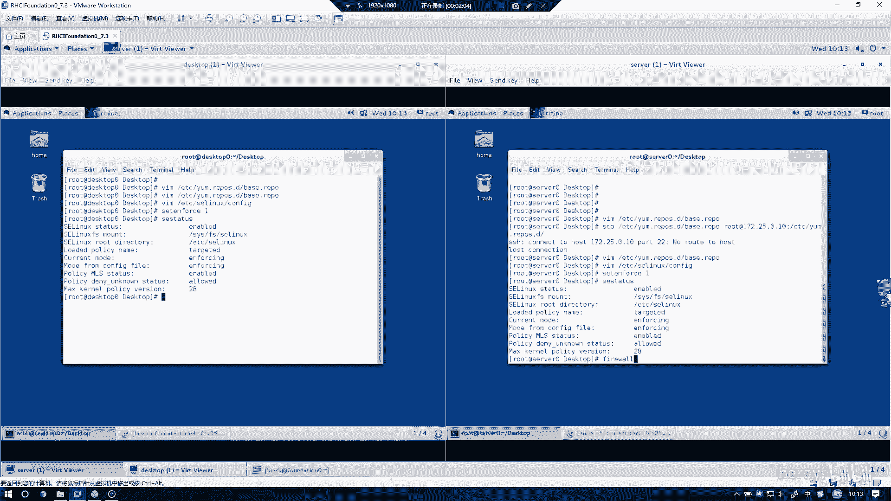

以下是添加拒绝规则的步骤：
1.  在防火墙配置界面中，选择添加规则。
2.  规则类型选择 **IPv4**，服务选择 **SSH**。
3.  将规则行为设置为 **拒绝（reject）**。
4.  在来源（Source）地址中，填入需要禁止的 IP 段，例如 `172.25.10.0/24`。
5.  确认并保存规则。

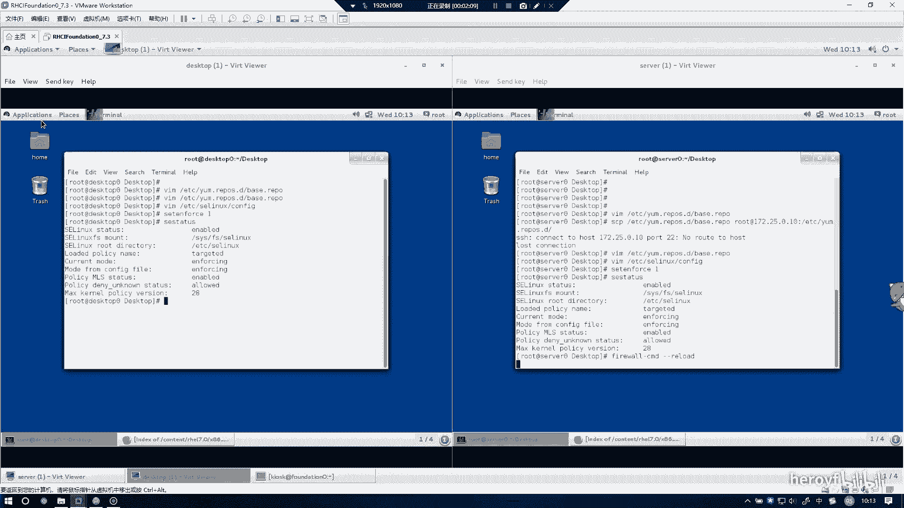

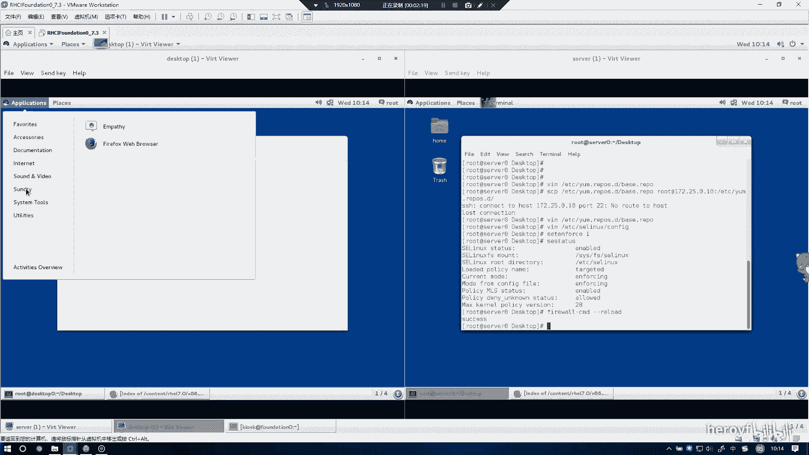

配置完成后，可以重新加载防火墙以使新规则立即生效。在另一台主机（如 desktop）上，需要重复完全相同的配置步骤。

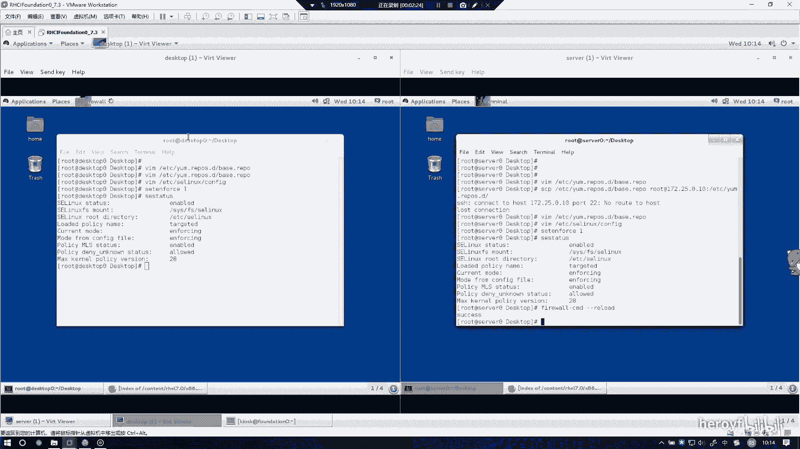

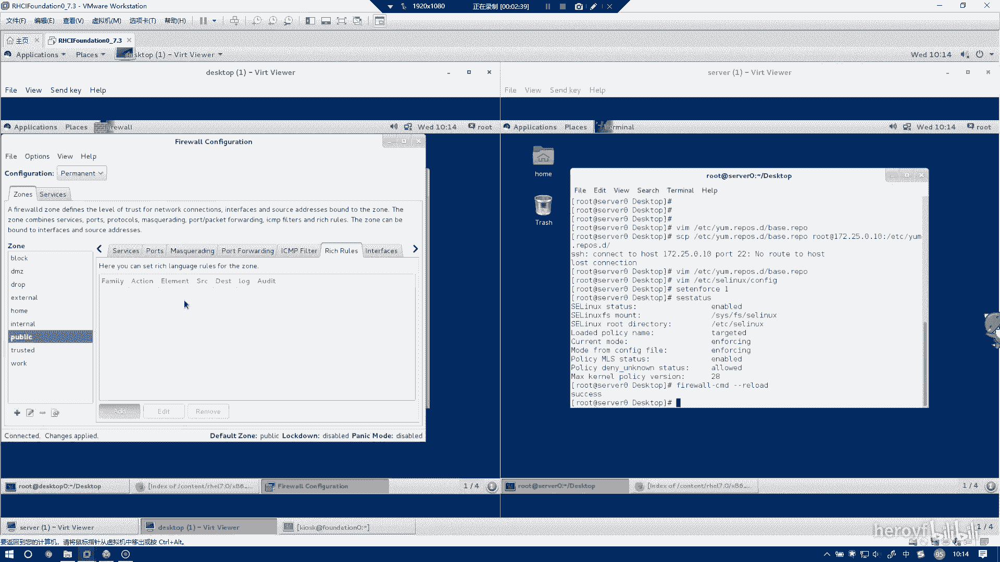

在 desktop 主机上进行配置时，同样需要注意将配置模式设置为永久模式，然后添加针对相同 IP 段的 SSH 拒绝规则。

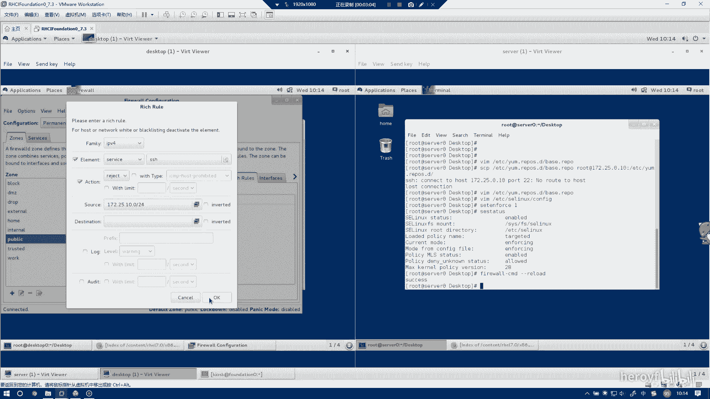

---

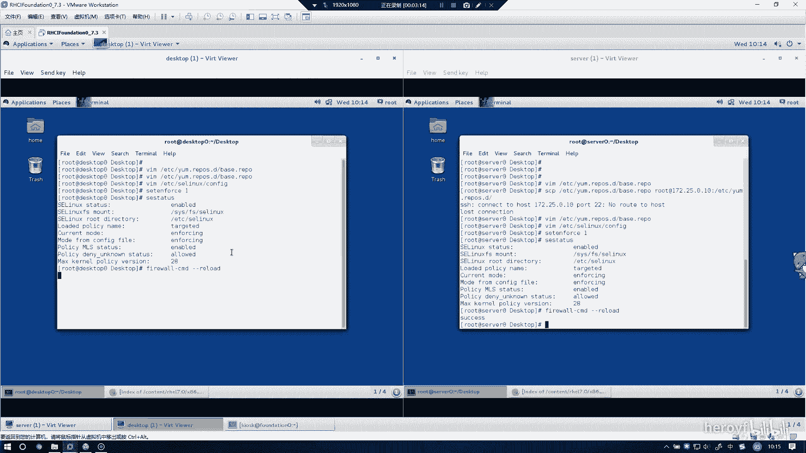

本节课中我们一起学习了如何通过图形化界面为 SSH 服务配置防火墙的允许和拒绝规则，并强调了将配置设置为永久模式的重要性。确保在所有相关主机上完成配置，即可满足题目要求。