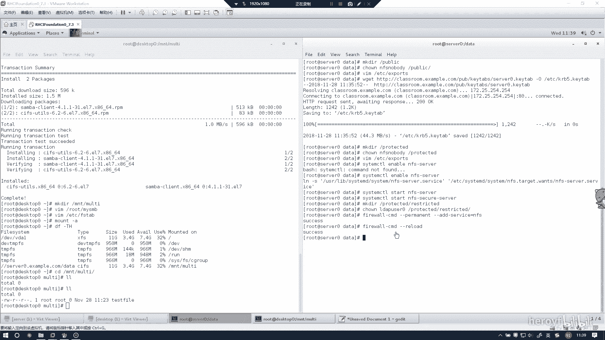
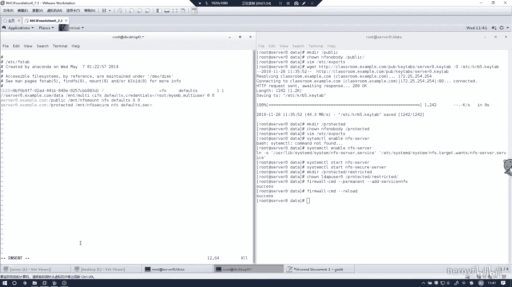
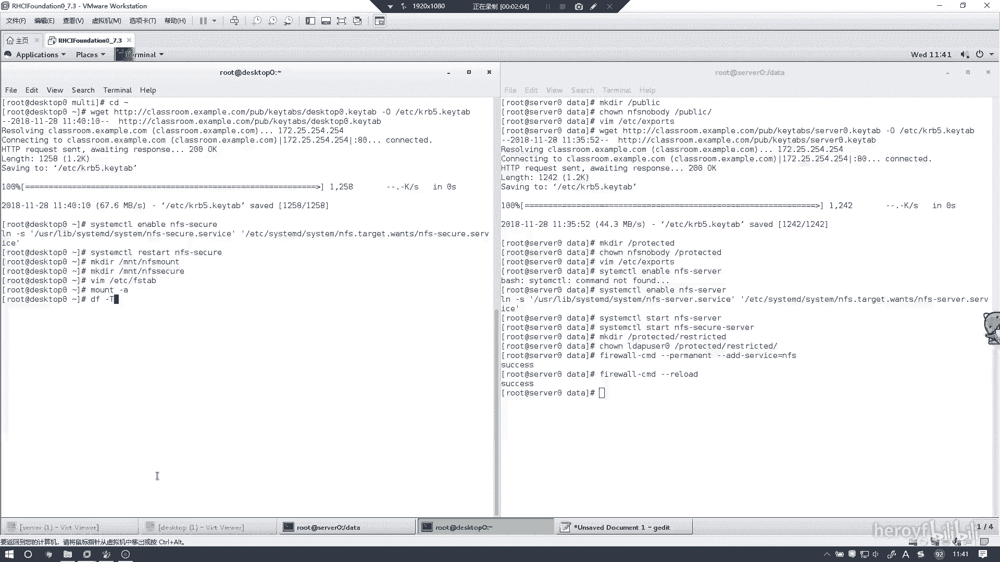
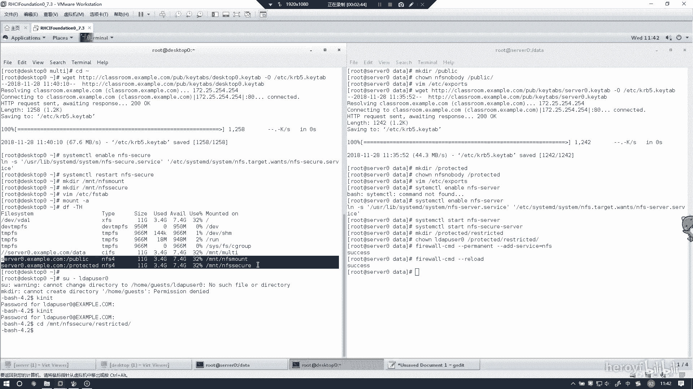
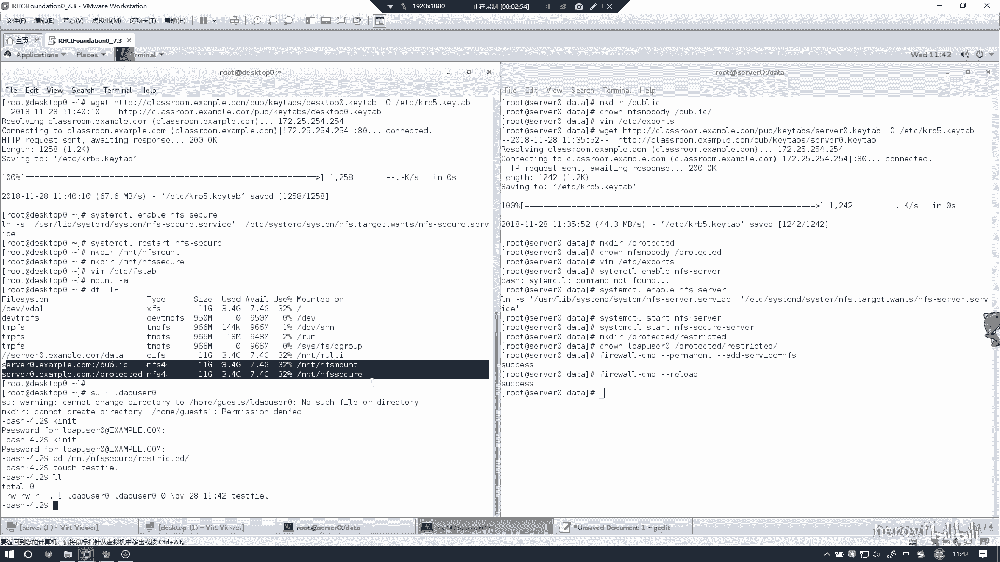
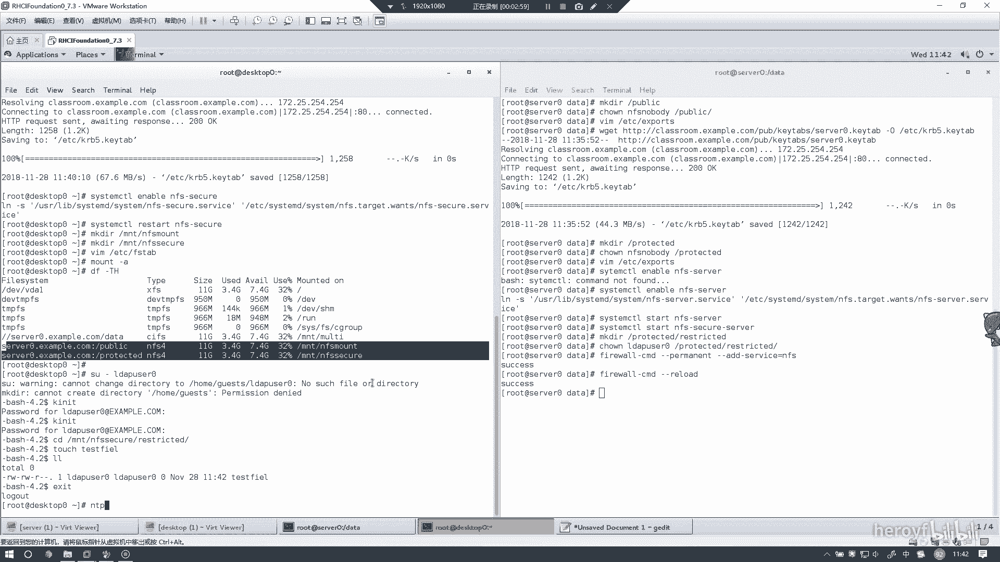
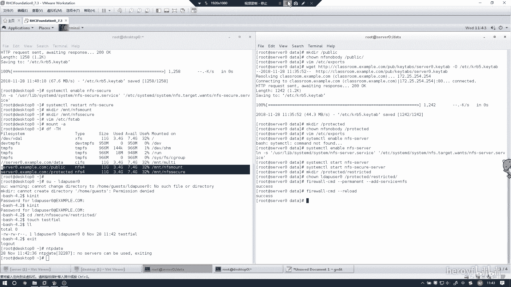

# RHCE(red hat7 考前讲解！最优做法解答，无坑) - P3：nfs客户端 - heroyf - BV1St411p7K8

嗯，然后这道题的话主要是在客户端上进行1个NFS的挂载。然后我们讲NFS这边随新听一下。我们这边可要要下载一个在客户端的证书。嗯，你可以选择怕打错的话，可以选择直接到浏览器里面去下载。あB。It。

然后这边下载好了。然后我们这边先把NFS。呃，这边的加入杯驱动。因为正式客户的，所以是呃没有NFSO的话，只有1个NFS。NFS。然后把这两个文件。文件夹创一下。NFSSEURE。然后我们这边的话写入。

开支挂载的一个配置文件。然后这个是挂载到。嗯，NFS。帽下面的。给你，然后。这里千万不能写错了，写错就肯定挂在不上。放啲。

然后这里话帮他刚刚预看一下。如果马上穿的话，说明就是没有问题的。

然后我们自己看一下，这里的话4202万其实都已经挂的上去。我们现在。家来啲。不知道上面有没有这个用户。啊，是有的。然后的话现在其实我们就可以看到已已经切换过去。但是的话其实是还没有。那个。

还没有完完全做好。K啊 b s。ケイアビアオース。CD杠MNT杠NFSQ。然后有个restricted，这个的话也是可以进去的。

然后我们可以在里面创建一个。S什么。看就有 test file。然后这里的话需要说这点，如果刚刚我那个梦A地方如果出错的话，可以尝试用NTB date先把这个退出来。

NTP date。

呃，对。来同步一下和同步一下NFS的时间点。然后其次的话，你可以检查一下你的证书有没有下错。然后的话基本上就这个问题。但是按照如果按照我这个步骤来一步做下来的话，是肯定没有问题的。所以的话NFS的话。

其实这一方就已经全部做完了。然后这个实验基本上就结束了。然后接下来的话讲一下外部服务器。

