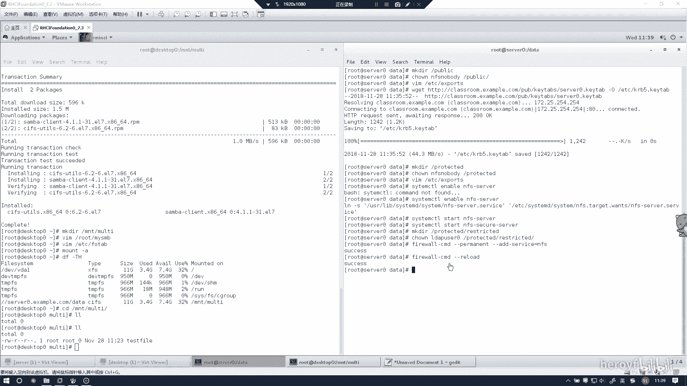
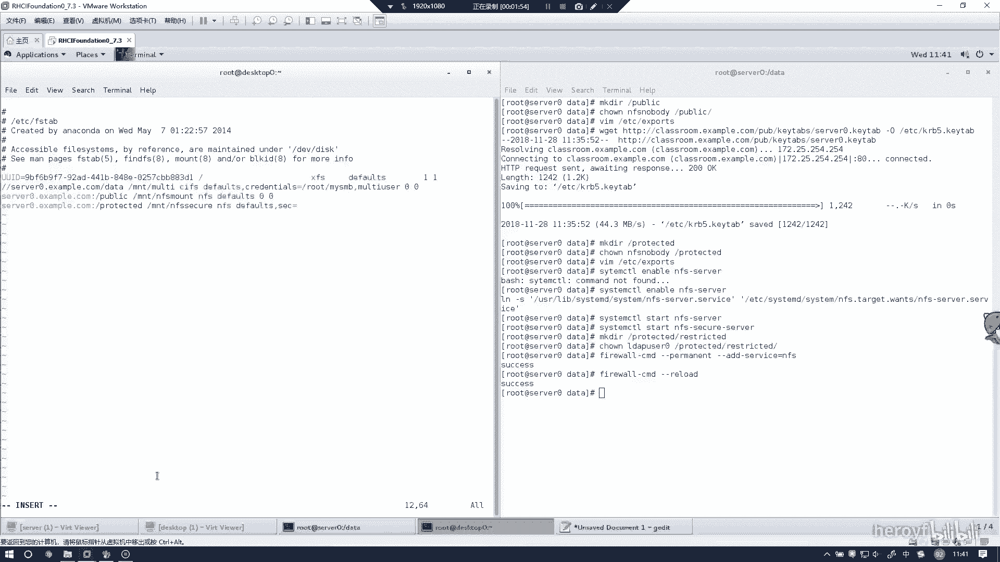
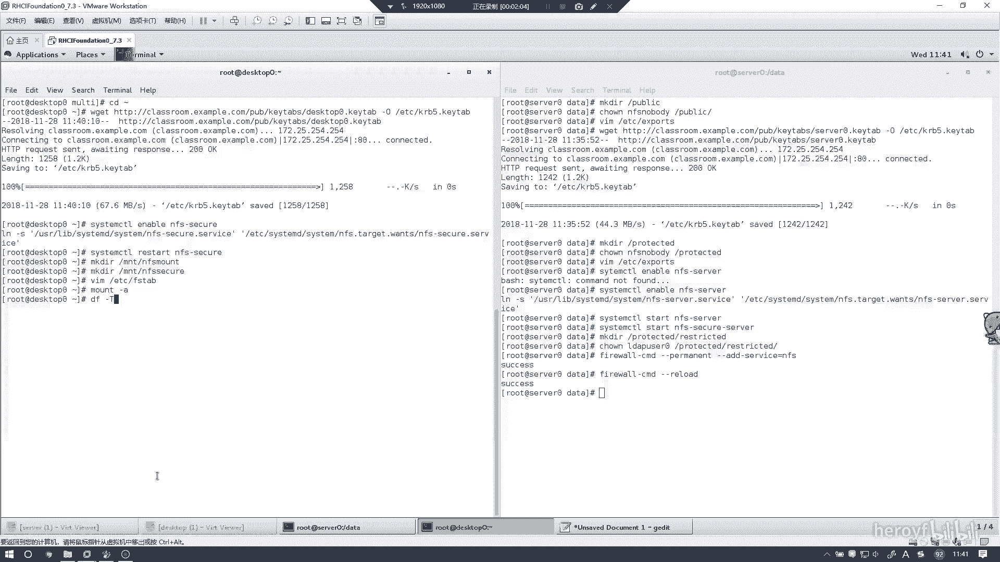
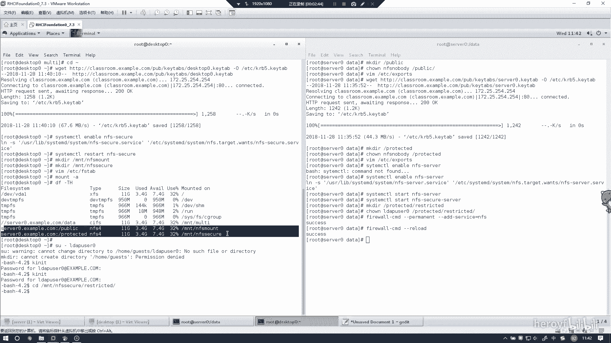
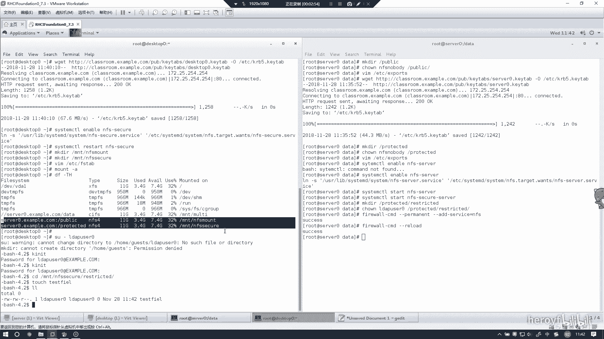
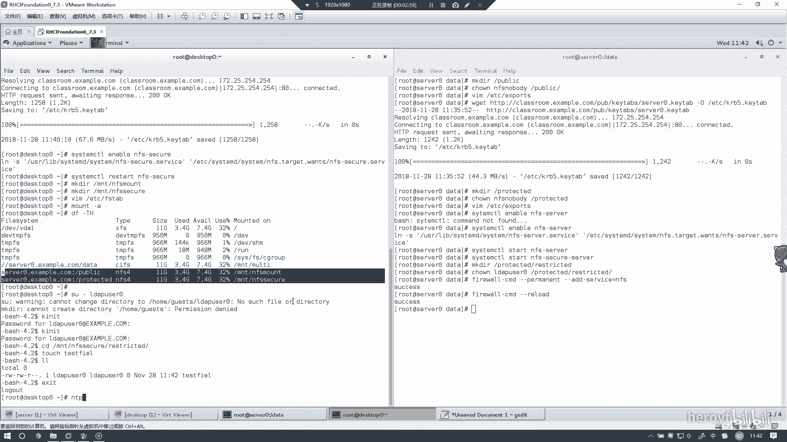
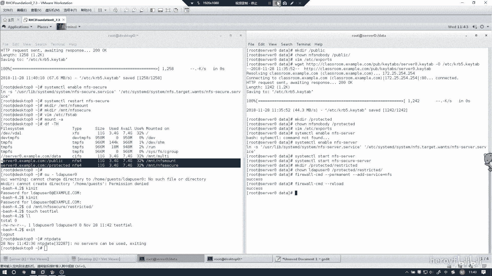

# RHCE 考前讲解：P3：NFS客户端配置教程 🖥️



在本节课中，我们将学习如何在Red Hat 7客户端上配置NFS挂载。我们将从下载证书开始，逐步完成挂载配置，并验证挂载是否成功。整个过程将遵循最优做法，确保操作无误。

## 概述 📋

NFS允许客户端通过网络访问服务器上的共享目录。本节将指导你完成在客户端挂载NFS共享的完整步骤，包括证书下载、目录创建、配置文件编写以及最终的挂载验证。

## 下载证书 🔐

首先，我们需要在客户端下载所需的证书。为了避免手动输入错误，建议直接从浏览器下载。

1.  打开浏览器，访问指定的证书下载地址。
2.  将证书文件下载到客户端本地。

## 创建挂载点目录 📁



在挂载NFS共享之前，需要在客户端创建相应的挂载点目录。

执行以下命令创建目录：
```bash
mkdir -p /mnt/nfssecure
mkdir -p /mnt/nfsq
```



## 编写挂载配置文件 ⚙️

接下来，我们需要编辑 `/etc/fstab` 文件，以配置系统启动时自动挂载NFS共享。

1.  使用文本编辑器打开 `/etc/fstab` 文件。
2.  在文件末尾添加以下挂载配置行：
    ```
    server_ip:/public /mnt/nfssecure nfs defaults 0 0
    server_ip:/protected /mnt/nfsq nfs defaults 0 0
    ```
    **注意**：请务必将 `server_ip` 替换为实际的NFS服务器IP地址，路径和挂载点也必须完全正确，否则将无法成功挂载。

## 测试与验证挂载 ✅

配置文件编写完成后，我们需要测试配置是否正确，并执行挂载。



1.  使用 `mount -a` 命令测试 `/etc/fstab` 文件中的配置。如果命令执行后没有报错，则说明配置语法正确。
    ```bash
    mount -a
    ```
2.  使用 `df -h` 命令查看挂载情况。如果能看到 `/mnt/nfssecure` 和 `/mnt/nfsq` 对应的挂载信息，则表明挂载成功。
    ```bash
    df -h
    ```

## 访问与测试共享目录 🔍

挂载成功后，我们可以切换到挂载目录并进行读写测试。



1.  切换到 `/mnt/nfsq` 目录。
    ```bash
    cd /mnt/nfsq
    ```
2.  尝试在目录内创建一个测试文件，以验证写权限。
    ```bash
    touch testfile
    ```



## 故障排除 🛠️

如果挂载过程中遇到问题，可以尝试以下步骤进行排查：

1.  **检查时间同步**：使用 `ntpdate` 命令同步客户端与NFS服务器的时间，时间不一致可能导致认证失败。
    ```bash
    ntpdate ntp_server_ip
    ```
2.  **验证证书**：确认下载的证书文件是否正确无误。
3.  **检查配置**：仔细核对 `/etc/fstab` 文件中的服务器IP、共享路径和本地挂载点。

按照上述步骤操作，NFS客户端的配置通常可以顺利完成。



## 总结 📝

本节课我们一起学习了在Red Hat 7客户端上配置NFS挂载的完整流程。我们首先下载了必要的证书，然后创建了本地挂载点目录，接着编辑了 `/etc/fstab` 配置文件以实现自动挂载。最后，我们通过测试命令验证了挂载的成功，并在共享目录中进行了简单的读写操作。整个过程清晰明了，遵循了最优实践，可以有效避免常见错误。