# RHCE(red hat7 考前讲解！最优做法解答，无坑) - P4：创建一个脚本 - heroyf - BV1St411p7K8

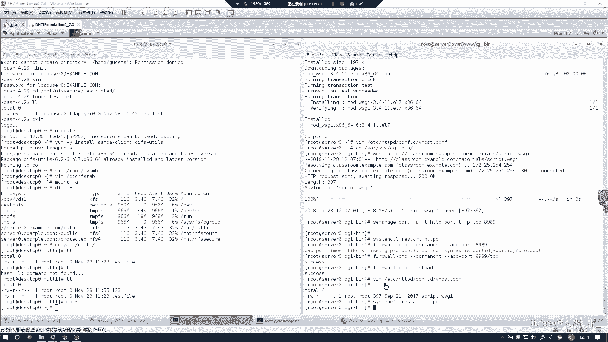

这个实验的话是创建一个脚本。

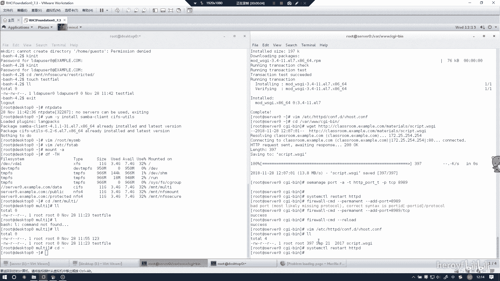

这个的话其实只要跟着打就行，没什么难度。

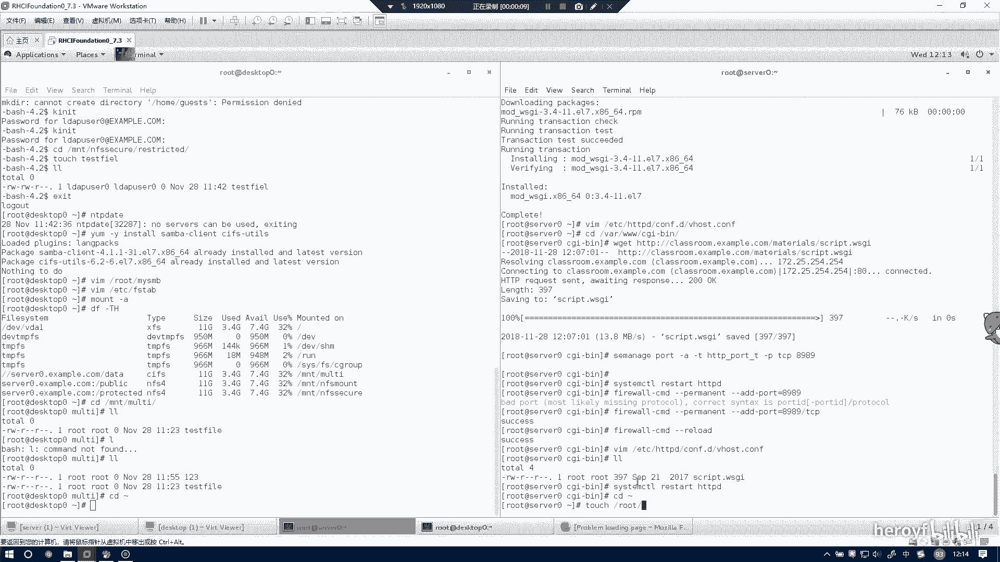

Let see。然后。

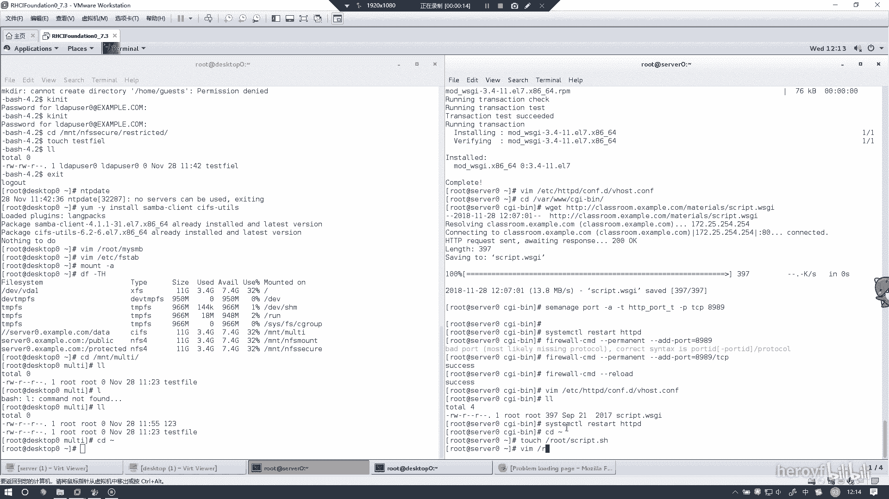

这样。只要打我打的这些东西就行了。收了语音。哦。No。No。具体什么意思的话，我昨天已经跟你讲过了。

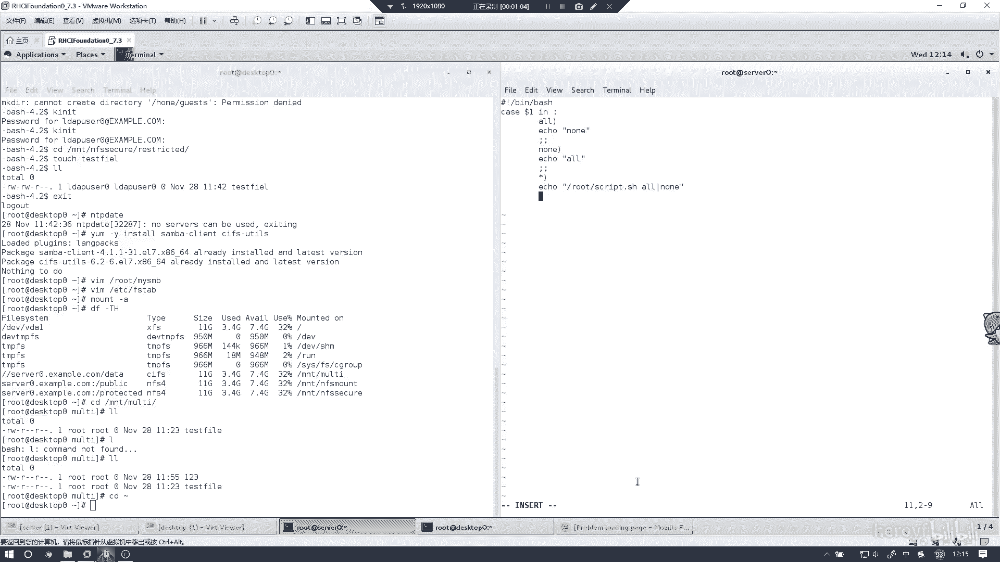

然后别忘记给他加上权限。

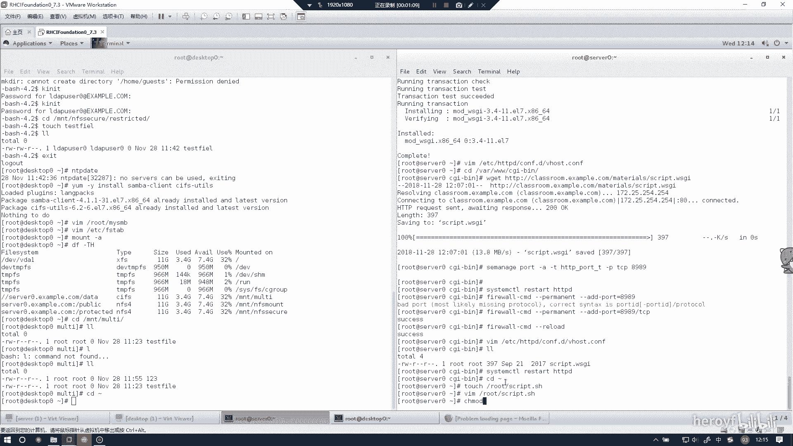

然后的话第一使用的话其实。

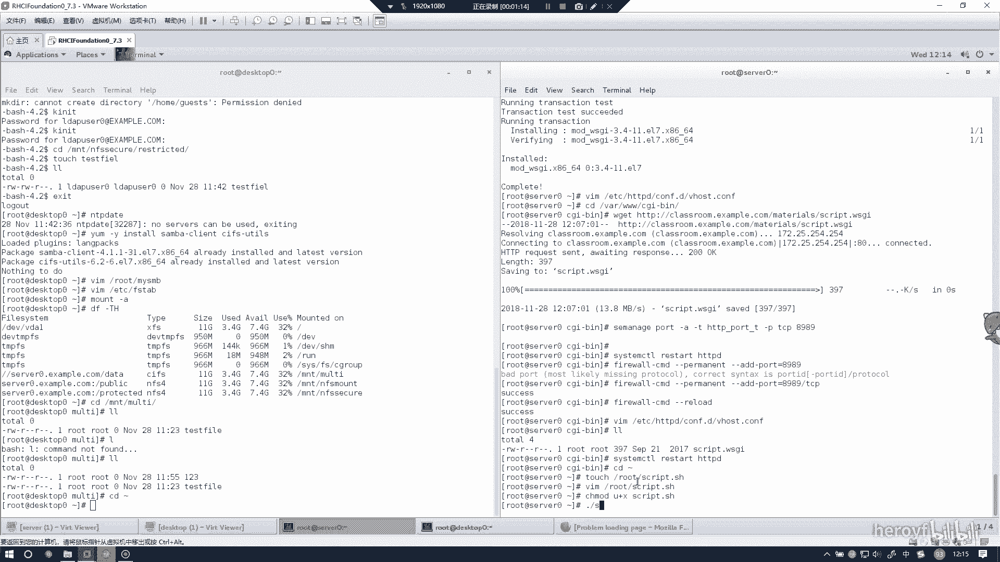

嗯。对的话应该是你的脚本写错了。

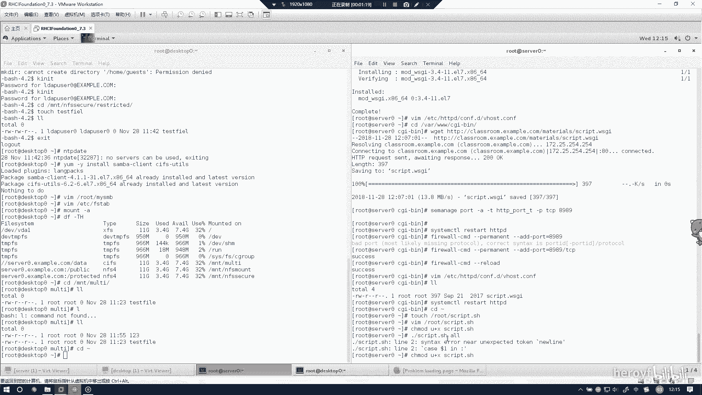

应该是在这里。

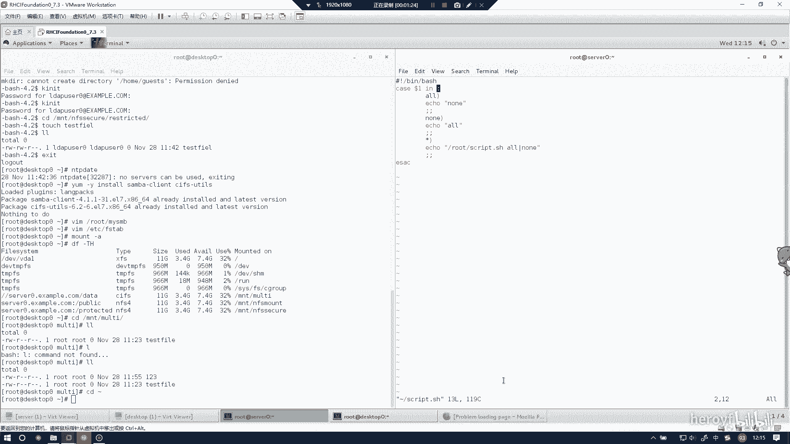

这个应该是没有问。or的话他能出来n，然后你打no的话，它能出来哦，然后你随便打一个东西，他应该会揣这个东西。然后的话这个节本就完成了。

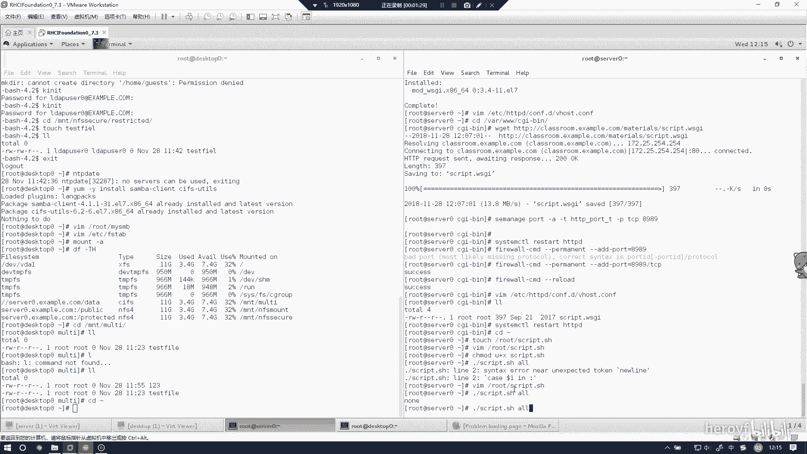

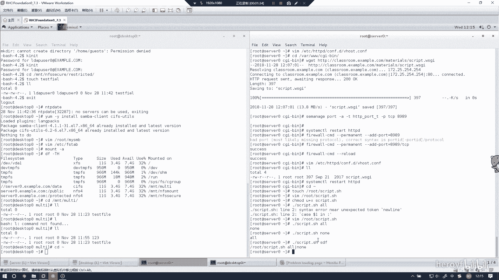