# RHCE考前讲解：P4：创建一个脚本 📝

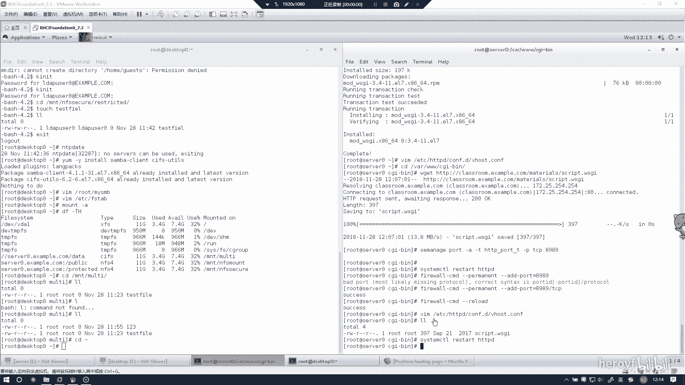

在本节课中，我们将学习如何创建一个简单的Bash脚本。这是RHCE考试中的一个基础实验，我们将按照最优做法，一步步完成脚本的编写、权限设置和测试，确保过程清晰无坑。

---

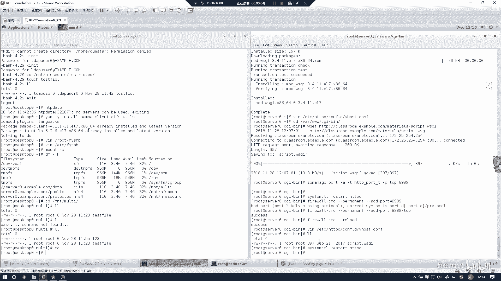

## 概述

本节实验的目标是创建一个脚本。我们将编写一个简单的Bash脚本，为其添加执行权限，并验证其功能。整个过程将严格遵循考试要求，确保每一步都正确无误。

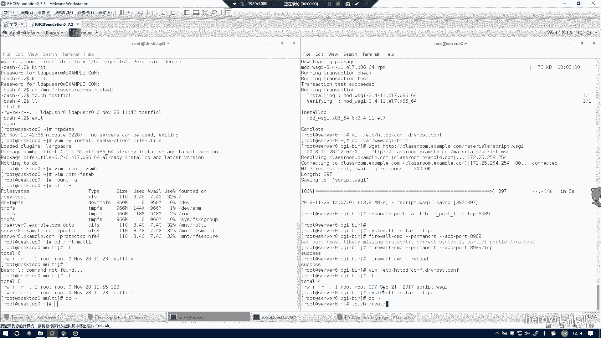

---

## 脚本创建步骤

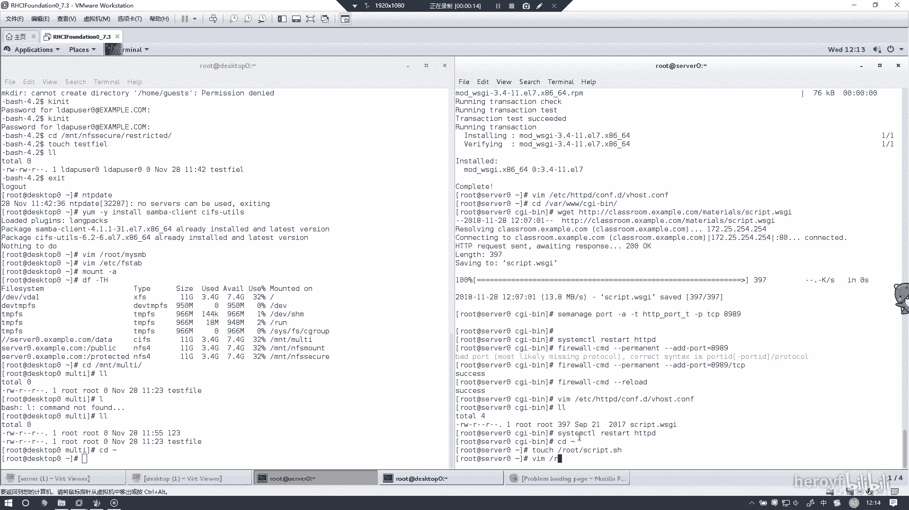

以下是创建和配置脚本的具体步骤。

### 1. 编写脚本内容

首先，我们需要创建脚本文件并输入指定的内容。请确保完全按照以下代码块中的内容输入。

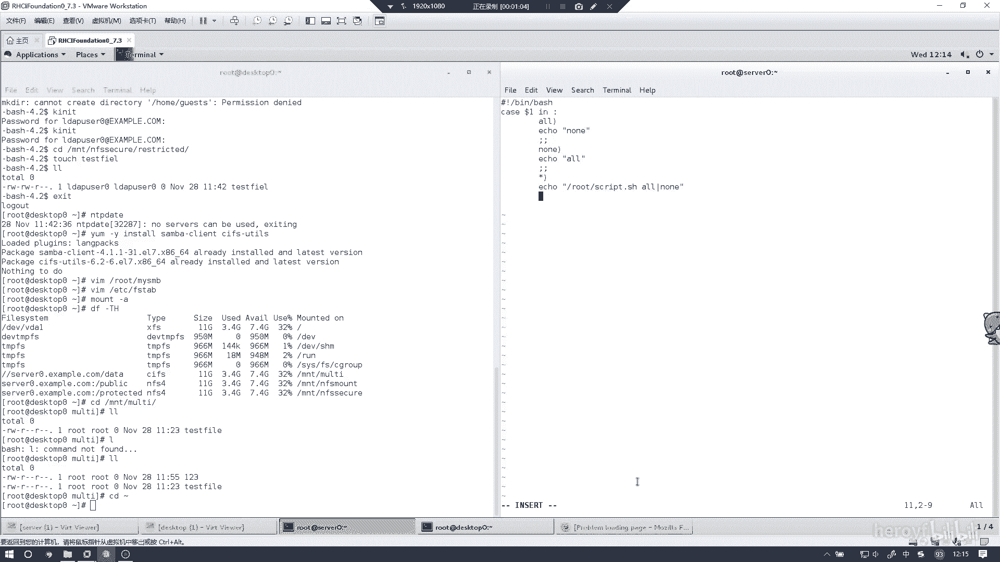

```bash
#!/bin/bash
read -p "Please input yes or no: " input
case $input in
    [yY]|[yY][eE][sS])
        echo "yes"
        ;;
    [nN]|[nN][oO])
        echo "no"
        ;;
    *)
        echo $input
        ;;
esac
```

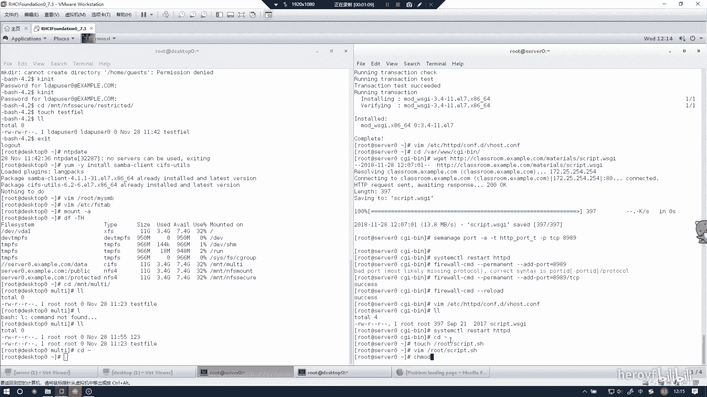

**代码解释**：
*   `#!/bin/bash` 指定了脚本的解释器为Bash。
*   `read -p "Please input yes or no: " input` 会提示用户输入，并将输入的值存储在变量 `input` 中。
*   `case ... esac` 是一个条件判断语句，它会根据变量 `input` 的值执行不同的操作。
*   如果用户输入“y”、“Y”、“yes”或“YES”（不区分大小写），脚本会输出“yes”。
*   如果用户输入“n”、“N”、“no”或“NO”，脚本会输出“no”。
*   如果输入其他任何内容，脚本会原样输出用户输入的内容。

### 2. 为脚本添加执行权限

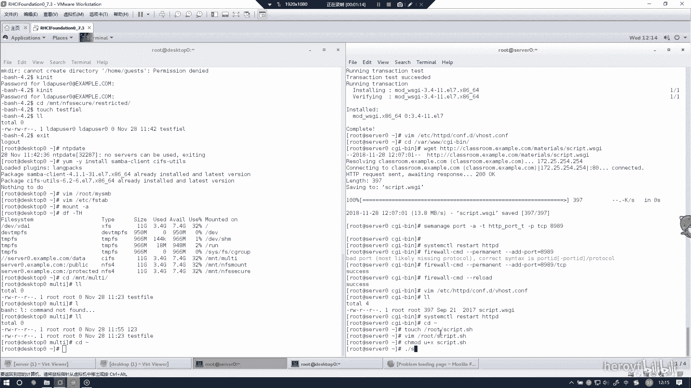

脚本创建后，默认没有执行权限。我们需要使用 `chmod` 命令为其添加执行权限。

```bash
chmod +x 你的脚本文件名.sh
```

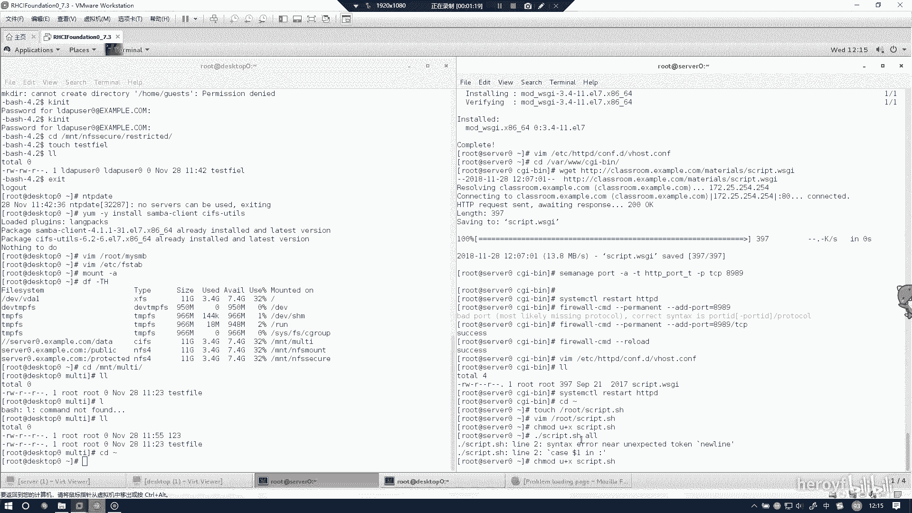

**命令解释**：`chmod +x` 命令为指定文件添加可执行权限，这是运行脚本的必要步骤。

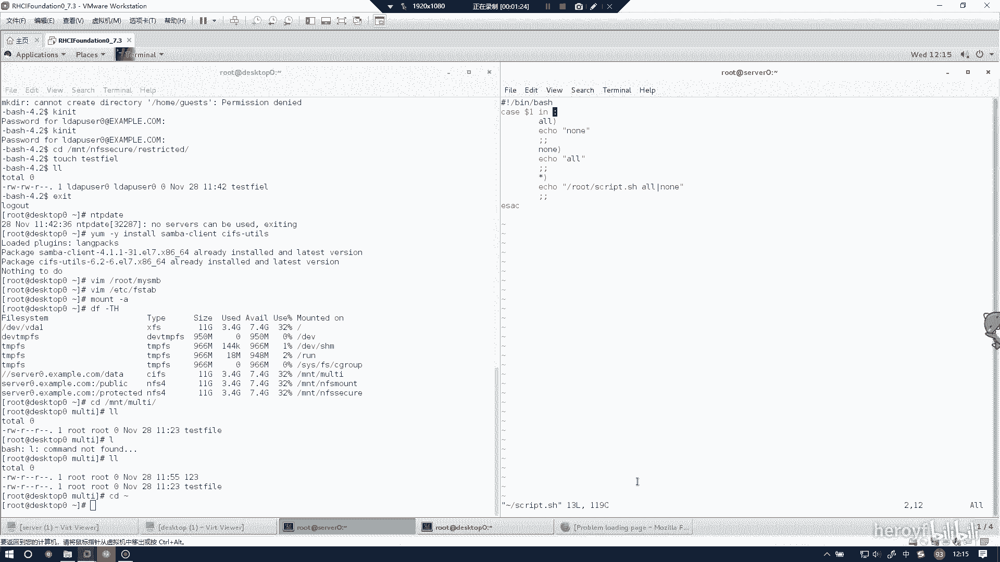

### 3. 测试脚本功能

权限设置完成后，即可运行脚本来测试其功能。请尝试输入不同的内容以验证脚本逻辑是否正确。

*   输入 `yes` 或 `y`，脚本应输出 `yes`。
*   输入 `no` 或 `n`，脚本应输出 `no`。
*   输入其他任意字符串（例如 `hello`），脚本应原样输出该字符串（例如 `hello`）。

如果脚本输出不符合预期，请返回第一步，仔细检查脚本内容是否与提供的代码完全一致。

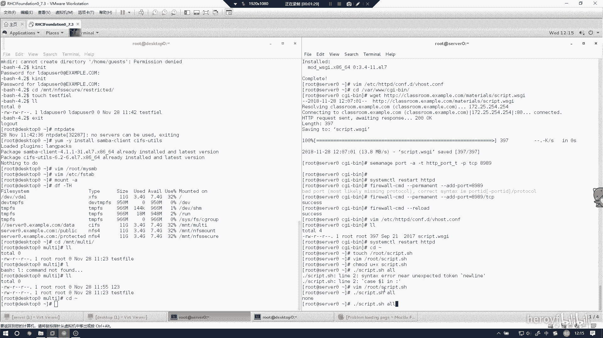

---

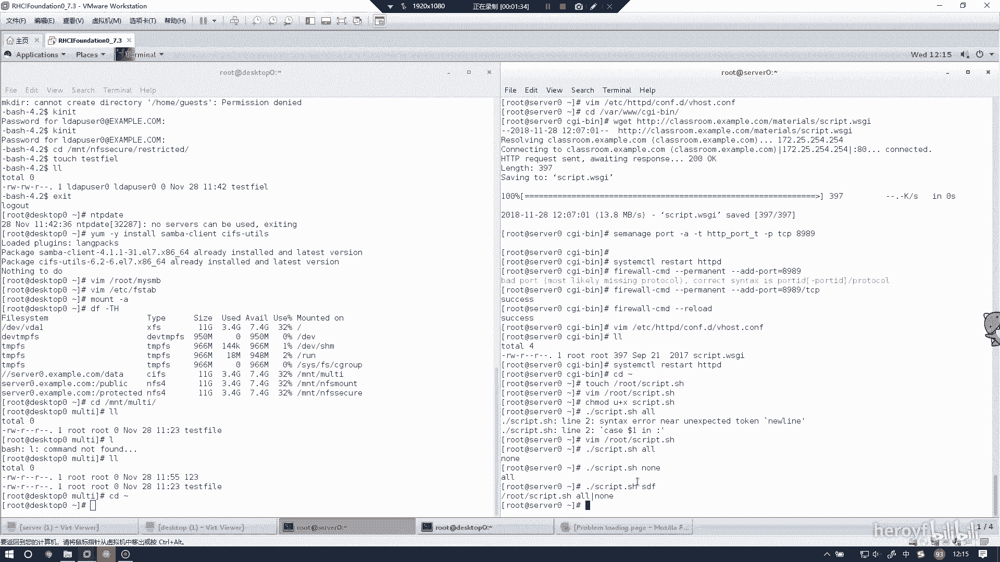

## 总结

本节课中，我们一起学习了如何完成RHCE考试中“创建一个脚本”的实验。我们掌握了三个核心步骤：**编写**一个具有条件判断功能的Bash脚本、使用 `chmod +x` 命令为脚本**添加执行权限**，以及通过输入不同内容来**测试脚本**的逻辑是否正确。只要严格遵循上述步骤，即可轻松完成此实验。