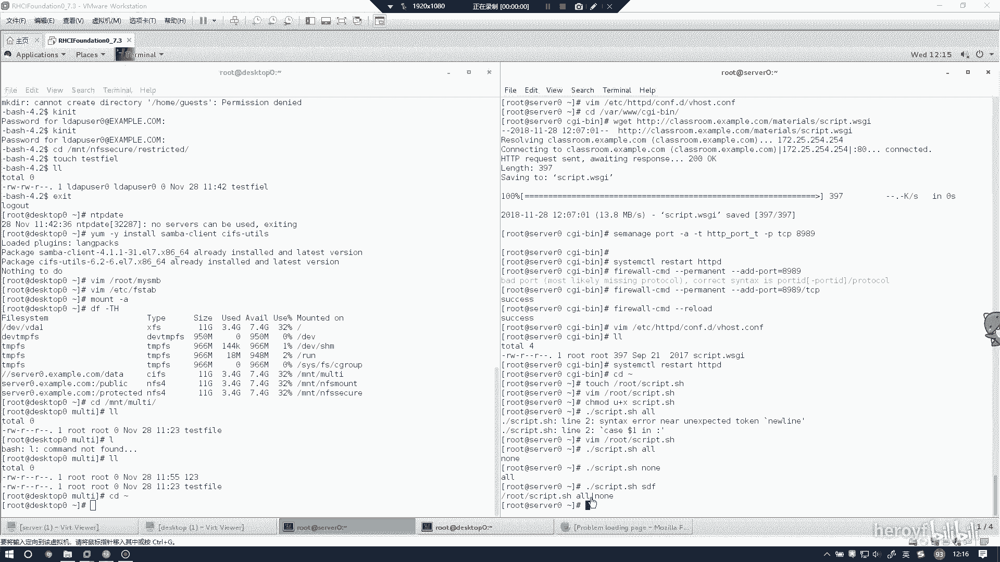
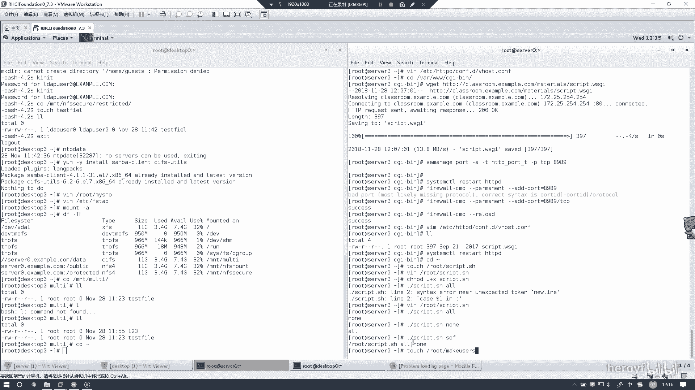
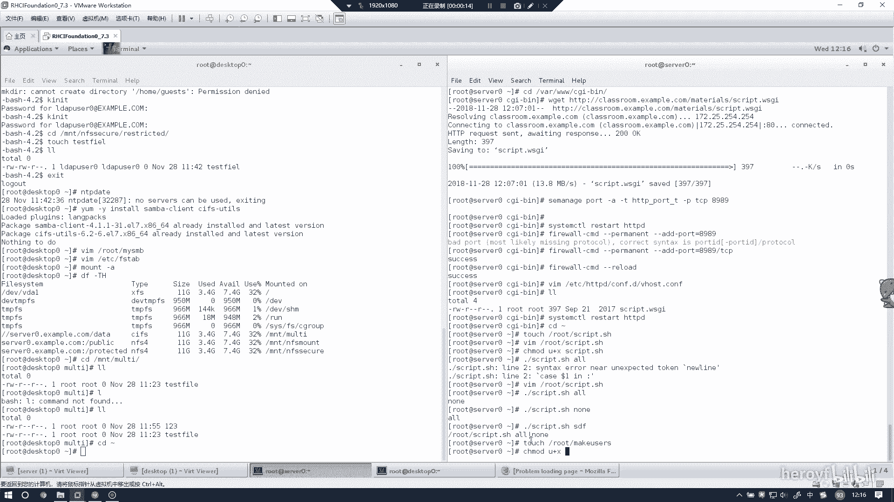
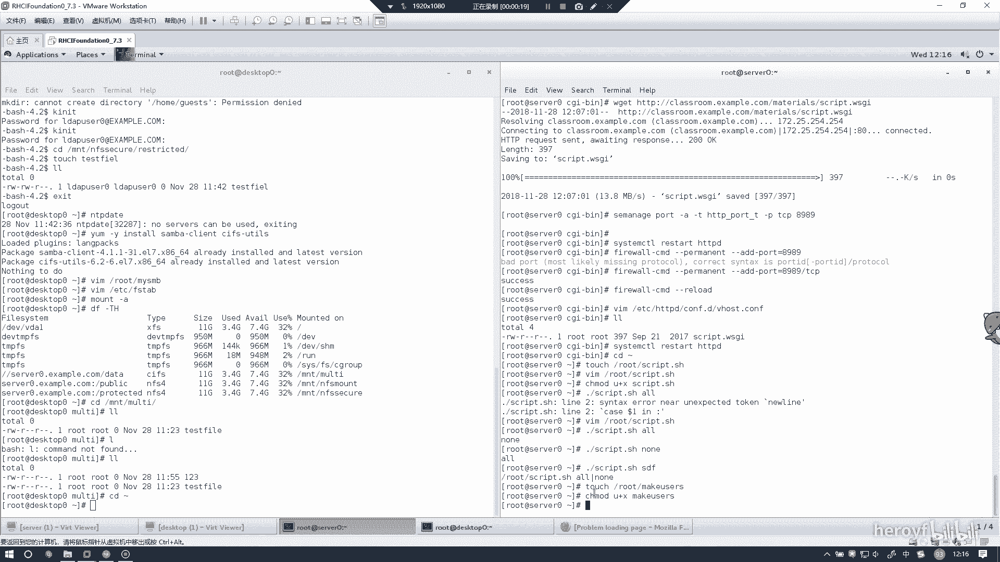
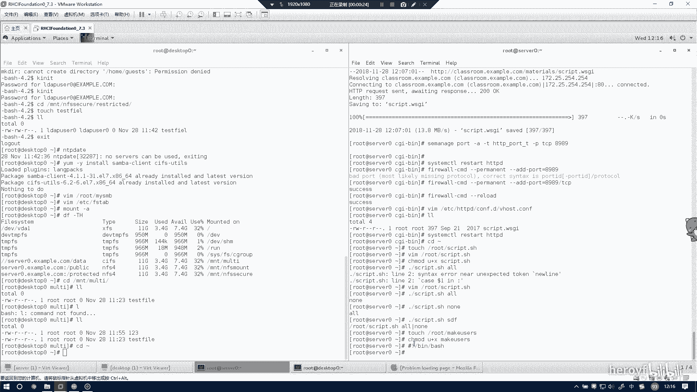
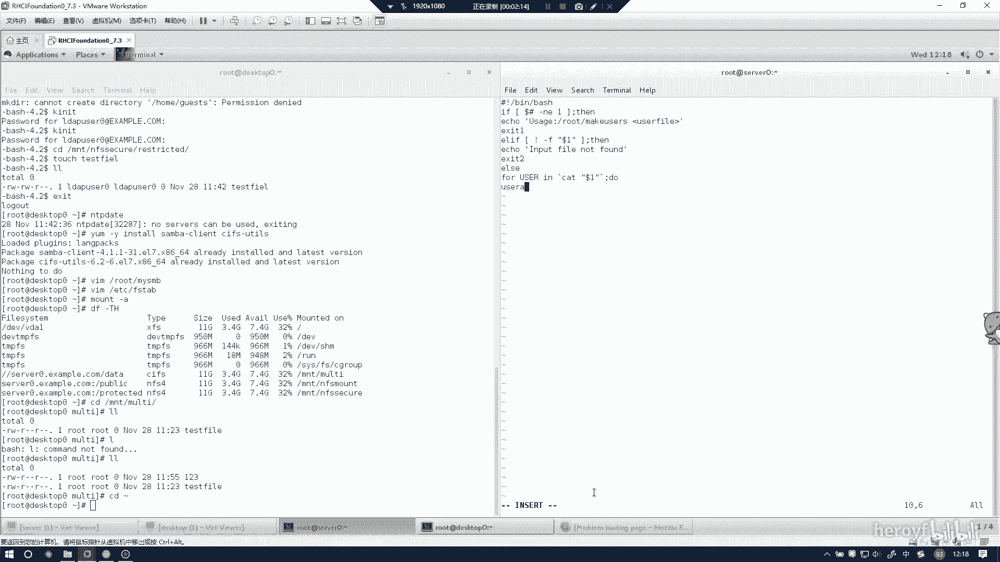
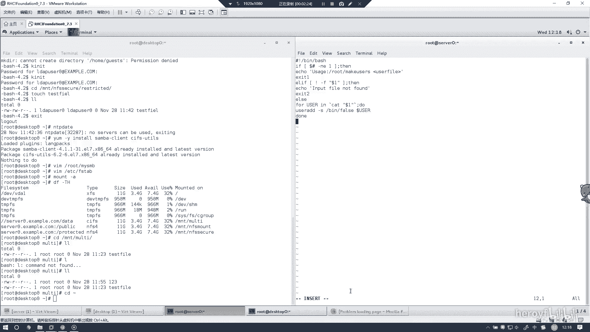
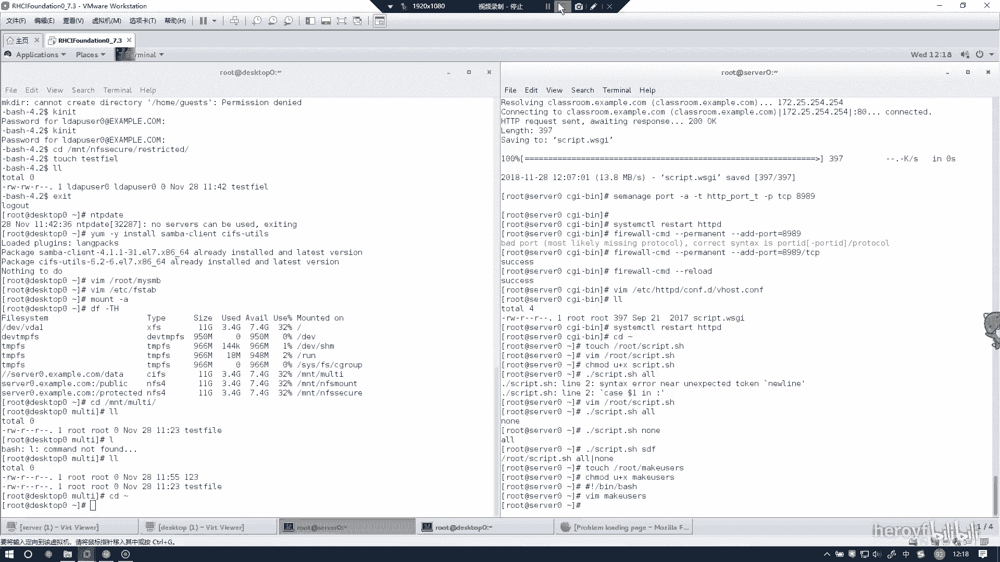

# RHCE(red hat7 考前讲解！最优做法解答，无坑) - P5：创建一个添加用户的脚本 - heroyf - BV1St411p7K8

当时创建一个脚本，一个添加。

这道题同样是创建一个添加用户的脚本。只要把这条本背下来，其实这道题根本就是共分题。

然后是U加X。

Make users。这道题的话不用检验。

你到时创建完就行了。啊，对不下。

With users。然后的说是F。F里面的这个里面所有打东西必须得有空格。没有空格就会报错。就在两个中括号之前，也就是这段东西之间必须有空格。和这里之间必须有空格，不然的话他是会报错的。然后者是e。

嗯。老是exist一。记着两个中国号之间必须有空格。如果。不存在这个文件的话。那么就e。イン口。那 to道。哦。Yeah。这里的话可以这样写。可以显成这样，这个代表是执行里面的命令。

然后的话也可以写成这个样子。随便你。然后这个的话是。忘了，双完引号到了一。然后。2。U的ADD。

对。だけ。这个脚本的话，你背下来就没有问题。也是一样。然好到。

一快。然后这个题目就做完了。

