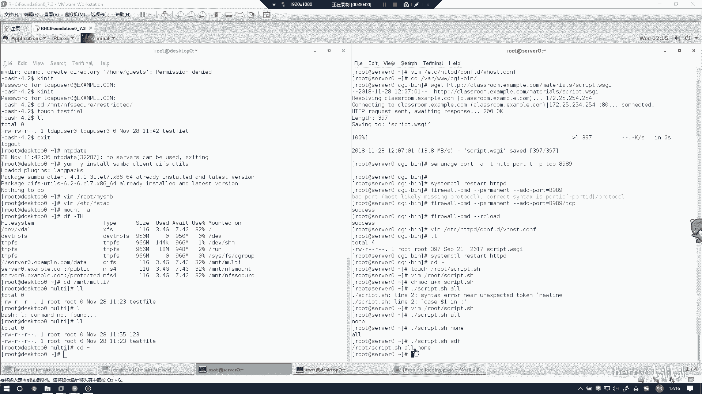
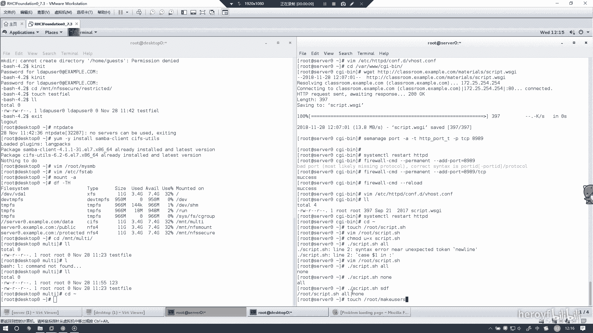
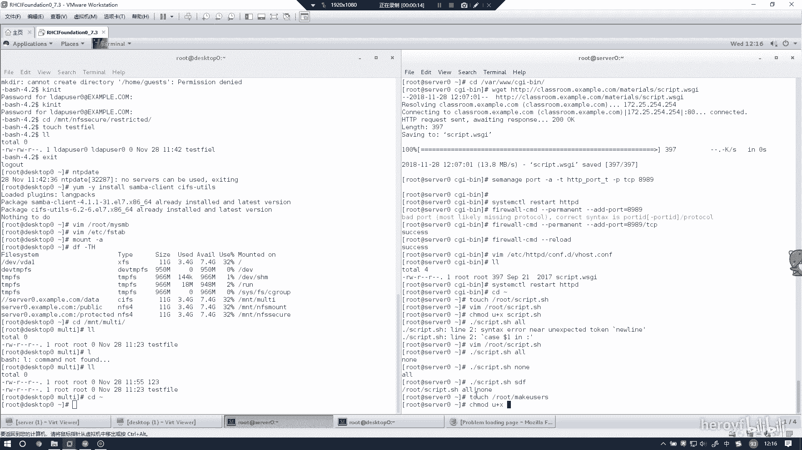
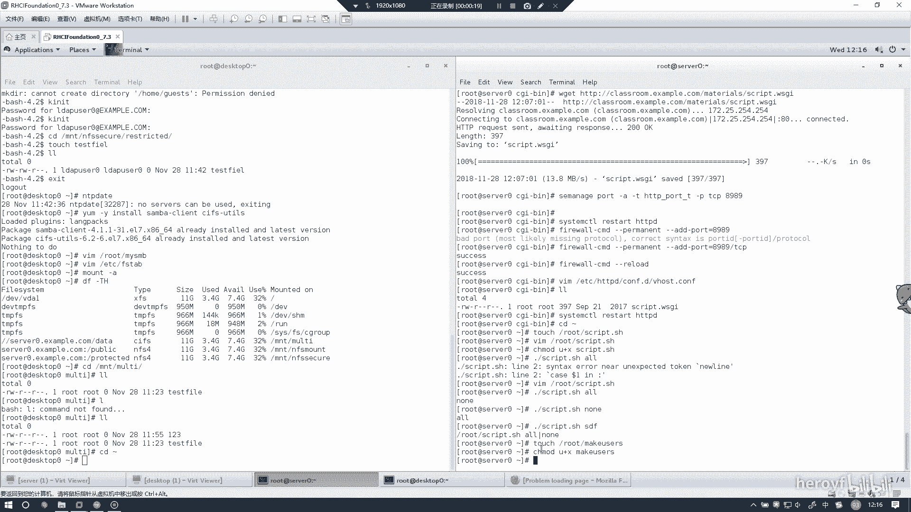
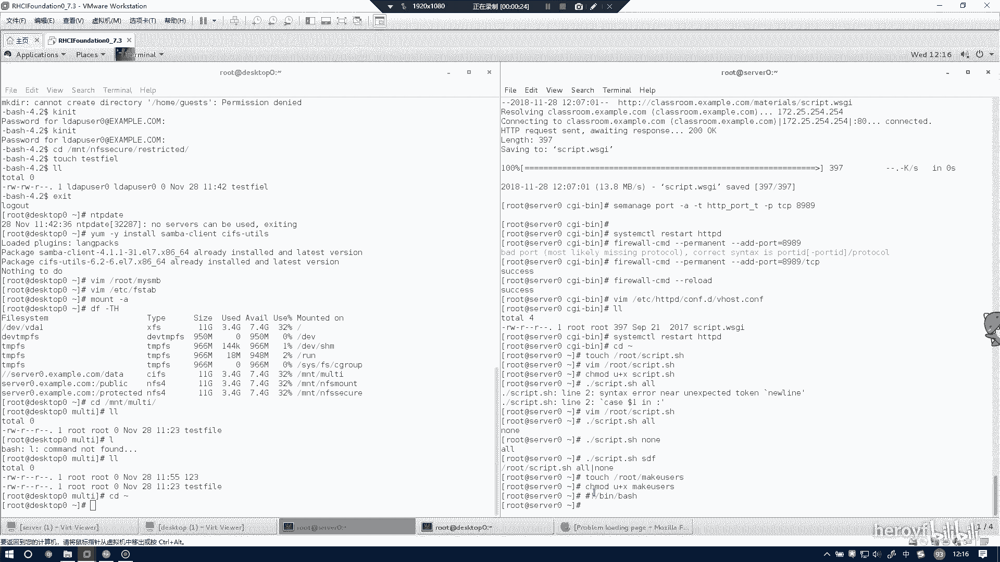
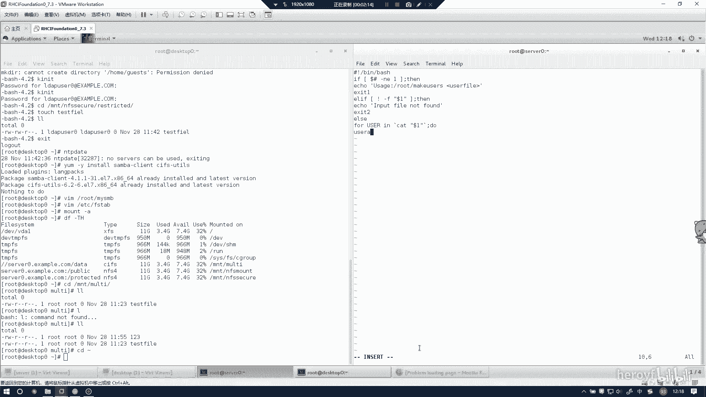
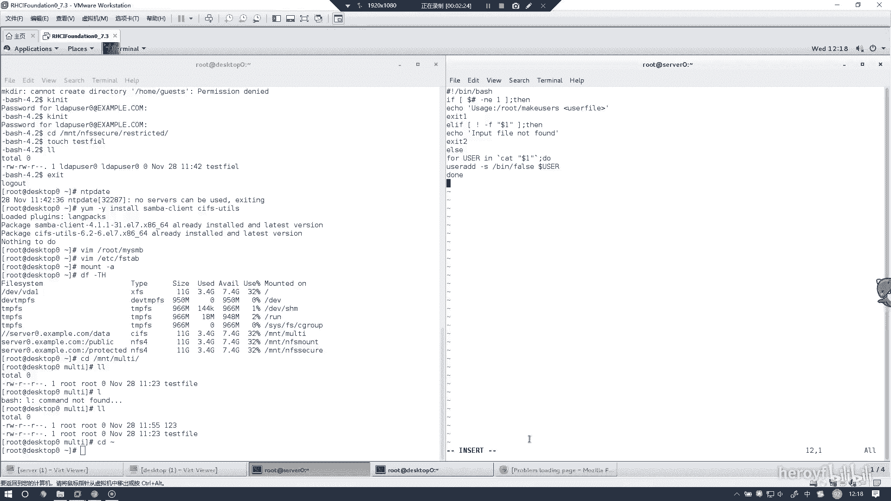
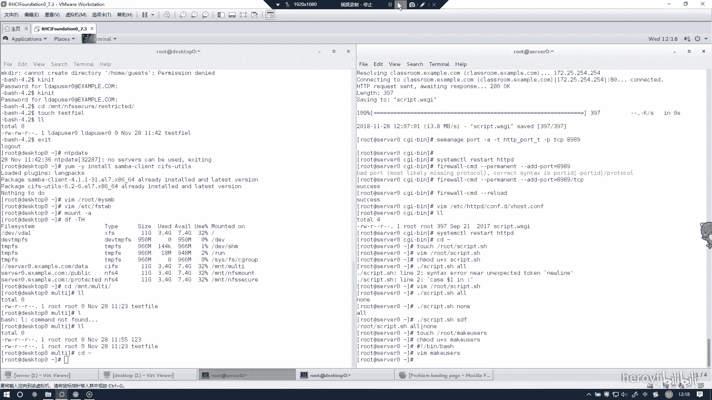

# RHCE 考前讲解：P5：创建一个添加用户的脚本 📝

在本节课中，我们将学习如何创建一个用于添加用户的Bash脚本。这是RHCE考试中的一个常见任务，掌握其标准做法可以帮助你高效、无差错地完成题目。



---

## 脚本创建与权限设置



首先，我们需要创建一个脚本文件。脚本文件通常以 `.sh` 作为扩展名。



以下是创建脚本文件的命令：
```bash
vim /usr/local/bin/makeusers
```

创建完成后，必须为脚本文件添加可执行权限，否则系统将无法运行它。



以下是修改文件权限的命令：
```bash
chmod u+x /usr/local/bin/makeusers
```

---



## 脚本内容解析

上一节我们创建了脚本文件并设置了权限，本节中我们来看看脚本的具体内容。这个脚本的核心功能是检查一个用户列表文件是否存在，如果存在，则读取文件并逐一创建用户。

以下是脚本 `makeusers` 的完整代码：
```bash
#!/bin/bash
if [ -e /root/userlist ]
then
    for i in `cat /root/userlist`
    do
        useradd $i
    done
fi
```

现在，我们来逐行解析这个脚本：

*   **`#!/bin/bash`**： 这是shebang行，它告诉系统使用哪个解释器来执行此脚本。这里指定使用Bash。
*   **`if [ -e /root/userlist ]`**： 这是一个条件判断语句。`-e` 选项用于检查 `/root/userlist` 这个文件是否存在。**注意**：方括号 `[` 和 `]` 的内侧必须留有空格，否则会导致语法错误。
*   **`then`**： 如果上述条件成立（即文件存在），则执行 `then` 后面的代码块。
*   **`for i in \`cat /root/userlist\``**： 这是一个 `for` 循环。它使用反引号执行 `cat /root/userlist` 命令，读取文件内容，并将每一行内容依次赋值给变量 `i`。
*   **`do`** 和 **`done`**： 这是循环体的开始和结束标记。在它们之间的命令会对每一行数据执行一次。
*   **`useradd $i`**： 这是循环体内执行的命令。`useradd` 是创建用户的命令，`$i` 会展开为从文件中读取的每一行用户名。
*   **`fi`**： 这是 `if` 条件语句的结束标记。

---

## 脚本的另一种写法



除了使用反引号，我们还可以使用更现代的 `$()` 语法来执行命令并捕获其输出，两者效果相同。

以下是使用 `$()` 语法的等价写法：
```bash
#!/bin/bash
if [ -e /root/userlist ]
then
    for i in $(cat /root/userlist)
    do
        useradd $i
    done
fi
```



---



## 总结

本节课中我们一起学习了如何创建一个用于批量添加用户的Bash脚本。我们首先创建了脚本文件并设置了执行权限，然后详细分析了脚本的每一部分，包括条件判断、文件读取和循环结构。最后，我们还了解了命令替换的两种写法（反引号和 `$()`）。记住这个脚本的模板，在考试中遇到类似题目时就可以轻松应对。