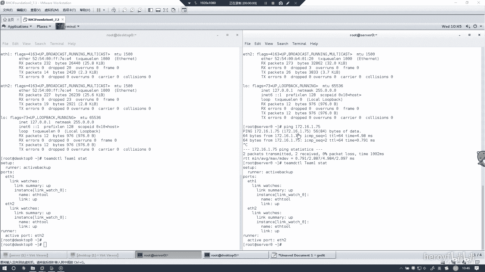
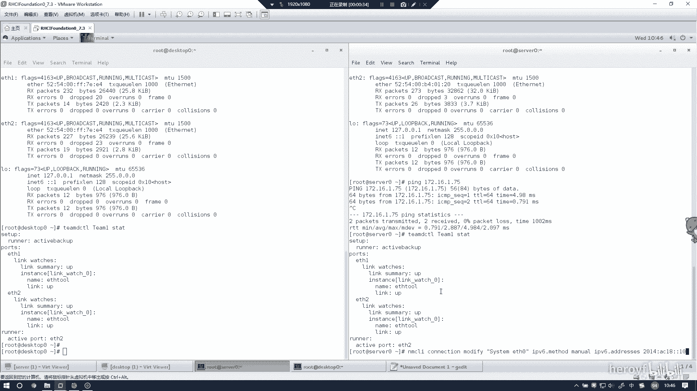
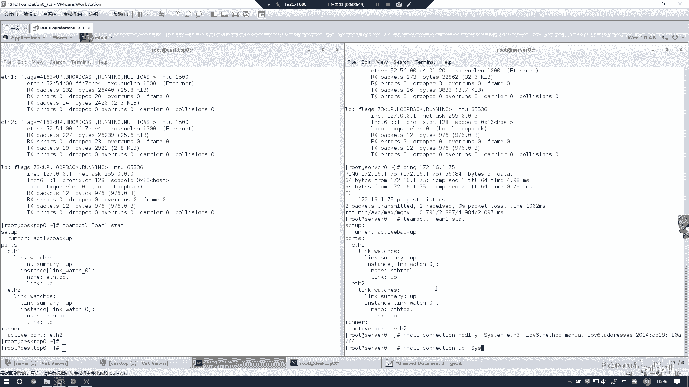
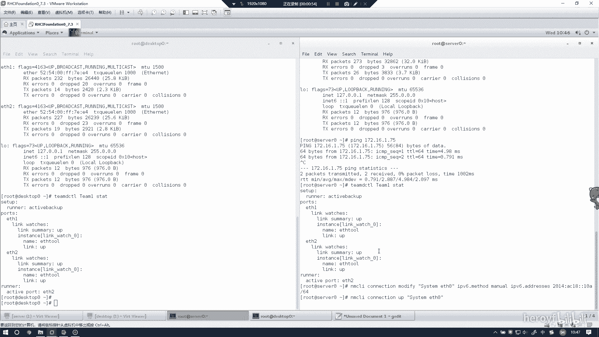
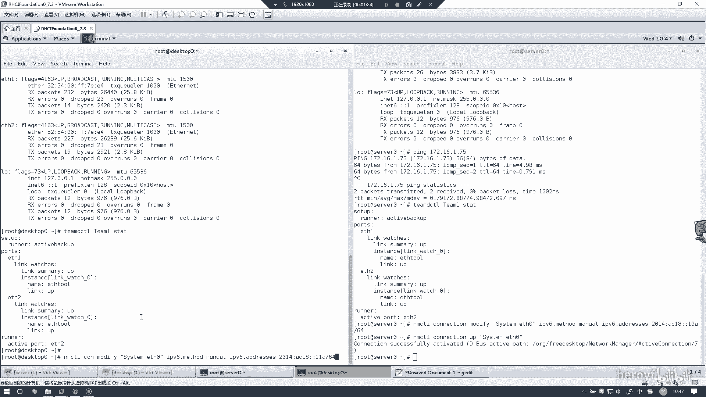
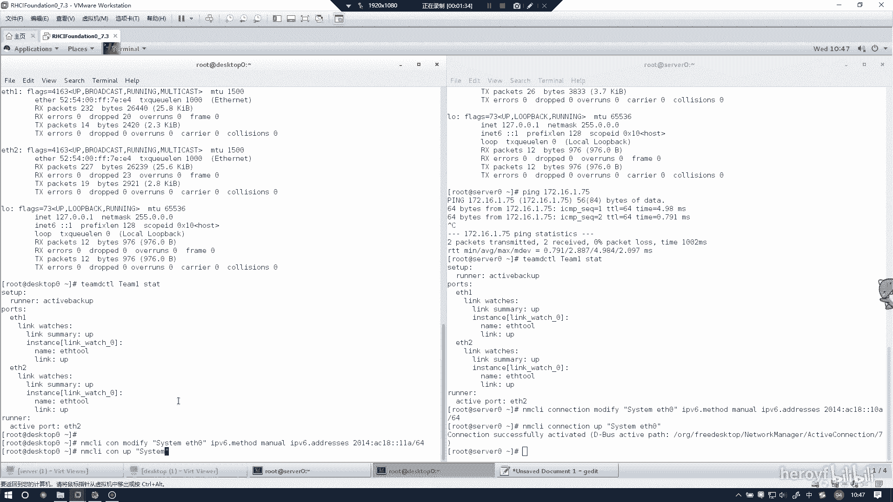
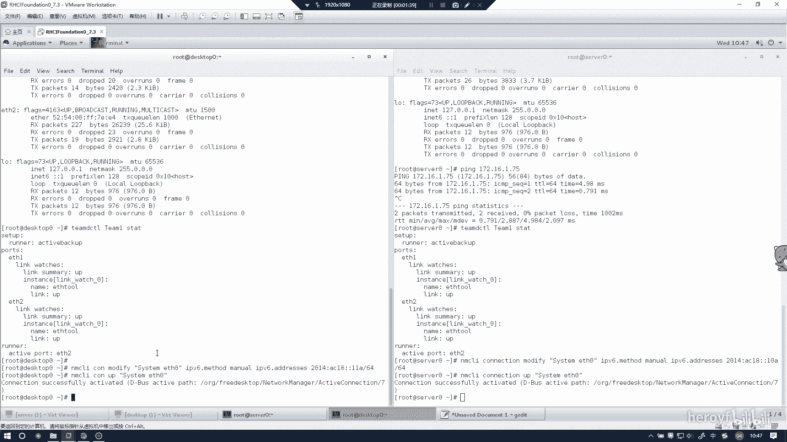
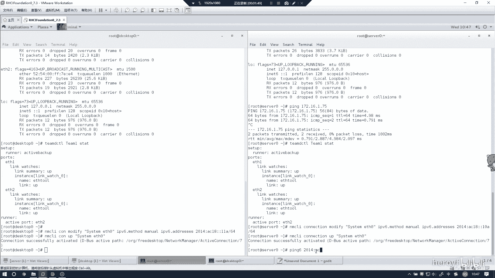
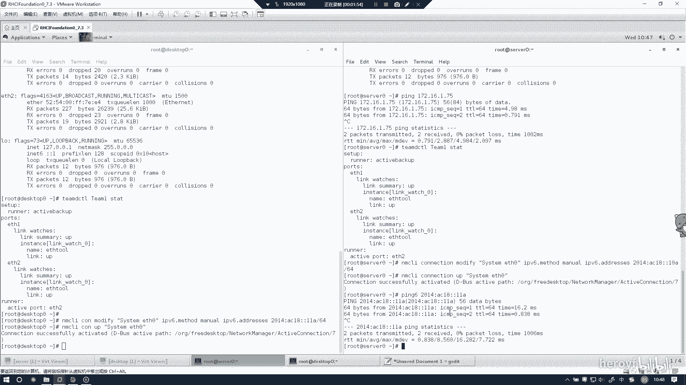

# RHCE(red hat7 考前讲解！最优做法解答，无坑) - P6：配置IPV6地址 - heroyf - BV1St411p7K8

这道题的话是配置IP6的地址。APPU地址就直接照命令好来说。🤧嗯，色林上好像是模地板。System ETH0。IPV6点S色的。现在不对呀。IPV9点。呃，2014。AC18。我好冇好。

10A。Com6。然后呃CLI别忘记把这个端给启一下。です。です。

ETH。

那车车起起来了。然后desktop上进行传的操作connection。呃，Mo。Ssem ETH。IP6的m的。Mニュー。然后是IPV6点Adress。2014然后AC18这个斜面都是不变的。

1A杠64。

🤧。记住一定表达错了。T system。

写H0。

然后这个的话尤其想呃拼一下。2014。AC18冒号冒号11A是吧？

好，有回应了。那这道题就做完了。😊。

