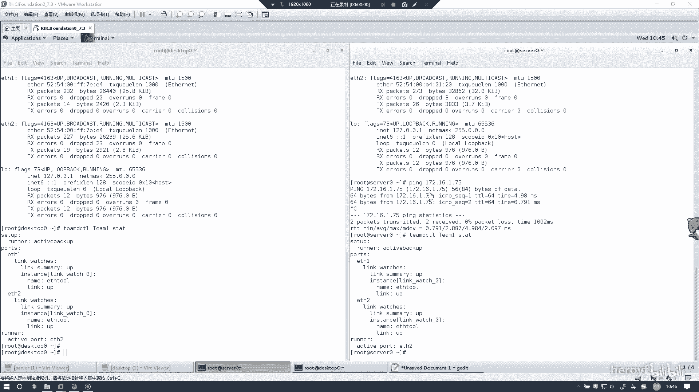
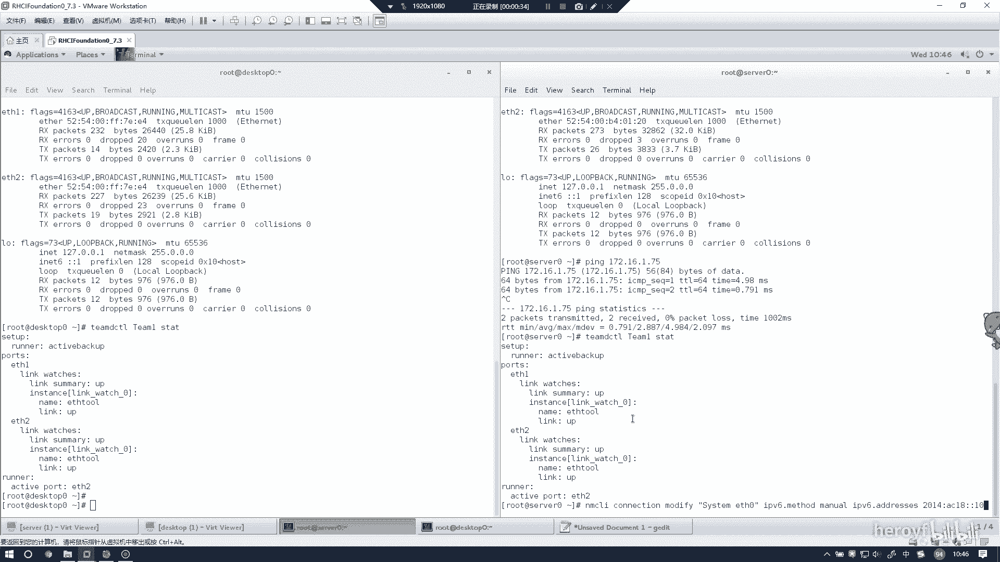
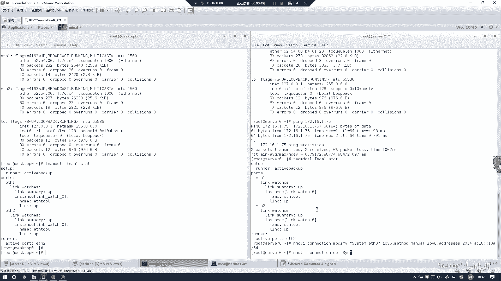
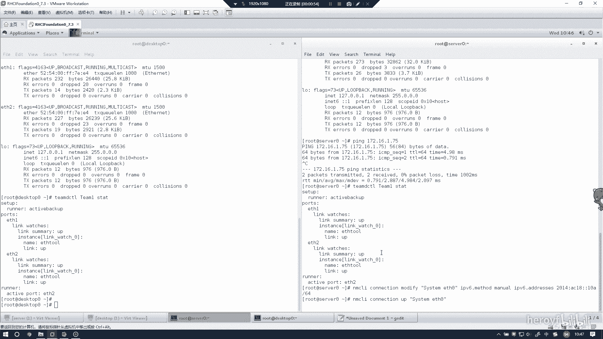
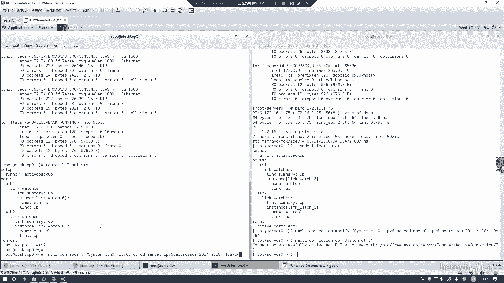
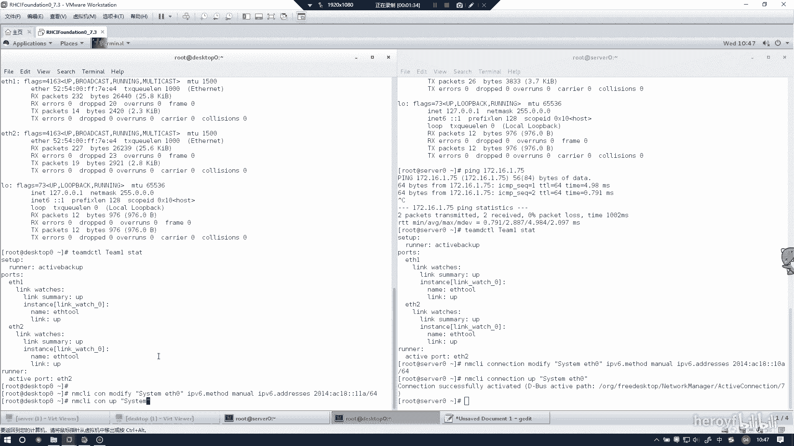
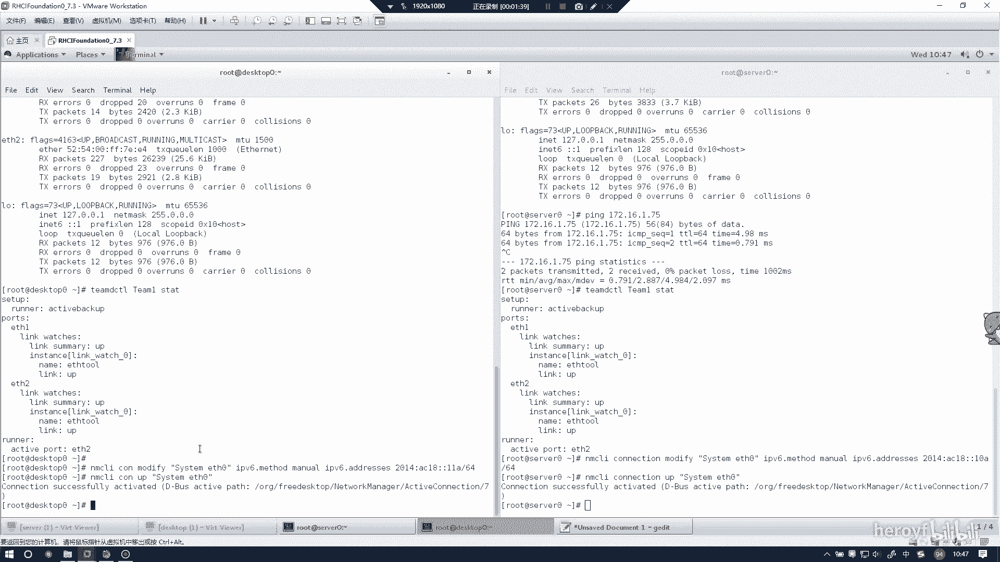
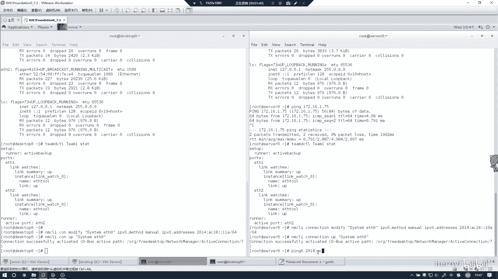
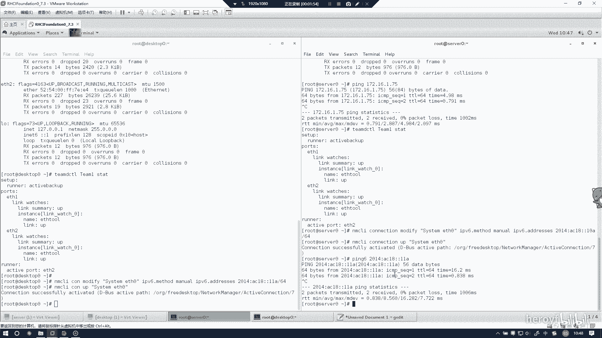

**RHCE 考前讲解：P6：配置 IPv6 地址 🌐**



在本节课程中，我们将学习如何在 Red Hat Enterprise Linux 7 系统上为网络接口配置 IPv6 地址。这是 RHCE 考试中的一个常见任务，我们将遵循最优做法，确保配置过程清晰、无遗漏。

---

上一节我们介绍了网络基础，本节中我们来看看如何具体配置 IPv6 地址。配置过程主要涉及使用 `nmcli` 命令修改网络连接。



以下是配置 server 主机 IPv6 地址的步骤：



1.  首先，为 `eth0` 接口的对应连接设置 IPv6 地址。命令格式为：
    ```
    nmcli connection modify "System eth0" ipv6.addresses 2001:db8:acad::1/64
    ```
    此命令将 IPv6 地址 `2001:db8:acad::1` 和前缀长度 `/64` 分配给名为 “System eth0” 的网络连接。



2.  接着，启用该连接的 IPv6 配置。命令如下：
    ```
    nmcli connection up "System eth0"
    ```
    此命令会激活刚才对 “System eth0” 连接所做的更改。

完成 server 的配置后，我们需要在 desktop 主机上进行类似的操作。

以下是配置 desktop 主机 IPv6 地址的步骤：



1.  为 desktop 主机的 `eth0` 接口配置 IPv6 地址。命令为：
    ```
    nmcli connection modify "System eth0" ipv6.addresses 2001:db8:acad::2/64
    ```
    这里我们将地址设置为 `2001:db8:acad::2/64`。

2.  同样，启用该连接以使配置生效：
    ```
    nmcli connection up "System eth0"
    ```



配置完成后，必须进行连通性测试以验证配置是否正确。



以下是验证 IPv6 连通性的步骤：



1.  从 desktop 主机，使用 `ping6` 命令测试到 server 主机 IPv6 地址的连通性：
    ```
    ping6 2001:db8:acad::1
    ```
2.  如果收到来自 `2001:db8:acad::1` 的回复，则表明 IPv6 地址配置成功，网络连通正常。

---



本节课中我们一起学习了在 RHEL 7 上使用 `nmcli` 命令为两台主机配置静态 IPv6 地址，并通过 `ping6` 命令验证了网络连通性。关键点在于准确使用 `nmcli connection modify` 设置地址，并用 `nmcli connection up` 激活更改。