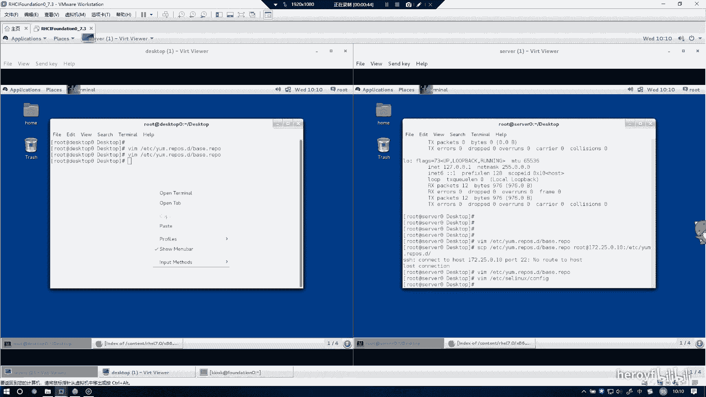
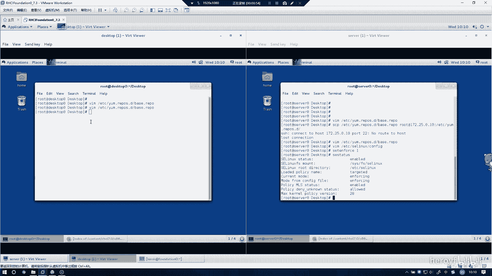

# RHCE(red hat7 考前讲解！最优做法解答，无坑) - P7：配置SElinux - heroyf - BV1St411p7K8

好的，下一个实验的话是配置SElinux。这台这个SElinux的话，基本上安C的所有的实验都要在server和 desktoptop上同时配置。

🤧う。嗯，有点卡。SE这种基本上用tab键都可以去补全。

找到这一行。

🤧把它。

改成 enforcement机构。

然后这这句话作用商，他立即生效。

然后你可以看一下，这里是都变成inforcing了，然后在dextop上做同样的操作。

也是在ETCSElinfi。

基本上confi就这个配置文件的意思。

同样的把这个改成ining。

这个改成一，然后他立即生效。

呵。这里的话也变成inforsing。那么第二个实验的话就这样就结束了。

