**RHCE考前讲解：P7：配置SELinux** 🔧

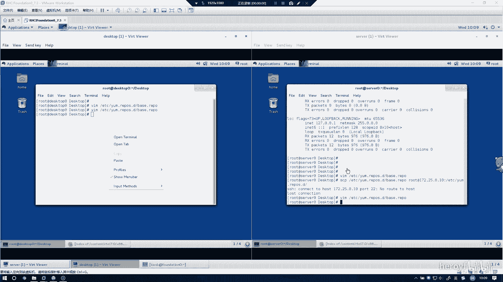

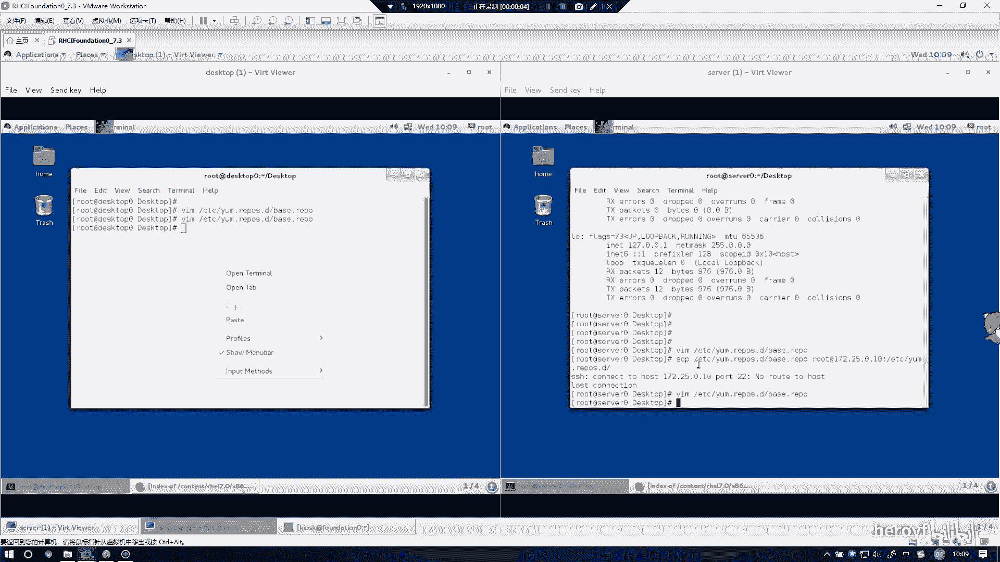

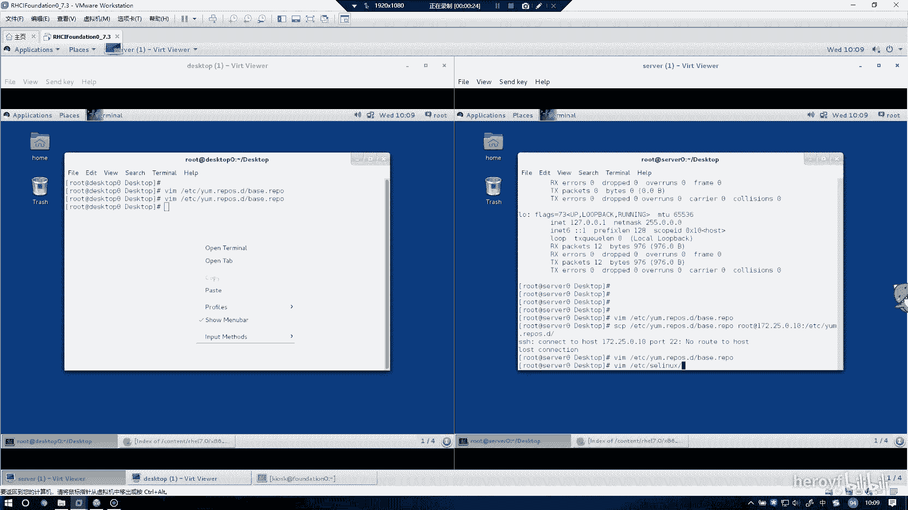

在本节课程中，我们将学习如何配置SELinux。SELinux是Red Hat Enterprise Linux 7中的一个重要安全模块，本实验的目标是在server和desktop两台主机上，将SELinux的模式从默认状态修改为强制模式。

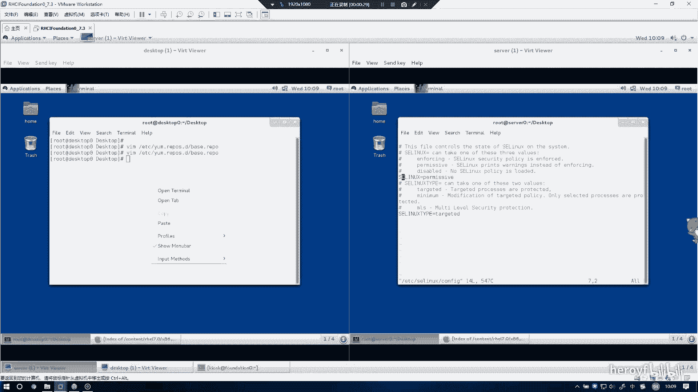

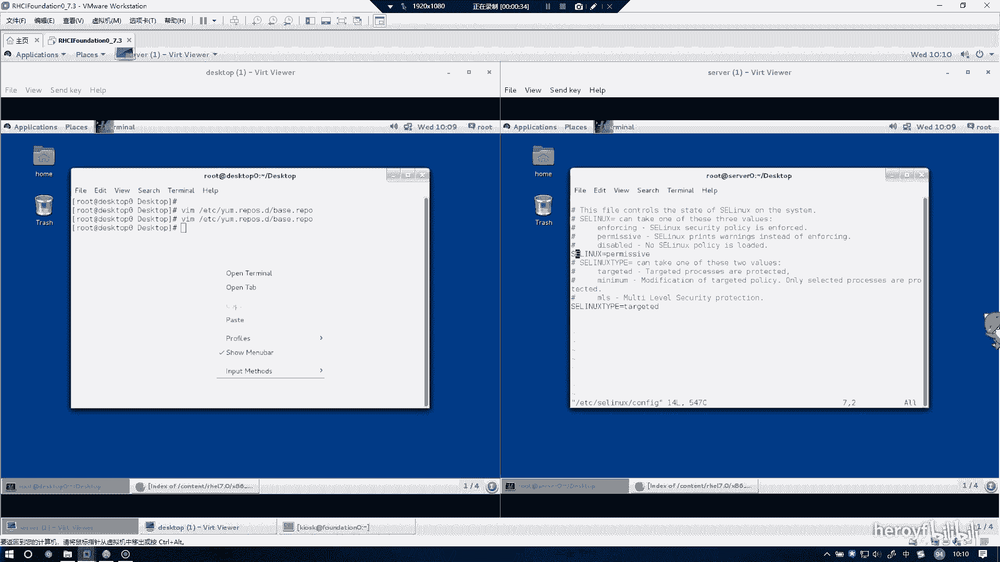

---

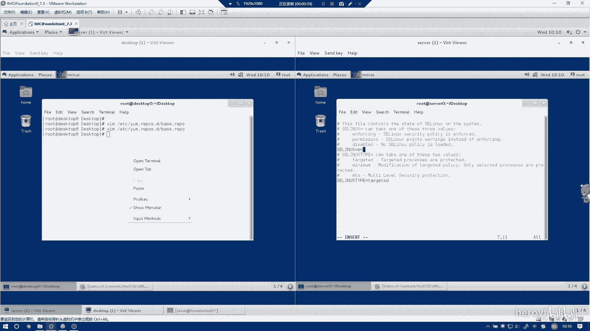

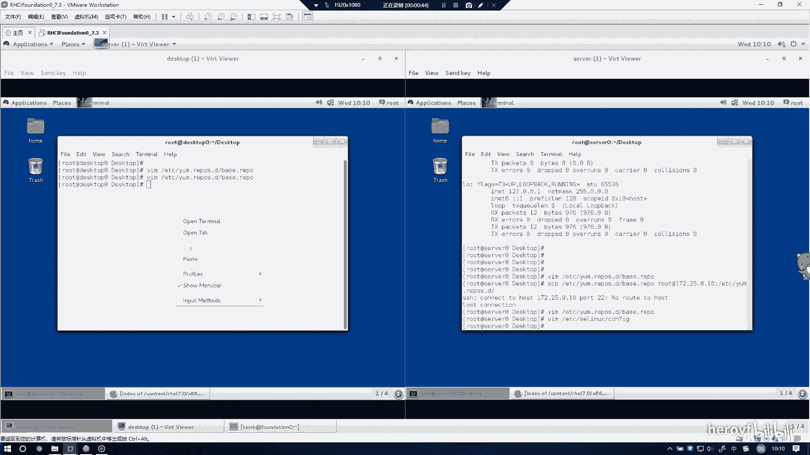

上一节我们介绍了实验的整体要求，本节中我们来看看具体的配置步骤。配置主要通过修改SELinux的主配置文件来完成。

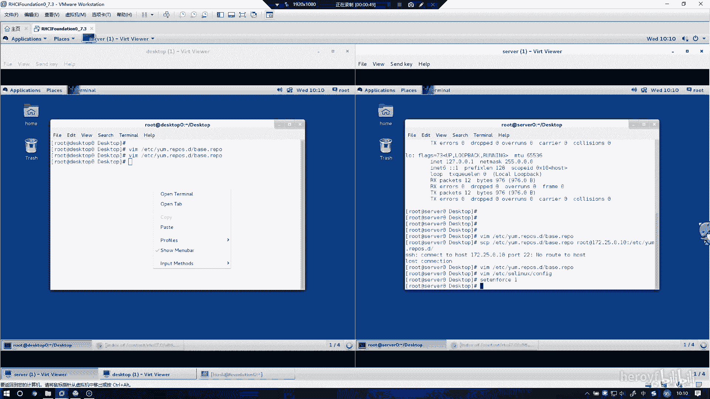

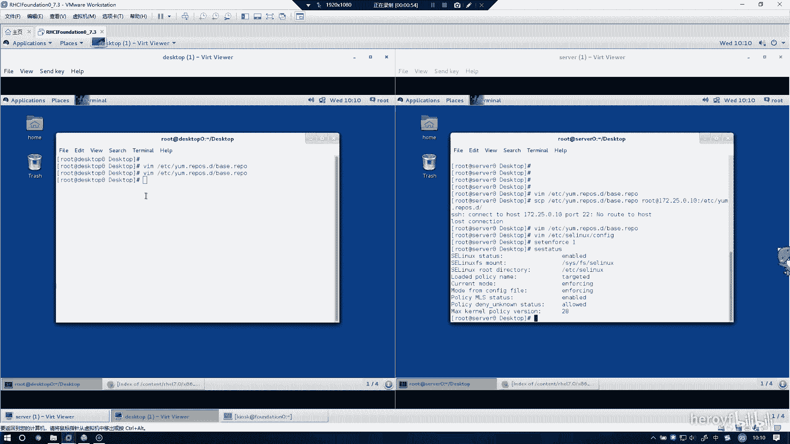

以下是配置SELinux的具体步骤：

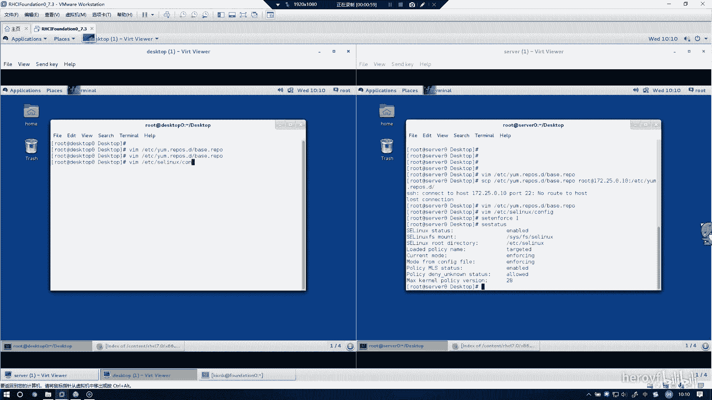

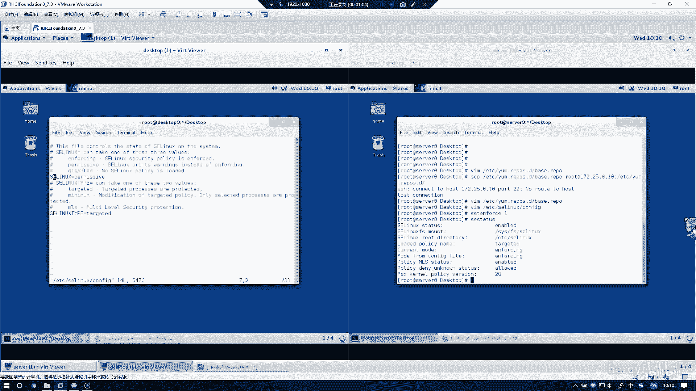

1.  在server主机上，使用文本编辑器打开SELinux配置文件 `/etc/selinux/config`。
2.  在配置文件中，找到定义SELinux运行模式的行 `SELINUX=`。
3.  将该行的值修改为 `enforcing`。
4.  为了使配置立即生效，执行命令 `setenforce 1`。
5.  使用命令 `getenforce` 验证当前SELinux模式已变为 `Enforcing`。
6.  在desktop主机上重复步骤1至步骤5，完成相同的配置。

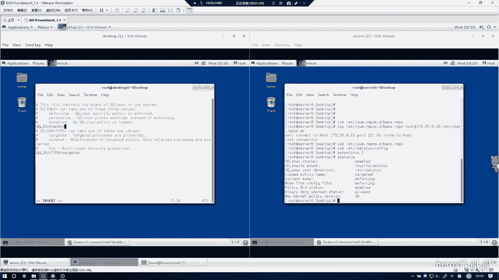

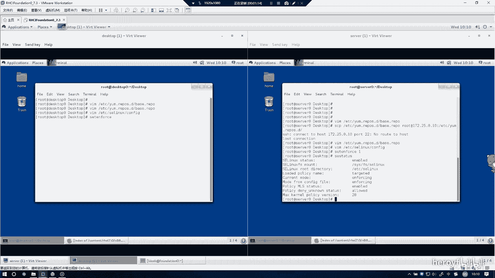

---

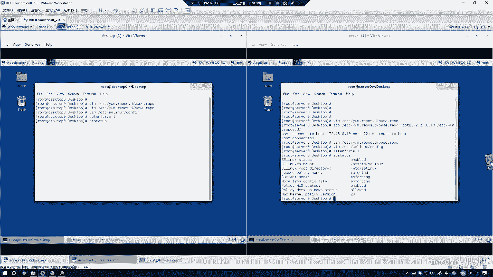

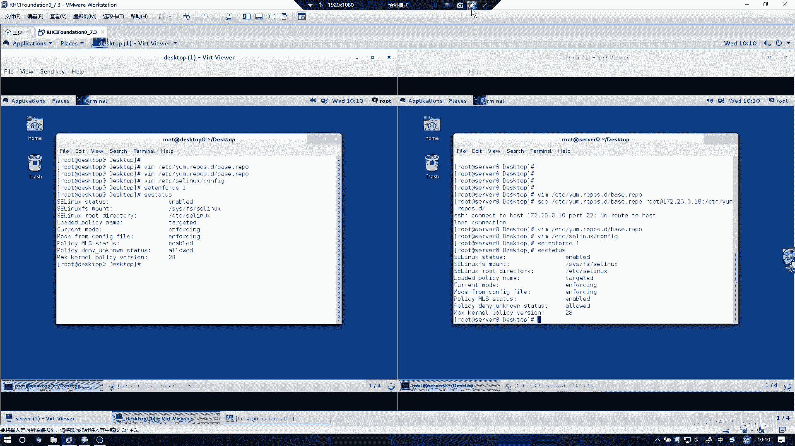

本节课中我们一起学习了SELinux的基本配置。核心操作是编辑配置文件 `/etc/selinux/config`，将 `SELINUX` 的值设置为 `enforcing`，并使用 `setenforce 1` 命令使设置立即生效。通过 `getenforce` 命令可以确认配置已成功应用。至此，第二个实验任务完成。