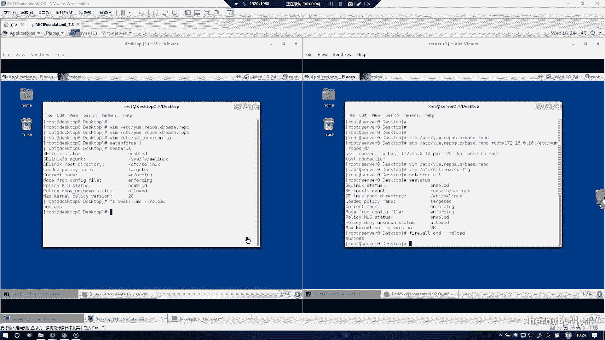
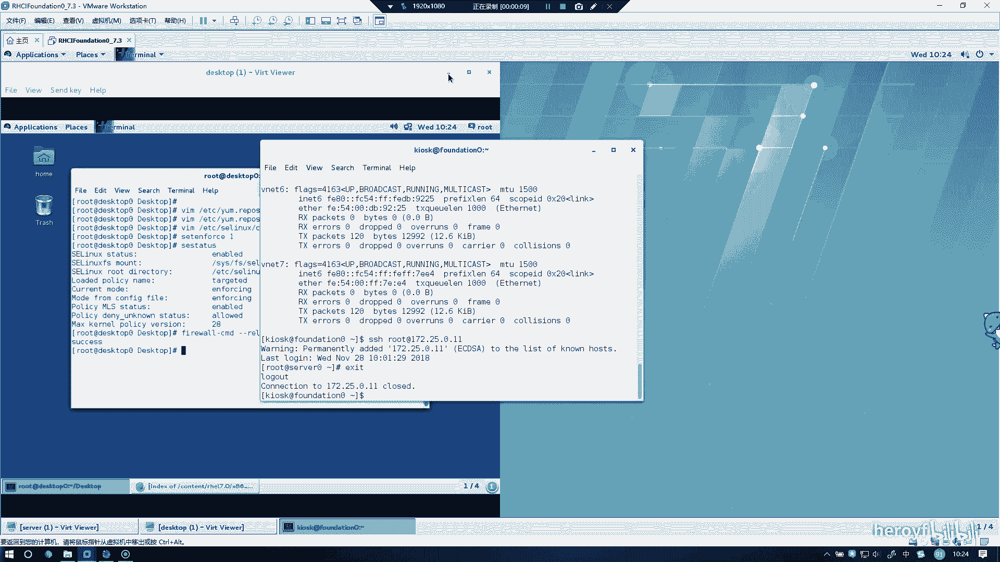
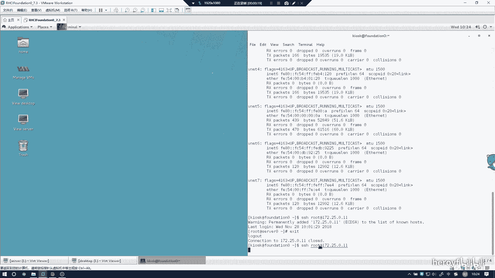
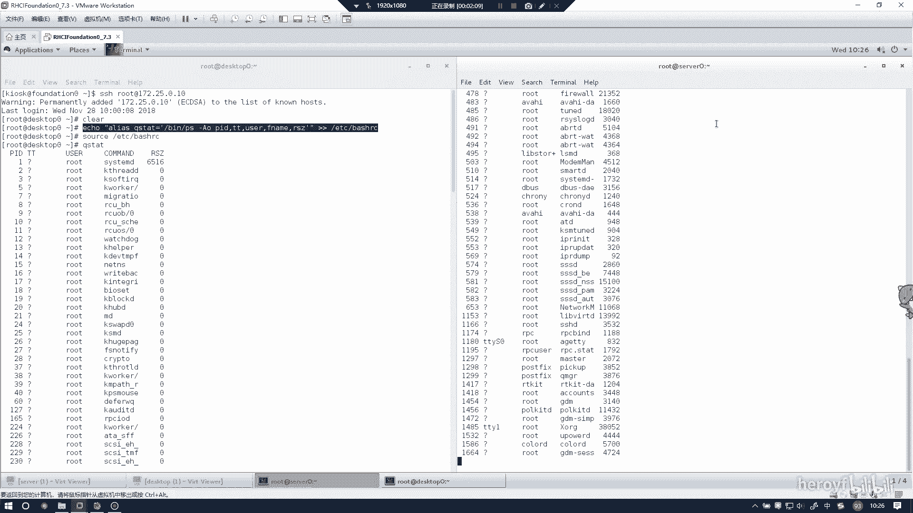

# RHCE(red hat7 考前讲解！最优做法解答，无坑) - P9：配置ssh访问 - heroyf - BV1St411p7K8

下一道题的话是自定义用户环境。刚刚我们配置了SS去访问，现在的话我们就可以啊直接从就是最外面这台考试机上面。

然后直接通过SSH进访问到我们的里面的两台环境，一个1设备，一个testtop。那么。

这样子的话，这就是420。左边的话同样也是extop。外面访问的话，他的。流畅度会好很多，不像在里面可能会比较卡。如果不是牵涉到那个叫什么呃防火墙配置的话，就如果只是纯命令的话，推荐都在外面进行撬。

这样这里如大cle的话，这已就会全部都况。呃，自定用户环境的话，其实就是一条命令的事情。Alice。Qs。景き点。TAT就不要敲错就可以。B。BPS。杠AO。I第。TT。是一样的。3。

这代表重进像重进像两个大于号，代表是追加，一个大于号代表是直接覆盖。到并别写成一个大于号，写成一个大于号，找地铁就崩了。只写两个大于号。检查一下。你没抄错，没有抄错。然后ss的话。

在利利益执行这个环境配置文件。这样的话，你敲PSSJAT的话，就会直接显示。东西了。然后在搜er端上也进行同样的操作。因为是在外面是在同一台物理机上SS去连到两台机子上的，所以这里可以直接复制。

这里直接复制的话，这里paste是可以直接出来的。🤧嗯。这里同样检查一遍。

KSTAT也出来了，那就说明交底成功了。