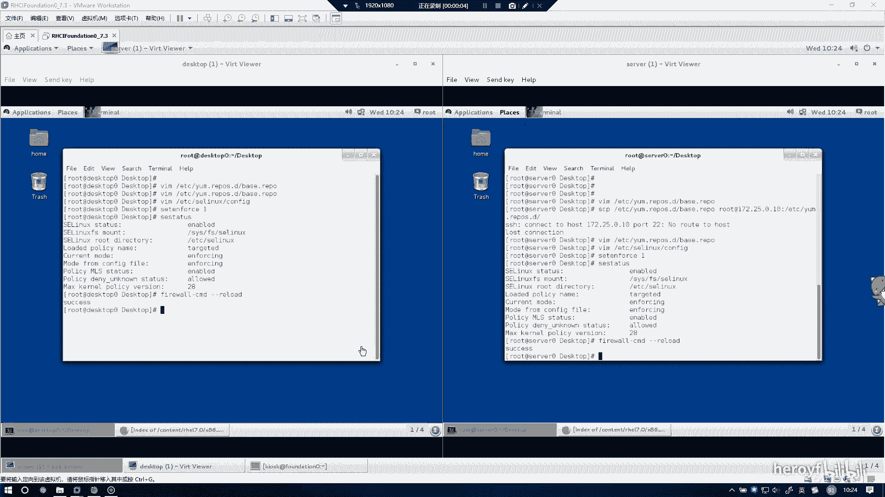
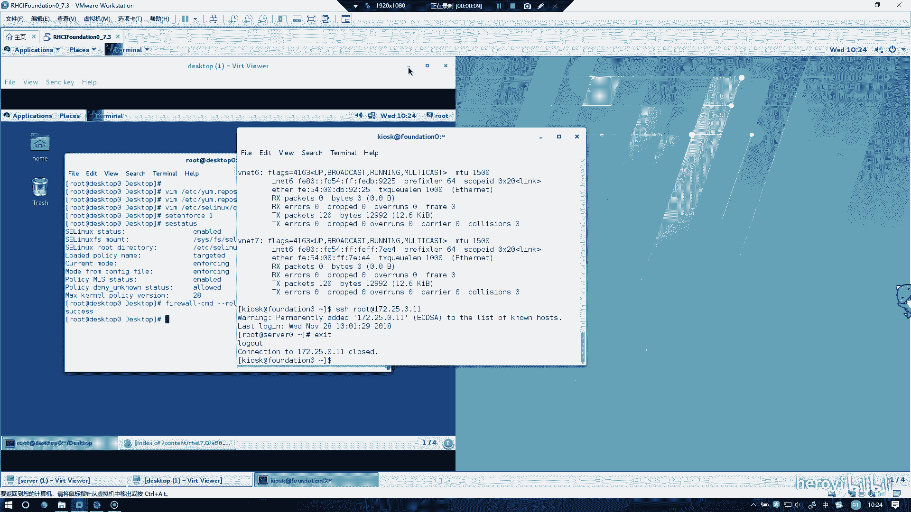
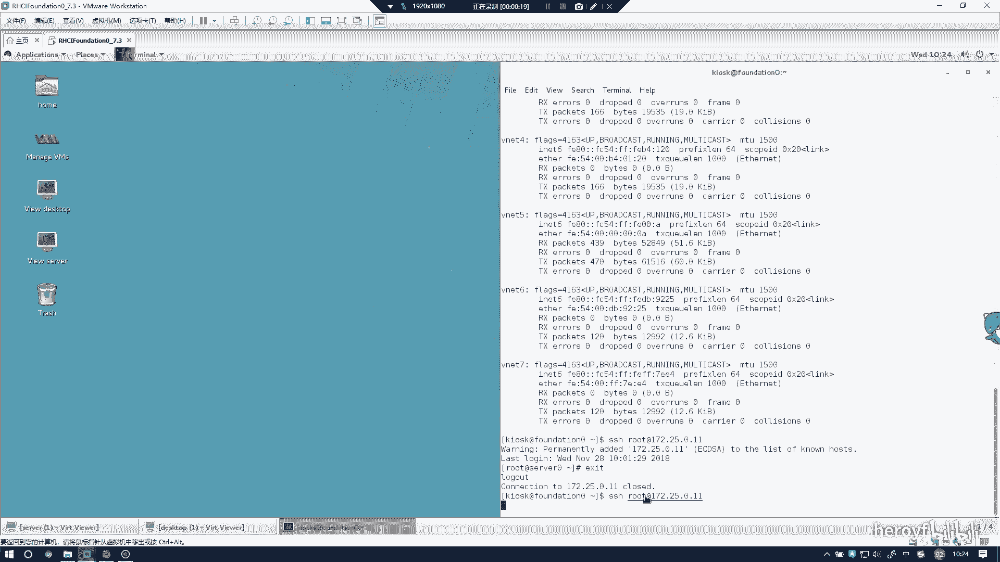
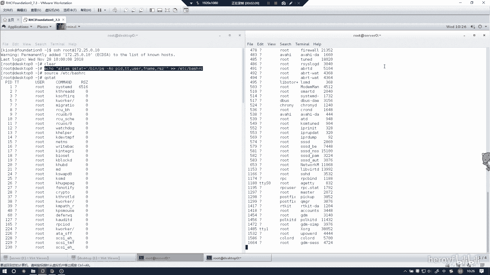

**RHCE 考前讲解：P9：自定义用户环境 🛠️**



在本节课程中，我们将学习如何配置自定义用户环境。上一节我们介绍了如何配置SSH访问，本节我们将利用SSH连接，在远程服务器上设置一个便捷的命令别名。



---



### 概述
通过SSH连接到考试环境中的服务器后，我们可以配置用户环境，使得输入特定命令（如 `ps`）时能自动显示更详细的信息。这通过修改用户的shell配置文件实现。

### 操作步骤
以下是配置自定义用户环境的详细步骤。

首先，确保你已通过SSH连接到目标服务器（例如 `servera` 和 `serverb`）。

1.  **编辑配置文件**
    我们需要在用户的家目录下的 `.bashrc` 配置文件中添加命令别名。使用以下命令：
    ```bash
    echo "alias ps='ps aux'" >> ~/.bashrc
    ```
    **注意**：命令中的 `>>` 代表“追加”内容到文件末尾。请务必使用两个大于号 `>>`。如果错误地使用一个大于号 `>`，会覆盖整个文件内容，导致配置丢失。

2.  **使配置生效**
    编辑完成后，需要让新的配置立即在当前会话中生效。执行以下命令：
    ```bash
    source ~/.bashrc
    ```

3.  **验证配置**
    现在，输入 `ps` 命令，它应该会显示等同于 `ps aux` 命令的详细进程列表。这证明环境配置成功。

4.  **在另一台服务器上重复操作**
    由于我们是从同一台考试机SSH连接到 `servera` 和 `serverb`，你可以在完成 `servera` 的配置后，将相同的命令复制并粘贴到 `serverb` 的SSH会话中执行。同样，执行后请使用 `source` 命令并验证 `ps` 命令的输出。



### 总结
本节课我们一起学习了如何通过修改 `~/.bashrc` 文件来创建命令别名，从而自定义用户环境。关键操作是使用 `echo` 命令追加别名定义，并使用 `source` 命令使更改生效。掌握这个方法可以让你在日常工作中更高效地使用命令行。