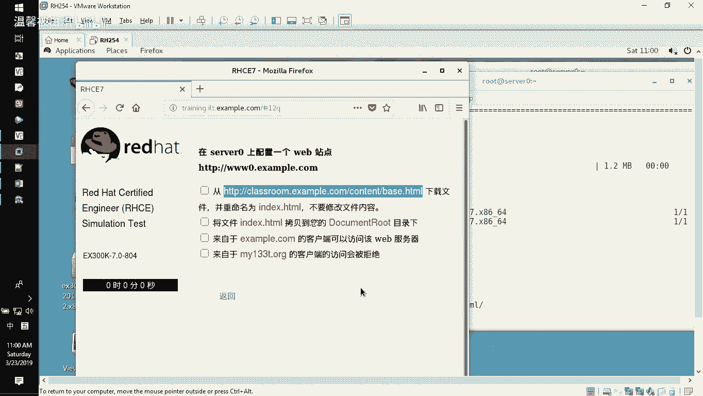
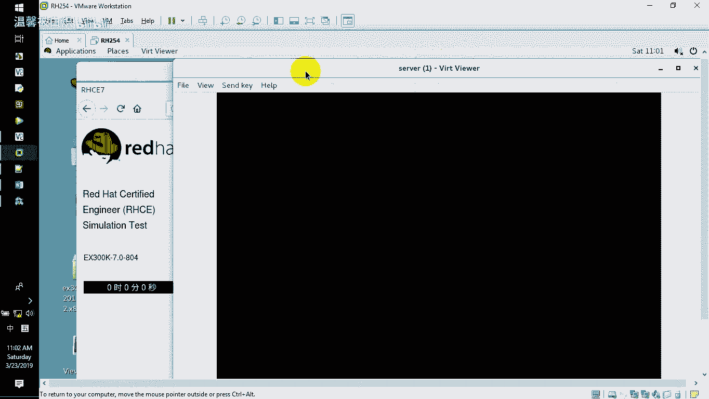
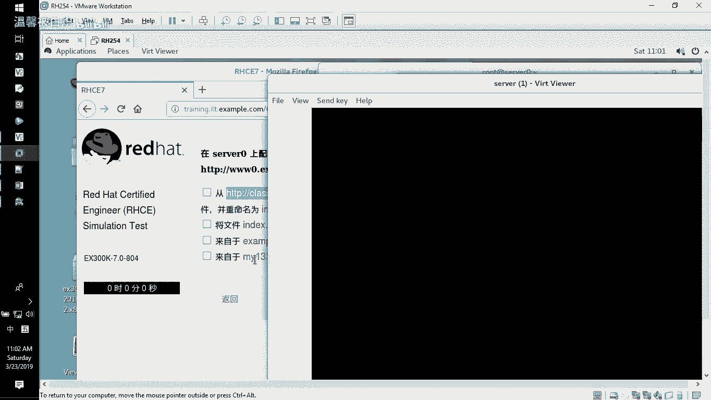
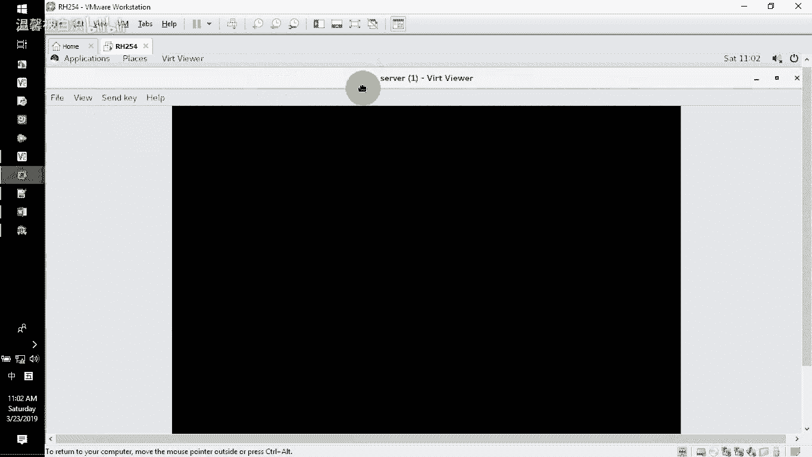
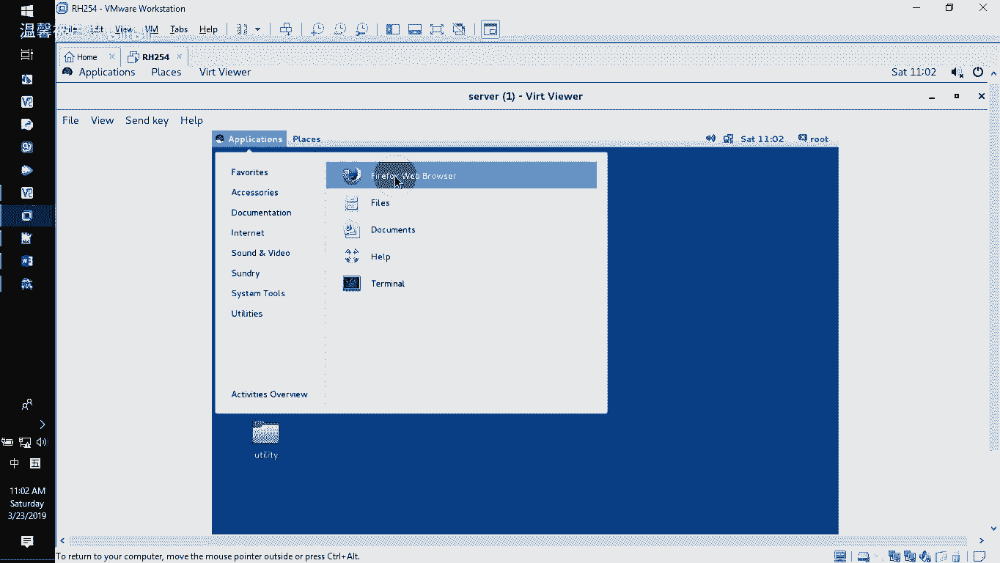
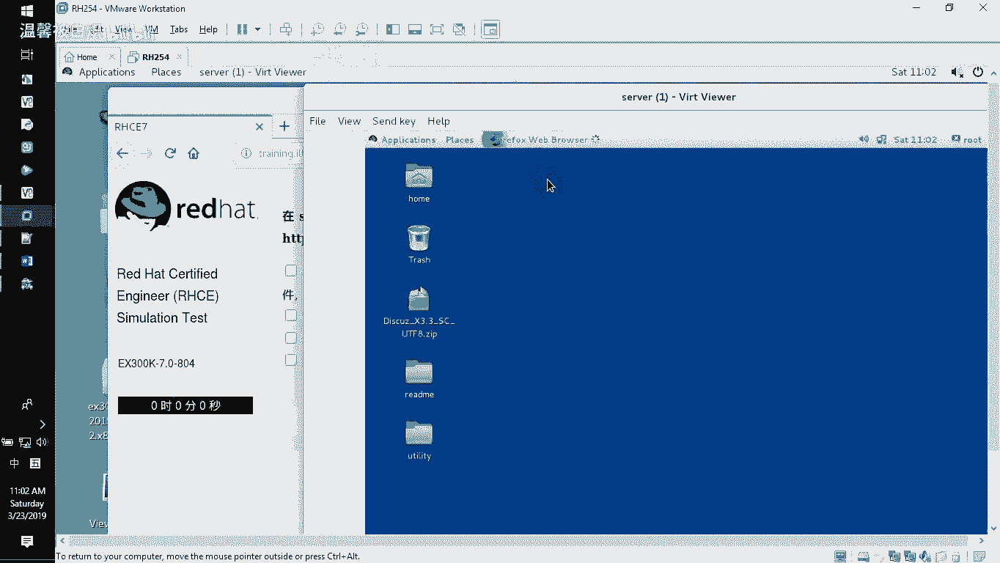
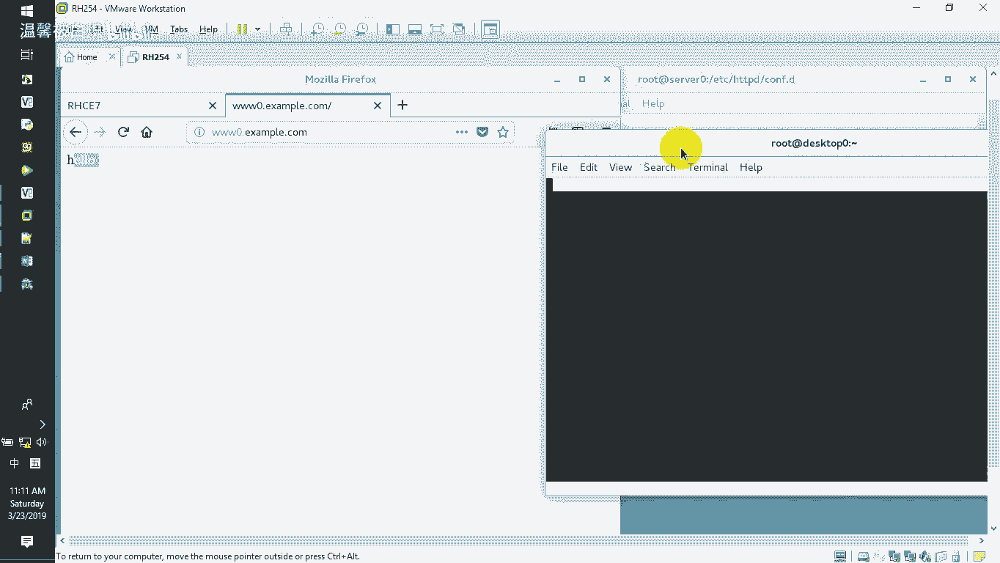
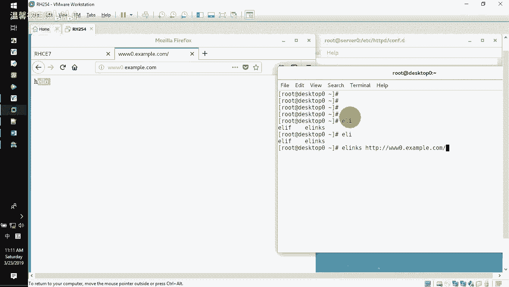
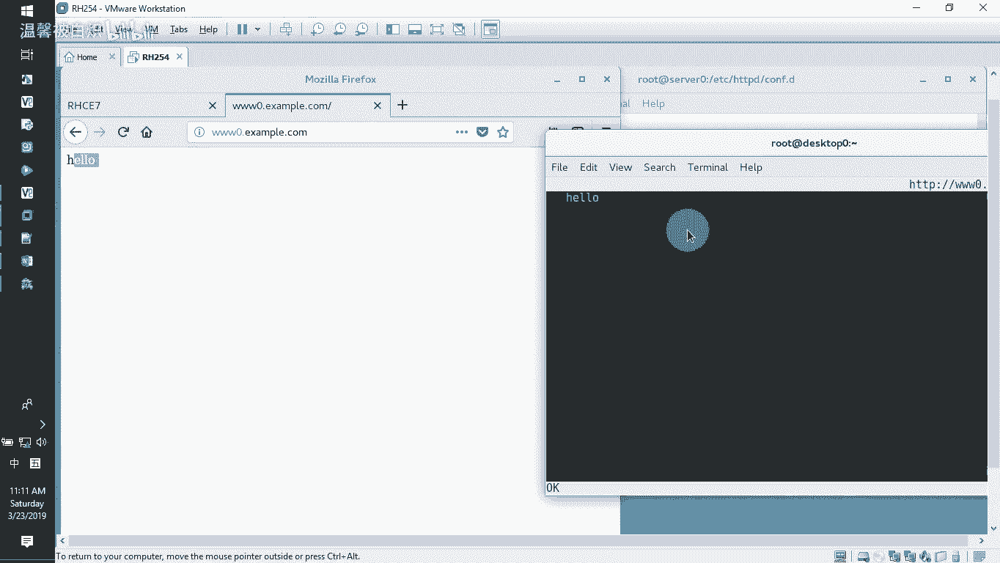
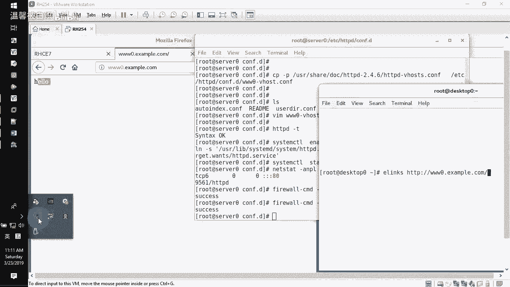

# RHCE课程：第10章：配置www0.example.com网站 🖥️

在本节课中，我们将学习如何在服务器上配置一个名为 `www0.example.com` 的Web站点。主要内容包括：安装Web服务器软件、下载并放置网站文件、配置虚拟主机以及设置基于IP地址的访问控制。

---



## 安装HTTPD软件包

首先，我们需要在服务器上安装Apache HTTP服务器软件包。

执行以下命令进行安装：
```bash
yum install httpd
```
安装完成后，默认的网站根目录位于 `/var/www/html`。



---





## 下载网站文件

上一节我们安装了Web服务器软件，本节中我们来看看如何获取网站页面文件。





根据要求，需要从一个指定路径下载页面文件，并将其重命名为首页文件 `index.html`，然后放置到网站根目录下。

以下是操作步骤：
1.  使用 `wget` 命令下载文件到指定目录。
2.  将下载的文件重命名为 `index.html`。

**重要提示**：必须使用命令行工具（如 `wget`）直接下载文件。严禁通过图形化浏览器（例如在虚拟机桌面环境中打开Firefox）访问下载链接并“另存为”文件，因为浏览器可能会修改文件内容，导致不符合题目“无论如何都不要去修改这个文件”的要求。

正确的下载命令示例如下：
```bash
wget -O /var/www/html/index.html <指定的下载URL>
```

---

## 配置虚拟主机

文件已准备就绪，接下来我们需要为 `www0.example.com` 这个域名配置虚拟主机。

Apache HTTPD 的主配置文件是 `/etc/httpd/conf/httpd.conf`，但我们通常将额外的站点配置放在 `/etc/httpd/conf.d/` 目录下。

以下是配置虚拟主机的步骤：
1.  进入额外配置目录：`cd /etc/httpd/conf.d/`
2.  复制虚拟主机配置模板：
    ```bash
    cp -p /usr/share/doc/httpd-*/httpd-vhosts.conf www0.example.com.conf
    ```
3.  编辑 `www0.example.com.conf` 文件，保留以下核心配置并修改相应参数：
    ```apache
    <VirtualHost *:80>
        ServerName www0.example.com
        DocumentRoot "/var/www/html"
        <Directory "/var/www/html">
            Require all granted
        </Directory>
    </VirtualHost>
    ```
    其中，`ServerName` 指定了主机名，`DocumentRoot` 指定了网站文件根目录。

---

## 设置访问控制

虚拟主机配置完成后，本节我们来实现基于IP地址的访问控制，要求允许 `172.25.0.0/24` 网段访问，拒绝 `172.25.1.0/24` 网段。

我们需要在虚拟主机配置文件的 `<Directory>` 指令块内，使用 `Require` 指令进行访问控制。

修改 `www0.example.com.conf` 文件中对应的部分：
```apache
<Directory "/var/www/html">
    Require ip 172.25.0.0/24
    Require not ip 172.25.1.0/24
</Directory>
```
配置含义是：首先允许 `172.25.0.0/24` 网段，然后拒绝 `172.25.1.0/24` 网段。Apache会按顺序处理这些规则。

---

## 检查配置并启动服务

所有配置完成后，在启动服务前，务必进行检查以确保配置语法正确。

以下是启动和验证服务的步骤：
1.  检查配置文件语法：
    ```bash
    httpd -t
    ```
    如果显示 `Syntax OK`，则表示配置无误。
2.  设置HTTPD服务开机自启并立即启动：
    ```bash
    systemctl enable --now httpd
    ```
3.  配置防火墙，永久开放HTTP服务：
    ```bash
    firewall-cmd --permanent --add-service=http
    firewall-cmd --reload
    ```

---

## 测试网站访问

服务启动后，我们需要验证网站是否可以正常访问，并且访问控制规则是否生效。



你可以使用以下任一方法进行测试：
*   **从客户端浏览器访问**：在浏览器地址栏输入 `http://www0.example.com`。
*   **在服务器或客户端使用命令行工具测试**：
    ```bash
    elinks http://www0.example.com
    ```
    或使用 `curl` 命令：
    ```bash
    curl http://www0.example.com
    ```
如果能看到正确的网页内容（例如“Hello”），则说明网站配置成功。



---



## 总结



本节课中我们一起学习了如何完整配置一个Apache虚拟主机网站。关键步骤包括：安装软件包、正确获取网站文件、编写虚拟主机配置文件、设置基于IP的访问控制列表、检查配置并启动服务，最后进行访问测试。请务必记住，使用命令行工具下载原始文件是保证文件未被修改的关键。