# RHCE课程：第11章：限制Web内容访问 🔒

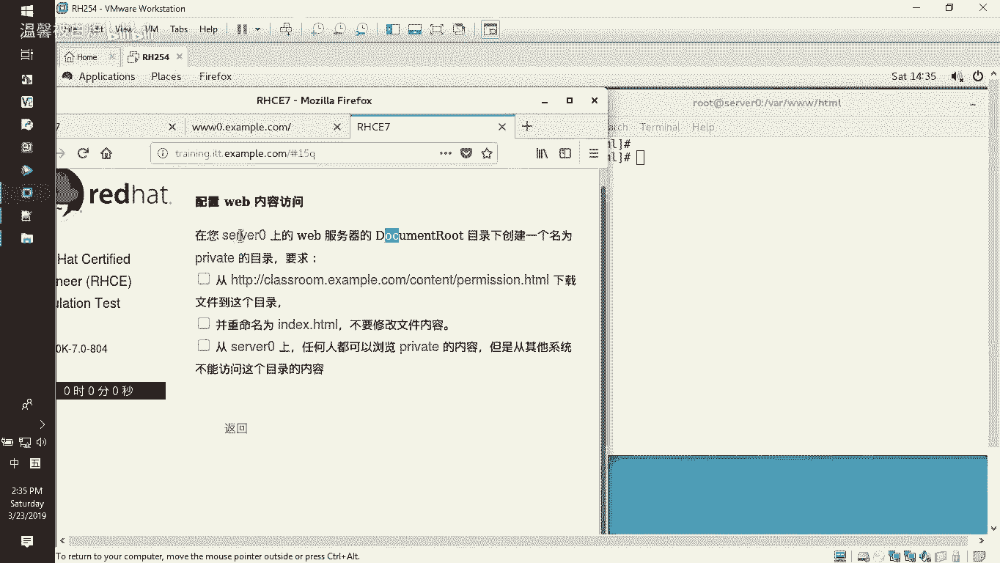

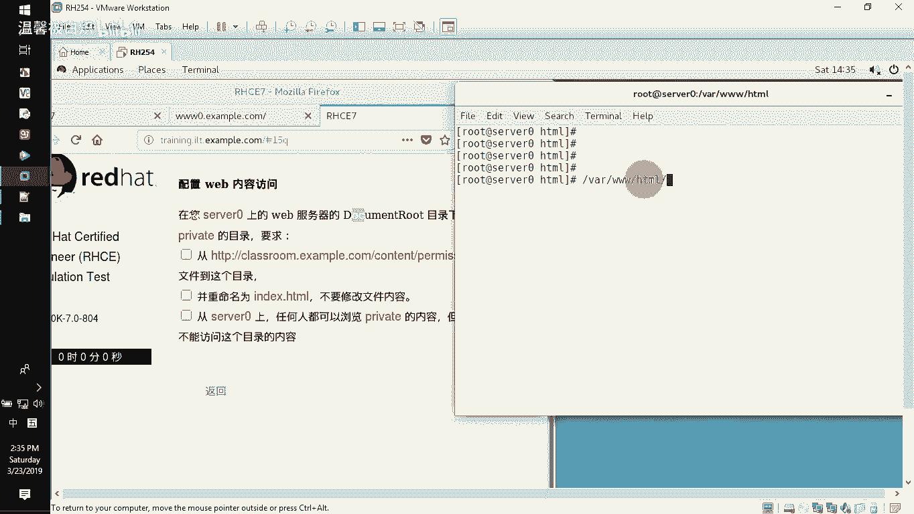

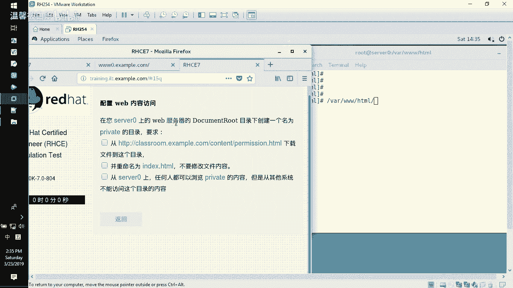

在本节课中，我们将学习如何在Apache Web服务器上，基于特定文件夹来限制内容的访问权限。具体目标是配置服务器，使得一个名为`private`的文件夹仅允许来自服务器本地的访问请求，而拒绝所有来自外部网络的访问。

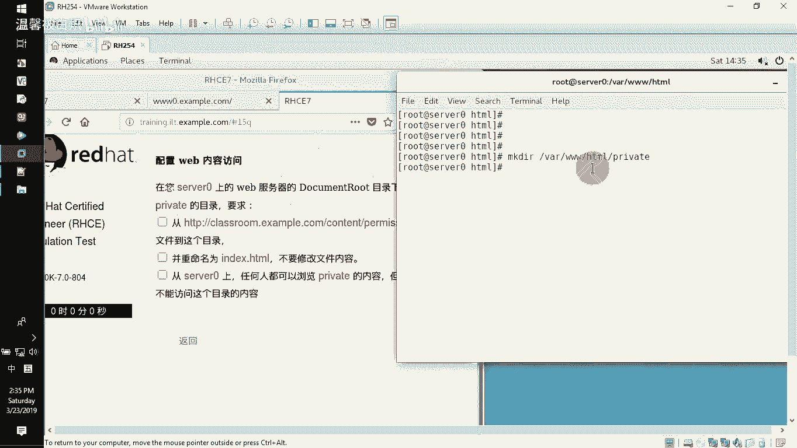

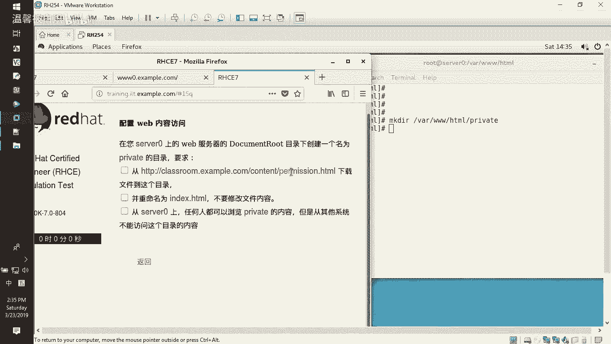

## 概述与准备工作

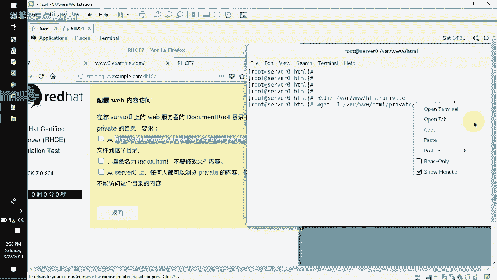

上一节我们介绍了Web服务器的基本配置，本节中我们来看看如何实现基于目录的访问控制。

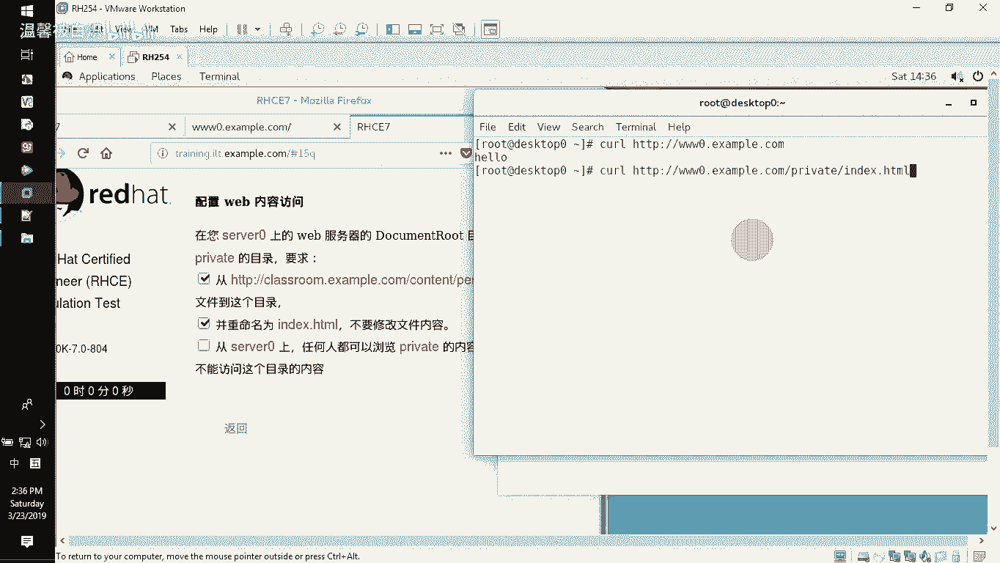

首先，我们需要在Web服务器的默认网站根目录下创建一个目标文件夹。假设我们的网站根目录位于`/var/www/html`。

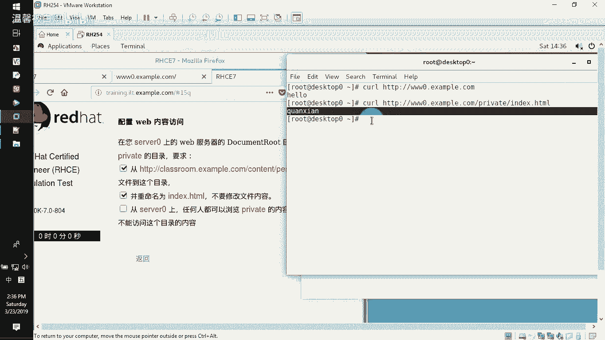

以下是创建文件夹并准备测试页面的步骤：
*   使用命令 `mkdir /var/www/html/private` 创建目标文件夹。
*   使用 `wget` 命令下载一个示例页面到该文件夹内，并将其重命名为 `index.html`。命令如下：
    ```bash
    wget -O /var/www/html/private/index.html [示例页面URL]
    ```

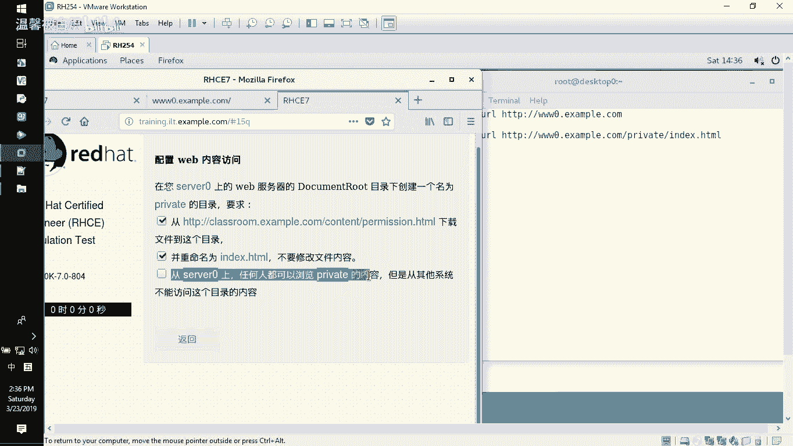

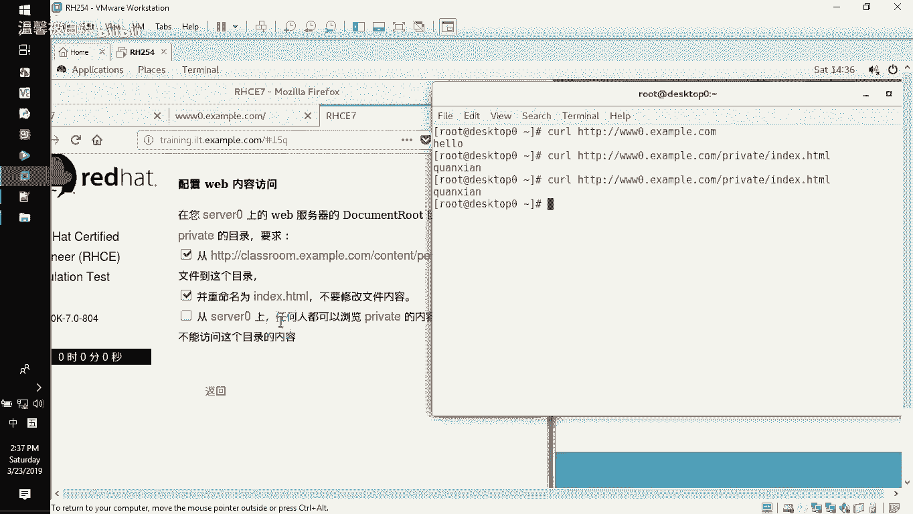

完成上述操作后，在没有进行任何访问限制配置前，无论是本地还是外部客户端，都可以通过浏览器访问 `http://your_server_ip/private/index.html` 这个地址。这不符合我们的安全要求。

## 配置目录访问控制

为了实现“仅本地可访问”的限制，我们需要修改Apache的虚拟主机配置文件。

以下是具体的配置步骤：
1.  切换到Apache配置目录：`cd /etc/httpd/conf.d`
2.  编辑默认的虚拟主机配置文件：`vi www.conf` (或类似名称，如 `00-default.conf`)
3.  在配置文件中，找到针对网站根目录 `<Directory “/var/www/html”>` 的配置段落。
4.  在该段落下方，为 `/private` 子目录添加一个新的 `<Directory>` 配置块。核心配置指令如下：
    ```apache
    <Directory “/var/www/html/private”>
        Require all denied
        Require local
    </Directory>
    ```
    *   **`Require all denied`**：此指令拒绝所有访问请求。
    *   **`Require local`**：此指令允许来自本地系统（127.0.0.1, ::1 及服务器自身IP）的访问请求。
    *   **注意**：Apache的授权逻辑是按顺序执行的。上述配置的含义是“首先拒绝所有人，然后允许本地用户”，最终效果是仅本地访问被允许。

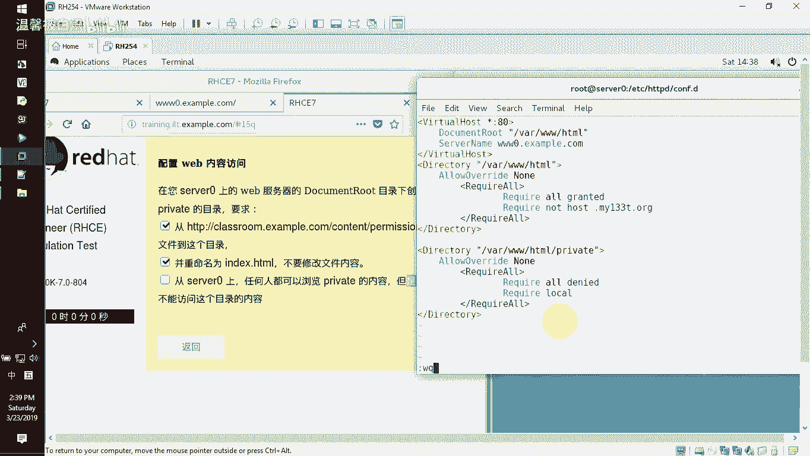

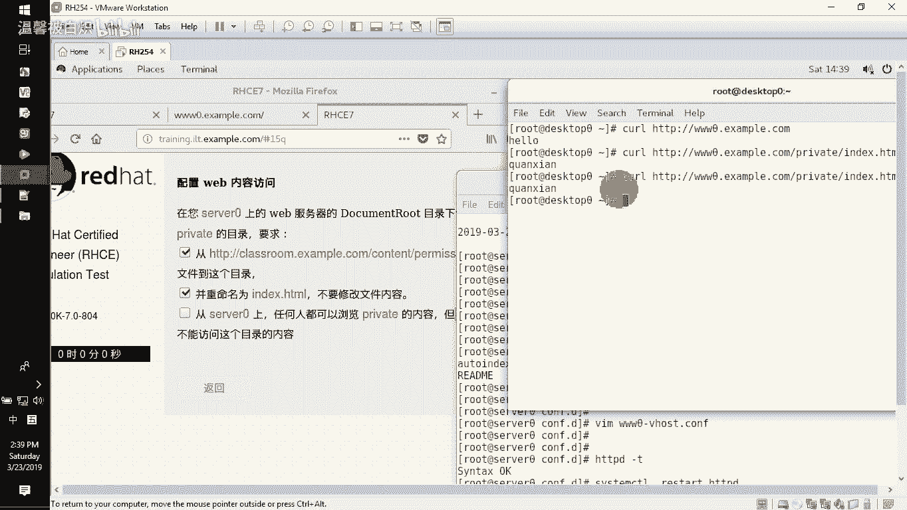

## 验证配置与测试

配置修改完成后，必须进行语法检查并重启服务使配置生效。

以下是验证与测试步骤：
1.  使用 `apachectl configtest` 或 `httpd -t` 命令检查配置文件语法是否正确。
2.  如果语法检查通过，则重启Apache服务：`systemctl restart httpd`
3.  进行访问测试：
    *   **在服务器本地测试**：在服务器终端执行 `curl http://localhost/private/index.html`，应该能成功获取到页面内容。
    *   **从外部客户端测试**：尝试从网络上的另一台计算机访问 `http://服务器IP地址/private/index.html`，此时浏览器应返回 **“403 Forbidden”** (您没有访问权限) 的错误页面。

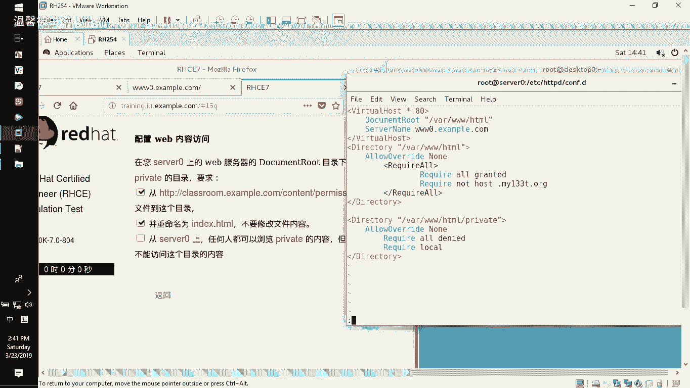

## 总结

本节课中我们一起学习了如何通过Apache的`<Directory>`指令和`Require`授权指令来实现基于目录的访问控制。关键点在于理解`Require all denied`与`Require local`指令的组合使用，它能够精确地定义“除本地外，全部拒绝”的访问策略。这是保护Web服务器上敏感目录的一种基础且有效的方法。